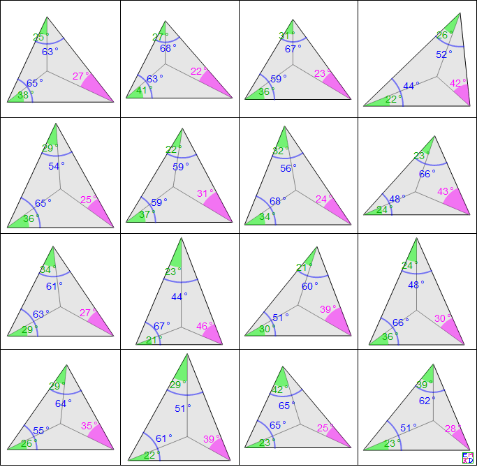
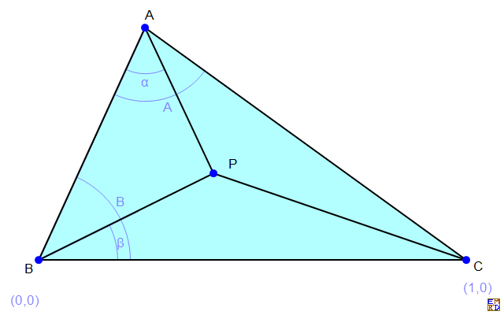
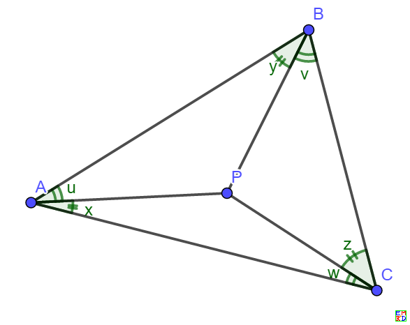
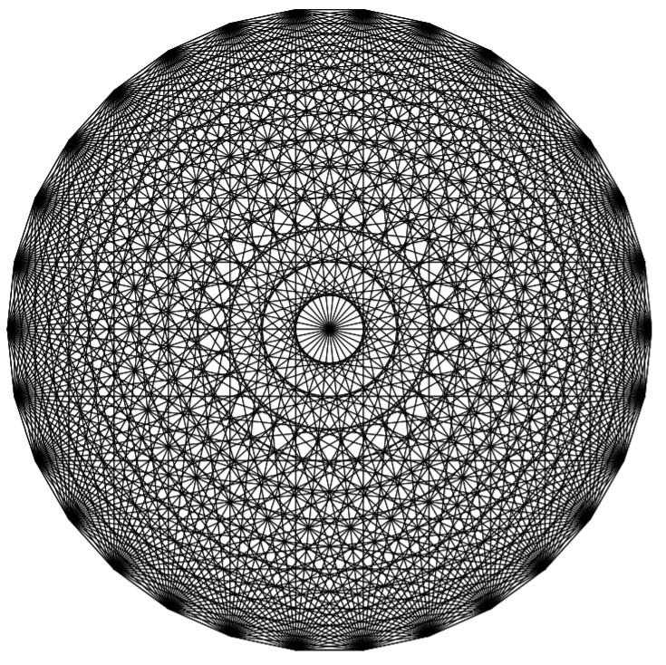
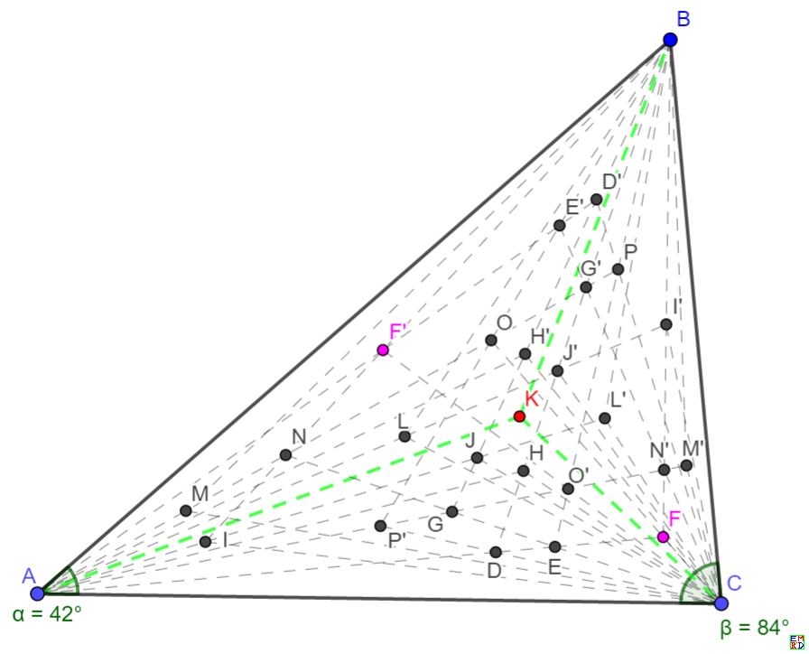

# 摘要
wayne发现了一篇讨论[三角形角格点问题](https://share.weiyun.com/5A9jH6D) 的文章，其中要求找出所以三个角都是10°的整数倍的$\Delta ABC$，而且在三角形$\Delta ABC$内部可以找到一个点P
使得$\Delta ABP, \Delta BCP, \Delta CAP$的三个角都是10°的整数倍。

wayne[把问题进行了推广](https://bbs.emath.ac.cn/thread-16953-1-1.html) ：三角形$\Delta ABC$的三个内角的比例 $\alpha:\beta:\gamma = m:n:l$使得$m,n,l$都是整数；
而且三角形ABC内部存在一点P，使得$\Delta ABP, \Delta BCP, \Delta CAP$的三个内角比例也都是整数，试问这样的三角形内有多少个这样的内点？  
另外由于对于等腰三角形，P在其对称轴上时通常会有很多平凡解，我们又通常会淘汰这种情况。  

比较有意思的是mathe最后利用[正n边形对角线交点问题](https://bbs.emath.ac.cn/thread-1112-1-1.html) 的结果给这个问题的推广情况一种公式解。

# 详细内容
## 整数度数解
chyanog首先给出所有角度都是整数度数的倍数时解的数目是5257个（而限定角度是10°的倍数时为61个）；不考虑等腰三角形对称轴上的点是3275个（限定角度为10°的倍数为45个）。  
比如下图为他找出的几个特殊结果:  
  
而对于一般情况的这种三角形，如下图  
  
他给出了对应的mathematica代码来计数：  
```bash
Clear[func];
func=Compile[{{A,_Integer}},
Module[{bag=Internal`Bag[Rest@{0}],angle},
Do[
If[A+B>=180,Continue[]];
angle=180+ArcTan[Cos[(A-α)°] Sin[(A+B)°] Sin[(B-β)°]-Sin[B °] Sin[(B+α-β)°],-Sin[(A+B)°] Sin[(A-α)°] Sin[(B-β)°]]/°;
If[0<angle<180-A-B&&0<angle<180&&Abs[Round[angle]-angle]<10^-10,Internal`StuffBag[bag,{A,α,B,β,180-A-B,Round@angle},1]];
,{B,179},{α,A},{β,B}];
Internal`BagPart[bag,All]
],
CompilationTarget->"C",RuntimeOptions->"Speed",RuntimeAttributes->{Listable}
];

Dimensions[data=Join@@(Partition[#,6]&/@func[Range[179]])]//AbsoluteTiming
Dimensions[res1=DeleteDuplicatesBy[data,Sort[Partition[#,2]]&]]
Dimensions[res2=Select[res1,DuplicateFreeQ[Sort[{#-#2,#2}]&@@@Partition[#,2]]&]]
Dimensions[res3=Select[res2,AllTrue[Divisible[#,10]&]]]
```

## 与正n边形对角线交点问题的关联
mathe建议重新描述本题推广情况为：  
我们可以改为要求找出所有这些角弧度都是$\frac{\pi}n$的倍数时的数目，很显然，n不小于6才有解。  
然后他采用如图记号  
  
我们要求$u,v,w,x,y,z$都是$\frac{\pi}n$的正整数倍,  
由于$\frac{\sin(x)}{\sin(w)}=\frac{PC}{PA}$等，我们可以得出$\sin(x)\sin(y)\sin(z)=\sin(u)\sin(v)\sin(w)$.  
而这个正好是存在点P的充分必要条件。  
比较有意思的是，对于任意一个合法的解，我们任意交换x,y,z的位置或u,v,w的位置还是合法的解。  
非常有意思的是[正n边形对角线交点问题](https://bbs.emath.ac.cn/thread-1112-1-1.html) 正好求解的是完全相同的等式。  
而那个问题结果可以在[A006600](https://oeis.org/A006600) 找到。  
  
其中[论文](http://math.mit.edu/~poonen/papers/ngon.pdf) 中定理4给出了完整的解,如下:  
i) {u,v,w}={x,y,z} (当然$x+y+z=\frac{\pi}2$)  
ii)  
    {u,v,w}={$\frac16,t,\frac13-2t$}$\times\pi$, {x,y,z}={$\frac13+t,t,\frac16-t$}$\times\pi, 0\lt t\lt \frac16$  
    {u,v,w}={$\frac16,\frac12-3t,t$}$\times\pi$, {x,y,z}={$\frac16-t,2t,\frac16+t$}$\times\pi, 0\lt t\lt \frac16$  
    {u,v,w}={$\frac16,\frac16-2t,2t$}$\times\pi$,{x,y,z}={$\frac16-2t,t,\frac12+t$}$\times\pi, 0\lt t\lt \frac1{12}$  
    {u,v,w}={$\frac13-4t,t,\frac13+t$}$\times\pi$,{x,y,z}={$\frac16-2t,3t,\frac16+t$}$\times\pi,0\lt t\lt \frac1{12}$  
iii)表格四种65组解（需要注意u,v,w任意交换或x,y,z任意交换也构成解，其中$u=U\pi,v=V\pi,w=W\pi,x=X\pi,y=Y\pi,z=Z\pi$）  
  

并且上面解中，唯一出现重复的解是第二类中  
  第二条方程$t=\frac1{12}$时退化成第一类解  
  第一条和第四条方程在$t=\frac1{18}$时相等  
  第二条和第四条方程在$t=\frac1{24}$时相等。  

经过复杂的分析，mathe最后得出所有角弧度为$\frac{\pi}n$的倍数时的数目可以写成  
$\frac{\delta_2(n)(n-2)(n-6)}8+\frac{delta_4(n)}2+\delta_6(n)(6n-35)-32\delta_12(n)-36\delta_18(n)-24\delta_24(n)+96\delta_30(n)+72\delta_42(n)+264\delta_60(n)+96\delta_84(n)+48\delta_90(n)+96\delta_120(n)+48\delta_210(n)$  
于是  
对于15°角倍数情况对应n=12,结果为13  
对于10°角倍数情况对应n=18,结果为61  
对于3°角倍数情况对应n=60,结果为1045  
对于整数角度情况对应n=180,结果是5257  

## wayne问题计数的最大值
mathe注意到wayne问的其实和大家讨论的是不同的问题。wanye的问题是给定一个三个角都是有理度数的三角形，其内部有多少个满足条件的P点。当然在三角形为等腰三角形时，其对称轴上可以有无穷多个点，
使得它分割的三个小三角形的角都是有理度数。但是对于非等腰三角形(或者等腰三角形去除对称轴上的点)，总是有而且只有有限个点满足条件。其中，每个三角形通常至少有三个第一类点，分别为角平分线交点和前面提到第一类一对共轭点(但是对于正三角形三个点重合)。而只有极少数三角形会拥有第二类和第三类点。所以对于给定的三角形，计算满足条件的所有P点也不能难，按上面公式逐一匹配即可。但是我们还有一个问题，非等腰三角形最多可以拥有几个满足条件的P点？等腰三角形最多可以拥有多少个不在对称轴上的满足条件的P点。

最终mathe计算得知非等腰三角形最多有25个满足条件的P点:  
Triangle: {7/30,3/10,7/15} has 25 rational angle points  
        {1/30,1/6,2/5:1/5,2/15,1/15}  
        {1/30,1/5,11/30:1/5,1/10,1/10}  
        {1/30,4/15,1/5:7/60,3/20,7/30}  
        {1/15,1/10,2/5:1/6,1/5,1/15}  
        {1/15,2/15,11/30:1/6,1/6,1/10}  
        {1/15,1/5,4/15:1/6,1/10,1/5}  
        {1/15,4/15,1/10:1/6,1/30,11/30}  
        {1/15,17/60,1/20:1/6,1/60,5/12}  
        {1/12,1/6,17/60:3/20,2/15,11/60}  
        {1/10,1/30,13/30:2/15,4/15,1/30}  
        {1/10,2/15,3/10:2/15,1/6,1/6}  
        {1/10,13/60,3/20:2/15,1/12,19/60}  
        {7/60,3/20,7/30:7/60,3/20,7/30}  
        {2/15,1/12,19/60:1/10,13/60,3/20}  
        {2/15,1/6,1/6:1/10,2/15,3/10}  
        {2/15,4/15,1/30:1/10,1/30,13/30}  
        {3/20,2/15,11/60:1/12,1/6,17/60}  
        {1/6,1/60,5/12:1/15,17/60,1/20}  
        {1/6,1/30,11/30:1/15,4/15,1/10}  
        {1/6,1/10,1/5:1/15,1/5,4/15}  
        {1/6,1/6,1/10:1/15,2/15,11/30}  
        {1/6,1/5,1/15:1/15,1/10,2/5}  
        {1/5,1/30,4/15:7/60,3/20,7/30}  
        {1/5,1/10,1/10:1/30,1/5,11/30}  
        {1/5,2/15,1/15:1/30,1/6,2/5}  
  
而chyanog最早发现等腰三角形可以有24个满足条件的非对称轴上P点，并且mathe的代码验证了这是最多的情况:  
Triangle: {1/5,1/5,3/5} has 24 rational angle points  
        201(t=1/60){1/60,1/6,9/20:11/60,1/30,3/20}  
        202(t=1/15){1/30,1/15,17/30:1/6,2/15,1/30}  
        202(t=1/30){1/30,1/10,8/15:1/6,1/10,1/15}  
        200(t=2/15){1/30,2/15,7/15:1/6,1/15,2/15}  
        201(t=1/60){1/30,11/60,3/20:1/6,1/60,9/20}  
        203(t=1/20){1/20,2/15,23/60:3/20,1/15,13/60}  
        202(t=1/15){1/15,1/30,17/30:2/15,1/6,1/30}  
        200(t=1/10){1/15,1/10,13/30:2/15,1/10,1/6}  
        203(t=1/20){1/15,3/20,13/60:2/15,1/20,23/60}   
        200(t=2/15){1/15,1/6,2/15:2/15,1/30,7/15}  
        202(t=1/30){1/10,1/30,8/15:1/10,1/6,1/15}  
        200(t=1/10){1/10,1/15,13/30:1/10,2/15,1/6}  
        200(t=1/10){1/10,2/15,1/6:1/10,1/15,13/30}  
        202(t=1/30){1/10,1/6,1/15:1/10,1/30,8/15}  
        200(t=2/15){2/15,1/30,7/15:1/15,1/6,2/15}  
        203(t=1/20){2/15,1/20,23/60:1/15,3/20,13/60}  
        200(t=1/10){2/15,1/10,1/6:1/15,1/10,13/30}  
        202(t=1/15){2/15,1/6,1/30:1/15,1/30,17/30}  
        203(t=1/20){3/20,1/15,13/60:1/20,2/15,23/60}  
        201(t=1/60){1/6,1/60,9/20:1/30,11/60,3/20}  
        200(t=2/15){1/6,1/15,2/15:1/30,2/15,7/15}  
        202(t=1/30){1/6,1/10,1/15:1/30,1/10,8/15}  
        202(t=1/15){1/6,2/15,1/30:1/30,1/15,17/30}  
        201(t=1/60){11/60,1/30,3/20:1/60,1/6,9/20}  
点击下载[更多格点三角形结果](../attached/tran.out) 。  
chyanog还从网络上发现了[一篇类似的文章](http://www.doc88.com/p-1913433050097.html) ，里面讨论了所有整数度数情况的格点三角形.
王守恩发现文章里面有一处小错误，其中包含了一组重复的结果，除此之外，可以和我们的方法得出完全同样的结果。  

最后zeroieme也给了一段简短的mathematica代码用于解决这个问题  
```bash
(Sin[Subscript[\[Theta], 1]] Sin[Subscript[\[Theta], 2]] Sin[Subscript[\[Theta], 3]])/(Sin[30\[Degree]-Subscript[\[Theta], 1]] Sin[30\[Degree]-Subscript[\[Theta], 2]] Sin[120\[Degree]-Subscript[\[Theta], 3]])/.{Subscript[\[Theta], 1]->\[Pi]/2,Subscript[\[Theta], 2]->\[Pi]/2,Subscript[\[Theta], 3]->2 ArcTan[(-5+2 Sqrt[13])/(3 Sqrt[3])]}//FunctionExpand//TrigExpand//FullSimplify
```
