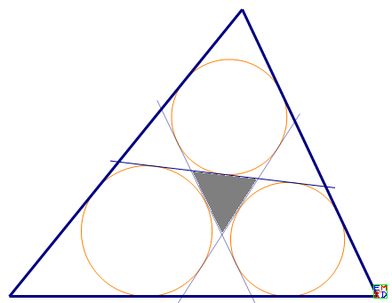
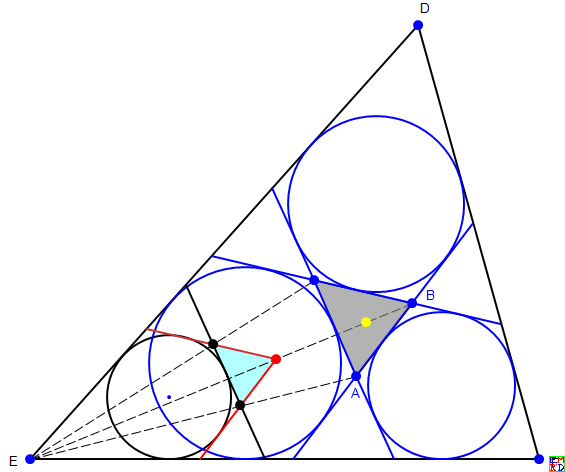
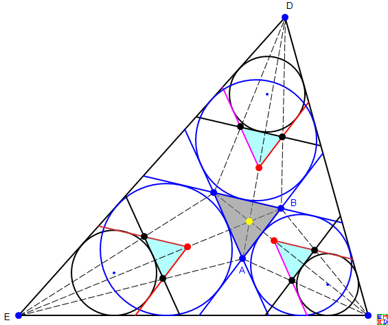
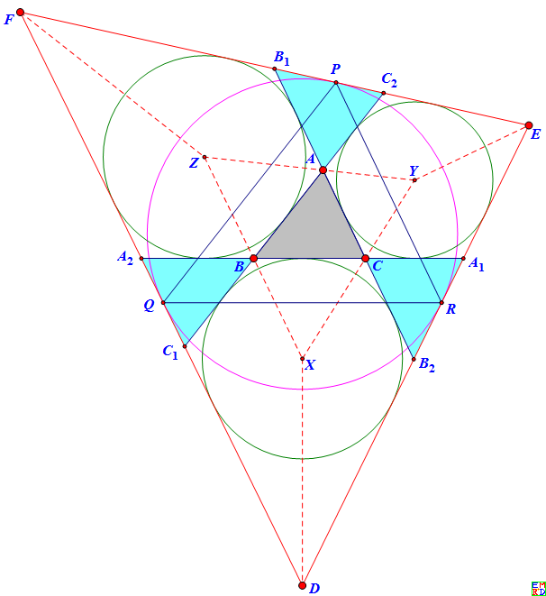
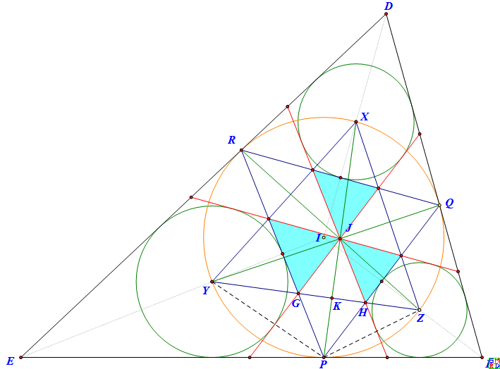

# 问题的提出
2019年1月数学研发论坛在热烈讨论的[三角形内三个四边形的内切圆](https://bbs.emath.ac.cn/thread-15603-1-1.html)，hujuhua感觉其中的约束有点散，受其启发，便研究了下述构图：
  
要求在三角形中作三条直线，将三角形剖分成七个部分，使其中的三个五边形都有内切圆。  
作出圆后一看，这三个圆不就是中心那个小三角形的旁切圆么，于是问题变成了[如下的描述](https://bbs.emath.ac.cn/thread-15653-1-1.html):  
如图，灰色三角形通过其三个旁切圆的三条外围的公切线决定了一个大三角形。  
现在灰色三角形和它的旁切圆都被隐去了，只可见外面的大三角形，请确定原来的灰色三角形。  

稍加研究不难发现，七个部分中，四个小三角形是全等的，外围的三个三角形是中间三角形的镜像，镜像线即三圆的两两连心线。  
由此可得推论：三条直线被大三角形所截的线段是等长的，正好是小三角形的全周长。  
因此问题也可以这样的等价方式提出：在三角形中作如图所示的三条线段，要求它们等长，并且所得四个小三角形全等。  

关于解的存在性，约束与自由度，最早是引用二次曲线来定量计算的。每个五边形都有一个内切椭圆，要求这个椭圆是圆，可得两个约束方程。三个圆共得六个约束。  
三条直线刚好六个自由度，所以仅有有限的解，不存在连续轨迹解，更不存在平面区域解。  
随后，mathe指出了位似作图法，虽然不是一个唯美的作图，但这确定了解的唯一性。  

# 美妙的作图
## 初步作图
作图思想主要还是mathe指出的[位似作图法](https://bbs.emath.ac.cn/forum.php?mod=redirect&goto=findpost&ptid=15653&pid=76821&fromuid=20):  
如优化作图部分lsr314的图，既知灰色三角形与大三角形的内切圆切点三角形PQR相位似，  
那么可以先作三角形PQR的三个旁切圆，再做三个旁切圆两两的外公切线可以得到一个和三角形DEF位似的三角形D'E'F'。  
作出三角形DEF和三角形D‘E'F'的位似中心和位似比，这同时也是三角形PQR与三角形ABC的位似中心和位似比，  
于是以三角形PQR为源，用位似作图法就可以作出像——三角形ABC了。  

显然，源的选择对于作图的简明和优美比较重要，不能像mathe的存在性陈述所说的任意选取。  
选择大三角形的内切圆切点三角形为源显然不利，作图范围太大，但这个切点圆要作出来，作为源三角形各边的平行方向参照。  
如图，选择大三角形的某个顶点为位似中心比较有利，源就在大三角形的该角内，该角的任一内切圆都可作该角内的那个旁切圆(视为像）的源，切于此圆不难作出源三角形。  
  
有了源和位似中心，要作出像，还需要相似比。为此可以像 mathe 说的那样作出大三角形的源，从大三角形的源和像（已知）得到相似比。  
但我们不这样做，这样作的图可想而知比较“脏”。我们在大三角形的三个角内各选一个源同时投射，以对应投射线（下图中的虚线）的交点来确定共同的像点。  
  
当然，我们只需要在两个角内同时投射就行了，但我们相信对称有利于优化。  

## 优化作图

[Isr314指出三个红色顶点所在的投射线相交于一点](https://bbs.emath.ac.cn/forum.php?mod=redirect&goto=findpost&ptid=15653&pid=76820&fromuid=20)（黄色点）:  
如图，由于两圆的两条外公切线关于两圆连心线对称，所以中间的灰色三角形与周边的三个天青色三角形是镜像对称的，故图中四个带色三角形中，下标不同而字母相同的点所在的角对应相等。  
由此可得，灰色三角形与大三角形的内切圆切点三角形相位似, $\angle A+\angle D/2=\angle B+\angle E/2=\angle C+\angle F/2=\frac{\pi}2$  
也就是说，灰色三角形各边与大三角形的对应角平分线相垂直，只要确定所截对角线长度，就能确定灰色三角形。  
另外，大小三角形对应顶点的连线相交于一点。  

那么我们就可以选择让三个红色顶点重合在这个交点，并使得三个源三角形的相平行的彩色边接合共线，利于减少作图元素。  
结果我们惊喜地发现剩下的三条黑色边端点相重合，正好构成大三角形内切圆切点三角形，即下图。这就让我们得到8#和10#的美妙作图，就在上页，不转于此地了。  
  
hujunhua云：  
古人论诗词之美，曰“无一字无来处”，论书法之美曰“无一笔无来处”，并不是不要创新，而是重在“有宗有趣”、“以故为新”、“点铁成金”。  
吾今论几何作图之美，夸张言之，亦当“无一点无来处”。此处“点”为作图基本元素之代名词，亦包括直线和圆等。所谓有“来处”，就是要跟那些经典的、常见的元素有较直接的关联，而不是千转百回的关联。  

# 作图的证明
  
我们要证明的是图中的三个天青色三角形是恰当的源，相应的位似中心在大三角形DEF的顶点。
这等价于：  
1、三条共点于 J 的红色线段分别平行于大三角形的切点三角形 PQR 的三边，并且  
2、大三角形三个角内的绿色内切圆分别是三个源三角形的旁切圆，并且  
3、三个绿色圆的圆心为大三角形的角平分线与大三角形内切圆的交点，并且  
4、三条红色的外公切线为切点三角形PQR与圆心三角形XYZ的公共六边形的三条大对角线。  
证明：由于 X, Y, Z 分属三条角平分线，所以分别平分内切圆PQR的三段圆弧，故连线PX、QY、RZ为三角形PQR的角平分线，相交于三角形PQR的内心 J。  
由圆的弦切角等于圆周角可知 YP 是角EPR的平分线，故 Y 是三角形EPR的内心。同理，X 是 三角形 DQR 的内心，Z 是三角形 FPQ 的内心。  
由三角形全等的“ASA”判定定理可知`\triangle YPZ ≌\triangle YJZ`, 可知 J 与 P 关于 YZ 成镜像对称。同理可知 J 与 Q、R 关于 ZX、XY 成镜像对称。  
现在，过 J 作切点三角形PQR三边的平行线，即图中三条红色线段，  
显然倚角的平行四边形比如GPHJ为菱形，故G、H在P，J的镜像线——连心线YZ上，圆Y为所切源三角形的旁切圆。  

