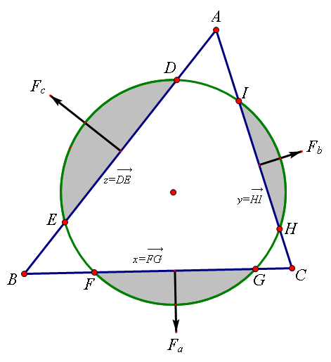
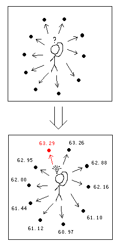

---

title: "世界拥抱日"
date: "2020-01-22"
thumbnail: "../images/圆与三角形的重叠面积.png"
author: "mathe"
tags: 
    - "圆"
    - "三角形" 
    - "极值"
---

1月21日是世界拥抱日，那么一个圆和三角形紧紧拥抱在一起会有什么结果呢？
<!--more-->

数学研发论坛的KeyTo9_Fans曾经在上海东华大学ACM邀请赛给出[下面的题目](https://bbs.csdn.net/topics/320043195)  
Problem C: Circle and Triangle  
Time Limit: 1 sec  
Description  
LMY and YY are geometry lovers. They enjoy challenging each other with interesting geometry problems. One day, LMY puts a circle and a triangle on a plane. Then YY moves them. They find that the overlapping area of the circle and the triangle varies as the relative position between the two changes. LMY and YY want to find out the largest common area.  
The Input   
Input consists of one or more lines. For each line, there are four integers describing one test case: the lengths of three sides of a triangle a, b, c; and the radius of a circle r; where 1≤a≤b≤c≤100, 1≤r≤100, and a+b>c.End of input is indicated by a line consisting four zeros.  
The Output   
For each test case, output a single line showing the largest overlapping area of the circle and the triangle. The precision should be 10-2.  
Sample Input  
3 4 5 1 （分别为三角形 三边 和半径）  
5 5 8 4  
0 0 0 0  

Sample Output  
3.14  
12.00  

[也就是](https://bbs.emath.ac.cn/thread-1779-1-1.html):
给定一个三角形的三边，和一个圆的半径。两个图形放在平面上，可以移动，请问两者如何拥抱才能有最大公共面积的接触！

hujunhua为这个题目配上如下图片并且[从力学角度对题目进行分析](https://bbs.emath.ac.cn/forum.php?mod=redirect&goto=findpost&ptid=1779&pid=42079&fromuid=20):

当时KeyTo9_Fans并没有得到最优解的表达式，用的是[瞎子爬山的方法](https://bbs.emath.ac.cn/forum.php?mod=redirect&goto=findpost&ptid=1779&pid=24331&fromuid=20)：  
  
在三角形内任找一点作为圆心，然后往重叠面积大的方向走。  
只要每次步长减小得恰当，在几十步之内一定可以爬到山顶。

[wayne](https://bbs.emath.ac.cn/forum.php?mod=redirect&goto=findpost&ptid=1779&pid=21971&fromuid=20)记三角形三边长分别为a,b,c，圆的半径为r,并且设圆心到三边距离分别为x,y,z,得出圆和三角形相交情况的数学形式为:
已知a,b,c,r,x,y,z为正数，其中a,b,c,r,S为定值并且满足约束条件$ax+by+cz=2S$，
求$\arccos\frac{x}{r}-\sqrt{1-(\frac{x}{r})^2}\frac{x}{r}+\arccos\frac{y}{r}-\sqrt{1-(\frac{y}{r})^2}\frac{y}{r}+\arccos\frac{z}{r}-\sqrt{1-(\frac{z}{r})^2}\frac{z}{r}$记图中阴影部分面积的最小值。

[mathe](https://bbs.emath.ac.cn/forum.php?mod=redirect&goto=findpost&ptid=1779&pid=21966&fromuid=20)指出取极值情况很简单，同三边相交的弦长要同对应边长度成正比，即$\frac a{\sqrt{r^2-x^2}}=\frac b{\sqrt{r^2-y^2}} =\frac c{\sqrt{r^2-z^2}}$.
而原因在于如果记$f(x)=\arccos(x)-x\sqrt{1-x^2}$, 那么$f'(x)=-2\sqrt{1-x^2}$, wayne的结果表明我们需要在线性约束条件$ax+by+cz=2S$的条件下就$f(\frac xr)+f(\frac yr)+f(\frac zr)$的最小值。使用拉格朗日二乘法可以知道极值在$\frac{f'(\frac xr)}a=\frac{f'(\frac yr)}b=\frac{f'(\frac zr)}c$时取到。

[倪举鹏](https://bbs.emath.ac.cn/forum.php?mod=redirect&goto=findpost&ptid=1779&pid=51748&fromuid=20)于2014年1月指出上面讨论没有考虑到钝角三角形, 而这种情况的答案会更复杂。

