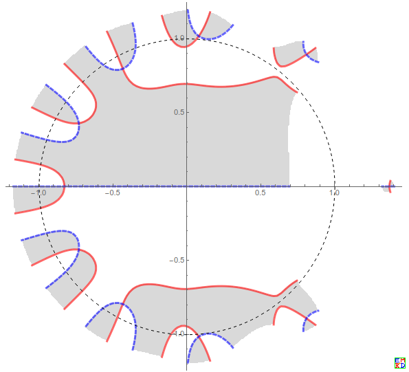
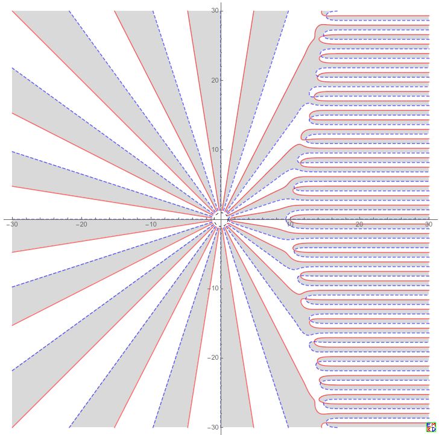

# 问题描述
求方程10^x=x^10的复数根有多少个?讨论见[趣题：10^x=x^10](https://bbs.emath.ac.cn/thread-16915-1-1.html)

# 解答1
mathe很快给出解答:

根据[儒歇定理](https://zh.wikipedia.org/wiki/儒歇定理)，取$f(x)=x^{10},f(x)+g(x)=x^{10}-{10}^x$,于是在复平面中$|x|<=2$的区域里面$f(x)=0$只有10重根，所以在$|x|<=2$以内$x^{10}-{10}^x=0$也是10个根，1~3中的解和3#中解的共轭给出了所有这些结果。
而且容易看出$2<|x|<10$无解，但是对于$|x|>=10$,有无穷个解

由于过于抽象,大家反响不强烈,于是 lsr314 和wayne给出了复数解的图.

```Mathematica
n=5;
ComplexPlot[10^x-x^10,{x,-n(1+I),n(1+I)},PlotPoints->400,Mesh->{Range[0,0],Range[0,0]},MeshFunctions->{Re[#2]&,Im[#2]&},MeshStyle->{Directive[Thickness[.005],Red],Directive[Dashed,Thickness[.005],Blue]},RegionFunction->Function[{z,f},Abs[f]<=n],BoundaryStyle->None,MeshShading->{{LightGray,White},{White, LightGray}},Epilog->{Thickness[.0001],Dashed,Circle[]},Frame->False,Axes->True]
```
$|x|<2$的情况下的根
  

$|x|>10$的情况下的根
  

# 解答2
最后wayne经过一番折腾,给出了一种新的解答形式:

本题$z^a=a^z$的解 即解方程组 $r \cos\theta \ln a = a\ln r ,  r \sin\theta \ln a=a\theta+2n\pi $
消元,那么得到 通解形式是:
$z = \frac{a \theta +2 \pi  n }{\ln a}(\cot\theta+i), n\in Z, n \neq 0$,其中 $\ln (\frac{a \theta +2 \pi  n}{\ln a\sin\theta})=\frac{a \theta +2 \pi  n}{a \tan \theta }$
