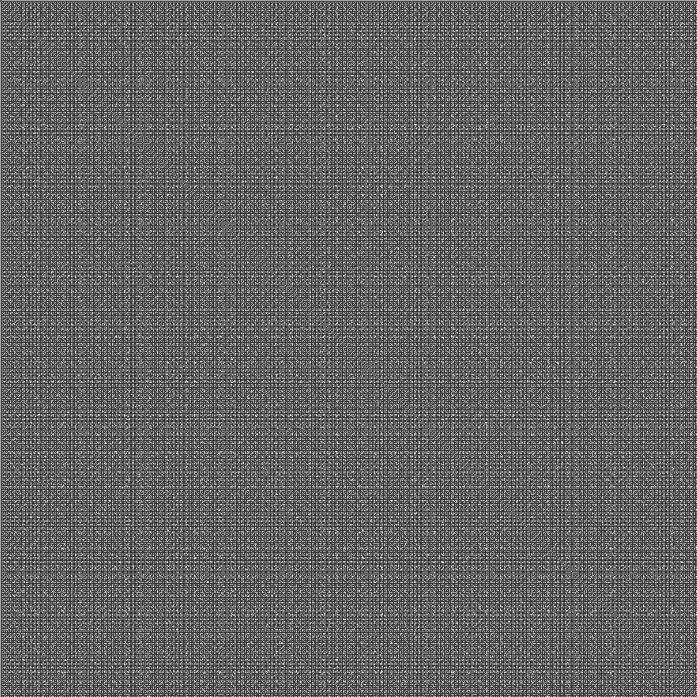
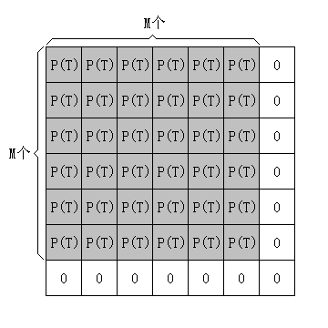
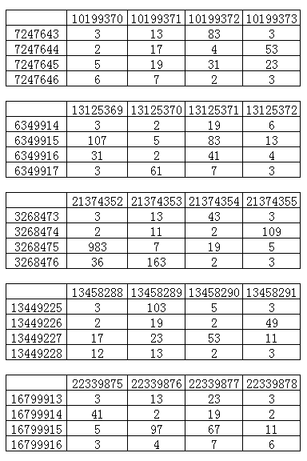

# 问题起源
2009年11月， [KeyTo9\_Fans提问](https://bbs.emath.ac.cn/thread-1946-1-1.html):  
把平面的第一象限分割成单位小方块，把坐标(整数部分)互质的点染成黑色，其余为白色。  
其效果如下图所示。（一个像素点是一个单位小方块，共1024\*1024个像素，原点在左上角）  
  
<!--more-->
## 问题一（经典问题）：  
在$[1,n]\times [1,n](n\to\infty)$的范围内，黑色方块所占的比例是否有极限？如何求这个极限值？  
## 问题二（自编问题）：  
考虑无限大的范围，能在里面找到大小为n\*n的纯白色区域的n的最大值是多少？  
## 问题三（自编问题）：  
设想整个平面是一块黑布，我们挖去了坐标(整数部分)不互质的部分，然后把这块布“拎”起来。  
这样，与主体失去连接的一些黑色方块会自动脱落，留下空洞。（用画板里的填充工具把上图的(1,1)填充一下就会发现有些黑色方块并没有被填充）  
问对角线旁边的方块（坐标为(x,x+1)或(x+1,x)的方块）是否全部与(1,1)相连？请证明或找反例。  

# 问题一证明
northwolves[回复认为](https://bbs.emath.ac.cn/forum.php?mod=redirect&goto=findpost&ptid=1946&pid=23531&fromuid=20)第一个问题的答案是$\frac6{\pi^2}$, 并且说这个问题他[以前在CSDN上讨论过](https://bbs.csdn.net/topics/80204336).  
KeyTo9\_Fans[提供了他的思路](https://bbs.emath.ac.cn/forum.php?mod=redirect&goto=findpost&ptid=1946&pid=23606&fromuid=20):  
P(N)有一个准确的上界：  
我们只取$p_1,p_2,\dots,p_n$。  
其中，$(p_1p_2\dots p_n)^2\lt N$  
记$M=\sqrt{N}$，取下整。  
记$T=p_1p_2\dots p_n$  
那么k关于素数$p_1$、$p_2$、... 、$p_n$的余数在k=1到k=N之内至少完成了M个周期的变化。  
在一个周期T里面，P(T)严格等于  
$\frac{p1^2-1}{p1^2}\frac{p2^2-1}{p2^2}\dots\frac{p_n^2-1}{p_n^2}$  
虽然至少完整地跑完了M个周期，但第(M+1)个周期并不完整。  
（实际上可能不止M个完整的周期，但讨论的是上界，就放缩到$\frac M{M+1}$好了）  
由于讨论的是上界，所以不完整的部分认为全满，一个空洞也没有。  
  
所以$P(N)\le \frac{P(T)M^2+2M+1}{(M+1)^2} \le \frac{P(T)M^2+3M}{M^2+2M}=\frac{P(T)M+3}{M+2}<P(T)+\frac1M$.  
所以随着N的增大，这个上界单调递减。  
另一方面，P(N)有一个准确的下界：  
不完整的部分被清得一个不剩。
  
所以$P(N)\gt P(T)\frac{M^2}{(M+1)^2} - \dots \gt P(T)\frac{M^2}{(M^2+3M)} - \dots =\frac{P(T)M}{M+3}-\dots \gt P(T)-\frac3M-\dots$  
除此之外，还要考虑剩下的素数  
p_(n+1)、p_(n+2)、......  
的影响。 
在N\*N的范围内，素数p造成的空洞不多于$\frac Np \times \frac Np$个，所占比例不多于$\frac 1{p^2}$。  
我们假设剩下的素数造成的空洞与之前的素数完全不重叠。
所以P(N)大于
$P(T) - \frac3M - \frac1{{p^{\primes}}_1^2} - \frac1{{p^{\primes}}_2^2} - \frac1{{p^{\primes}}_3^2} - \dots$  
其中 $p'_1$表示$p_{n+1}$，$p'_2$表示$p_{n+2}$，……，依次类推。  
记 $S = \frac1{{p^{\primes}}_1^2} + \frac1{{p^{\primes}}_2^2} + \frac1{{p^{\primes}}_3^2} + \dots$  
则$P(N)\gt P(T) - \frac3 M - S$  
综上：
$P(T) - \frac 3M - S \lt P(N) \lt P(T) + \frac 1M$  
由极限的夹逼性，P(N)的极限与P(T)的极限相同, 由此在根据前面一些结论可以得出结果。  

后来KeyTo9\_Fans发现数学吧cqhm关于这个问题给了个[很漂亮而且非常简单的证明](http://tieba.baidu.com/f?kz=192294075):  
R·查特在1904年发现，两个随意写出的数中，互素的概率为$\frac6{\pi^2}$。  
证明:考虑两个正整数最大公约数为n的概率，记为p(n)。  
明显两个数最大公约数为n当且仅当它们从n的倍数中选取且它们除以n的商互素。  
因此$p(n)=\frac{p(1)}{n^2}$.  
而显然所有p(n)之和为1，因为两个数有唯一的最大公约数，故p(1)乘以所有正整数平方倒数和为1,而这个和为$\frac{\pi^2}6$，故$p(1)=\frac6{\pi^2}$.  
mathe评论说如果一定要给这个证明鸡蛋挑骨头，那么就是没有证明概率的存在性。  

# 问题二讨论
mathe说问题二中[纯白色正方形区域可以任意大](https://bbs.emath.ac.cn/forum.php?mod=redirect&goto=findpost&ptid=1946&pid=23541&fromuid=20)：  
取前$n^2$个素数排成$n\times n$方阵。  
设方阵中每行n个数乘积为$u_i$,每列n个数乘积为$v_i$  
那么所有的$u_i$之间互素，同样所有$v_i$之间互素。  
根据中国剩余定理  
$x\equiv -(i-1) (mod u_i) ,1\le i\le n$有解.  
同样:  
$y\equiv -(i-1) (mod v_i), 1\le i\le n$有解.
方阵$[x,x+n-1]\times[y,y+n-1]$满足条件.  

# 问题三反例
问题三看上去很像是能够成立的样子，但是后来Fans在n=2189时[找出了一个反例](https://bbs.emath.ac.cn/forum.php?mod=redirect&goto=findpost&ptid=1946&pid=23631&fromuid=20):  
  
上图是截至[2160,2223]\*[2160,2223]区间中的互质点。  
左上角坐标为(2160,2160)，右下角坐标为(2223,2223)。  
黑色方块表示不与(1,1)相连，红色方块表示与(1,1)相连，白色表示不互质。  

# 问题二深入讨论计算
关于问题二，Fans又提出了一个[最优解寻找问题](https://bbs.emath.ac.cn/thread-1948-1-1.html):  
对于n=2、n=3、n=4的情况，找对应的(x,y)，使得整数对  
(x,y)，(x+1,y)，...，(x+n-1,y)  
(x,y+1)，(x+1,y+1)，...，(x+n-1,y+1)  
............  
(x,y+n-1)，(x+1,y+n-1)，...，(x+n-1,y+n-1)  
均不互质。  
在满足上面的条件的前提下，(x+y)的值越小越好。 
看看对于n=2、n=3、n=4的情况，找出来的整数对到底有多大。  

northwolves快速给出[n=2](https://bbs.emath.ac.cn/forum.php?mod=redirect&goto=findpost&ptid=1948&pid=23585&fromuid=20)： (14,20)  
[n=3](https://bbs.emath.ac.cn/forum.php?mod=redirect&goto=findpost&ptid=1948&pid=23586&fromuid=20): (1274 ,1308)  
mathe建议对于更大的n[只搜索特殊模式的解](https://bbs.emath.ac.cn/forum.php?mod=redirect&goto=findpost&ptid=1948&pid=23682&fromuid=20):  
如下的结构，其中?用互素而且不小于5的素数。  
6 ?  2 3  
? ?  ? ?  
2 ?  2 ?  
3 ?  ? 3  
然后提供了[一份C代码](../attached/coprime/co_mathe.txt)
并且找出n=4时[可以有解](https://bbs.emath.ac.cn/forum.php?mod=redirect&goto=findpost&ptid=1948&pid=23688&fromuid=20)x=726156780,y=68838054。  
随后KeyTo9\_Fans找出了[一组更小的解](https://bbs.emath.ac.cn/forum.php?mod=redirect&goto=findpost&ptid=1948&pid=23724&fromuid=20): x=7247643,y=10199370
并且给出几组类似的不错的解:  

并且发现已经[有人捷足先登](http://www.wolframscience.com/nksonline/page-1093b-text)了.  
Fans继续努力，程序[经过通宵运行](https://bbs.emath.ac.cn/forum.php?mod=redirect&goto=findpost&ptid=1948&pid=24017&fromuid=20)，找出n=5的解:  
x=7759032126,y=247376414072  

|   | y  |   y+1| y+2 |y+3| y+4|
|---|----|------|-----|---|----|
|x  | 2  |    3 |  2  | 41|  2 |
|x+1| 137|  37  | 103 | 7 | 11 |
|x+2|   2|  19  |   2 | 29| 2  |
|x+3|  23|    3 |  109| 31| 3  |
|x+4|   2|    47|   2 | 5 |  2 |

x=14150396180,y=232889465522

|   | y  |   y+1| y+2 |y+3| y+4|
|---|----|------|-----|---|----|
|x  | 2  | 37   |2  |  5 |    2|
|x+1|79  |3     |67  |97 |  3|
|x+2| 2  |13   |2   |17  | 2|
|x+3| 7  |11  |31  |83  |43|
|x+4| 2  | 3   | 2  | 29 |  3|

x=[37945747188](https://bbs.emath.ac.cn/forum.php?mod=redirect&goto=findpost&ptid=1948&pid=24048&fromuid=20),y=131487690152

|   | y  |   y+1| y+2 |y+3| y+4|
|---|----|------|-----|---|----|
|x  |2   | 3   |   2  | 73|  2  |
|x+1|7   | 41   |277  |151| 109|
|x+2|2   | 89   |  2  | 5 |    2|
|x+3|31  |  3   |  83 | 19|    3|
|x+4|2   | 17   |  2  |409|  2 |

其中最后一个结果最优秀并且被Fans提交到了[A179594](https://oeis.org/A179594).  
