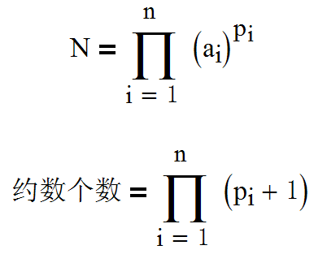
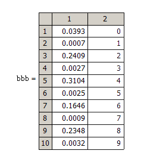

---

title: "勇敢的CSDNer"
date: "2020-01-29"
thumbnail: "../thumbnails/ballon.jpg"
author: "mathe"
tags: 
    - "多方博弈"
---
2009年6月CSDN中有网友[提出了多方博弈问题](https://bbs.csdn.net/topics/310116143):  
10位CSDNer乘坐热气球在太平洋上空旅行，他们打算开香槟庆祝一下这个伟大的时刻。然而很不幸，他们发现气球上破了一个洞，氢气不断外泄，气球开始下降，很快他们就会掉到海洋里成为鲨鱼的甜品。  
但他们并没有就此完蛋，只要其中一位能够牺牲自己，跳出气球，就可以挽救其余人的生命。那问题就变成了，谁会愿意这么做呢？有一个公平的办法来解决这个问题。首先，把这十个人从0到9编上号，然后每个人先在纸上写上一个大于等于1小于等于10000的整数，把这10个人写的数字相乘，等到一个结果a，找出a的约数的个数b，则b的个位就是要牺牲自己的CSDNer的编号。把这位英雄找出来吧！！  
<!--more-->
输入：每行一个大于等于1小于等于10000的整数  
输出：b的个位数  
样例：  
输入：  
1  
2  
6  
1  
3  
1  
1  
1  
1  
1  
那么a=1\*2\*6\*1\*3\*1\*1\*1\*1\*1=36  
a的约数有：1，2，3，4，6，9，12，18，36总共9个  
则b=9  
那么b的个位也是9  
输出：9  

shshsh_0510把问题[进口到数学研发论坛](https://bbs.emath.ac.cn/thread-1578-1-1.html), 并且询问，CSDNer能否有什么策略让别人更英雄一些吗？  

# 详细信息
到处瞎逛[首先指出这个博弈是不公正的](https://bbs.emath.ac.cn/forum.php?mod=redirect&goto=findpost&ptid=1578&pid=20019&fromuid=20),偶数编号是很吃亏的:  
约数的个数的公式如下：  
  
并且给出了1~10000以内数字的约数数目的个位数分布频率
  
可知如果你拿到一个奇数的数字，你的策略就是选择一个较大的素数，这样其他的十个人中有人真好和你选择的这个素数相同的概率是非常小的。  
也就是说你会为这个大的乘积数字贡献一个只有指数系数为1的数字，那么最终的约数个数必然是偶数。你就不会跳下去了。  
如果你是偶数，那就没办法了。
gxqcn进一步指出[0号选手特别危险](https://bbs.emath.ac.cn/forum.php?mod=redirect&goto=findpost&ptid=1578&pid=20020&fromuid=20), 非常容易被合谋致死。  
mathe对大家的分析做了[更加详细的解释](https://bbs.emath.ac.cn/forum.php?mod=redirect&goto=findpost&ptid=1578&pid=20109&fromuid=20):  
对于编号是奇数的用户,如果不存在故意陷害某个人的因素,为了保护自己,通常他们4个都会随机选择一个大于5000的素数,这样是比较有利的选择.所以我们可以认为有非常大的概率,这4个人选择的素数都不相同,他们对总因子数贡献了一个倍数32.
现在应该考虑用户2,4,6,8是否有办法在不合谋的情况下采用某种策略使得存在较大的概率存在某个素因子的次数为4(和9等),而编号为0的用户需要预防这种策略的攻击.  
如果2,4,8,6相互之间构成一个乘法群,所以,如果最终结果落在他们中间之一,那么到底那一个还是比较随机的(只要随机在添加一个不同的素因子,就相当于总数乘2,于是跳跃到乘法群的下一个数).
所以从这个角度来说,2,4,8,6用户即使不是故意要合谋0号用户,至少也要去拉他下水.为此,他们会希望能够有较大的概率创造出某个素因子的次数是4.为此,这4个用户会偏向于选择那些小素数的乘积构成的数,特别是那些含有比较多素因子2,3,5,7,11,13等的数.这样他们共同合作的结果会有较大的概率使得最终乘积中可能会某个素因子的次数是4. 而对于0号用户,我觉得他也会部分选择这些含有小因子的数,从而破坏这些素音子的次数(比如使它们超过4次).而最终这里需要达到一个纳什均衡.  
KeyTo9\_Fans登堂亮相，充分显示了ACMer的能量，[进行了大量的模拟](https://bbs.emath.ac.cn/forum.php?mod=redirect&goto=findpost&ptid=1578&pid=64912&fromuid=20),比如:  
第$41$次迭代，重复$100$万次试验，得到$0$号选手的死亡率已经高达$90.4%$了，  
说明$0$号选手死得太多了，导致很多数字都无法区分好坏，策略调整的效率又大大降低了。  
于是接下来$10$个成员全部采用【潜在死亡次数】来调整策略，  
也就是每次试验不论选择了什么数字，死还是没死，都假定其中$9$个人选的数字不变，  
然后剩下$1$人从$1$到$10000$各选$1$遍，看看选哪些数会把自己整死。  
这样每次实验每人都可以得到$100000$个样本用于分析，效率会大大提高。  
第$41$次迭代：  
重复$0.5$亿次试验，得到各选手的死亡率如下。  
$0$	$0.904004$  
$1$	$9.580946\times 10^{-13}$  
$2$	$0.024025$  
$3$	$1.198199\times 10^{-12}$  
$4$	$0.024178$  
$5$	$8.687553\times 10^{-10}$  
$6$	$0.024050$  
$7$	$1.196017\times 10^{-12}$  
$8$	$0.023969$  
$9$	$1.125888\times 10^{-12}$  
最后他的总结是:  
博弈论里定义的【纳什均衡点】只是要求【任何一个人单方面改变自己的策略，都无法获得更低的死亡率】，  
我感觉这个要求太弱了，在楼主设定的游戏里，这样的均衡点多如牛毛，无法知道到底哪个【纳什均衡点】才是最终的策略。  
而通过迭代的方法，大家的策略会收敛到其中一个【纳什均衡点】上，  
而一旦进入了一个【纳什均衡点】，大家的策略就稳定下来了，就很难再跳到别的纳什均衡点上了。  
就好比通过局部调整法找到函数的一个极值后，局部调整就稳定下来了，就很难再跳到别的极值点上了，  
所以无法保证局部调整得到的极值就是函数的最值。  
所以我觉得【纳什均衡点】在这里并不适用，可能存在更强的均衡点，例如，  
【任何$2$个人在其余$8$人都不改变策略的前提下进行$2$人博弈，他们仍然会继续使用自己当前的策略】。  
【任何$3$个人在其余$7$人都不改变策略的前提下进行$3$人博弈，他们仍然会继续使用自己当前的策略】。  
……  
【任何$9$个人在剩余$1$人不改变策略的前提下进行$9$人博弈，他们仍然会继续使用自己当前的策略】。  
不知道研究【多方博弈】的文献里有没有这样的定义和求解方法。
