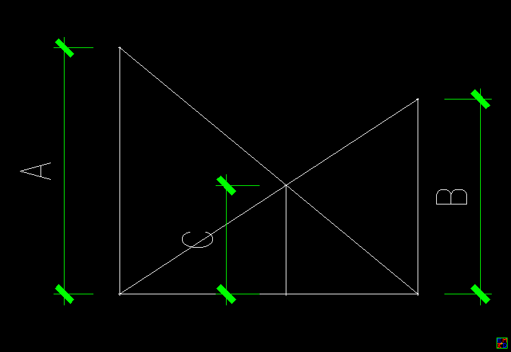

---

title: "倒数丢番图方程"
date: "2020-01-25"
thumbnail: "../images/Diophrecip.png"
author: "mathe"
tags: 
    - "丢番图"
    - "倒数" 
---

wayne于2014年3月[转载projectEuler 454问题](https://bbs.emath.ac.cn/thread-5423-1-5.html):  
设对于给定的 $L$，等式 $\frac1X + \frac1Y = \frac1N, (0 \lt X \lt Y \leqslant L)$ 成立总共有 $f(L)$ 种情况 .
举几个简单的例子, 有 $f(6) =1, f(12)=3, f(1000)=1069$, 求$f(10^{12})$.  
[参考链接](http://projecteuler.net/problem=454)  

# 公式推导
wayne指出：  
$\frac{x+y}{(x,y)}\mid (x,y)$  
不过,在此基础上,可以导出这种一般性的解表达:   $x=km(m+n) ,y=kn(m+n), (m,n)=1, m\lt n$, 即$L=kn(m+n)$  

但要计算出$f(10^{12})$,还需要进一步的挖掘,优化.  
Lwins_G给出进一步[公式推导过程](https://bbs.emath.ac.cn/forum.php?mod=redirect&goto=findpost&ptid=5423&pid=52667&fromuid=20):  
直接计算$ \sum_{n=1}^{\sqrt{L}} \sum_{m=1,(n,m)=1}^{n-1} [\frac{L}{n(n+m)}] $只需要$O(L)$的时间，我认为这是可以承受的。不过我们也可试着优化一下：  
$$
\sum_{n=1}^{\sqrt{L}} \sum_{ m=1,(n,m)=1 }^{n-1} [ \frac{L}{n(n+m)} ]
=\sum_{n=1}^{\sqrt{L}} \sum_{s=n+1 , (n,s)=1 }^{2n-1} \left[ \frac{L}{ns} \right] 
=\sum_{n=1}^{\sqrt{L}} \sum_{s=n+1}^{2n-1} \left[ \frac{L}{ns} \right] \left[ \frac{1}{(n,s)} \right] 
=\sum_{n=1}^{\sqrt{L}} \sum_{s=n+1}^{2n-1} \left[ \frac{L}{ns} \right] \sum_{d | (n,s)} \mu(d) 
=\sum_{n=1}^{\sqrt{L}} \sum_{d | n} \sum_{ n < s \leq 2n-1, d | s } \left[ \frac{L}{ns} \right] \mu(d) 
=\sum_{n=1}^{\sqrt{L}} \sum_{d | n} \mu(d) \sum_{\frac{n}{d} < s^{\prime} \leq \frac{2n-1}{d}} \left[ \frac{L}{nds^{\prime}} \right] 
=\sum_{n=1}^{\sqrt{L}} \sum_{d | n} \mu(d) \left( \psi\left( \left[ \frac{L}{nd} \right],\frac{2n-1}{d}\right) - \psi\left(\left[ \frac{L}{nd} \right],\frac{n}{d}\right) \right)
$$

计算$ \psi(x,y) = \sum_{n=1}^{y} \left[ \frac{x}{n} \right]$显然是$O(\sqrt{x})$的。
于是使用该公式可以做到在$O(L^{3/4})$的复杂度内计算。  

cn8888给出了这个丢番图方程的[几何意义](https://bbs.emath.ac.cn/forum.php?mod=redirect&goto=findpost&ptid=5423&pid=52964&fromuid=20):
  
[倪举鹏表示](https://bbs.emath.ac.cn/forum.php?mod=redirect&goto=findpost&ptid=5423&pid=54235&fromuid=20):  
还有种几何关系满足这个等式：平面过一点的三射线中间射线与两边射线夹角都是60度。一条直线截这3射线为三段，这三段长度满足这个等式.

[sunwukong认为](https://bbs.emath.ac.cn/forum.php?mod=redirect&goto=findpost&ptid=5423&pid=53582&fromuid=20):  
因为  
$\frac1x+\frac1y=\frac1n$，$0\lt x\lt y\leq L$  
所以 $n\lt x\lt y\leq L$  
设 $x=n+s$，$y=n+t$，则$1\leq s\lt t\leq L-n$  
$\frac1{n+s}+\frac1{n+t}=\frac1{n} \iff n^2=st$  
所以  
$n^2=st\geq1\times 2=2 \Rightarrow n\geq 2$  
$s=\frac{n^2}t\geq \frac{n^2}{L-n}$  
$\frac{n^2}{L-n}\leq s\lt n\lt t\leq L-n$  
$\frac1{n}=\frac1x+\frac1y\gt \frac1L+\frac1L=\frac2L \Rightarrow n\lt \frac{L}{2}$  
所以  
$f(L)$  
$=\sum_{n=2}^{\lfloor \frac{L-1}{2} \rfloor} \sum_{ s\geq\frac{n^2}{L-n} , s| n^2}^{n-1} 1$  
$=\sum_{n=2}^{\lfloor \frac{L-1}{2} \rfloor} \sum_{ t=n+1, t|n^2 }^{L-n} 1$  
$=\sum_{n=2}^{\lfloor \frac{L-1}{2} \rfloor} \frac{(\sum_{ u\geq\frac{n^2}{L-n} , u| n^2}^{L-n} 1)-1}2$  

关键的是  
给定 $n$，$L$，求满足  
$t| n^2$，$n\lt t\leq L-n$  
的$t$的数目  
这一步的复杂度与$n^2$的质因数分解相同  

[kastin指出](https://bbs.emath.ac.cn/forum.php?mod=redirect&goto=findpost&ptid=5423&pid=54225&fromuid=20):  
其实就是涉及大数分解，虽然大数分解本身没有什么高效率的算法，但是这个题目只是统计解的个数，而非找到每一组解。
联想到给出不大于$x$的素数个数$\pi(x)$的算法目前最高效的算法中，并不需要找出所有小于x的素数然后统计个数（见M. DELEGLISE AND J. RIVAT.COMPUTING  (x): THE MEISSEL, LEHMER, LAGARIAS,MILLER, ODLYZKO METHOD)
因而，$n^2$满足一定限制要求的分解方案数，应该有相应不需要找出每种具体方案的高效算法。

# 开始计算
wayne试着[开始计算](https://bbs.emath.ac.cn/forum.php?mod=redirect&goto=findpost&ptid=5423&pid=52668&fromuid=20)
```bash
L=10^4;phi=Sum[Floor[#1/n],{n,1,#2}]&;
Sum[MoebiusMu[j](phi[Floor[L/(j i)],(2i-1)/j]-phi[Floor[L/(j i)],i/j]),{i,1,Sqrt[L]},{j,Divisors[i]}]
```
但是他发现这份Mathematica代码计算$10^7$就要40秒

Lwins_G测试后认为Mathematica计算$\psi(x,y)$时所消耗的时间是平凡的，为$O(y)$，这会导致复杂度退化为  
$\sum_{n=1}^{\sqrt{L}}\sum_{d\mid n} O(\frac nd)=O(L)$  
所以需要自己重新实现。

282842712474直接[使用Lwins_G的公式](https://bbs.emath.ac.cn/forum.php?mod=redirect&goto=findpost&ptid=5423&pid=54248&fromuid=20)用phyton计算出$f(10^7)=30093331,\quad f(10^8)=349446716$，前者用时1.7秒，后者用时17秒。
$f(10^9)=3979600400$，用时196.748994145秒... 按这个速度$10^{12}$预计需要3天时间才能计算出来。  
[对应的python代码](../attached/diophrecip/python.txt)  
然后[他继续实现](https://bbs.emath.ac.cn/forum.php?mod=redirect&goto=findpost&ptid=5423&pid=54270&fromuid=20)$O(L^{\frac34})$复杂度的[代码](../attached/diophrecip/python2.txt), 测试运行$f(10^9)$提升到24秒。
[最终他实现](https://bbs.emath.ac.cn/forum.php?mod=redirect&goto=findpost&ptid=5423&pid=54281&fromuid=20)了$O(\sqrt{L})$复杂度的算法,[这份代码](../attached/diophrecip/ohalf.txt)用时101秒计算出$f(10^{12})=5435004633092$.

