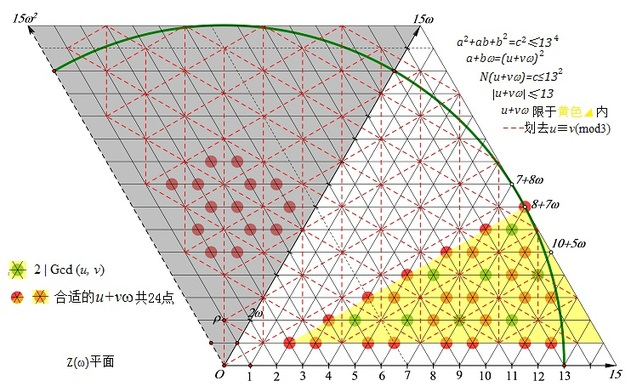

2010年4月[wayne提问](https://bbs.emath.ac.cn/thread-2281-1-1.html) :  
如果,正整数a,b,N，满足，$a^2-ab+b^2=N^2$，  
试问，$1\le a\lt b\lt 10^{100}$以内的互质的解有多少组？  
wayne要求计算的范围有点不现实，他表示可以改为一个更加合理的范围。  
最终hujunhua通过利用Eisenstein整环给出了一个对于给定的N上面方程正整数解数目的公式， 并且给出了原理分析。

# 公式推导
看到这个信息，hujunhua[快速给出了如下结论](https://bbs.emath.ac.cn/forum.php?mod=redirect&goto=findpost&ptid=2281&pid=27576&fromuid=20):  
要求互质解的话，N有且只能有1(mod3)的质因数。这是数论中关于$Z(\omega)$的一个基本定理。  
如果我没算错的话，当N有k个1(mod3)的质因子时，$a^2-ab+b^2=N^2$的互质解(a,b)对数为$2^{k-1}$。  
并且他认为:   
在算法上，这个问题与求本原勾股数完全相同。关于本原勾股数的两个公式:  
1、通解公式：$a=|u^2-v^2|, b=2uv, c=u^2+v^2$, 式中GCD(u, v)=1, u, v一奇一偶。  
2、计数公式：c只含有1(mod4)的质约数，当c有k个1(mod4)的质约数时，本原(a,b)对有$2^{k-1}$个。  
wayne的问题中也有对应的通解公式和计数公式，它们对对优化算法的作用应该是完全一样的。一定范围内的勾股数应该有现成的算法吧，可以拿来参考一下。

wayne选择特殊的N[对hujunhua的结论进行验证](https://bbs.emath.ac.cn/forum.php?mod=redirect&goto=findpost&ptid=2281&pid=27608&fromuid=20):  
```bash
比如当N=7*13*19*31*37*43
其解有2^5=32组，如下：
{a,b}:

{5, 9237}, 		{157, 9312},		 {368, 9413},		{873, 9640},
{880, 9643},		{960, 9677},		{1063, 9720},		{1383, 9848},
{1565, 9917},		{1592,   9927},	{1752, 9985},		{1933, 10048},
{2277, 10160},	{2435,   10208},	{2640, 10267},	{2687, 10280},
{2787, 10307},	{3127, 10392},	{3272, 10425},	{3355, 10443},
{3625, 10497},	{3707,   10512},	{3953, 10553},	{4103, 10575},
{4177, 10585},	{4272, 10597},	{4297, 10600},	{4755, 10643},
{4833, 10648},	{4925, 10653},	{4968, 10655},	{5295, 10663}
```

mathe认为[可以有通解](https://bbs.emath.ac.cn/forum.php?mod=redirect&goto=findpost&ptid=2281&pid=27622&fromuid=20):  
i)$(u,v)=1$,  
$\begin{cases}b=4uv\\a=3u^2-v^2+2uv\\N=3u^2+v^2\end{cases}$  
ii)$(u,v)=1$,  
$\begin{cases}b=4uv\\a=u^2-3v^2+2uv\\N=u^2+3v^2\end{cases}$  
当然我们还需要限定条件$1\le a\lt b$,还有可能有公共的因子2需要消去

然后hujunhua给出了[改进的公式](https://bbs.emath.ac.cn/forum.php?mod=redirect&goto=findpost&ptid=2281&pid=27639&fromuid=20):  
$\{a, b\}=\{u^2-v^2, 2uv-v^2\}$  
$N=u^2-uv+v^2$  
$u\gt v\gt 0, Gcd(u,v)=1, u\ne -v(\mod3)$。  

# Eisenstein整环简介
[hujunhua给出](https://bbs.emath.ac.cn/forum.php?mod=redirect&goto=findpost&ptid=2281&pid=27669&fromuid=20):
       $Z(\omega)$及丢番图方程$a^2-ab+b^2= N^2$简介

一、Eisenstein整数环$Z(\omega)$简介。  
【定义1】（Eisenstein整数环）$Z(\omega):=\{a+b\omega|a, b\in Z\}$，$\omega$是3次单位根，满足$\omega^3=1，\omega^2+\omega+1=0$.  
        注1:  $\omega$的共扼根$\omega^{\prime}=\omega^{-1}=\omega^2$, 这对共轭复根具有平等对称的性质，随便取哪个当作$\omega$定义$Z(\omega)$都是一样的，因为有$\omega+\omega^{\prime}=-1$使得$Z(\omega^{\prime})=Z(\omega)$。故$Z(\omega)$中的数也并行采用$a+b\omega^{\prime}$的形式，有互易转换$a+b\omega=(a-b)-b\omega^{\prime}$.  
        在下文中，如用一个字符来表示$Z(\omega)$中的数，不作声明时都用$z$（可带下标）。  
【定义2】（范数）对于$z= a+b\omega，N(z):=|z|^2=(a+b\omega)(a+b\omega^{\prime})=a^2-ab+b^=:a\otimes b$ ，称为$z$的范数。  
        注：$\otimes$是为了简化书写而引入的一个二元运算符号。  
【定义3】（单位元）范数等于1的Eisenstein整数称为$Z(\omega)$的(乘法)单位元。  
        注1：$Z(\omega)$中有6个单位元: $\pm 1$, $\pm\omega$, $\pm\omega^{\prime}$，以下用 $\epsilon$不定代指单位元。  
        注2：如果$z_1=\epsilon z_2$，就称$z_1$和$z_2$相伴。  
【基本性质1】作为环，$Z(\omega)$对加、减、乘法封闭。值得一提的是对乘法封闭的意义，即对任意的a+b\omega与c+d\omega, 存在e+f\omega=(a+b\omega)(c+d\omega)。由于降次公式\omega[sup]2[/sup]=-1-\omega，这是显然的。取范数可得代数恒等式
$(a\otimes b)(c\otimes d)=(ac-bd)\otimes (da+bc+bd)$
        胡子评曰：恒等式“两平方和乘积=两平方和”与此具有相似的背景和意义，它们在初等代数中都不是显然的，仿佛灵光一闪间妙手偶得之，但在Z(i)和$Z(\omega)$中一点也不惊奇，就跟1+1=2差不多。从高端看初等的优势于此可见一斑。
【基本性质2】$Z(\omega)$中成立算术基本定理，并且是唯一分解的整环。  
        注：$Z(\omega)$中的素数有3类： 
        1)  $\omega-\omega^{\prime} =:\rho$, 具有性质$\rho=\omega-\omega^{\prime}=-(\omega^{\prime}-\omega)=-\rho^{\prime}$, 所以$\rho^2=-N(\rho)=-3$。可见$3=-\rho^2$不是$Z(\omega)$中的素数。  
        2)  $a+b\omega,  a\otimes b=1(mod6)$的素数。即6m+1形的自然素数都不是$Z(\omega)$中的素数，都可以唯一地分解为$Z(\omega)$中一对共扼素数$a+b\omega$和$a+b\omega^{\prime}$的积。  
        3)  2(mod3)的自然素数， 即2和6m-1形自然素数在$Z(\omega)$仍然是素数。  
二、几个对本帖有用的引理。  
【引理1】 $\omega\equiv\omega^{\prime}\equiv1(\mod\rho)$  
                证：$\omega\equiv\omega^{\prime}(mod\rho)$显然，两边乘以$\omega^2$得  $\omega\equiv\omega^{\prime}\equiv1(\mod\rho)$.  
        推论1：$a+b\omega\equiv a+b\omega^{\prime}\equiv a+b(mod\rho)$  
        推论2：$a+b\omega\equiv 0(mod \rho)$ 当且仅当$a+b\equiv 0(mod 3)$.（证略）  
        注：事实上， $\rho$ 与$1-\omega，1-\omega^{\prime}$相伴，而且大多数书上选择的是$\rho=1-\omega$.   
【引理2】 $Gcd(a+b\omega, a+b\omega^{\prime})|\rho Gcd(a, b)$  
        证：$Gcd(a+b\omega, a+b\omega^{\prime})=Gcd(a+b\omega, a+b\omega-(a+b\omega^{\prime}))=Gcd(a+b\omega, \rho b)|Gcd(\rho(a+b\omega)-\omega\rho b,  \rho b)$  
                                                                                                                              $=Gcd(\rho a, \rho b)=\rho Gcd(a, b)$.  
        推论1：当 $\rho$ 不整除$a+b\omega$时，$Gcd(a+b\omega, a+b\omega^{\prime})=Gcd(a, b)$.  
        推论2：当 $\rho$ 不整除$a+b\omega$时，$Gcd(a+b\omega, a+b\omega^{\prime})=1↔Gcd(a, b)=1$.即“共扼互质↔分量互质”。  
【引理3】 $d|(a+b\omega)$, 当且仅当$d|Gcd(a,b)$. 
        证：d总是同时整除$a+b\omega$和$a+b\omega^{\prime}$，即$d|Gcd(a+b\omega, a+b\omega^{\prime})|\rho Gcd(a, b)$. 当$d$不含因子3时，显然$d|Gcd(a,b$). 当$3|d$时，因$d$和$Gcd(a, b)$均含有偶数个$\rho$，仍有$d|Gcd(a,b)$.  
三、丢番图方程$a^2+ab+b^2= n^2$的通解公式和解数  
        除了那些基本性质，关于$Z(\omega)$最容易想到的一个问题就是哪些$a+b\omega(ab\ne 0)$的模为自然整数，即范数$N(a+b\omega)$为自然平方数。这就导致方程:  
$a\otimes b=n^2$.  在$Z(\omega)$中写为$(a+b\omega)(a+b\omega^{\prime})=n^2$.  
        只要求出本原解，比例解乘以倍数可得，所以限定$Gcd(a,b)=1$是有道理的。这个限制使得  
        1）n不含任何第3)类素数因子$p^3$. 否则$p^3|(a+b\omega)$，由引理3得$p^3|Gcd(a, b)=1$，矛盾.   
        2）n不含因子3.  否则$n^2$含$\rho^4$. 由于引理1的推论1知$a+b\omega$与$a+b\omega^{\prime}$平分$n^2$中的$\rho$，那么至少各分得$\rho^2$，即$3|Gcd(a, b)=1$，矛盾. 于是按引理2推论2可得  
        3) $Gcd(a+b\omega, a+b\omega^{\prime})=Gcd(a,b)=1$，因此总可得到$a+b\omega=(u+v\omega)^2$， $a+b\omega^{\prime}=(u+v\omega^{\prime})^2$，$n=u\otimes v$.  
展开后比较分量系数可得  $a=u^2-v^2，b=2uv-v^2$.   
        要保持$Gcd(a,b)=1$，须有$Gcd(u, v)=1，u+v\ne 0(mod 3)$.（引理1推论2）  
        显然，总可以得到$u \gt  v \gt0$。如果所得$u^2-v^2\gt 2uv-v^2$，那就取 $a=2uv-v^2，b=u^2-v^2$. 总可使得结果满足$0\lt a\lt b$.  
        4)假定$n=p_1^{s_1}\cdot p_2^{s_2}\cdot \cdot \cdot p_i^{s_i}\cdot \cdot \cdot p_k^{s_k}$，$p_i=(a_i+b_i\omega )(a_i+b_i\omega^{\prime})$，为了构造$a+b\omega$和$a+b\omega^{\prime}$，我们需要将$(a_i+b_i\omega)^{2s_i}(a_i+b_i\omega^{\prime})^{2s_i}$的所有质因子（按重数计）平分成两堆，划拨给$a+b\omega$和$a+b\omega^{\prime}$。由于引理3的原因，$a+b\omega$不能同时要一对共扼因子，$a+b\omega^{\prime}$也一样。否则短路打火，烧焦成实因子，就破坏了a与b的互质性。所以要么将$(a_i+b_i\omega )^{2s_i}$全部给$a+b\omega$、$(a_i+b_i\omega^{\prime})^{2s_i}$全部给$a+b\omega^{\prime}$，要么将$(a_i+b_i\omega^{\prime})^{2s_i}$全部给$a+b\omega$、$(a_i+b_i\omega)^{2s_i}$全部给$a+b\omega^{\prime}$，只有这2种分配方案。于是全部分配方案就是$\frac{2^k}2=2^{k-1}$种。除以2是因为共扼对称和乘法交换律。  
		
并且hujunhua给出了对应的图解
  
