# 摘要
数学星空于2011年10月询问，给定一个椭圆，其[内接n边形的周长最大是多少](https://bbs.emath.ac.cn/thread-3740-1-2.html) ？  
给定椭圆可以假设方程为$\frac{x^2}{a^2}+\frac{x^2}{b^2}=1$,求其内接n边形周长的最大值$L(n)$。  

# 具体内容
[数学星空首先给出](https://bbs.emath.ac.cn/forum.php?mod=redirect&goto=findpost&ptid=3740&pid=39892&fromuid=20) 了$L(3)=2\sqrt{3}\frac{a^2+b^2+D}{\sqrt{a^2+b^2+2D}}$,其中·$D=\sqrt{a^4+b^4-a^2b^2}$。  
并且指出，对于椭圆内接n边形有现成结论：  
P是已知椭圆上的一点，以P为一顶点且内接于椭圆的n边形中，有且仅有一个周长最长的，记为n(P), 它由下面的2个等价的条件之一决定：  
（1） n(P)的全部顶点都具有光反射特性。  
（2）n(P)外切于某个与椭圆同焦点的另一个椭圆上。 

## 诡异的椭圆定理
hujunhua指出，根据数学星空前面给出的链接（已失效）中结论，应该有$L(4)=4\sqrt{a^2+b^2}$，并且指出，不仅仅是椭圆，对于任意的卵形线，其
周长最大的内接多边形都是反射封闭光路。 他还指出，链接中有一个很有用的命题：  
椭圆外一点向椭圆的张角与向椭圆俩焦点的张角同角平分线。  
并且hujunhua给出[对应的几何证明](https://bbs.emath.ac.cn/forum.php?mod=redirect&goto=findpost&ptid=3740&pid=39915&fromuid=20) 。 
设PA,PB是椭圆的切线，$F_1,F_2$是两个焦点，
作$PF_1$关于切线PA的镜像PC,和$PF_2$关于切线PB的镜像PD, 易知A、C、$F_2$共线，B、D、$F_1$共线，B、D、$F_1$共线，并且$CF_2=DF_1=2a$,
所以得出$\Delta PCF_2$和$\Delta PDF_1$全等，余下就简单了。  
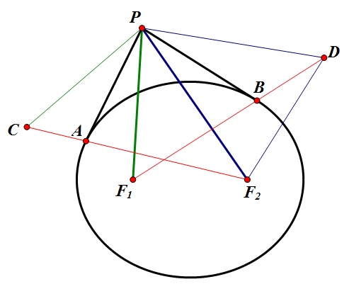  
hujunhua进一步指出，将$F_1PF_2$想象为一根绷直的绳，两端扎紧在小孔$F_1$和$F_2$中，P为一个半径无穷小的张紧轮。当轮P在绳上滚动时，其轨迹形成了椭圆最经典的定义。

现在，用一个比椭圆周长长一些的绳圈套在上图的椭圆上，也用一个张紧轮P将松松垮垮的绳子绷紧，绳子绷直的两段与椭圆相切于A、B处。当轮P在绳子上滚动时，其轨迹是什么？

[答案很不新鲜](https://bbs.emath.ac.cn/thread-4216-1-1.html) ：也是以$F_1$和$F_2$为焦点的椭圆！  
 
mathe建议用$|PA|+|PB|-弧AB$的微分来分析，看看能否证明此微分为0。

zgg\_\_ 建议可以用物理方法分析： 
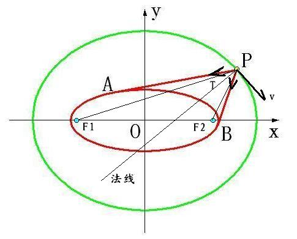  
分析P点的受力状况，可以看到它只受到绳子的张力T，因为T的大小总是相等，所以力合成的效果是沿着角APB的角平分线方向（就是法线方向），所以P点的运动方向将垂直于法线。
如hujunhua在[帖子](https://bbs.emath.ac.cn/thread-3740-1-2.html) 的6层所说：“椭圆外一点向椭圆的张角与向椭圆两焦点的张角同角平分线。”所以它们共法线了。
既然它们在P点的运动方向总是一致的，那么它们的轨迹就重合了，所以轨迹就是椭圆了。
这的确是个有趣的结果。后来yinhow对这个方法进行补充说明: 绳子有弹性，总长不变，所以弹性势能不变；系统机械能守恒，所以动能（或者速率）不变；速率不变，所以切向力为零，即角平分线垂直于切线。

数学星空最先对这个模型[进行数值计算](https://bbs.emath.ac.cn/forum.php?mod=redirect&goto=findpost&ptid=4216&pid=42610&fromuid=20)  ，验证结果几乎严格相等，下面是对应的计算误差图:  
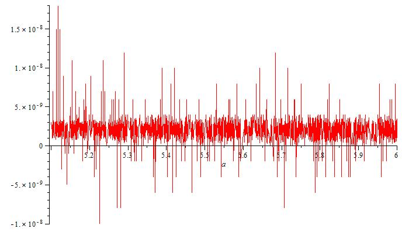  

然后数学星空取绳长L=40, 内椭圆长短轴m=5,n=3,计算得出外椭圆长短轴a=13.26652410,b=12.6491368,并且选择120个样本点做出如下轨迹图:  
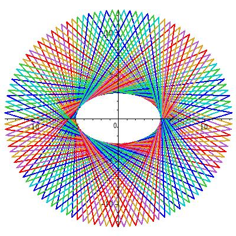  

zgg\_\_甚至还把问题[演绎成非椭圆的一般情况](https://bbs.emath.ac.cn/forum.php?mod=redirect&goto=findpost&ptid=4216&pid=42690&fromuid=20) :  
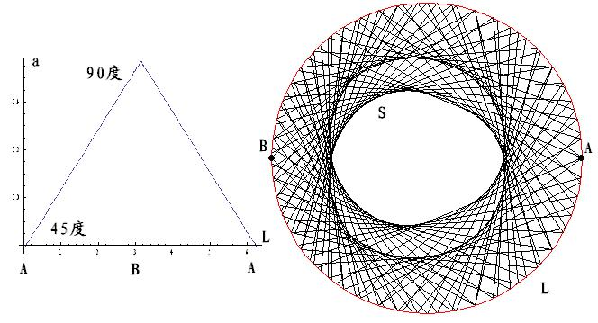  

数学星空使用[七边形验证光反射多边形周长的最大性](https://bbs.emath.ac.cn/forum.php?mod=redirect&goto=findpost&ptid=4216&pid=42755&fromuid=20) 。  
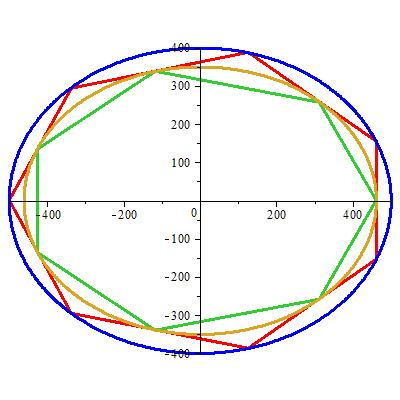  

kastin也给出了问题运动学证明：  
由于楼主的问题是在一种物理背景下的问题（运动学问题），故下面给出一种运动学上的证明。

椭圆的切线有个性质——
##引理## 过椭圆外一点Y做两射线与椭圆相切，切点分别为H,K。设距切点最近相应的焦点分别为F1,F2。那么∠F1YH=∠F2YK。

首先，在每个瞬时AP有增长的趋势，BP有缩短的趋势，于是P点速度方向是AP,BP方向上速度的合成。
由于绳长一定，那么运动过程中 AP减少的长度 = BP增加的长度。因此在每个瞬时其速度方向分别是沿AP向量方向和PB向量方向，且速度大小$v_{Ap}=v_{BP}$。根据平行四边形法则可知，合速度方向一定是沿着∠APB的外角平分线方向。而∠APB的内角平分线一定是与外角平分线垂直的，因此P点的速度方向（即轨迹切线方向）一定垂直于∠APB的内角平分线。
根据上面的引理，可知∠APB的内角平分线一定是∠F1PF2的内角平分线，且同时垂直于P点速度方向。由于满足光线反射定律\*，因此P点运动轨迹是以F1,F2为焦点的椭。

注\*：椭圆的切线的性质就是焦点三角形顶角的内角平分线与椭圆切线垂直，其逆命题也成立（可利用微分方程可推出椭圆方程证之）。更一般地，一焦点发射的光线通过某镜面在另一点汇聚，那么镜面就是椭球面。过焦点反射平行轴光线的镜面是抛物面。过一焦点的光线通过某镜面，反射的光线的反向延长线都通过另一点，那么镜面是双曲面。

mathe使用在线mathematica中[第二类不完全椭圆积分来进行数值计算验证这个问题](https://bbs.emath.ac.cn/forum.php?mod=redirect&goto=findpost&ptid=4216&pid=51394&fromuid=20) 。  

wayne使用mathematica进行复杂的计算也验证了这个“诡异的定理”：  
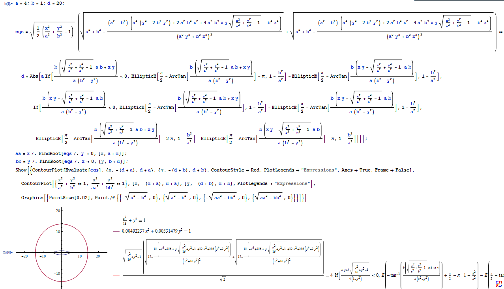  

mathe建议我们可以改为证明对于一般光滑封闭图形，固定无弹性绳子套作图形移动笔尖做出图形的法向总是俩绳子方向的角平分线，并且给出如下证明：  
我们假设对一曲线其关于弧长的参数方程为$p(s)$(这里p是向量，s是弧长参数，后面还有参数r为向量,u,v,h为数量）  
于是$||p'(s)||=1$,或者可以写成$p\prime^2=1$(这里$p\prime$表示对于s的导数)，  
假设曲线上关于$s_1,s_2$的两个点处切线交于向量$r(t)$,其中t是交点构成曲线上任意参数表示  
于是存在数量u,v使得$r=p(s1)+u\times p\prime(s_1)=p(s_2)+v\times p\prime(s_2)$,而且我们知道两段切线段长度分别为u和-v  
而且我们知道$p\prime(s_1)-p\prime(s_2)$表示两线角平分线方向,$p\prime(s_1)+p\prime(s_2)$是和这个方向垂直的方向。  
我们需要证明$\frac{dr}{dt}(p\prime(s_1)-p\prime(s_2))=0$即可证明  
由于$\frac{dr}{dt}=p\prime(s_1)(\frac{ds_1}{dt}+\frac{du}{dt})+u\times \frac{dp\prime(s_1)}{dt}=p\prime(s_2)(\frac{ds_2}{dt}+\frac{dv}{dt})+v\times\frac{dp\prime(s_2)}{dt}$  
另外由于$p\prime(s_1)^2=p\prime(s_2)^2=1$,对t求导得到$p\prime(s_1)\frac{dp\prime(s_1)}{dt}=p\prime(s_2)\frac{dp\prime(s_2)}{dt}=0$  
于是$\frac{dr}{dt}p\prime(s_1)=\frac{ds_1}{dt}+\frac{du}{dt}$  
$\frac{dr}{dt}p\prime(s_2)=\frac{ds_2}{dt}+\frac{dv}{dt}$,  
两切线长度和合弧长差为常数代表$u-v=s_2-s_1+h$,所以$u+s_1=v+s_2+h,\frac{d(u+s_1)}{dt}=\frac{d(v+s_2)}{dt}$  
由此我们得出$\frac{dr}{dt}p\prime(s_1)=\frac{dr}{dt}p\prime(s_2)$  
也就是$\frac{dr}{dt}(p\prime(s_1)-p\prime(s_2))=0$.

最后数学星空找出了这个定理的官方出处:  
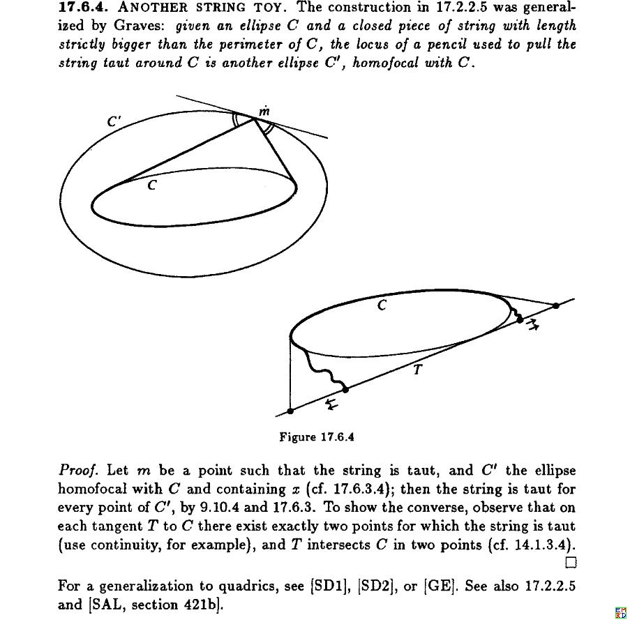  
以及
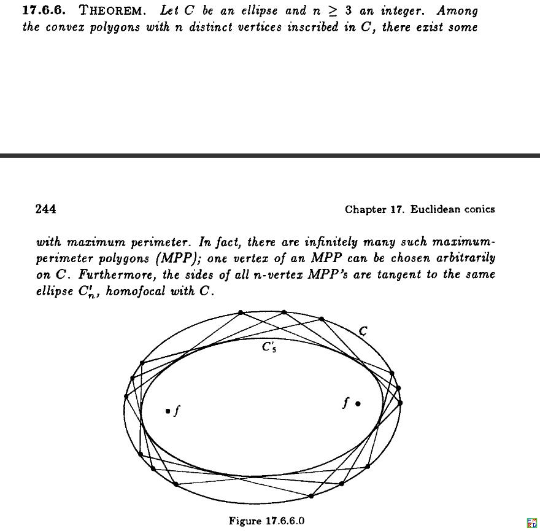  

##双心多边形计算
在另外一个贴子中，mathe给出了对应[同时具有外接椭圆和内切椭圆的多边形的计算方案](https://bbs.emath.ac.cn/thread-5476-1-1.html)   
数学星空总结如下：  
为了便于讨论双椭圆的相关公式，我们先将N边形内接圆并外切于椭圆的相关讨论结果转载如下：

mathe 给出了：

$J=\begin{bmatrix}1&0&0\\0&1&0\\0&0&-r^2\end{bmatrix}$

$K=\begin{bmatrix}\frac1{a^2}&0&-\frac{x_0}{a^2}\\0&\frac1{b^2}&-\frac{y_0}{b^2}\\-\frac{x_0}{a^2}&-\frac{y_0}{b^2}&\frac{x_0^2}{a^2}+\frac{y_0^2}{b^2}-1\end{bmatrix}$

我们可以求出矩阵$M=J^-1 K$有三个特征根：（三个根分别记为$r_1,r_2,r_3$）  
对应特征方程:  
$b^2a^2r^2 x^3 +(−a^2b^2 +a^2y_0^2 −a^2r^2+b^2x_0^2 −b^2r^2 )x^2 +(a^2 −x_0^2+b^2 −y_0^2+r^2)x−1=0$

于是$\frac{1}{r_1},\frac{1}{r_2},\frac{1}{r_3}$满足方程  

$x^3-(a^2 −x_0^2+b^2 −y_0^2+r^2)x^2+(a^2b^2 -a^2y_0^2 +a^2r^2 -b^2x_0^2 +b^2r^2)x-a^2b^2r^2=0$

其中$a=\sqrt{\frac{r_3}{r_1}},b=\sqrt{\frac{r_3}{r_2}}$

mathe 进一步给出结论：

其中将外曲线固定为$xy=1$,那么如果内曲线方程变化为$(x-a)(x-b)=(1-a)(1-b)$，  

那么经计算以后，对应的特征方程为$(x-1)(x-1+a)(x-1+b)=0$

也就是说，那里可以得出，如果固定外曲线，里面有三条内曲线，对应特征值分别为$(1,1-a,1-b),(1,1-at,1-bt),(1,1-as,1-bs)$

如果s,t满足条件

$\begin{bmatrix}s^2&s&1\end{bmatrix} \begin{bmatrix}a^2b^2&-2ab&1\\-2ab&-2ab+4a+4b-2&-2\\1&-2&1\end{bmatrix} \begin{bmatrix}t^2\\t\\1\end{bmatrix}=0$

那么它们之间有如链接中复合变换关系，利用这个关系是应该可以推算出k边形的情况

并指出, 通过利用[二次对合](https://emathgroup.github.io/blog/quadratic-convolution) 问题中的结论，可以得出：

设$t_1=1,t_2=\frac{4(a-1)(b-1)}{(ab-1)^2}$而且$t_{n+1}=\frac{(t_n-1)^2}{(abt_n-1)^2t_{n-1}}$然后利用$t_n=0$就可以得出n变形情况特征值的约束方程。

由此数学星空计算出[n=10以内参数a,b之间的关系](https://bbs.emath.ac.cn/forum.php?mod=redirect&goto=findpost&ptid=5490&pid=53149&fromuid=20) 

  
## 周长最长内接n边形计算
数学星空指出n=3时，陈都很早就有了深入的研究  
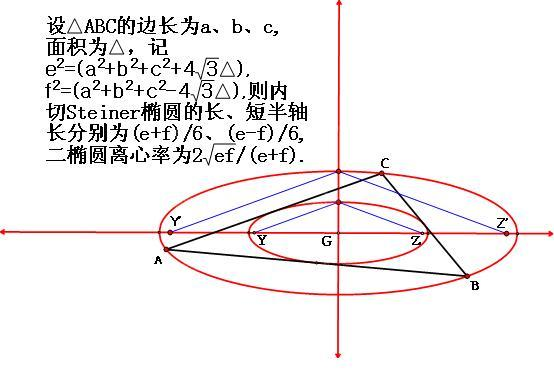  

数学星空并且给出总结:

对于$n=3$
$L(3)=2\sqrt{3}\frac{a^2+b^2+D}{\sqrt{a^2+b^2+2D}},D=\sqrt{a^4+b^4-a^2b^2}$  
$m=a\times\frac{d^2-b^2}{a^2-b^2}$  
$n=b\times\frac{a^2-d^2}{a^2-b^2}$  
$d^2=\sqrt{a^4+b^4-a^2*b^2}$  
$L(3)=\int_0^{2\pi}m\sqrt{1-(m^2-n^2)\frac{\cos(x)^2}{m^2}}dx-3(2\int_0^{arccos(\frac{m}a)}m\sqrt{1-(m^2-n^2)\frac{\cos(x)^2}{m^2}}dx-\frac{2b\sqrt{a^2-m^2}}a$  

对于$n=4$  
$L(4)=4\sqrt{a^2+b^2}$  
$m=\frac{a^2}{\sqrt{a^2+b^2}}$  
$n=\frac{b^2}{\sqrt{a^2+b^2}}$  
$L(4)=\int_0^{2\pi}m\sqrt{1-\frac{(m^2-n^2)\cos(x)^2}{m^2}}dx-4(2\int_0^{arccos(\frac ma)}m\sqrt{1-\frac{(m^2-n^2)\cos(x)^2}{m^2}}dx-\frac{2b\sqrt{a^2-m^2}}a$  
另外他还给出了[L(5)~L(8)](https://bbs.emath.ac.cn/forum.php?mod=redirect&goto=findpost&ptid=3740&pid=42785&fromuid=20) 
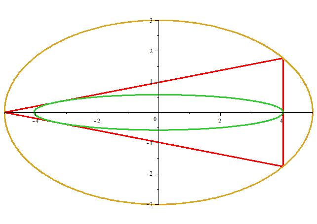  
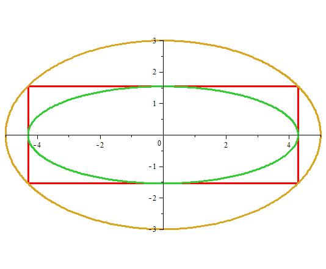  
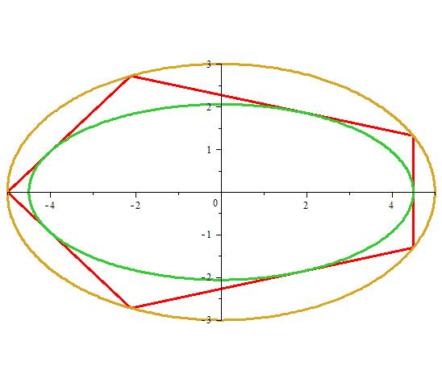  
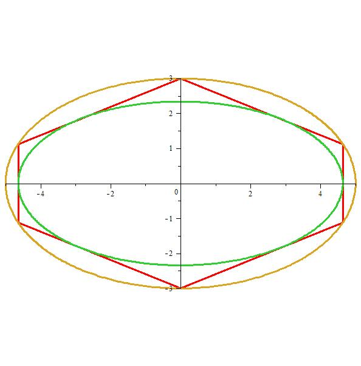  
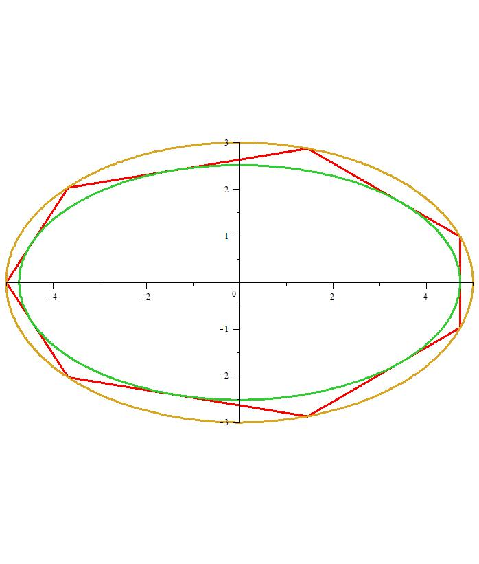  
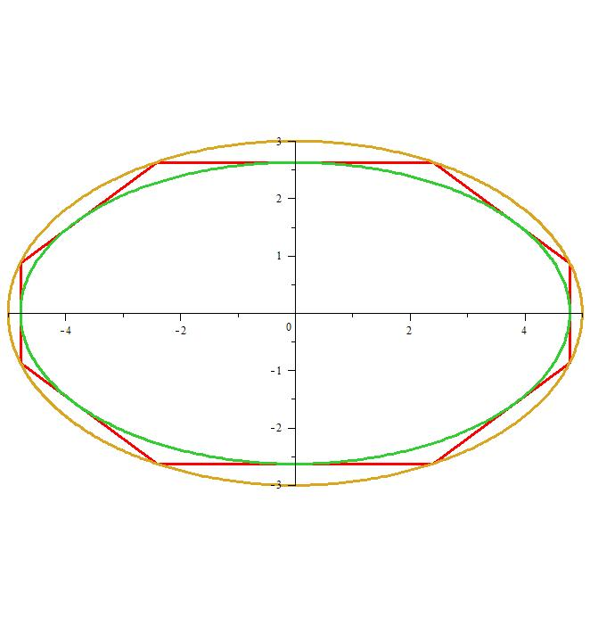  

## 参考链接
关于这个话题，[数学研发论坛](https://bbs.emath.ac.cn/) 内讨论内容非常丰富，这里很难全部予以转述。下面给出几个重要的相关链接:   
[椭圆内接n边形周长最大值](https://bbs.emath.ac.cn/thread-3740-1-1.html)  
[双椭圆外切内接N边形问题](https://bbs.emath.ac.cn/thread-5490-1-1.html)  
[求外接圆的半径](https://bbs.emath.ac.cn/thread-5476-1-1.html)  
[诡异的椭圆定理](https://bbs.emath.ac.cn/thread-4216-1-1.html)  

