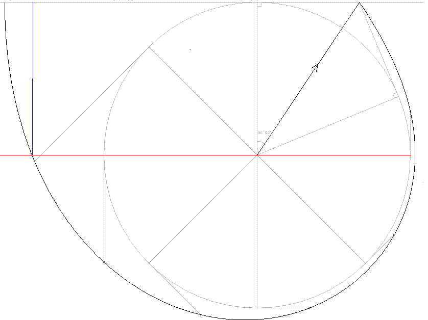
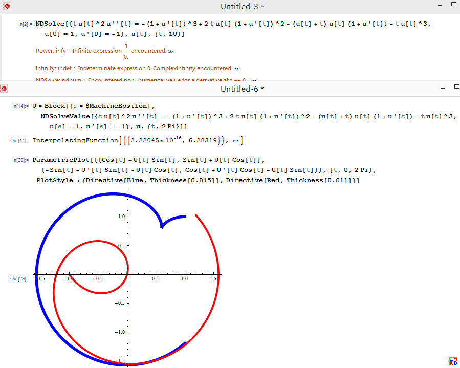
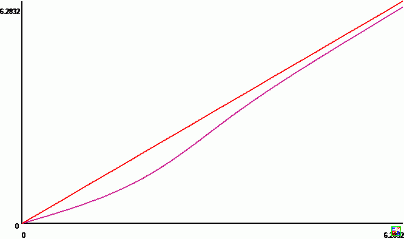
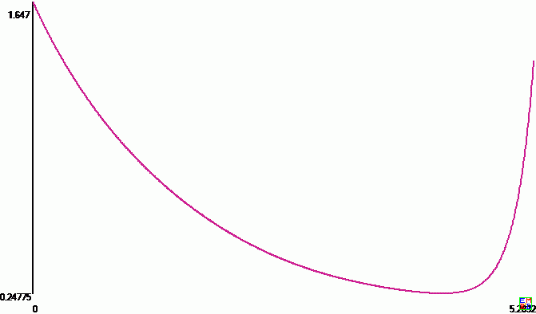
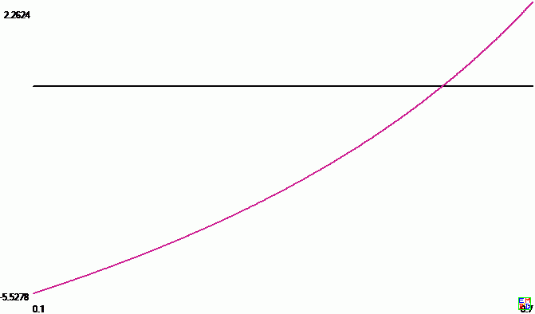
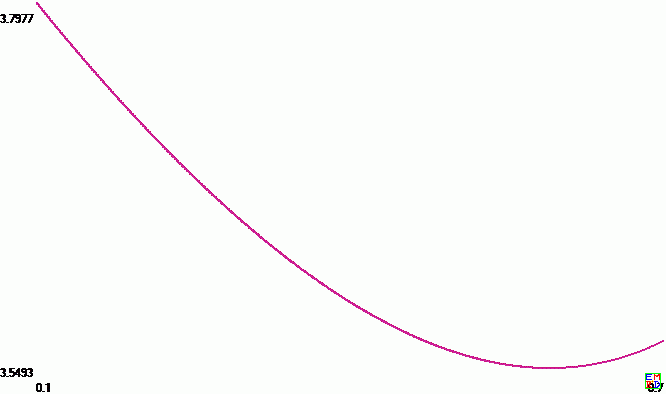
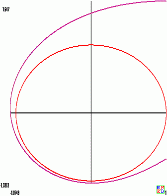

# 简介
百度数学吧的东方角落提出了很多非常漂亮的数学题，比如[随机游走问题](https://emathgroup.github.io/blog/random-walk) 好像就是他提出的。
这里我们要讨论他提出的另外一个很有难度的问题：[极地出逃问题](https://bbs.emath.ac.cn/thread-307-1-1.html) ,很可惜，对应的百度链接已经不可以使用，在网络上也搜索不出相关的详细信息了，
只能转述在[数学研发论坛](https://bbs.emath.ac.cn/) 还保留的部分信息了。  

极地出逃问题说：  
一个人在冰天雪地里迷路。已知离他一英里的地方有一条笔直的高速公路。但他完全失去了方向。不知道这条公路在哪个方向。如果天气恶劣，能见度只有一米（更精确的描述是能见度为0，也就是说只有到了公路才知道）。  
问：采取怎样的方式才能尽快找到高速公路？尽快的定义是期望值最短。也就是说如果往不同方向出发，平均值最小。

这个问题应该是在2008年4月以前就提出了，
根据搜狗问问里面能找到的[一点残余信息](https://wenwen.sogou.com/z/q471909037.htm?pg=2#pageLocation) ，应该是东方角落当时自己给出了一个计算结果为3.549260。  
mathe根据变分法，给出了一个路线在极坐标下的微分方程$tu^2u^{\prime\prime}=-(1+u^{\prime})^3+2tu(1+u^{\prime})^2-(u+t)u(1+u^{\prime})-tu^3$，可以大家一直未能利用这个微分方程来求解。
直到2015年，mathe重拾这个问题，最终通过复杂的分析，给这个微分方程找到一种比较合适的计算方法，得出极度问题平均期望值的高精度结果为3.54925966919232488335307997505516088581017092471241443348333130503956135888576020826237。

# 动态规划求解
这个问题如果改为计算[最差情况路径最短](https://bbs.emath.ac.cn/forum.php?mod=redirect&goto=findpost&ptid=307&pid=2642&fromuid=20) ，那么会比较容易，据说百度贴吧里面给出了这种情况的结果为$1+\sqrt{3}+\frac{7\pi}6$。  
为了解决这个期望路径最短问题，[据说KeyTo9先给出了一种先直行在拐弯绕行](https://bbs.emath.ac.cn/forum.php?mod=redirect&goto=findpost&ptid=307&pid=2729&fromuid=20) 方案的示意图  
  
先假设最优结果所用曲线总是这种类型（只是后面绕圆的曲线可以任意选择）。
我们将终点切线对应角度定义为角度0(也就是上面图中向上的方向为角度0),逆时针方向为角度增加的方向（所以行走过程中角度一直在降低）。
所以开始的时候，用户是沿着一个角度为$-d$的半径行走到圆外某处，知道到达一条参数为$2\pi-2d$的切线（也就是对应切点的角度为$2\pi-2d$）。
对于用户行走的线路上每个点,我们定义一个函数u为这个点到对应切点的距离。通过这种方法，用户行走线路的坐标可以表示成  
&nbsp;&nbsp;$x(\theta)=\cos(\theta)-u(\theta)\sin(\theta)$  
&nbsp;&nbsp;$y(\theta)=\sin(\theta)+u(\theta)\cos(\theta)$  
第一种可以想到的解题方法是采用动态规划：  
我们将$\theta$均匀划分成N份，同样对于u可能出现的值，在一定范围内划分成M份，
于是曲线上一段线的长度可以用折线长度  
&nbsp;&nbsp;$L(\theta_i)=\sqrt{(x(\theta_{i+1})-x(\theta_{i}))^2+(y(\theta_{i+1})-y(\theta_{i}))^2}$  
来近似表示,而动态规划过程将要将表达式  
&nbsp;&nbsp;$\sum\theta_i L(\theta_i)$  
最小化（这个部分不包含起始直线那一段）。  
百度贴吧中应该是东方角落自己最先给出一个近似解3.549260, 估计就是采用这种方法或类似方法进行计算的。  
mathe说他采用这种方法在将角度和切线都分成1000份左右时，可以得出类似精度的结果，但是即使再细分，精度也无法提升了。

# 变分法分析
我们同样假设曲线还是类似上面的形式，我们现在先只对$0\le\theta\le2\pi-2d$部分进行分析。
由$\frac{ds}/{d\theta}=\sqrt{(\frac{dx}{d\theta})^2+(\frac{dy}{d\theta})^2}$,  
以及目标函数$\sum\theta_i L(\theta_i)$的连续表示方式就是  
$\int_0^{2\pi-2d} \theta \frac{ds}{d\theta} d\theta = \int_0^{2\pi-2d} \theta \sqrt(u^2+(1+u^{\prime}^2) ) d\theta$,  
也就是我们要求上面积分的最小值。  
利用[变分法](http://mathworld.wolfram.com/CalculusofVariations.html) 就可以得到微分方程  
$tu^2u^{\prime\prime}=-(1+u^{\prime})^3+2tu(1+u^{\prime})^2-(u+t)u(1+u^{\prime})-tu^3$.  

# 尝试微分方程求解
上面的微分方程是非线性的，很难去数值求解。  
不过可以注意到在上面微分方程中，让$\theta=0$,我们马上可以得到$u^{\prime}(0)=-1$.  
而两边同时经过一次微分后让后让$\theta=0$代入，我们可以得到$u^{\prime\prime}(0)=-\frac{u(0)}2$.  
同样，两边同时n次微分后，我们应该可以计算出$u^{(n+1)}(0)$的值（用$u(0)$来表示）。  
mathe采用了C语言进行符号运算，算出了上面式子的各阶微分到前50项，并且解出在$\theta=0$时各阶微分的值。  
惊奇的发现所有奇数次导数在0的取值是常数，同$u(0)$没有关系，而偶数次导数在0的取值同$u(0)$成正比。  
由此我们知道，函数u可以写成 $u(\theta)=w(\theta)+u(0)v(\theta)$。  
其中w是奇函数，v是偶函数。  
于是只要我们分别计算出$u(0)=1$和$u(0)=2$时候的函数u的表达式，对于所有其他情况下的函数u都可以用这两个函数的线性组合表示出来。  
但是mathe采用上面的思路进行计算以后，发现得出的[结果明显不合理](https://bbs.emath.ac.cn/forum.php?mod=redirect&goto=findpost&ptid=307&pid=2736&fromuid=20) 。  
在得出这些参数以后，我们就可以计算对于不同的$u(0)$,对应的曲线$u(\theta)$的图像。计算结果表明，通常很快,在$\theta$稍微大一点时，对应的$u(\theta)$马上就小于0了，这个同几何意义是矛盾的。实际上这个表示在$\theta$以后的角度中，用户都应该贴着圆周走。这个结果让我非常吃惊，因为它得到的模型同动态规划的结果已经不同了。  
其中需要计算积分$ \int_0^{2\pi-2d} \theta \sqrt{u^2+(1+(u^{\prime})^2) } d\theta$，如果采用数字积分的方法，不仅编程比较麻烦，而且精度比较难控制。为此，他再次将函数 $\sqrt{u^2+(1+(u^{\prime})^2}$的各阶导数通过计算机计算出来，然后将它表示成多项式形式（同样分段表示），然后这个定积分也就变成多项式计算了.  

mathe觉得上面函数的问题是只含有一个参变量。而通常二阶微分应该包含两个变参（这样我们分别给定两个边界条件就可以得到一个唯一解）。
产生上面的原因是解方程过程中假设了函数$u(\theta)$在$\theta=0$任意阶导数都存在。而估计另外存在一些解的二阶导数趋向无穷了，所以这个方法就计算不出来了。  

使用这个结果，得出的结论是最优的线路是先一直在圆周边界上走到最后只余下83度的角度，然后切换到对应的u(0)=1.714的曲线上,总共期望距离为4.0749987。

qxqcn曾经请一位精通Mathematica/Maple的朋友帮忙解决这个微分方程，没有成功。后来wayne试着使用Mathematica9.0.1同样软件也报错，他分析原因发现是由于初始值不当导致的。
他[尝试用无穷小代替0，得出了如下数值解](https://bbs.emath.ac.cn/forum.php?mod=redirect&goto=findpost&ptid=307&pid=51699&fromuid=20)  
  
对应的Mathematica代码为
```bash
U=Block[{\[Epsilon]=$MachineEpsilon},NDSolveValue[{t u[t]^2u''[t]==-(1+u'[t])^3+2t u[t](1+u'[t])^2-(u[t]+t)u[t](1+u'[t])-t u[t]^3,u[\[Epsilon]]==1,u'[\[Epsilon]]==-1},u,{t,30}]]
```

# mathe卷土重来
2015年1月，[mathe重新分析这个问题](https://bbs.emath.ac.cn/forum.php?mod=redirect&goto=findpost&ptid=307&pid=57051&fromuid=20) ，这时他发现前面计算中方程弄错了：  
检验了一下，好像以前推导的结果中最后一项符号弄错了$-\theta u^3$应该改为$+\theta u^3$, 推导方法如下:  
$F(\theta,u,u^{\prime})=\theta \sqrt{u^2+(1+u^{\prime})^2}$,  
要求$\frac{\partial F}{\partial u} =\frac{d}{d\theta}\frac{\partial F}{\partial u^{\prime}}$,  
注意最后一次对$\theta$求导时$u,u^{\prime}$都要看成$\theta$的函数,而$u^{\prime}$就是$\frac{du}{d\theta}$  
而已知边界条件为$u(2\pi-2d)=\tan(d)$  
而求出函数$u(\theta)$后，我们只要画出参数曲线$(\cos(\theta)-u(\theta)\sin(\theta),\sin(\theta)+u(\theta)\cos(\theta))$  
另外根据方程我们容易看出$u^{\prime}(0)=-1$这个表明在曲线末端曲率半径就是$u(0)$,也就是这个端点到对应圆的切点的距离。这个说明曲线末端是垂直于对应的切线的。  
然后我们做变量替换$v=\frac{1+u^{\prime}}{u}$,得出微分方程$\frac{dv}{d\theta}=(1-\frac v{\theta})(v^2+1)$, 边界条件$v(0)=0$.  
如果再做替换$v=ctg(\phi)$,得到$\frac{d\phi}{d\theta}=\frac{\ctan(\phi)}{\theta}-1$,其中几何意义中$\phi$是轨迹上一点的切线和这个点对应的到单位圆（我们的目标圆）的切线的夹角.  
上面$v$的微分方程和边界条件唯一确定函数$v$.  
然后由于$u^{\prime}-vu+1=0$,假设方程有两个不同的解$u_1,u_2$,得出$(u^{\prime}_1-u^{\prime}_2)=v(u_1-v_2)$所以$u_1-u_2=C\exp(\int_0^{\theta}v(x)dx)$  
也就是任意算出一个满足条件的函数$u$以后，只要加上$V(\theta)=\exp(\int_0^{\theta}v(x)dx)$的常数倍，就得出$u$的通式，最后我们需要通过方程$u(2\pi-2d)=\tan(d)$计算出对应的d.  
而不同的d。每个$u$的不同的通式将有一个不同的d,我们需要从中再挑选出使得总平均距离最小的一条，估计计算量会比较大。但是由于前面已经有个Fans的数值解，我们可以利用那个解来估算这些参数，应该会比较容易找到一个较好的解。  

数学星空指出:  
$tu^2u^{\prime\prime}=-(1+u^{\prime})^3+2tu(1+u^{\prime})^2-(u+t)u(1+u^{\prime})+tu^3$  
做变量替换$v=\frac{1+u^{\prime}}{u}$,得出微分方程$\frac{dv}{d\theta}=(\theta-v)(v^2+1)$ 应改成  
$\frac{dv}{d\theta}=(1-\frac{v}{\theta})(v^2+1)$. 

在v离1比较远时的图像是类似的，就在0附近区别比较大。而这个方程应该有$v(0)=0,v^{\prime}(0)=\frac12$,而且可以看成这个解是一个奇函数.  
设其在0的展开式为$v(t)=\sum_{n=0}^{+\infty} a_{2n+1}t^{2n+1}$,我们得出:  
$\sum_{n=0}^{+\infty}(2n+1)a_{2n+1}t^{2n+1}=(t-\sum_{n=0}^{+\infty} a_{2n+1}t^{2n+1})(1+(\sum_{n=0}^{+\infty} a_{2n+1}t^{2n+1})^2)$.  
展开比较系数就可以得出$a_1=\frac12,(2n+2)a_{2n+1}=\sum_{k=0}^{n-1}a_{2k+1}a_{2n-2k-1}-\sum_{k=0}^{n-1}a_{2k+1}\sum_{m=0}^{n-k-1}a_{2m+1}a_{2(n-k-m)-1},n\ge 1$.  
而对应的方程$u^{\prime}-vu+1=0$初始条件$u_0(0)=0$的解也是奇函数。而$V(t)=exp(\int_0^t v(t)dt)$是偶函数，u的通解为$u(t)=u_0(t)+C*V(t)$.  

解决了$v$的展开式以后，我们可以用之先得出$u$任意一个特解$u_0$的展开式以及$V$的展开式等。  
此后我们知道目标函数为  
$A(d)+\int_0^{2\pi-2d} \theta u(\theta)\sqrt{v^2(\theta)+1}d\theta$其中$A(d)=\ln(\frac{1+\sin(d)}{1-\sin(d)})+\frac{2\pi-2d}{\cos(d)}$  
$A(d)+\int_0^{2\pi-2d}\theta u_0(\theta)\sqrt{v^2(\theta)+1}d\theta+C\int_0^{2\pi-2d}\theta V(\theta)\sqrt{v^2(\theta)+1}d\theta$  
然后记$B(x)=\int_0^x\theta u_0(\theta)\sqrt{v^2(\theta)+1}d\theta,D(x)=\int_0^x\theta V(\theta)\sqrt{v^2(\theta)+1}d\theta$  
同样可以推导出B,D的泰勒展开式  
而根据$u(\2pi-d)=\tan(d)$可以得出$C=\frac{\tan(d)-u_0(2\pi-2d)}{V(2\pi-2d)}$  
代入以后目标函数变成只含一个变量d的函数$average(d)=A(d)+B(2\pi-2d)+\frac{\tan(d)-u_0(2\pi-2d)}{V(2\pi-2d)}D(2\pi-2d)$。然后求导为0即可解得d。  
也就是  
$\frac{(2\pi-2d)\sin(d)}{\cos^2(d)}-2(2\pi-2d)u_0(2\pi-2d)\sqrt{v^2(2\pi-2d)+1}-2\frac{\tan(d)-u_0(2\pi-2d)}{V(2\pi-2d)}(2\pi-2d) V(2\pi-2d)\sqrt{v^2(2\pi-2d)+1}+\frac{V(2\pi-2d)(\sec^2(d)+2u^{\prime}_0(2\pi-2d))+2(\tan(d)-u_0(2\pi-2d))V^{\prime}(2\pi-2d)}{V^2(2\pi-2d)}D(2\pi-2d)=0$  

# 最终的结果
更新代码以后，mathe得出结果如下  
d = 0.59090489185668802875786709583348871021050937452181485289441819749025679734298579253579 
a = 3.54925966919232488335307997505516088581017092471241443348333130503956135888576020826237
这个结果同fans的数据一致了
其中对应的图片
  
这是$v(\theta)$的图像

  
这是$u(\theta)$的图像

  
这是这是目标函数关于d的导数的图像  

  
这是目标函数关于d的图像，也就是距离的期望值  

  
这个是最优解对应的图像

点击可以[下载对应的Pari/gp代码](../attached/pole.zip)  
v,u函数在$\theta=0$的收敛半径好像大于$\pi$,所以实际上，分段数目可以少很多，但是由于直接从以前代码修改过来，就保留了更多的分段了。  
而比较有意思的是计算出来在$\theta=0.5$的收敛半径好像小于1，这个有点不符合道理（圆的边界上必然有函数的奇点，但是落在0为中心收敛圆内部）。  
一个比较合理的解释就是计算误差引起的。可以看到满足v的微分方程的一族曲线中，除了这条v(0)=0的曲线，其余的在靠近$\theta=0$时，值都会发生剧烈变化，远远离开原点。  
这个导致咋$\theta=0.5$时，如果有一点计算误差，对应到$\theta=0$处，会有很大的误差，所以就远离我们的目标曲线了。所幸，$\theta$越大，这种误差影响越小。  
另外，如果我们能够修改一下代码，更大范围使用在$\theta=0$处的展开式(可以有精确表达形式),会有更好的精度。  
另外比较有意思的是取$u_0(0)=0$对应的u的解在$\theta=0$处展开式的前面15项竟然全部是正数(对应到$\theta^{31}$系数)，但是可惜后面的就出现负数了。  
