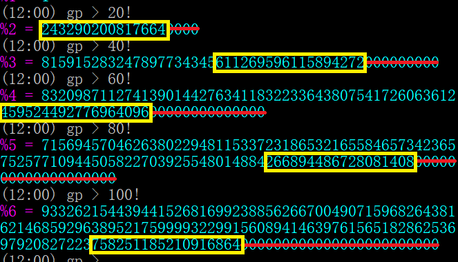

# 摘要
xstring于[2005年在csdn挑战](https://bbs.csdn.net/topics/70362869?list=712578) ，对于一个给定的大整数，如何快速计算这个整数阶乘去掉尾零后的最低18位

最后mathe给出了一种时间复杂度为$O(L^3 \log(L)^2 +L^3 \log(L)T +T^2)$的有效算法，其中L代表计算的非零尾数位数， T代表输入整数的位数。  
gxqcn还利用他的[HugeCalc](https://www.emath.ac.cn/hugecalc/) 对算法重新实现并进行性能优化，比mathe用[gmp](https://gmplib.org/) 实现的代码更快了一个数量级。 
贴子内容是mathe对https://blog.csdn.net/mathe/article/details/1132404 的备份。  

# 详细内容
xstring首先发问: 阶乘不用解释吧，阶乘的 18 位非零尾数需要简单解释一下。阶乘的十进制结果中末尾都会有很多个数字 0 (5以下的除外)，去掉这些连续的 0 之后最后 18 位数字即是这里所说的 18 位非零尾数。之所以称这为“非零”，是因为通常最后一个数字是 0。举两个例子，10! = 3,628,800，其 18 位非零尾数为 36,288；24! = 620,448,401,733,239,439,360,000，其 18 位非零尾数为 044,840,173,323,943,936  
比如下图中结果  
  

mathe给出了如下分析:

分析这个问题,可以发现主要在于计算
$1\times 2\times 3\times 4\times 6\times 7\times 8\times 9\times 11\times 12\times \dots (\mod 5^{18})$, 也就是去掉所有5的倍数后的乘积.

分析方法如下:  
由于对于充分大的N, N!中因子2的数目要远远大于因子5的数目,我们可以认为对于充分大的N,2的因子数目减去5的因子数目不小于18了,也就是,去掉N!末尾所有的0后面的数我们认为还是被$2^{18}$整除,  
实际上,对于28!,
2的因子数目为:
$[\frac{28}2]+[\frac{28}4]+[\frac{28}8]+[\frac{28}{16}]=25$  
5的因子数目为:
$[\frac{28}5]+[\frac{28}{25}]=6$  
所以28!的2的因子数目同5的因子差值已经不小于18了,对于更大的N,这个差值也不会变小.  
所以我们只需要对小于28的整数特殊处理(直接相乘就可以了),其余的,都认为N!去掉末尾的0后,  
还是被$2^{18}$整除,所以我们只要计算出这个数对于$5^{18}$的余数,就可以通过中国剩余定理计算出关于$10^{18}$的余数了.  

对于N!,我们可以将5的倍数和不是5的倍数的数分开处理:  
所有的5的倍数构成$5^{[\frac{N}5]}\times[\frac{N}5]!$。  
如果我们已经得到所有不是5的倍数的乘积关于$5^{18}$的余数,记为g(N),
所求的结果记为f(N),那么就有$f(N)=g(N)f([\frac{N}5]) (\mod 5^{18})$.  
所以关键是求g(N),也就是1到N之间所有不是5的倍数的数的乘积关于$5^{18}$的余数,
也就是最前面列出的。  
后面只讨论如何计算:
$g(N)=1\times 2\times 3\times 4\times 6\times 7\times 8\times 9\times 11\times 12\times \dots\times N (\mod 5^{18})$

还可以扩展这个问题到一般情况,记f(N,L)是N!去掉末尾的0后最后L位，而g(N,L)是1,2,...,N中去掉5的倍数后所有数字乘积的最后L位。  
对于T位数N,计算N!去掉末尾的0的最后L位的算法f(N,L)的时间复杂度可以达到:  
$O(L^3 \log(L)^2 + L^3 \log(L) \times T+T\times\log(T))$, 
使用的空间复杂度为$O(L^3+L^2 \log(L)+T)$。  
计算过程中,我们总假设一个长度为L的数占用的空间为O(L),两个长度为L的数相乘花费的时间为$O(L\times\log(L))$,而相加的时间复杂度为O(L)。  

方法如下:
i)计算杨辉三角形 关于$5^L$的余数,并保存,记为$C_U^V (\mod 5^L)$ 其中$1\le U\le L, 0\le V\le U$。  
空间复杂度为$O(L^3$ ($L^2$个长度为L的整数),需要花费$O(L^2)$次加法,每次加法需要O(L)的时间,所以时间复杂度也是$O(L^3)$.  
ii)记$F(k,x)=(x\times 5^k+1)(x\times5^k+2)(x\times5^k+3)(x\times5^k+4)(x\times5^k+6)\dots(x\times5^k+5^k-1) (\mod 5^L)$
其中连乘中所有5的倍数全部被去掉
那么$F(1,x)=24+50\times 5\times x+35\times 5^2\times x^2+10\times 5^3\times x^3+5^4\times x^4 (\mod 5^L)$.  
假设$F(n,x)=a_0+a_1\times 5\times x+a_2\times5^2\times x^2+\dots+a_{L-1}\times 5^{L-1}\times x^{L-1} (\mod 5^L)$,  
那么$F(n+1,x)=F(n,5x)\times F(n,5x+1)\times F(n,5\times x+2)\times F(n,5x+3)\times F(n,5x+4) (\mod 5^L)$.  
首先将每个$F(n,5x+t)$ 展开, 重新整理成关于$5x$的多项式,这个需要$L^2$次乘法运算,使用到i)中的杨辉三角形.花费时间复杂度为$O(L^3\log(L))$.  
然后将4个多项式俩俩相乘,$5x$次数大于L的都可以抛弃,每次两个多项式相乘最多花费$O(L^2)$次乘法(如果使用快速乘法可以只用$O(L\log(L))$次乘法),所以花费的时间复杂度还是$O(L^3\log(L))$
这样,通过$O(L^3 \log(L)^2)$,我们可以计算出$F(k,x)$,其中$1\le k\le L$.  
而保存所有的$F(k,x)$,需要花费的空间是$O(L^2 \log(L))$ ($L\log(L)$个长度为L的数).  
而对于$F(k,x), k\gt L$,我们知道$F(k,x)=1$,不需要再计算了.
iii)对于$f(N,L),f(N,L) (\mod 5^L)=g(N,L)f([\frac{N}5],L) (\mod 5^L)$.  
而$g(N,L) (\mod 5^L)$我们可以将它划分成若干个长度不一的类似ii)中的连乘式,其中长度不超过L的有L个，长度大于L的由于对应F(k,x)总是1,可以统一处理。对于每个长度不超过L的连乘式,我们代入公式ii)后,
需要L次乘法,
所以计算$g(N,L)(\mod 5^L)$共花费时间为$O(L^3 \log(L))$
v) 在计算完$g(N,L) (\mod 5^L)$以后,我们还需要计算$f([\frac{N}5],L)$,同样的,如果我们把N看成T位5进制数(事先转化一个数为5进制只需要$T\log(T)$的时间),那么$\frac{N}5$是T-1位5进制数,所以通过同样算法,可以再花费$O(L^3 \log(L))$的时间递归到T-2位数,...,这样总共经过T步后就会得出最终结果.
这个递归过程中总共花费时间最多为 $O(T\times L^3 \log(L))$
而保存原式输入数据X (以及中间数据X/5, X/25,...等等)需要一个长度为T的空间,需要O(T)的空间
所以总共需要时间复杂度
$O(L^3 \log(L)^2 + L^3 \log(L) T + T \log(T))$
使用的空间复杂度为$O(L^3+L^2 \log(L)+T)$

上面过程只是算出$f(N,L) (\mod 5^L)$,而对于充分大的N(超过$\frac{10L}3$肯定够了,而对于这么小的N,直接计算乘积就可以了),$f(N,L) (\mod 2^L)$总是0,所以通过中国剩余定理就可以计算出$f(N,L) (\mod 10^L)$.  
对于现在的计算机基本上在$L\le 100$而且$T\le 1000$ (也就是$N\le 10^{1000}$)时不会有问题.  
[附件程序](../attached/ft.txt) 使用了GMP库,
但是由于下面的程序中，对于输入的T位整数N,没有通过事先转化为5进制的方法，所以实际上花费的时间复杂度为 $O(L^3 \log(L)^2 +L^3 \log(L)T +T^2)$.  
