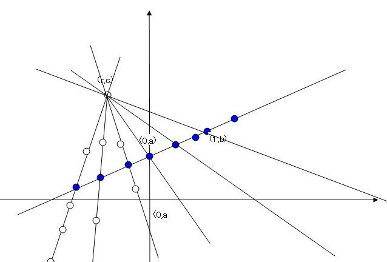

# 问题溯源
[2009年1月northwolves提问](https://bbs.emath.ac.cn/thread-1143-1-1.html "2009年1月northwolf提问")：  
$f(x)$ 定义在实数域上，且$f(x+y)+f(x-y)-2f(x)-2y^2=0 $ ，求$f(x)$

# 初步进展
[mathe提议](https://bbs.emath.ac.cn/forum.php?mod=redirect&goto=findpost&ptid=1143&pid=15141&fromuid=20), 将$g(x)=f(x)-x^2$代入。  
northwolves然后使用这种方法[进一步推导](https://bbs.emath.ac.cn/forum.php?mod=redirect&goto=findpost&ptid=1143&pid=15150&fromuid=20)得出:  
$f(x+y)+f(x-y)-2f(x)-2y^2=0 $.  
Let $g(x)=f(x)-x^2$,得出  
$g(x+y)+(x+y)^2+g(x-y)+(x-y)^2-2g(x)-2x^2-2y^2=0$。  
故$g(x+y)+g(x-y)-2g(x)=0$。  
shshsh_0510接下去指出g(x)可以是[任意线性函数](https://bbs.emath.ac.cn/forum.php?mod=redirect&goto=findpost&ptid=1143&pid=15152&fromuid=20),即$g(x)=ax+b$， 所以  
$f(x)=x^2+ax+b$,其中$a,b \in R$.

# 解析解

新手wayne在[假设初等函数的基础上给出](https://bbs.emath.ac.cn/forum.php?mod=redirect&goto=findpost&ptid=1143&pid=16118&fromuid=20):  
在原式的基础上关于x求导，并解得  
$f^{\prime}(x+y)=f^{\prime}(x)+2y$.  
令上面的x=0，则得微分方程  $f^{\prime}(y)=f^{\prime}(0)+2y$,  
进而我们可以得到$f(x) =x^2+f^{\prime}(0)x+C$, $C \in R$  

# 不连续函数解
但是[mathe指出](https://bbs.emath.ac.cn/forum.php?mod=redirect&goto=findpost&ptid=1143&pid=15161&fromuid=20):   
实数空间R可以看成有理数空间Q上的无限维线性空间。  
于是只要g是R上的线性变换就可以满足题目要求。  
如果额外添加条件函数f是连续函数，那么可以得到$f(x)=x^2+ax+b$，  
不然只能写成$f(x)=x^2+g(x)$,其中g(x)是线性空间R中的任意一个线性变换。  
在假设选择公理成立的条件下，我们可以找到一个集合H,对于H中任意有限个$h_1,h_2,...,h_t$以及非零有理数$q_1,q_2,...,q_t$,  
那么必然有$q_1h_1+q_2h_2+...+q_th_t\ne0$； 而且对于任意一个实数r,必然存在H的一个有限子集${h_1,h_2,...,h_t}$以及唯一的有理数$q_1,q_2,...,q_t$使得$r=q_1h_1+...+q_th_t$。  
于是只要任意定义一个函数G:H->R,然后对于任意实数$r=q_1h_1+...+q_th_t$,定义$g(r)=q_1G(h_1)+...+q_tG(h_t)$,那么函数g就可以满足条件。  

# 是否还有其它解
shshsh_0510继续提问，如何说明  
1）H存在性的证明？  
2）是否还有其他解？  

mathe回复  
H存在性需要假设选择公理成立，这个时候就可以使用佐恩引理来证明H的存在性。  
所有的解应该写成$f(x)=x^2+g(x)+c$,其中c为任意常数，g为实数集R(看成有理数集Q上的线性空间)上的线性变换。  
而证明这一点，我们只需要证明$f(x)-x^2-f(0)$是线性变换就可以了。  

证明变换$h(x):R\to R$为关于域Q的线性变换，那么只需要证明对于任意的$x_1 \in R, x_2 \in R, q_1 \in Q, q_2 \in Q$都有$h(q_1x_1+q_2x_2)=q_1h(x_1)+q_2h(x_2)$就可以了。  

对于$g(x)=f(x)-x^2-f(0)$,我们直接有性质$g(x+y)+g(x-y)=2g(x)$而且$g(0)=0$  
让$x=ny$代入，可以得到  
$g((n+1)y)-g(ny)=g(ny)-g((n-1)y)=\dots=g(y)-g(0)=g(y)$  
所以我们可以得到对于任意整数n,$g(ny)=n g(y)$.  
令$y=\frac tm$，其中m为另外一个整数，得到$g(\frac nm t)=\frac nm g(t)$  
也就是对于任意有理数p,$g(p t)=p g(t)$  
此外，另$s=x+y,t=x-y$得到$g(s)+g(t)=g(x+y)+g(x-y)=2g(x)=g(2x)=g(s+t)$  
所以对于任意的有理数p,q和实数s,t,我们有$g(ps+qt)=g(ps)+g(qt)=pg(s)+qg(t)$  
由此证明了函数g是线性变换。  

至于第一个问题，我们需要看一下实变函数或泛函分析的书，找一找介绍[佐恩引理](http://mathworld.wolfram.com/ZornsLemma.html)的章节。实际上它是通过构造集合簇（集合的集合）中的一个偏序关系来证明的。  

而使用Zorn引理证明实数集作为有理数集上的线性空间存在一组基H.  
记$\mathcal{R}$为所有$R$中那些满足任意有限个元素的有理线性组合都不是0的集合构成的集簇。  
那么我们在$\mathcal{R}$中任意两个集合之间的包含关系构成一个偏序关系。  
而对于$\mathcal{R}$中任意一个链$U_1 \sub U_2 \sub U_3 \sub \dots \sub U_k \sub \dots$  
容易验证$U=\cup_{k=1}^{\infty}U_k$也在$\mathcal{R}$中。所以根据[佐恩引理](http://mathworld.wolfram.com/ZornsLemma.html)，$\mathcal{R}$存在上界，也就是存在集合$H \in \mathcal{R}$,使得对于任何其它集合$x \in \mathcal{R}$有$x \sube H$.然后容易检验H就是所要的基。  

shshsh_0510为这个过程配了一个示意图:
  
如果我们确定了函数g在两个实数的取值，那么它们的任意有理线性组合上的值也就确定了，如同上图中确定了一条直线上两个点的取值，那么这条直线上所有点的取值就确定了。但是此后，我们还是可以继续选择任意一个不属于这些被确定数的有理线性组合的数字任意指定函数值，就相当于如图中还可以在直线外面再选择一个点。由于示意图知识二维的，在再次选定一个点并确定它的取值以后，这个点和已知直线上所有点的连线就可以覆盖整个平面，所以整个二维平面上所有点的取值就都确定了。但是由于实数集对于有理数集来说，是无限维（准确的说是不可列维），这个过程会一直继续下去。  

不过关于选择公理本身，就是属于一个可选而不是必须的公理，所以和它相关的结论难于理解也是正常的。  
而比较神奇的是[选择公理](https://bbs.emath.ac.cn/forum.php?mod=redirect&goto=findpost&ptid=1143&pid=15365&fromuid=20)虽然给出了不连续的线性变换g是存在的，而且有不可数个，但是我们事实上一个也确定不下来。实际上我们除了知道$g(0)=0$以外对于g函数的任意其它点的取值都很难确定下来。所以选择公理本身也是具有争议的。  

而像g(x)这样的函数方程在数学上被称为[柯西方程](https://baike.baidu.com/item/%E6%9F%AF%E8%A5%BF%E6%96%B9%E7%A8%8B)  

# 类似问题分析
wayne在他的微信群里面发过另外一个类似的函数方程：  
求所有运算$\diamond:R_{\gt 0}\to R_{\gt 0}$, 使得对于任意正实数a,b,c,有$a\diamond(b\diamond c)=(a\diamond b)c$, 且对于任意正实数$a\ge 1$,有$a\diamond a\ge 1$.  

mathe分析结果是只有唯一情况就是$a\diamond b=ab$, 但是他很好奇如果最后的不等式条件被去除后结果会如何。分析结果表明，$a\diamond b=a f(b)$, 其中函数$f(x)=\exp(g(\ln(x)))$,其中$g(x)$和前面问题的$g(x)$完全相同，是R在Q中的任意线性函数  
他主要思路如下：  
1. 证明左消去律: $a\diamond b=a\diamond c => b=c$  
2. 右消去律:  $a\diamond c=b\diamond c => a=b$  
3. 右单位元:  $a\diamond 1 = a$  
4. 左乘性:  $b\diamond a = b(1\diamond a)$  
5. 三元交换:  $a\diamond(b\diamond c)=c\diamond(b\diamond a)$  
6. 倒数率： $1\diamond \frac 1 a =\frac1{1\diamond a}$  
定义$f(x)=1\diamond x$后，可以得出  
7. $f(xf(y))=yf(x)$  
8. $f(f(y))=y$  
9. $f(xz)=f(x)f(z)$  

无心人于2008年6月提出[一个类似的问题](https://bbs.emath.ac.cn/thread-1160-1-1.html),  
解函数方程： $f(x+2f(y))=f(x)+y+f(y)$  
而这个函数方程的解[也同样是无限维的](https://bbs.emath.ac.cn/forum.php?mod=redirect&goto=findpost&ptid=1160&pid=15340&fromuid=20):  

同样将实数集R看成有理数集Q上的线性空间，H是R的一个基，现在将H分解成两个部分$H_1,H_2$  
其中$H_1$生成的子空间记为$R_1$,$H_2$生成的子空间为$R_2$,那么对于任意一个实数r,那么存在唯一的$r_1 \in R_1,r_2 \in R_2$,使得$r=r_1+r_2$,定义$f(r)=r_1-\frac12 r_2$  
于是对于任意的实数x,y,假设$x=x_1+x_2,y=y_1+y_2,x_1 \in R_1,y_1 \in R_1, x_2 \in R_2, y_2 \in R_2$  
我们有  
$f(x+2f(y))=f(x+2y_1-y_2)=f(x_1+2y_1+x2-y_2)=x_1+2y_1-\frac12 x_2+\frac12 y_2$  
$f(x)+y+f(y)=f(x_1+x_2)+y_1+y_2+f(y_1+y_2)=x_1-\frac12 x_2+y_1+y_2+y_1-\frac12 y_2=x_1+2y_1-\frac12 x_2+\frac12 y_2$  
所以这个函数满足条件.  
上面方法[还给出了方程所有的解](https://bbs.emath.ac.cn/forum.php?mod=redirect&goto=findpost&ptid=1160&pid=15351&fromuid=20)  
现在来证明方程所有的解都有这个形式。  
也就是说必然存在一个线性子空间$R_1$和$R_2$(其中特殊情况是$R_1$和$R_2$可以退化为0维线性子空间{0}),使得函数在$R_1$里面有$f(x)=x$,在$R_2$里面有$f(x)=-\frac x2$.  

对于一个满足条件的函数f(x),由于我们已经证明了f(x)是R在Q上的线性变换，记集合$R_1=\{x|f(x)=x\},R_2=\{x|f(x)=-\frac x2\}$  
显然$R_1$和$R_2$只有唯一的公共元0.  
对于任意一个元素x,我们知道$f(x+2f(x))=x+2f(x)$,所以$x+2f(x) \in R_1$  
同样$f(x-f(x))=f(x)-f(f(x))=-\frac12 (x-f(x))$,所以我们知道$x-f(x) \in R_2$  
由于$x=\frac13 (x+2f(x))+\frac23 (x-f(x))$,我们得到$R=R_1+R_2$  
由此证明了所有满足条件的f(x)都有这种形式。  

