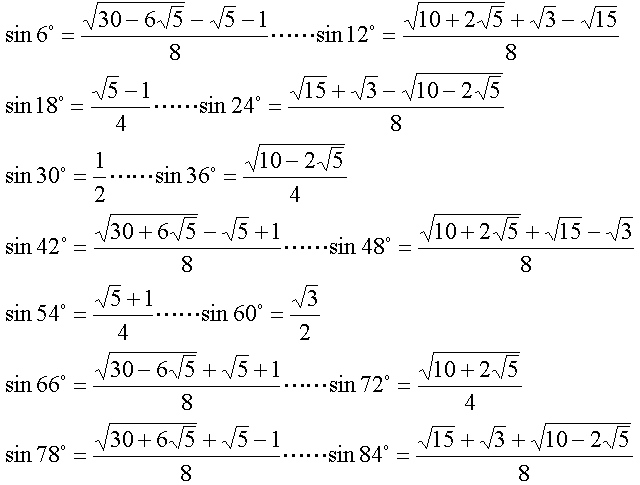

# 摘要
mathe于[2008年5月提问](https://bbs.emath.ac.cn/thread-418-1-1.html) ：  
已知$\cos(\theta)=\frac{\sqrt{3}-1}2$,那么请问$\theta$用度数表示是否是无理数，或者说$\theta$如果用弧度表示，是否$\frac{\theta}{\pi}$是无理数?  

zeroieme于[2011年4月](https://bbs.emath.ac.cn/thread-3136-1-1.html) 提问:  
使$\sin(a\pi),\cos(a\pi)$ 都是有理数。
除了 $a = \frac12  n$ (n是整数)外，a 还有其他有理数解么？

没人会算于[2011年4月在百度数学吧](http://tieba.baidu.com/p/1051245073?pid=11918704479&cid=0#11918704479) 提问：  
$\frac{\theta}{\pi}$与$\cos(\theta)$都是有理数，证明$\cos(\theta)$必为下列几个数之一：  
$-1,-\frac12,0,\frac12,1$  

hejoseph于[2016年12月](https://bbs.emath.ac.cn/thread-9262-1-1.html) 提问:  
设 $a$ 是有理数，$0\leq a\leq 90$。  
若 $\cos a^{\circ}$ 也是有理数，则 $a=0$ 或 $a=60$ 或 $a=90$。  
若 $\cos a^{\circ}$ 是一个不可约整系数二次方程的根，则 $a=30$ 或 $a=36$ 或 $a=45$ 或 $a=72$。  
若 $\cos a^{\circ}$ 是一个不可约整系数三次方程的根，则 $a$ 可能是哪些值呢？  

百度贴巴中[jerry_science提议用分圆多项式](http://tieba.baidu.com/f?kz=368976205) 解决这个问题，最终我们证明了：
一个正有理数平方根和另外一个有理数的和差如果不是整数角度的余弦值，那么就不可能是有理数角度的余弦值。

# 详细内容
无心人通过数值计算得出这个角度为68.529298567560044851501529672774°，所以至少不是整数度数。  
zgg\_\_认为，是无理角度吧。因为sin值是$\sqrt{\frac{\sqrt{3}}2}$，那么$(\cos(\theta)+i\sin(\theta))^n$的虚部有4次$\sqrt{3}$捣乱，总是没法等于0。所以，$(\cos(\theta)+i\sin(\theta))^n$不能为1，角度也就是无理角了吧。  
mathe建议采用[第二类切皮雪夫多项式](http://mathworld.wolfram.com/ChebyshevPolynomialoftheSecondKind.html) 来解决:  
根据第二类切皮雪夫多项式上面链接中内容，  
$$
U_n(x)=\left|\begin{matrix}2x&1&0&0&\dots&0&0\\
1&2x&1&0&\dots&0&0\\
0&1&2x&1&\dots&0&0\\
0&0&1&2x&\dots&0&0\\
\cdots&\cdots&\cdots&\cdots&\ddots&\cdots&\cdots\\
0&0&0&0&\cdots&2x&1\\
0&0&0&0&\cdots&1&2x\end{matrix}\right| =2^n\prod_{k=1}^n (x-\cos(\frac{k\pi}{n+1}))
$$  
所以只要能够证明
$$
U_n(\frac{\sqrt{3}-1}2)=\left|\begin{matrix}\sqrt{3}-1&1&0&0&\dots&0&0\\
1&\sqrt{3}-1&1&0&\dots&0&0\\
0&1&\sqrt{3}-1&1&\dots&0&0\\
0&0&1&\sqrt{3}-1&\dots&0&0\\
\cdots&\cdots&\cdots&\cdots&\ddots&\cdots&\cdots\\
0&0&0&0&\cdots&\sqrt{3}-1&1\\
0&0&0&0&\cdots&1&\sqrt{3}-1\end{matrix}\right|\ne 0
$$
即可解决本题中的问题。

zgg\_\_[继续细化其思路](https://bbs.emath.ac.cn/forum.php?mod=redirect&goto=findpost&ptid=418&pid=4255&fromuid=20) ，认为:  
假设x为$\sqrt{\frac{\sqrt{3}}2}i$，那么题目就相当于证明$f(n)=(-\frac12+x-x^2)^n$，对于$n\gt 1$时，$f(n)\ne 1$。  
我们看到f(n)总可以表示成为$A+Bx+Cx^2+Dx^3$的形式，例如f(0)到f(5)的{A,B,C,D}分别为：{1, 0, 0, 0}、{-1/2,1,-1,0}、{1,-1,2,-2}、{-7/2,3,-3,4}、{7,-8,8,-8}和{-31/2,17,-19,20}。
其中B列的系数0、1、-1、3、-8、17、-39……满足递推关系$B_{k+4}=-2B_{k+3}+2B_{k+1}+B_k$，（这是因为$-x^2+x-\frac12$是方程$x^4+2x^3+2x+1=0$的根。）我们可以看到B列的系数的绝对值是越来越大的，不难证明它再也回不到0了。
而如果B列的数不为0，f(n)是不会得实数的（因为x是不能用1、$x^2$、$x^3$来线性表示的）。所以就证明了上面预期的结论。

百度贴吧中[jerry_science提议](http://tieba.baidu.com/f?kz=368976205) :  
$z=\cos(\theta)+i\sin(\theta)$的一个零化多项式是$f(z)=(z^2+z+1)^2-3z^2$,  
如果z是单位根的话，那么z的最小多项式必然是[分圆多项式](http://mathworld.wolfram.com/CyclotomicPolynomial.html) p(z).  
所以$p(z)|f(z)$，从而$\deg(p)\le \deg(f)=4$.   
但是次数$\le 4$的分圆多项式很少，可以列举出来的，之后就出现矛盾.  

根据分圆多项式的理论，它是一个次数为$\varphi(n)$的不可约多项式，其中$\varphi(n)$是欧拉函数，代表和n互素的n的同余类的数目，
于是我们可以直到，只有n=1,2,3,4,5,6,8,10,12时$\varphi(n)\le 4$,所以我们得出了推广的结论:  
一个正有理数平方根和另外一个有理数的和差如果是有理角度的余弦值，那么必然是整数角度的余弦值。(事实上必然是3°角的倍数的余弦值)  

liangbch贴出了6°角倍数的正弦值:  
  

mathe说明有了上面这些角已经足够了，因为  
我们只要需要检验满足$\varphi(n)\le 4$的所有n所划分的角度，也就是$\cos(\frac{2k\pi}{10})$和$\cos(\frac{2k\pi}{12})$和$\cos(\frac{2k\pi}{8})$
也就是72度,30度和45度倍数的余弦值就可以了.  

而关于余弦值和角度都是有理数的特殊情况，[百度数学吧中链接](http://tieba.baidu.com/p/1051245073?pid=11918704479&cid=0#11918704479) 通过使用[第一类切皮雪夫多项式](http://mathworld.wolfram.com/ChebyshevPolynomialoftheFirstKind.html) 来解决:  
设$T_n(x)$是第一类切皮雪夫多项式,  
其中$T_0(x)=1,T_1(x)=x,T_{n+1}(x)=2xT_n(x)-T_{n-1}(x)$  
于是$T_n(\cos(t))=\cos(nt)$.  
我们选择$S_n(2x)=2T_n(x)$,于是可以得到  
$S_0(x)=2,S_1(x)=x, S_{n+1}(x)=xS_n(x)-S_{n-1}(x)$.  
于是马上可以得出$S_n(x)$在$n\ge 1$时是一个次数为n,最高项系数为1的整系数多项式。  
而且$S_n(2\cos(t))=2\cos(nt)$.  
于是我们知道对于$t=q\pi$,其中$q=\frac{u}{v}$是有理数，那么  
$S_{2v}(2\cos(q\pi))=2\cos(2u\pi)=2$.  
所以$2\cos(q\pi)$是首1整系数多项式$S_{2v}(x)-2=0$的根，所以如果是有理数，必然是整数。  
由此得出$2\cos(q\pi)$是有理数时只能是$0,\pm1,\pm2$.

