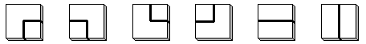

mathe于2011年5月提问  

中国象棋（9×10）棋盘上一只马从任何一个位置出发，没有重复经过所有格子最后返回起始点的不同方案有多少种？
如果不需要返回起始点，那么又有多少种方案？

KeyTo9_Fans出手，使用计算机经过艰难的计算，得出最终最后返回起点情况的数目为19381952998732022416892种。
但是不需要返回起点的情况复杂度太大，还没有人能够求出方案数。

# 详细信息

风云剑最先给出了两种[枚举代码] 。

然后KeyTo9_Fans出手,给出了一种重要的[使用动态规划计数]的算法。  
KeyTo9_Fans认为这个问题和[走格子线路统计问题]类似  
在走格子路线数统计问题里，种走法的位移为：  
(0, 1) 、 (1,0)、（0，-1）、（-1，0）  

我们可以根据这种走法，设计出$C_4^2=6$种瓷砖：  
  
于是路线数统计问题就变成了铺瓷砖方案数统计问题。

我们从上往下铺瓷砖。

铺的时候需要考虑：

1、新铺的瓷砖和已经铺好的瓷砖的边沿是否匹配。

2、新铺的瓷砖和已经铺好的瓷砖的连通性是否合法。

可以用动态规划算法统计合法的铺瓷砖方案总数。

由于所有走法的坐标变化的绝对值不超过 $(1\plus 0)$。

所以边沿状态只有一行格子的信息。

而马踏棋盘有8种走法：
(1,2)、（2，1）、（1，-2）、（2，-1）、（-1，2）、（-2，1）、（-1，-2）、（-2，-1)  
相应的一共有$C_8^2=28$种瓷砖。

所有走法的坐标变化的绝对值不超过(2 + 1)。  

所以边沿状态有2行加1个格子的信息。

即19个格子的信息。

信息包括：

1、该格子的两个端口（上一步从哪里跳过来，下一步跳到哪里去）已经确定了几个？用一个数字0、1、2表示。

2、对于标了数字1的格子，它们的连通情况。用1a、1b、1c……表示。相同的字母表示目前已经相连，不同的字母表示目前尚未相连。

暂不考虑第2条信息，在最坏的情况下第1条信息就已经有$3^{19}$种可能了，这个数有点大。但实际情况会好多少，这个暂时不知道。

[xbtianlang] 先枚举出$5\times 6$棋盘有8条回路, 而$6\times 7$棋盘[有1067638条回路]。

KeyTo9_Fans先利用他提出的算法[计算了$6\times n$棋盘的回路数目]，得出
|棋盘规模|回路总数|程序运行时间|
|----------|---------|---------------|
|$6\times 7$| 1067638|20s|
|$6\times 8$| 55488142|42s|
|$6\times 9$| 3374967940|56s|
|$6\times 10$| 239187240144|70s|

然后找到了[A175881]

然后他继续[计算$7\times 2n$棋盘的回路数目],得出
|棋盘规模|回路总数|
|----------|---------|
|$7\times 2$| 0|
|$7\times 4$| 0|
|$7\times 6$| 1067638|
|$7\times 8$| 34524432316|
|$7\times 10$| 1250063279938854|
|$7\times 12$| 38350427205194670084|

然后mathe[帮忙运行$8\times n$得出]
|棋盘规模|回路总数|
|----------|---------|
|$8\times 5$| 44202|
|$8\times 6$| 55488142|
|$8\times 7$| 34524432316|
|$8\times 8$| 13267364410532|
|$8\times 9$| 7112881119092574|
|$8\times 10$| 4235482818156697040|
|$8\times 11$| 2085986745706526487660|
|$8\times 12$| 1105402225545775529519346|
|$8\times 13$| 586820020252349733523479144|
|$8\times 14$| 311550865844403670432538061432|
|$8\times 15$| 162703111270599746594928785964078|
|$8\times 16$|85817858712661606753131465774443178|
|$8\times 17$| 45194091394912063170099393989692461352|
|$8\times 18$| 326323885119378112085100727490253780278|


并且贴出了[Fans的源代码]：
```bash

#include<cstdio>
#include<memory>
#include<algorithm>
#include <string.h>
using namespace std;
#define __int64 long long
const unsigned int pm=503,pn=8388608;
char fn[96];
unsigned char a[20],b[20];
unsigned int c[pn],h,i,j,k,l,m,n,t;
unsigned long long o;
unsigned __int64 ui,vi,ans[32],u[pn],v[pn];
FILE *ou[pm],*in;
#ifndef MODR
#define MODR 0
#endif

unsigned __int64 add(unsigned __int64 x, unsigned __int64 y)
{
    if(MODR==0)return x+y;
    if((-MODR)-x>y)return x+y;
    return x+y+MODR;
}

void pr(unsigned int f,unsigned __int64 v)
{
        fwrite(&v,sizeof(unsigned __int64),1,ou[f]);
}

void pri(unsigned __int64 v)
{
        fwrite(&v,sizeof(unsigned __int64),1,in);
}

void sc(unsigned int f,unsigned __int64 &v)
{
        if(fread(&v,sizeof(unsigned __int64),1,ou[f])!=1)v=0ull;
}

void sci(unsigned __int64 &v)
{
        if(fread(&v,sizeof(unsigned __int64),1,in)!=1)v=0ull;
}

unsigned __int64 id(unsigned char a[])
{
        unsigned char c[16],i,j;
        unsigned __int64 s;
        memset(c,0,16);
        for(i=0;i<l;i++)
        {
                j=a[i];
                if(j>1)
                        if(c[j])
                        {
                                a[c[j]-1]=i-c[j]+2;
                                a[i]=0;
                        }
                        else c[j]=i+1;
        }
        s=0;
        for(i=0;i<l;i++)
                s=s*(l+1-i)+a[i];
        return s;
}

void ar(unsigned __int64 x)
{
        unsigned char i,j,k;
        k=2;
        for(i=l+1;i;)
        {
                i--;
                j=l-i+1;
                a[i]=char(x%j);
                x/=j;
                if(a[i]>1)
                {
                        a[i+a[i]-1]=k;
                        a[i]=k++;
                }
        }
}

void ad(unsigned __int64 x)
{
        unsigned __int64 s;
        s=id(b);
        pr(s%pm,s);
        pr(s%pm,x);
        o++;
}

unsigned int d(unsigned int x)
{
        unsigned int i;
        for(i=1;;i++)
                if(i!=x&&a[i]==a[x])return i;
}

void c1(unsigned int x)
{
        unsigned int i,j;
        if(a[x]==1)return;
        memcpy(b,&a[1],l);
        if(a[x]==a[0])
        {
                j=h/m+2;
                b[x-1]=1;
                for(i=0;i<l;i++)
                        if(h+i+1<j*m&&b[i]!=1||h+i+2>j*m&&b[i]!=0)break;
                if(i>=l)ans[j]=add(ans[j],vi);
                return;
        }
        if(!a[x])b[x-1]=a[0];
        else
        {
                b[x-1]=1;
                b[d(x)-1]=a[0];
        }
        ad(vi);
}

void c2(unsigned int x,unsigned int y)
{
        unsigned int i,j;
        if(a[x]==1||a[y]==1)return;
        memcpy(b,&a[1],l);
        if(a[x]&&a[x]==a[y])
        {
                j=h/m+2;
                b[x-1]=1;
                b[y-1]=1;
                for(i=0;i<l;i++)
                        if(h+i+1<j*m&&b[i]!=1||h+i+2>j*m&&b[i]!=0)break;
                if(i>=l)ans[j]=add(ans[j],vi);
                return;
        }
        if(a[x])
        {
                b[x-1]=1;
                b[y-1]=1;
                if(a[y])b[d(y)-1]=a[x];
                else b[y-1]=a[x];
        }
        else
                if(a[y])
                {
                        b[x-1]=a[y];
                        b[y-1]=1;
                }
                else
                {
                        b[x-1]=15;
                        b[y-1]=15;
                }
        ad(vi);
}

bool cmp(unsigned int i,unsigned int j)
{
        return u[i]<u[j];
}

int main()
{
        scanf("%d%d",&n,&m);
        //n=10;
        //m=8;
        l=m+m+1;
        b[m+1]=2;
        b[m+m]=2;
        vi=id(b);
        for(i=0;i<pm;i++)
        {
                sprintf(fn,"sa/%04d.dat",i);
                ou[i]=fopen(fn,"wb");
                if(vi%pm==i)
                {
                        pr(i,vi);
                        pr(i,1);
                }
                fclose(ou[i]);
        }
        for(h=1;h<n*m-m;h++)
        {
                o=0;
                j=h%m;
                for(i=0;i<pm;i++)
                {
                        sprintf(fn,"sb/%04d.dat",i);
                        ou[i]=fopen(fn,"wb");
                }
                for(i=0;i<pm;i++)
                {
                        sprintf(fn,"sa/%04d.dat",i);
                        in=fopen(fn,"rb");
                        while(1)
                        {
                                sci(ui);
                                if(!ui)break;
                                sci(vi);
                                ar(ui);
                                if(a[0]==1)
                                {
                                        memcpy(b,&a[1],l);
                                        ad(vi);
                                        continue;
                                }
                                if(a[0]>1)
                                {
                                        if(j>1)c1(m-2);
                                        if(j&&h/m<n-2)c1(m+m-1);
                                        if(j<m-1&&h/m<n-2)c1(m+m+1);
                                        if(j<m-2)c1(m+2);
                                        continue;
                                }
                                if(j>1)
                                {
                                        if(h/m<n-2)c2(m-2,m+m-1);
                                        if(j<m-1&&h/m<n-2)c2(m-2,m+m+1);
                                        if(j<m-2)c2(m-2,m+2);
                                }
                                if(j&&h/m<n-2)
                                {
                                        if(j<m-1)c2(m+m-1,m+m+1);
                                        if(j<m-2)c2(m+m-1,m+2);
                                }
                                if(j<m-2&&h/m<n-2)c2(m+m+1,m+2);
                        }
                        fclose(in);
                        in=fopen(fn,"wb");
                        fclose(in);
//                        printf("%c%c%c%d",8,8,8,i);
                }
//                printf(" ");
                for(i=0;i<pm;i++)
                {
                        fclose(ou[i]);
                }
                for(i=0;i<pm;i++)
                {
                        sprintf(fn,"sb/%04d.dat",i);
                        ou[i]=fopen(fn,"rb");
                        t=0;
                        while(1)
                        {
                                sc(i,ui);
                                if(!ui)break;
                                u[t]=ui;
                                sc(i,v[t]);
                                c[t]=t++;
                        }
                        fclose(ou[i]);
                        sprintf(fn,"sb/%04d.dat",i);
                        ou[i]=fopen(fn,"wb");
                        fclose(ou[i]);
                        sort(c,c+t,cmp);
                        sprintf(fn,"sa/%04d.dat",i);
                        in=fopen(fn,"wb");
                        vi=v[c[0]];
                        for(k=1;k<=t;k++)
                                if(k<t&&u[c[k]]==u[c[k-1]])vi=add(vi,v[c[k]]);
                                else
                                {
                                        pri(u[c[k-1]]);
                                        pri(vi);
                                        if(k<t)vi=v[c[k]];
                                }
                        fclose(in);
                //        printf("%03d%c%c%c",i,8,8,8);
                }
//                printf("%c%d %d: %llu\n",13,h/m,j,o);
                if(j>m-2){printf("%llu\n",ans[h/m+2]);fflush(stdout);}
        }
//        scanf("%d",&h);
        return 0;
}
```
并且 [补充了$7\times 2n$的数目到30]

然后数据提交到了OEIS [A193054] [A193055]

知道2015年Fans换了TB级别硬盘, 终于可以[向$9\times 2n$问题发起冲击], 得出
|棋盘规模|回路总数|
|----------|---------|
|$9\times 6$| 3374967940|
|$9\times 8$| 7112881119092574|
|$9\times 10$| 19381952998732022416892|

不过这个数据好像忘了提交OEIS了

[枚举代码]: https://bbs.emath.ac.cn/forum.php?mod=redirect&goto=findpost&ptid=3231&pid=37314&fromuid=20  
[使用动态规划计数]: https://bbs.emath.ac.cn/forum.php?mod=redirect&goto=findpost&ptid=3231&pid=37327&fromuid=20  
[走格子线路统计问题]: https://bbs.emath.ac.cn/thread-517-1-1.html
[xbtianlang]: https://bbs.emath.ac.cn/forum.php?mod=redirect&goto=findpost&ptid=3231&pid=37375&fromuid=20
[有1067638条回路]: https://bbs.emath.ac.cn/forum.php?mod=redirect&goto=findpost&ptid=3231&pid=37401&fromuid=20
[计算了$6\times n$棋盘的回路数目]: https://bbs.emath.ac.cn/forum.php?mod=redirect&goto=findpost&ptid=3231&pid=37414&fromuid=20
[A175881]: http://oeis.org/A175881
[计算$7\times 2n$棋盘的回路数目]: https://bbs.emath.ac.cn/forum.php?mod=redirect&goto=findpost&ptid=3231&pid=37451&fromuid=20
[帮忙运行$8\times n$得出]: https://bbs.emath.ac.cn/forum.php?mod=redirect&goto=findpost&ptid=3231&pid=37591&fromuid=20
[Fans的源代码]: https://bbs.emath.ac.cn/forum.php?mod=redirect&goto=findpost&ptid=3231&pid=37689&fromuid=20
[补充了$7\times 2n$的数目到30]: https://bbs.emath.ac.cn/forum.php?mod=redirect&goto=findpost&ptid=3231&pid=37698&fromuid=20
[A193054]: http://oeis.org/A193054
[A193055]: http://oeis.org/A193055
[向$9\times 2n$问题发起冲击]: https://bbs.emath.ac.cn/forum.php?mod=redirect&goto=findpost&ptid=3231&pid=60722&fromuid=20
