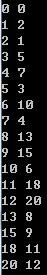

#自然数分家 - 威佐夫博弈和Beatty定理
PKU-1067是一个石子游戏，这其实是一个[威佐夫博弈问题](https://blog.csdn.net/wu_tongtong/article/details/79295069), [英文维基百科](https://en.wikipedia.org/wiki/Beatty_sequence) 也有详尽描述。  
问题的大概描述是: 有两堆各若干个物品，两个人轮流从某一堆或同时从两堆中取同样多的物品，规定每次至少取一个，多者不限，最后取光者得胜。  
如果两堆余下物品分别在下面图标中数目时：  
    
是接下去先手会输的局面，我们称这种问题中的必败态为奇异局势$(a_k,b_k)$。  
可以看到，$a_0=b_0=0$，$a_k$是未在前面出现过的最小自然数，而$b_k=a_k+k$。  
进一步分析可以发现：  
  任何自然数都包含在一个且仅有一个奇异局势中，  
由于$a_k$是未在前面出现过的最小自然数，所以有$a_k \gt a_{k−1}$。  
$b_k=a_k+k\gt a_{k−1}+k\gt a_{k−1}+k−1=b_{k−1}\gt a_{k−1}$。  
其中$a_k=\lfloor k\omega\rfloor$, 其中$\omega^2=\omega+1$,即$\omega = 1.618\dots$即所谓黄金分割数，而$b_k=\lfloor k\psi\rfloor$,其中$\psi=\omega+1$。  
实际上$a_n$和$b_n$构成了一个Beatty序列。  
##Beatty定理  
设$a，b$是正无理数且$\frac1a+\frac1b=1$  
记$P=\{\lfloor na\rfloor|n为任意的正整数\}，Q=\{\lfloor nb\rfloor|n为任意的正整数\}$  
（$\lfloor x\rfloor$指的是不好过$x$的最大整数）  
则$P$与$Q$是$Z^{+}$的一个划分，即$P∩Q$为空集且$P∪Q$为正整数集合$Z^{+}$。  

即对于任意满足条件的无理数$a,b$, 数列$\lfloor na\rfloor$和$\lfloor nb\rfloor$实现了正整数集的完美分家。  

#三家分赵

王守恩[在2019年10月询问](https://bbs.emath.ac.cn/thread-16952-1-1.html) ，$\{a(n)\}\cup\{b(n)\}\cup\{c(n)\}$正好构成正整数集吗？为什么？
其中:  
{a(n)}={1, 4, 07, 09, 12, 15, 16, 19, 22, 25, 27, 30, 32, 34, 37, 40, 43, 45, 47, 50, 52, 55, 58, 60, 63, 65,...}  
{b(n)}={2, 5, 08, 11, 14, 18, 20, 23, 26, 29, 33, 36, 38, 41, 44, 48, 51, 54, 56, 59, 62, 66, 69, 72, 75, 77,...}  
{c(n)}={3, 6, 10, 13, 17, 21, 24, 28, 31, 35, 39, 42, 46, 49, 53, 57, 61, 64, 67, 71, 74, 79, 82, 85, 89, 92,...}  

$a(n)=n+\lfloor n\sqrt[4]{\frac12}\rfloor+\lfloor n\sqrt[4]{\frac14}\rfloor$

$b(n)=n+\lfloor n\sqrt[4]{\frac12}\rfloor+\lfloor n\sqrt[4]{2}\rfloor$

$c(n)=n+\lfloor n\sqrt[4]{4}\rfloor+\lfloor n\sqrt[4]{2}\rfloor$

[lsr314分析发现](https://bbs.emath.ac.cn/forum.php?mod=redirect&goto=findpost&ptid=16952&pid=81380&fromuid=20) ,
貌似只要$t\gt 0$且$t^2,t+\frac1t,t+t^2,\frac1t+\frac1{t^2}$都是无理数，那么
$a_n=n+\lfloor\frac nt\rfloor+\lfloor\frac n{t^2}\rfloor],b_n=n+\lfloor\frac nt\rfloor+\lfloor nt\rfloor,c_n=n+\lfloor\frac n{t^2}\rfloor+\lfloor nt\rfloor,$
$\lfloor x\rfloor$表示$x$的整数部分，那么每个正整数刚好在$a_n,b_n,c_n$中出现一次。本题中$t=2^{\frac14}$。  

#群雄逐鹿
王守恩继续问， 还可以有 $\{a(n)\}\cup\{b(n)\}\cup\{c(n)\}\cup\{d(n)\}$正好构成正整数集吗？ 

[lsr314继续做出解答](https://bbs.emath.ac.cn/forum.php?mod=redirect&goto=findpost&ptid=16952&pid=81499&fromuid=20)  
如果$t_1,t_2,…,t_k$都是正数，且任意两个数的比值都是无理数，  
$a_i(n)=\sum_{j=1}^k\lfloor\frac{t_j}{t_i} n\rfloor,i=1,2,…k.$
那么每个正整数在数列$a_1(n),…a_k(n)$中恰好出现一次。

#自然数大分家 - Fibonacci矩阵
[mathe在csdn的博客](https://blog.csdn.net/mathe/article/details/1600057) 中, 如下定义一个无限阶矩阵m：  
矩阵第0行正好是Fibonacci数列，也就是 m(0,0)=1,m(0,1)=2,m(0,2)=3, m(0,3)=5,m(0,4)=8,....
矩阵第k行中第一个数字是前面k-1行中都没有出现的最小正整数,  所以
m(1,0)=4, 而m(k,1)=2m(k,0)-k (这个关系对于第0行也成立), 比如$m(1,1)=2\times4-1=7$。  
而第k行后面的任意一个数的递推关系同第一行类似,是当前行前面两个数的和。  
比如m(1,2)=m(1,0)+m(1,1)=11,...  
于是我们可以得到如下的Fibonacci矩阵  
1 2 3 5 8 13 21 34 55 89 144...  
4 7 11 18 29 47 76 123 199 322 521...  
6 10 16 26 42 68 110 178 288 466 754...  
9 15 24 39 63 102 165 267 432 699 1131...  
12 20 32 52 84 136 220 356 576 932 1508...  
14 23 37 60 97 157 254 411 665 1076 1741...  
...  
我们可以神奇的发现，这个矩阵正好包含了所有的自然数，而且每个自然数只出现一次，它实现了正整数集更大的分家。  
链接中还提出了如下一些问题:  
问题1)  
我们计算所有的m(k+1,0)-m(k,0),我们可以得到如下序列:  
32332...  
证明或否定:所有的m(k+1,0)-m(k,0)必然是2或者3.  
问题2)  
我们在一张白纸上先写下  
32  
两个数  
然后从这行数第一个数字开始查看,每看到一个3,在后面添加三个数332;每看到一个2,在后面添加两个数32,  
比如第一次操作,由于第一个数是3,添加332,所以数列变成:  
32332  
第二次操作,由于第二个数是2,添加32,所以数列变成  
3233232  
第三次操作,由于第三个数是3,添加332,所以数列变成  
3233232332  
一直这样下去  
证明或否定,这样得到的一个序列正好是(1)中由所有m(k+1,0)-m(k,0)顺序排成的序列.  
这个方法给出了一种快速构造上面矩阵的方案。

