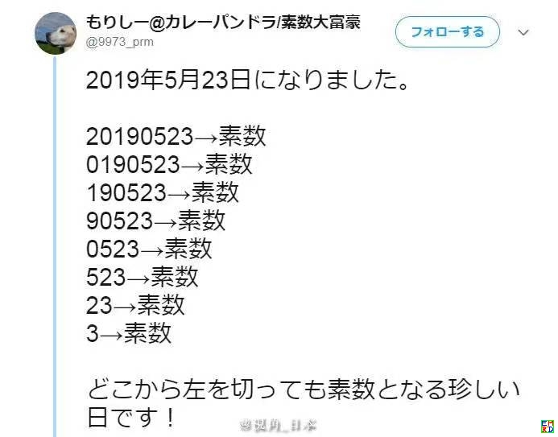
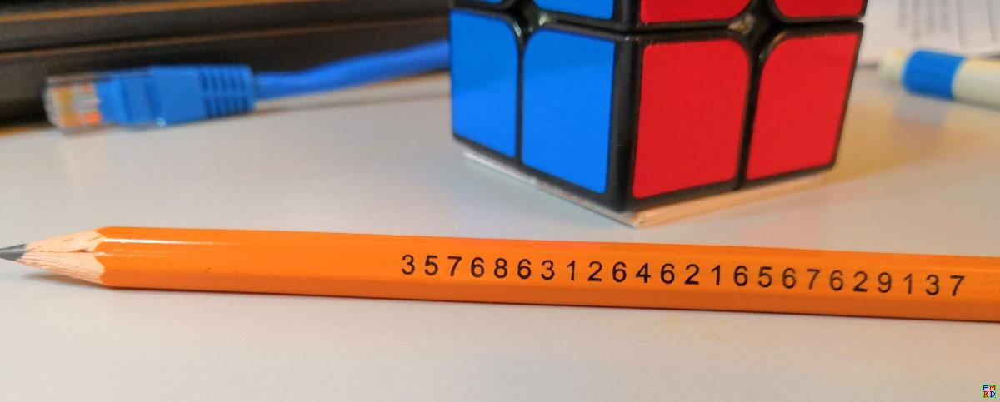

# 摘要
[2008年4月无心人问询](https://bbs.emath.ac.cn/thread-290-1-1.html) :  
假设一个素数去掉十进制最高位一个数字还是素数，称外洋葱素数  
假设一个素数去掉十进制最低位一个数字还是素数，称内洋葱素数  

现在求小于等于$10^{19}$的全部这类数字.  

# 外洋葱素数
半天过后，mathe找出了所有的外洋葱素数：  
```bash
...
3484957213536676883
6484957213536676883
8963315421273233617
7986315421273233617
6312646216567629137
4686798799354632647
6918997653319693967
8918997653319693967
3396334245663786197
5396334245663786197
1276812967623946997
6276812967623946997
6165678739293946997
Total 13 for length 19
36484957213536676883
67986315421273233617
86312646216567629137
18918997653319693967
15396334245663786197
66276812967623946997
Total 6 for length 20
367986315421273233617
686312646216567629137
918918997653319693967
315396334245663786197
666276812967623946997
Total 5 for length 21
6686312646216567629137
7686312646216567629137
5918918997653319693967
9918918997653319693967
Total 4 for length 22
96686312646216567629137
57686312646216567629137
95918918997653319693967
Total 3 for length 23
357686312646216567629137
Total 1 for length 24
Total 0 for length 25
Total 4259 found
```
于是我们确定了最大的外洋葱素数为357686312646216567629137。
#对应代码
mathe使用gxqcn的[HugeCalc](https://www.emath.ac.cn/hugecalc/) 编写了搜索外洋葱素数的c代码，主要部分如下：
```bash
#include <list>
using namespace std;
....
typedef CHugeInt integer;
typedef list<integer> THE_LIST;
THE_LIST list1,list2;
THE_LIST *orig_list, *new_list, *tmp_list;
#define MAX_N  50
 
   int i,j;
    integer v(1);
    int count=3;
    list1.push_back(integer(3));list1.push_back(integer(5));list1.push_back(integer(7));
    orig_list=&list1;
    new_list=&list2;
    printf("3\n5\n7\n");
    printf("Total 3 for length 1\n");
    for(i=2;i<=MAX_N;i++){
        new_list->clear();
        v*=10;
        THE_LIST::iterator it;
        for(it=orig_list->begin();it!=orig_list->end();++it){
            integer& u=*it;
            for(j=1;j<=9;j++){
                integer cur(j*v+u);
                if(CHugeInt(cur).IsPrime()){
                    new_list->push_back(cur);
                    printf("%s\n",cur.GetStrA(FS_NORMAL));
                    count++;
                }
            }
        }
        printf("Total %d for length %d\n",new_list->size(),i);
        if(new_list->size()==0)break;
        tmp_list=orig_list;
        orig_list=new_list;
        new_list=tmp_list;
    }
    printf("Total %d found\n",count);
```

#内洋葱素数

无心人看到有限个外洋葱素数后提问，内洋葱素数是不是更多并且无限个？  
mathe稍微修改了下他的代码，[给出了如下的内洋葱素数列表](https://bbs.emath.ac.cn/forum.php?mod=redirect&goto=findpost&ptid=290&pid=2466&fromuid=20) : 

Call HugeCalc V8.0.0.0 
```bash
3
5
7
Total 3 for length 1
31
37
53
59
71
73
79
Total 7 for length 2
311
313
317
373
379
593
599
719
733
739
797
Total 11 for length 3
3119
3137
3733
3739
3793
3797
5939
7193
7331
7333
7393
Total 11 for length 4
31193
31379
37337
37339
37397
59393
59399
71933
73331
73939
Total 10 for length 5
373379
373393
593933
593993
719333
739391
739393
739397
739399
Total 9 for length 6
3733799
5939333
7393913
7393931
7393933
Total 5 for length 7
37337999
59393339
73939133
Total 3 for length 8
Total 0 for length 9
Total 59 found
```
不过他修改代码时忘了数字2是可以参与内洋葱素数的。  
[air指出总数应该83个](https://bbs.emath.ac.cn/forum.php?mod=redirect&goto=findpost&ptid=290&pid=31525&fromuid=20) ：  
```bash
内洋葱素数算掉了一部分（首位数字只能为2、3、5、7，其余数字只能为1、3、7、9），总数应该是83个。
1位：2 3 5 7
2位：23 29 31 37 53 59 71 73 79
3位：233 239 293 311 313 317 373 379 593 599 719 733 739 797
4位：2333 2339 2393 2399 2939 3119 3137 3733 3739 3793 3797 5939 7193 7331 7333 7393
5位：23333 23339 23399 23993 29399 31193 31379 37337 37339 37397 59393 59399 71933 73331 73939 
6位：233993 239933 293999 373379 373393 593933 593993 719333 739391 739393 739397 739399
7位：2339933 2399333 2939999 3733799 5939333 7393913 7393931 7393933
8位：23399339 29399999 37337999 59393339 73939133
```

#空心洋葱素数
gxqcn提议[可以讨论空心洋葱素数](https://bbs.emath.ac.cn/forum.php?mod=redirect&goto=findpost&ptid=290&pid=2553&fromuid=20) :  
忽然想到：如果“洋葱素数”允许在剥离过程中产生的数首位为“0”的话，结果会多很多！

这个主要是针对“外洋葱素数”数而言，“内洋葱素数”不存在该问题。

如果允许上述条件，则“外洋葱素数”就是无限的了，无论是有限剥离还是无限剥离:)

一个在2019年5月23日在网络上传播过的比较有意思的空心洋葱素数是:  
  

#其它讨论
[hujunhua](https://bbs.emath.ac.cn/forum.php?mod=redirect&goto=findpost&ptid=290&pid=31819&fromuid=20) 还发现[百度知道中一题](http://zhidao.baidu.com/question/175853886.html) 和洋葱素数紧密关联:  
正整数数列$a_1, a_2, \dots, a_n, \dots$的递推构造规则为：$a_{k+1}=a_k$后缀一个不是9的数字.  
证明：这个数列中必定有无穷多合数.

不过这个问题的证明应该还有难度，虽然我们感觉应该是成立的。

另外[manthanein](https://bbs.emath.ac.cn/forum.php?mod=redirect&goto=findpost&ptid=290&pid=65068&fromuid=20) 发现这个问题在英文维基百科中称为[Truncatable prime](https://en.wikipedia.org/wiki/Truncatable_prime) .  
[葡萄糖](https://bbs.emath.ac.cn/forum.php?mod=redirect&goto=findpost&ptid=290&pid=79625&fromuid=20) 找到了Mathematica官方推出一种对应的铅笔:  
 


