---

title: "二十棵树最优解求解问题"
date: "2019-10-18 05:06:57"
thumbnail: "../thumbnails/p20.png"
author: "mathe"
tags: 
    - "bash"
    - "果树问题" 
---

# 简介

20棵树植树问题是一个关于将20棵树(每棵树看成一个点)种在一个平面果园中，要求每行正好四棵树的行数尽量多的数学问题。比如:  
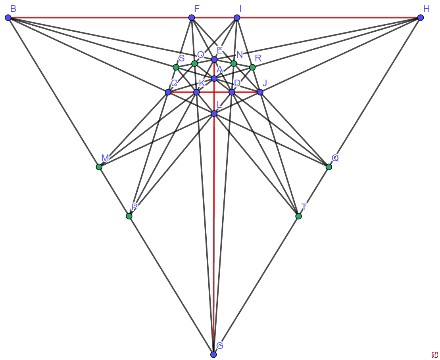  
这个问题来源于[Orchard Planting Problem], 或者英文维基百科[果树问题]上也有介绍。原始问题是要求将n棵树种在一个平面果园中，要求每行k棵树的行数尽量多。  
这个问题中[每行3棵树]的情况已经有非常好的结果: [B. Grunbaum和Sloane]在1974年通过复杂的数学理论（椭圆曲线）给出了很好的下界，不少于$1+⌊\frac{n^2}6-\frac{n}2⌋$行; 而[G. Ben和陶哲轩]在2013年证明了对于充分大的n,上面方法给出的已经是最优解。  
但是对于每行4棵或更多树的情况，现在我们还没有得出很好的结果。其中20棵树每行四棵的问题不知道为何，在国内互联网广为流传, 形成了20棵树植树问题。  
网络上流传着一个非常漂亮多层正五角星嵌套的20行结果（计算机搜索结果），不过这个远远不是最优解：  
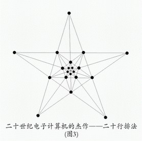  
2005年，[Xianzu Lin] (可以能是福建师范大学的林贤祖教授)最早给出了一种20棵树23行的方案(图上缺了直线KQRL)，只是给出的图中部分点为无穷远点，非数学专业人员难以理解（后面我们会介绍如何将结果转化为更加容易看懂的等价结果）。可能因为这个原因，这个结果并没有怎么流传开来。  
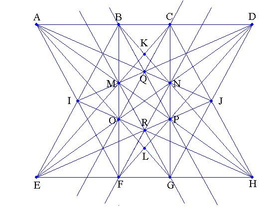  
2006年，辽宁锦州开发区笔架山小学的[王兴君]成功地绘制出了一个欧氏平面中23行图，这个结果在国内网络上流传比较广泛  
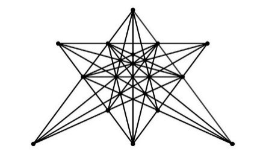  
2009年，河北省邢台学院学生[黄阳阳]（昵称eyond）成功地绘制出了另一个漂亮的23行植树图，结果如下：  
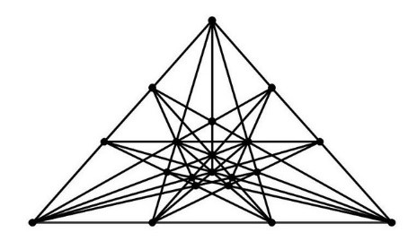  
2010年2月，我们在数学研发论坛上通过多人协作，共同使用多台计算机验证了20棵树每行四棵树，[最多只能种植23行]。但是限于计算能力，我们还无法找出所有的23行解。程序只找到了两种不等价的解，其中一个解和Xianzu Lin的结果等价，而另外一组解和王兴君和黄阳阳的都等价。其中王兴君和黄阳阳的结果虽然看似不同，但是从数学中的射影变换的角度来看，是可以相互转化的。  
2019年9月，我们利用计算机又找出一种和上面两种方案都不等价的[新的23行解]。可以看出，这个解过每棵果树都至少有4行，而Lin的方案有两棵树只有3行经过，王和黄的方案有一棵树只有三行经过，所以这个解必然和它们不同。  
  
从数学角度，我们可以通过射影变换将上面这些图片进行变换得出一些等价的但是看似不同的结果，比如2012年1月wayne就将前两种23行结果经过射影变换变化出如下[一些漂亮的图片]， 下面只给出四个图片，对应链接中含有更多的等价漂亮图片。  
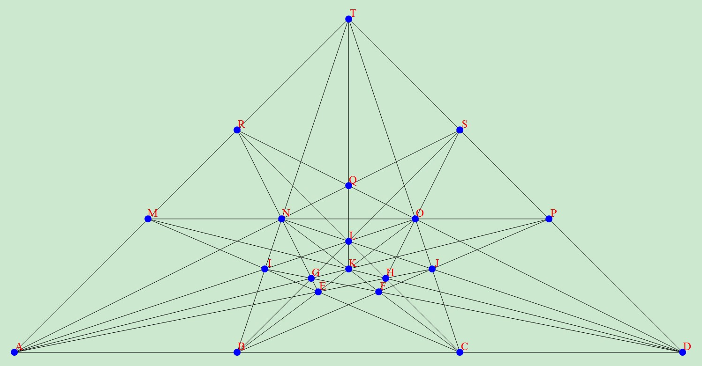  
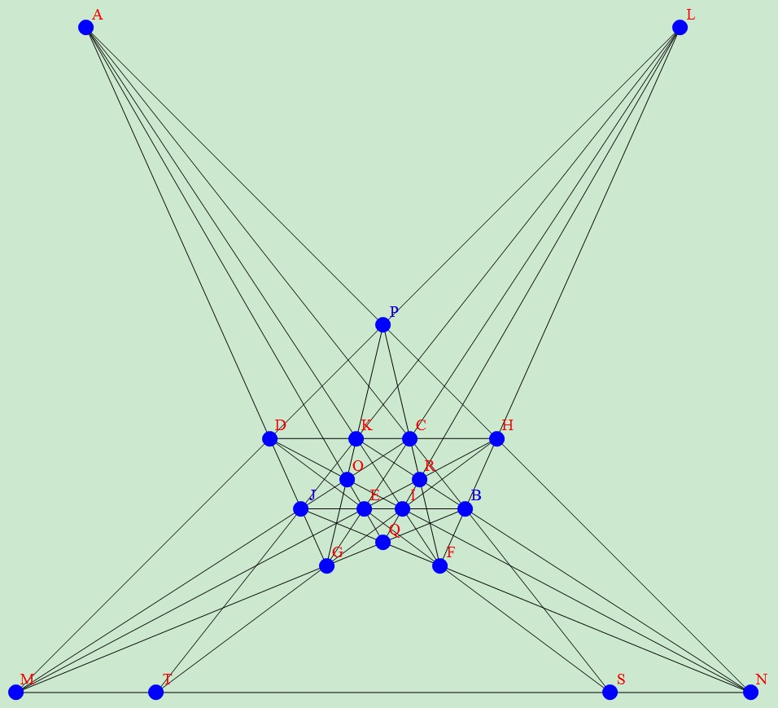  
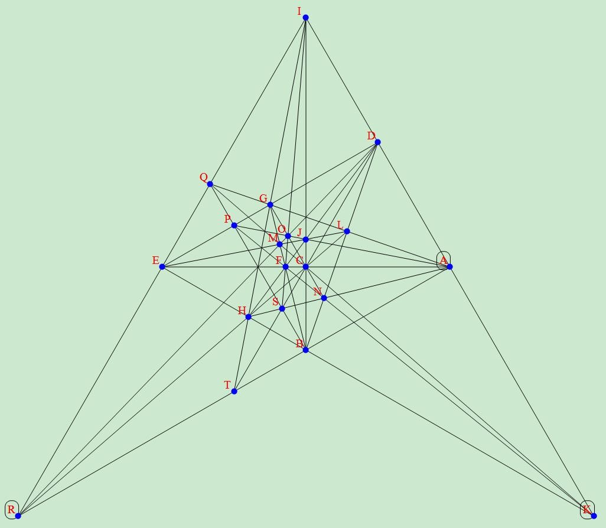  
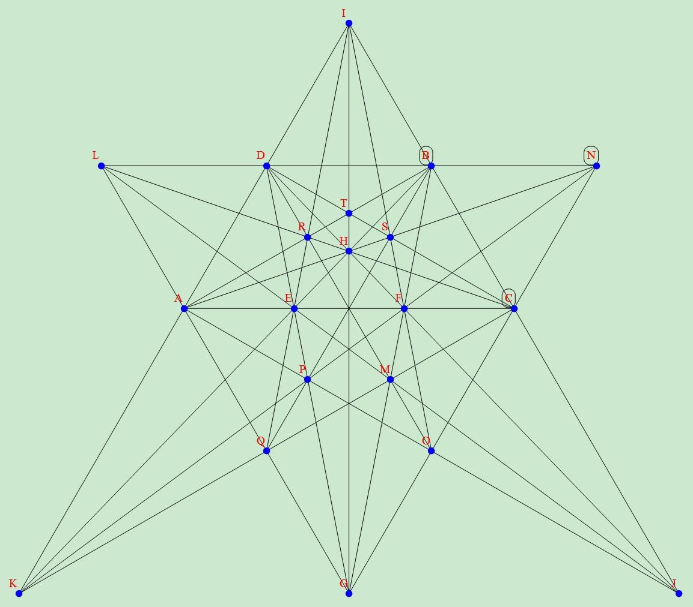  

# 射影变换介绍

如果我们观察圆盘在地面上的影子，我们会发现圆形的圆盘会被投影成椭圆形的; 也就是在投影变换下，图片的形状会发生变换。而且随着点光源，圆盘和投影平面位置的变化，我们甚至还可以将圆盘投影为抛物线和双曲线。但是可以看出，在投影下，直线的投影还是直线，并且投影也不会改变直线系中交点和直线的相关关系。所以如果我们得到了一个二十棵树问题的解，那么通过投影变换就可以转化出无数幅看似不同的结果。比如[王兴君]和[黄阳阳]的答案看似不同，本质相同。  
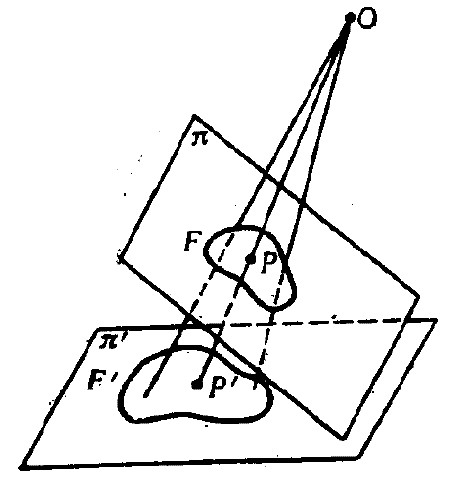  
在网页[射影几何简介]中给出了射影变换的介绍。而为了能够通过数值计算的方案对上面这些结果进行射影变换转化出更多的结果，我们首先需要理解齐次坐标这个概念。  
在平面坐标系中，任何一个点可以通过其横坐标和纵坐标值(x,y)来确定。对于这样的一个点，在对应的齐次坐标系中，我们需要使用[rx : ry : r]来表示，其中参数r可以是任意非零的实数。也就是说，任何一个点在齐次坐标系下其表示形式是不唯一的，可以有无穷种形式。比如平面坐标系上点(-1,1)在对应的齐次坐标系下可以写成[-1 : 1 : 1],也可以表示为[-2 : 2 : 2]等等。  
齐次坐标系的最大好处是可以描述无穷远点。在平面几何中，两条直线可以有平行和相交两种关系。但是在射影几何中，任何两条直线相交于唯一的一点。其中，平面几何中平行的两条直线在射影几何中相交于一个无穷远点。所有无穷远点的齐次坐标形式中第三个分量总是0。比如所有和横坐标平行的直线相交于无穷远点[1 : 0 : 0],而所有和纵坐标平行的直线相交于无穷远点[0 : 1 : 0]。所有的无穷远点构成一条无穷远直线Z=0。  

对于一个平面图案，如果我们选择一个3×3可逆矩阵$A=\begin{pmatrix}a_{11}&a_{12}&a_{13}\\a_{21}&a_{22}&a_{23}\\a_{31}&a_{32}&a_{33} \end{pmatrix}$,那么对于射影平面上任意一个点[x:y:z], 变换[x’:y’:z’]= [x:y:z]A就对应一个投影变换; 也就是$\begin{cases}x=a_{11} x+a_{21} y+a_{31} z\\y=a_{12} x+a_{22} y+a_{32} z\\z=a_{13} x+a_{23} y+a_{33} z\end{cases}$, 或者对应平面坐标系下的变换（如果没有无穷远点参与）$\begin{cases}x=\frac{a_{11} x+a_{21} y+a_{31}}{a_{13} x+a_{23} y+a_{33} }\\y=\frac{a_{12} x+a_{22} y+a_{32}}{a_{13} x+a_{23} y+a_{33} }\end{cases}$。  
wanye通过一个简单的mathematica代码给出了将二十棵树问题的一个解[随机投影]成另外一些形式。 其中，通过将无穷远直线投影成普通直线可以使得得到的图看上去和原先的图完全不同。

# 计算机求解算法简介
由于搜索20棵树问题最优解的计算量非常大，我们使用了很多技巧来解决这个问题。这个算法首先构造了一些使用较少树的方案，然后通过每次逐步添加一棵额外的树，得到包含更多树的方案。计算过程中采用了齐次坐标，由此可以事先任意设定其中四个三点不共线点的坐标（射影变换可以将任意三点不共线的四个点坐标任意投影）。

[算法总体介绍]的第三步中给出了一种对于给定两个看似不同的点线关系图，判断它们是否等价（通过交换点或线的顺序）的算法。在添加树的搜索扩张过程中，如果我们发现两个图（包含了若干树）是等价，就可以淘汰掉其中一个图，不需要继续搜索从它派生的图，从而节省了大量的计算时间。

另外对于给定的一种点线关系图（特别是包含的行很多时），[无法保证一定存在对应的果树问题解]。[算法总体介绍]还描述了一种通过消元来简化方程组，最后可以部分确认/简化或淘汰某些关系是否存在对应的果树问题解。这个算法不仅仅在我们得到一种合法的果树问题解的点线关系后，可以用于求出最终的坐标，也可以在上述搜索过程中，提前淘汰一些没有对应果树问题解的看似合法的点线关系，从而也缩小了搜索空间，节省大量的计算时间。  
通过使用上述的算法，使用计算机已经可以解决[13棵树]和[14棵树]问题，但是对于20棵树问题还远远不够。
 
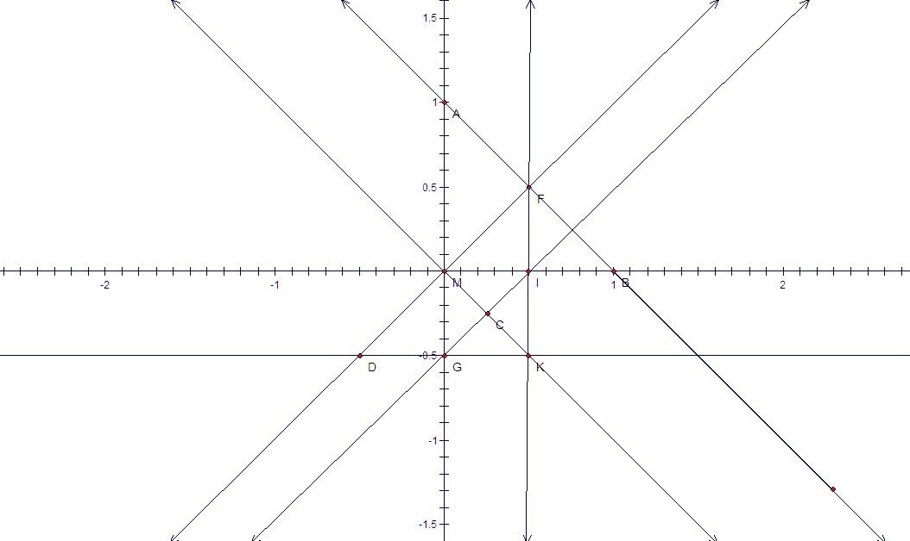   
13棵树问题的解（9行，包含无穷远直线）  
```bash
ABEFAGHMBIJMCEKMCGILDFLMDGJKEHJLFHIK
A(0,1) B(1,0) C(1/4,-1/4) D(-1/2,-1/2) E[1 : -1 : 0] F(1/2,1/2) G(0,-1/2) H[0 : 1 : 0] I(1/2,0) J[1 : 0 : 0] K(1/2,-1/2) L[1 : 1 : 0] M(0,0)
```

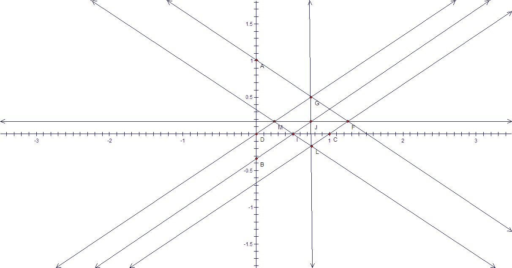  
14棵树问题的解（10行，包含无穷远直线）  
```bash
ABDEAFGHBIJNCDIKCFLNDGMNEGJLEHKNFJKMHILM
solve([-4/3+1*K_X,-8/3+1*L_X,+3+1*L_Y,+9/4+1*J_Y,+2+1*K_Y,+3/2+1*I_Y,+1+1*H_Y,-3+1*G_Y,+4+1*C_Y,+5+1*F_Y,-4/3+1*H_X,-8/3+1*C_X,-8/3+1*F_X,-4/3+1*E_X],[K_X,L_X,L_Y,J_Y,K_Y,I_Y,H_Y,G_Y,C_Y,F_Y,H_X,C_X,F_X,E_X]);
print("A_x=1 A_y=0 B=[1:0:0] D_x=0 D_y=0 E_y=0 G_x=0 I=[1:I_y:0] J=[1:J_y:0] M_x=0 M_y=1 N=[0:1:0] ");
```
后来，我们进一步提供了一种可以[只搜索包含线的数目比较多的方案]，再次加速了搜索过程，使得我们能够解决到[17棵树]的问题。

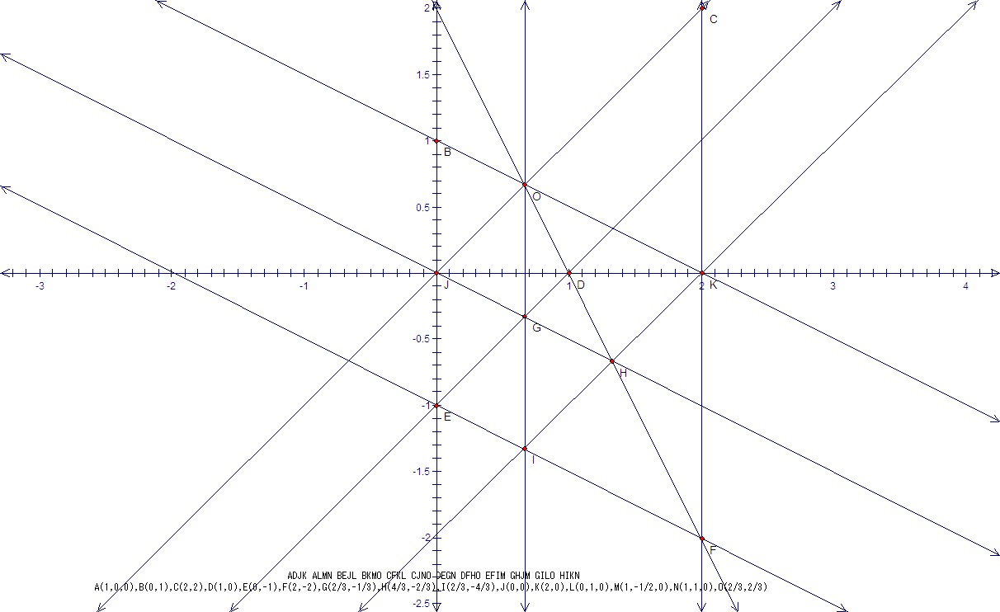   
[15棵树]问题的最优解  

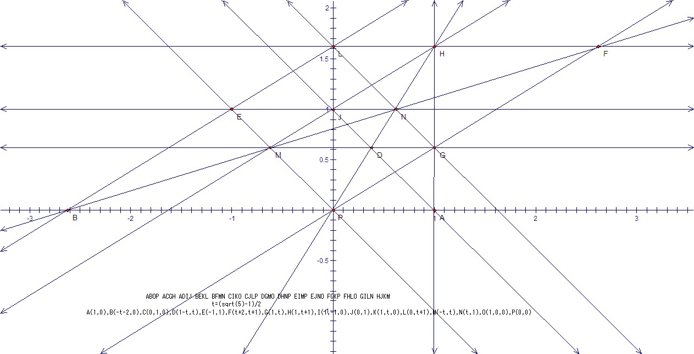   
[16棵树]问题的最优解

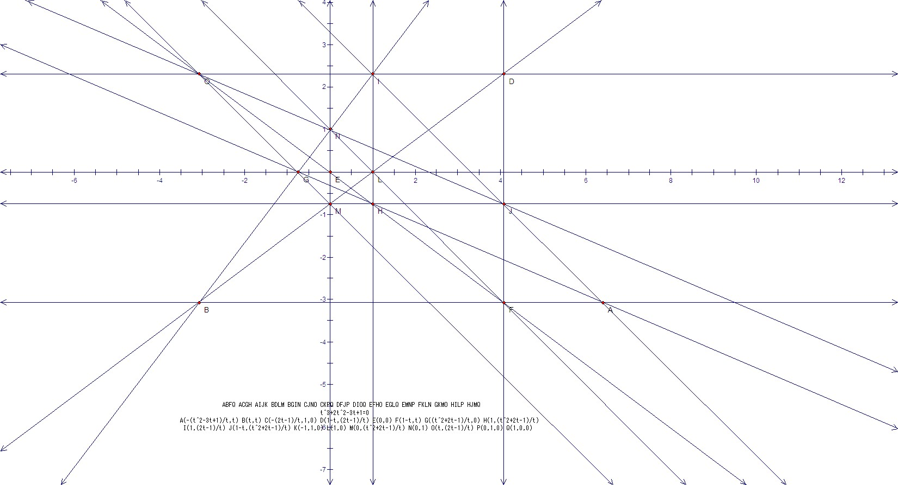  
[17棵树]问题的最优解

通过进一步找到了[一种更快速的部分判断识别一个点线关系是否存在合法的果树问题解的算法]，再次解决了[18棵树]和[19棵树]问题。

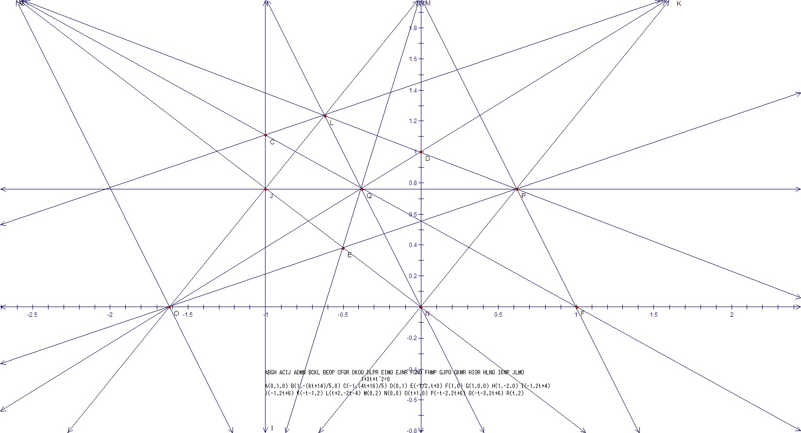  
[18棵树]问题的最优解

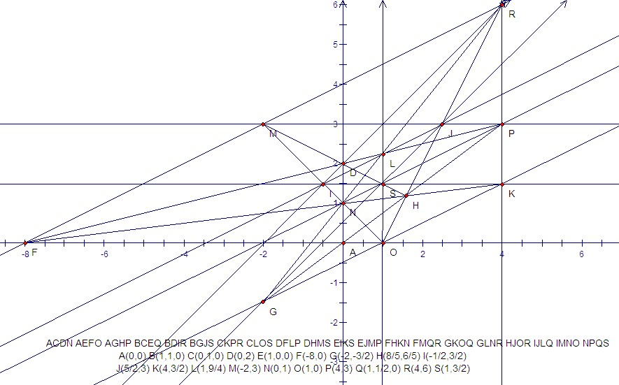   
[19棵树]问题最优解

然后[数学研发论坛上的网友一起合作]，利用十余人拥有的计算机资源共同计算，证明了20棵树不存在24行解，从而证明23行已经是最优结果。但是，由于拥有的计算资源还不够，我们还不能找出所有的23行解。  
2019年9月，我们重新运行了以前的代码，利用计算机又找出一种和上面两种方案都不等价的[新的23行解]。  

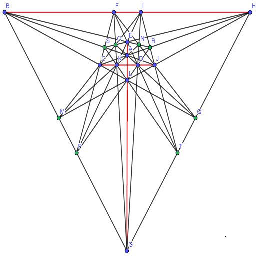

## 已知的20棵树23行解坐标如下:
### [解1]
```bash
print(ADGJBEIJCDHKAFIKCEGLBFHLCJMODINODLMPAHNPGKOPBGMQFJNQAEOQEHMRBKNRCFPRILQRABCSDEFSGHITJKLTMNST);
solve([+1+3*T_Y+1*T_Y*T_Y,-3/5+1*R_Y-2/5*T_Y,-4/5+1*R_X-1/5*T_Y,-3+1*H_X-1*T_Y,-4+1*P_X-1*T_Y,+1+1*S_X,-2+1*Q_X-1*T_Y,+2+1*O_X+1*T_Y,-1+1*L_Y-1*T_Y,+1+1*P_Y,-3+1*M_Y-2*T_Y,+1+1*D_Y+1*T_Y,-2+1*S_Y-1*T_Y,+1*G_Y-1*T_Y,-1+1*Q_Y,+1+1*N_Y,-2+1*C_Y-1*T_Y,-2+1*B_Y-1*T_Y,-1+1*O_Y,+1+1*H_Y,+2+1*C_X+1*T_Y,-2+1*N_X-1*T_Y,-1+1*L_X,-1+1*T_X,+2+1*M_X+1*T_Y,-2+1*F_X-1*T_Y],[T_Y,R_Y,R_X,H_X,P_X,S_X,Q_X,O_X,L_Y,P_Y,M_Y,D_Y,S_Y,G_Y,Q_Y,N_Y,C_Y,B_Y,O_Y,H_Y,C_X,N_X,L_X,T_X,M_X,F_X]);
print("A=[1:0:0] B_x=0 D=[1:D_y:0] E_x=0 E_y=1 F_y=0 G=[1:G_y:0] I_x=0 I_y=0 J=[0:1:0] K_x=1 K_y=0 ");
```
### [解2]
```bash
ACEFDFHJBCIJBEHKADIKBFGMEJLMBDLNCGNODEGPFKNPAJOPAGLQCKMQCHLRDMOREIQRAHNSFIOSBPQSGHITABRTCDST
+4/3+1*Ey,-1/2+1*Tx,+3+1*Py,+2+1*Qy,-5/2+1*Qx,+1/2+1*Rx,-3+1*Px,+3/2+1*Lx,-3/2+1*Mx,-2+1*Ry,+1+1*Oy,-2+1*Ly,+2+1*My,-3+1*Nx,+1+1*Ny,-2+1*Hy,-1+1*Ox,-1+1*Sx,-3+1*Kx,+1+1*Ay,+2+1*Ky,-3/2+1*Gx,-3/2+1*Bx,+1+1*Gy,-1+1*Ty,-1+1*Sy
Ey,Tx,Py,Qy,Qx,Rx,Px,Lx,Mx,Ry,Oy,Ly,My,Nx,Ny,Hy,Ox,Sx,Kx,Ay,Ky,Gx,Bx,Gy,Ty,Sy
Ax=1,Az=0,By=0,Bz=1,Cx=1,Cy=0,Cz=0,Dx=0,Dz=1,Dy=1,Dz=1,Ex=1,Ez=0,Fx=0,Fy=1,Fz=0,Hx=0,Hz=1,Ix=1,Iz=1,Iy=0,Iz=1,Jx=0,Jz=1,Jy=0,Jz=1,
```

### [解3]
```bash
print(BFHICDJKAEGLHJLMDGINAKMNFGKOCIMOEIKPBGMPBCLQFJNQADOQACHRBENRDLPRABJSEHOSCFPSDEFTGHQTIJRTKLST);
solve([+1-2*T_X+1*P_Y*T_X-2*T_X*T_X,+1*P_Y-1*T_X-1*T_X*T_X,+1*P_Y*P_Y+1*T_X-3*P_Y*T_X,+1*N_X-1*P_Y+1*T_X,-1+1*P_X+1*P_Y-1*T_X,-1+1*S_X+1*T_X,-1+1*S_Y-1*T_X,+1*Q_Y+1*T_X,-2+1*A_Y+1*P_Y-1*T_X,+1+1*L_Y-1*P_Y+1*T_X,+3+1*F_Y-1*P_Y+2*T_X,-1+1*N_Y+1*P_Y,-1+1*K_X+1*P_Y,+1*D_X-1*P_Y,-1+1*G_Y+1*P_Y,-1+1*E_X+1*T_X,-1+1*O_X+1*T_X,-1+1*B_Y+1*P_Y-1*T_X,-1+1*R_X,-1+1*A_X,-1+1*D_Y+1*P_Y,+1*G_X-1*T_X,+1*Q_X-1*T_X,-1+1*R_Y,-1+1*T_Y,+1*K_Y-1*P_Y,+1*E_Y-1*P_Y],[P_Y,T_X,N_X,P_X,S_X,S_Y,Q_Y,A_Y,L_Y,F_Y,N_Y,K_X,D_X,G_Y,E_X,O_X,B_Y,R_X,A_X,D_Y,G_X,Q_X,R_Y,T_Y,K_Y,E_Y]);
print("B=[1:B_y:0] C_x=1 C_y=0 F=[1:F_y:0] H=[0:1:0] I=[1:0:0] J_x=0 J_y=1 L_x=0 M_x=0 M_y=0 O_y=0 ");

```

点击链接可以查看部分[关键C++代码]。  

相关结果被收集到OEIS: [A006065] [A172992] [A172993]  

# 理论上下界分析
对于每一棵果树，如果经过这棵果树存在k行，每行4棵，那么这k行除了这棵公共果树，其余果树都互不相同，所以我们得出$3k\le n-1$,n是树的总数。  
累加所有果树的结果，这种计数方法将每行都重复统计四次，所以总行数最终不会超过$\lfloor\frac{(n-1)n}{12}\rfloor$。shengjianguo进一步指出，根据[单壿著的《组合几何》的结果]，可以得出总行数不超过$\lfloor\frac{(n+2)(n-3)}{14}\rfloor$。  

射影平面上一条直线方程可以表示为$ax+by+cz=0$,表示其中点[x : y : z] 满足直线[a: b: c]对应的方程。但是反过来，我们也可以把$ax+by+cz=0$看成经过点[a : b: c]的所有直线满足的方程。于是在这种意义下，[x : y : z]需要被看成直线的坐标（或者说对应直线方程的系数），而[a : b: c]被看成一个点。射影几何里面把上述两种看法称为互为对偶。  
于是在对偶意义下，一个点被看成直线，直线被看成点；经过一个点的直线被看成一条直线上一点；两条直线的交点被看成过两点的一条直线。  
于是果树种植问题的对偶问题就是如何找出n条直线，使得其中正好有k条直线经过的点尽量多。而对于k=4时，如果我们使用$m\times m$的标准网格以及它们构成小正方形中对角线的连线共6m-2条直线，那么除了大正方形四个顶点意外，所有其它交点都正好有四条直线经过。于是我们可以使用6m-2条直线构造出了$m^2-4$个正好4条直线经过的点。由于我们给出了k=4的果树问题的一种下界，不少于$\frac{n^2}{36}+O(n)$。考虑到这种方案中，靠近大正方形四个角的一些斜线经过的点比较少，利用率不高，去除这些斜线可以得出一个八边形模型，可以使用$14m+O(1)$条直线得出$7m^2+O(m)$个四条直线经过的交点，由此我们得出了对于k=4的果树问题的下界不小于$\frac{n^2}{24}+O(n)$.  
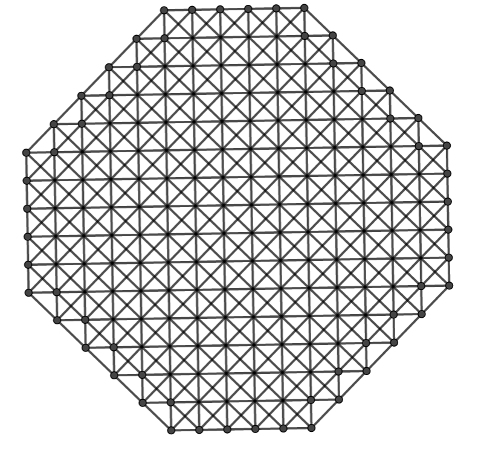  

<a name="table"></a>  
另外根据现在我们已经知道数据，我们可以猜测k=4的果树问题的数目不小于$\lfloor\frac{(n-1)(n-3)}{14}\rfloor$.  

| n | 实数范围[A006065] | 整数范围[A172992] | 复数范围[A172993] | $\lfloor\frac{(n-1)(n-3)}{14}\rfloor$|
|---|------------------|------------------|------------------|------------------|
| 4 |         1        |         1        |         1        |         0        |
| 5 |         1        |         1        |         1        |         0        |
| 6 |         1        |         1        |         1        |         1        |
| 7 |         2        |         2        |         2        |         1        |
| 8 |         2        |         2        |         2        |         2        |
| 9 |         3        |         3        |         3        |         3        |
|10 |         5        |         5        |         5        |         4        |
|11 |         6        |         6        |         6        |         5        |
|12 |         7        |         7        |         9        |         7        |
|13 |         9        |         9        |         9        |         8        |
|14 |        10        |        10        |        11        |        10        |
|15 |        12        |        12        |        13        |        12        |
|16 |        15        |        14        |        15        |        13        |
|17 |        16        |        15        |        17        |        16        |
|18 |        18        |        17        |        18        |        18        |
|19 |        20        |        20        |        20        |        20        |
|20 |        23        |        23        |        23        |        23        |
|21 |      $\ge 24$    |      $\ge 24$    |      $\ge 24$    |        25        |
|22 |      $\ge 28$    |      $\ge 26$    |      $\ge 28$    |        28        |
|23 |      $\ge 28$    |      $\ge 28$    |      $\ge 28$    |        31        |
|24 |      $\ge 30$    |      $\ge 30$    |      $\ge 33$    |        34        |
|25 |      $\ge 32$    |      $\ge 32$    |      $\ge 35$    |        37        |

# 每行四棵最优解完整列表
8棵树一下由于太简单了，这里就不列出了。  
下面列表或附件中每三行代表一组解，其中第一行是点线关系，每四个字母代表一行。第二行是一个需要求解的方程组，里面各个用','相隔的表达式都要求等于0。而第三行包含一些已知坐标。比如A=(1,A\_y,0) 代表A是一个无穷远点，方向A\_y需要从方程组求解。由于我们的代码还不能完全求解所有方程组，所以列表中可能会包含一些非法情况，比如方程组无解，或解得结果存在五点以上共线的情况等等，需要我们事后再次淘汰。而所有这些解中都把其中某一行果树投影到无穷远直线，如果需要产生果树没有投影到无穷远点的图，需要自己做额外的射影变换。  

比如9棵树3行的所有解只有一类，由于含有两个参数，在射影变换等价的意义下有无穷组解  
```bash
print(ABGHCDGIEFHI);
solve([],[]);
print("A=(1,A_y,0) B=(1,B_y,0) C_x=0 C_y=1 D_x=0 E_x=1 E_y=0 F_y=0 G=(0,1,0) H=(1,0,0) I_x=0 I_y=0 ");
```
其中第二行全空代表已经没有额外约束条件，所以包含两个自由参数A\_y和B\_y。 

10棵树5行也只有一类，含两个自由参数  
```bash
print(ABCDAEFGBEHICFHJDGIJ);
solve([+1*D_Y-1*D_Y*I_X-1*J_Y-1*D_Y*J_Y,+1*G_Y+1*D_Y*I_X,-1+1*J_X+1*J_Y,+1+1*C_Y],[D_Y,G_Y,I_X,J_Y,J_X,C_Y]);
print("A=(0,1,0) B=(1,0,0) C=(1,C_y,0) D=(1,D_y,0) E_x=0 E_y=0 F_x=0 F_y=1 G_x=0 H_x=1 H_y=0 I_y=0 ");
```
从上面方程组我们可以手工解得C\_Y = -1, J\_X = 1 - J\_Y, G\_Y = -D\_Y\*I\_X, D\_Y = J\_Y / (1 - I\_X)

11棵树6行也只有一类，含两个自由参数：
```bash
print(ABCJADEKBFGKCHIKDFHJEGIJ);
solve([+1-1*K_X+1*I_Y*K_X,+1*D_Y-1*E_Y-1*D_Y*K_X,+1*A_Y+1*D_Y-1*E_Y,+1+1*H_Y-1*I_Y,-1+1*I_X,-1+1*E_X],[D_Y,E_Y,I_Y,K_X,A_Y,H_Y,I_X,E_X]);
print("A_x=0 B_x=0 B_y=0 C_x=0 C_y=1 D=(1,D_y,0) F=(1,0,0) G_x=1 G_y=0 H=(1,H_y,0) J=(0,1,0) K_y=0 ");
```

12棵树时，开始出现复杂的情况了，
首先，我们原先球的在复数范围中得出两种点线关系不同的8行的情况，不含自由参数
```bash
print(ABCDAEFGAHIJBEHKBFILCEJLCGIKDFJKDGHL);
solve([+1-1*L_X+1*L_X*L_X,-1+1*K_X+1*L_X,-1+1*J_Y+1*L_X,+1*G_Y-1*L_X,-1+1*C_Y+1*L_X,-1+1*J_X,-1+1*I_X,-1+1*L_Y,+1*D_Y+1*L_X,-1+1*I_Y],[L_X,K_X,J_Y,G_Y,C_Y,J_X,I_X,L_Y,D_Y,I_Y]);
print("A=(0,1,0) B=(1,0,0) C=(1,C_y,0) D=(1,D_y,0) E_x=0 E_y=0 F_x=0 F_y=1 G_x=0 H_x=1 H_y=0 K_y=0 ");

print(AEFGAHIJBEHKBFILCEJLCGIKDFJKDGHL);
solve([+1-1*L_Y+1*L_Y*L_Y,-1+1*C_Y,+1*C_X+1*L_Y,-1+1*K_Y+1*L_Y,-1+1*L_X+1*L_Y,-1+1*D_Y,+1+1*J_Y-1*L_Y,+1+1*I_Y,-1+1*G_X+1*L_Y,-1+1*D_X+1*L_Y],[L_Y,C_Y,C_X,K_Y,L_X,D_Y,J_Y,I_Y,G_X,D_X]);
print("A=(1,0,0) B_x=0 B_y=1 E_x=0 E_y=0 F_x=1 F_y=0 G_y=0 H=(0,1,0) I=(1,I_y,0) J=(1,J_y,0) K_x=0 ");
```
但是在2019年10月发现在[复数范围12棵树可以达到9行]，而这个解[以前被maxima错误过滤]了
```bash
        Parameter [+1+1*t+1*t^2=0]
        A[0 ,+1 , 0]
        B[+1 ,0 , 0]
        C[+1 ,+1+1*t , 0]
        D[+1 ,+1*t , 0]
        E[0 ,0 , +1]
        F[0 ,+1 , +1]
        G[0 ,-1*t , +1]
        H[+1 ,0 , +1]
        I[+1 ,+1 , +1]
        J[+1 ,+1+1*t , +1]
        K[+1+1*t ,0 , +1]
        L[-1*t ,+1 , +1]
ABCDAEFGAHIJBEHKBFILCEJLCGIKDFJKDGHL
```

齐次在实数或整数范围可以有两种不同点线关系达到7行，分别含有一个和两个自由参数:
```bash
print(AHIJBCHKBDILCEJLDGJKEFIKFGHL);
solve([+1*D_X-1*K_Y,-1+1*E_X+1*K_Y,+1+1*G_Y-1*K_Y,+1+1*J_Y,+1*F_Y-1*K_Y,+1*E_Y-1*K_Y,-1+1*F_X,-1+1*G_X],[D_X,E_X,G_Y,J_Y,F_Y,E_Y,F_X,G_X]);
print("A=(1,A_y,0) B_x=0 B_y=0 C_x=0 C_y=1 D_y=0 H=(0,1,0) I=(1,0,0) J=(1,J_y,0) K_x=0 L_x=1 L_y=0 ");
print(ABIJACDKBEFLCGILDHJLEHIKFGJK);
solve([+1*F_Y-1*K_Y+1*E_X*K_Y,-1+1*B_X+1*F_Y,+1*F_X+1*F_Y-1*K_Y,+1*G_X-1*K_Y,+1*H_Y+1*K_Y,+1+1*J_Y,+1*E_Y-1*F_Y,+1*B_Y-1*F_Y],[E_X,F_Y,K_Y,B_X,F_X,G_X,H_Y,J_Y,E_Y,B_Y]);
print("A_x=0 A_y=1 C_x=0 C_y=0 D=(0,1,0) G_y=0 H=(1,H_y,0) I_x=1 I_y=0 J=(1,J_y,0) K_x=0 L=(1,0,0) ");
```

13棵树9行还留下不超过6种模式（还需要再验算一下是否每种都是合法的），其中第二种有整数解:
```bash
print(ADEFAGHIBDGJBHKLCDKMCEILEHJMFGLMFIJK);
solve([+1+1*M_Y+1/2*M_Y*M_Y,+2+1*L_Y+2*M_Y,+1+1*K_X,-1+1*L_X-1*M_Y,+1+1*B_X+1*M_Y,+2+1*C_Y+1*M_Y,-1+1*C_X-1*M_Y,-1+1*I_X-1*M_Y,+1*K_Y+1*M_Y,+1+1*H_Y,+1*I_Y+1*M_Y,+1*F_Y+1*M_Y],[M_Y,L_Y,K_X,L_X,B_X,C_Y,C_X,I_X,K_Y,H_Y,I_Y,F_Y]);
print("A_x=0 A_y=1 B_y=0 D_x=0 D_y=0 E=(0,1,0) F_x=0 G_x=1 G_y=0 H=(1,H_y,0) J=(1,0,0) M=(1,M_y,0) ");
print(ABEFAGHMBIJMCEKMCGILDFLMDGJKEHJLFHIK);
solve([+2+1*L_Y,+1+1*L_X,-4+1*C_Y,-3+1*G_Y,-2+1*K_Y,+4+1*D_Y,+1+1*J_Y,-1+1*K_X,-1+1*H_Y,-1+1*C_X,+1+1*D_X,+1+1*F_X],[L_Y,L_X,C_Y,G_Y,K_Y,D_Y,J_Y,K_X,H_Y,C_X,D_X,F_X]);
print("A=(1,0,0) B_x=0 B_y=0 E_x=1 E_y=0 F_y=0 G=(1,G_y,0) H=(1,H_y,0) I_x=0 I_y=1 J_x=0 M=(0,1,0) ");
print(BCDEBFGHBIJKCFILCGJMDFKMDHJLEGKLEHIM);
solve([+1-1*M_X+1*M_X*M_X,-1+1*L_X+1*M_X,-1+1*K_Y+1*M_X,+1*H_Y-1*M_X,-1+1*D_Y+1*M_X,-1+1*K_X,-1+1*J_X,-1+1*M_Y,+1*E_Y+1*M_X,-1+1*J_Y],[M_X,L_X,K_Y,H_Y,D_Y,K_X,J_X,M_Y,E_Y,J_Y]);
print("B=(0,1,0) C=(1,0,0) D=(1,D_y,0) E=(1,E_y,0) F_x=0 F_y=0 G_x=0 G_y=1 H_x=0 I_x=1 I_y=0 L_y=0 ");
print(AEFGAHIMBEHJBFKMCELMCGIKDGJMDHKLFIJL);
solve([+1+1*L_Y-1*L_Y*L_Y,+1+1*D_Y-1*L_Y,-1+1*C_Y-1*L_Y,+2+1*H_Y-1*L_Y,+1+1*J_Y,-1+1*B_Y+1*L_Y,+1*L_X+1*L_Y,-1+1*J_X,+1*E_X+1*L_Y,+1*C_X+1*L_Y,-1+1*D_X,+1+1*I_Y],[L_Y,D_Y,C_Y,H_Y,J_Y,B_Y,L_X,J_X,E_X,C_X,D_X,I_Y]);
print("A=(1,0,0) B_x=0 E_y=0 F_x=0 F_y=0 G_x=1 G_y=0 H=(1,H_y,0) I=(1,I_y,0) K_x=0 K_y=1 M=(0,1,0) ");
print(ABLMAFGHBIJKCFILCGJMDFKMDHJLEGKLEHIM);
solve([+1+1*M_Y+1*M_Y*M_Y,+1+1*K_X+1*M_Y,+1/3+1*B_Y-1/3*M_Y,+1+1*D_X,+1*E_X+1*M_Y,+1*J_X-1*M_Y,-1+1*C_X-1*M_Y,+1*D_Y+1*M_Y,-1+1*E_Y,-1+1*K_Y,+1*J_Y+1*M_Y,+1*H_Y+1*M_Y],[M_Y,K_X,B_Y,D_X,E_X,J_X,C_X,D_Y,E_Y,K_Y,J_Y,H_Y]);
print("A=(0,1,0) B=(1,B_y,0) C_y=0 F_x=0 F_y=0 G_x=0 G_y=1 H_x=0 I_x=1 I_y=0 L=(1,0,0) M=(1,M_y,0) ");
print(ABKLAGHMBIJMCDKMCGILDHJLEFLMEHIKFGJK);
solve([+1-1*K_X*K_X,-1+1*F_Y+1*K_X,-1+1*D_Y+1*K_X,+1+1*E_Y-1*K_X,+1+1*C_Y-1*K_X,+1*I_Y-1*K_X,-1+1*E_X,-1+1*F_X,+1*G_Y+1*K_X,+1*C_X-1*K_X,+1+1*H_Y,+1*D_X-1*K_X],[K_X,F_Y,D_Y,E_Y,C_Y,I_Y,E_X,F_X,G_Y,C_X,H_Y,D_X]);
print("A=(1,0,0) B_x=0 B_y=0 G=(1,G_y,0) H=(1,H_y,0) I_x=0 J_x=0 J_y=1 K_y=0 L_x=1 L_y=0 M=(0,1,0) ");
```

14棵以上候选解太多了，如有需要请下载：  
<a name=fulllist></a>  
所有数据[openf4](https://github.com/nauotit/openf4) 有限域处理结果[click to download all best result candidates from 12 to 18 trees](../attached/ocdrst.tgz) 

# 其它优秀解
<a name=others></A>
2019年11月29日发现24棵33行的复数解:  
```bash
print(ABGIAFHLBCHJCDIKDEJLEFGKAMOSBNPTCOQUDPRVEMQWFNRXAKRTBLMUCGNVDHOWEIPXFJQSGRSUHMTVINUWJOVXKPSWLQTXGJMPHKNQILORACWXAEUVBDSXBFVWCESTDFTU);
solve([+1-3*X_Y+3*X_Y*X_Y,+2/7+1*Q_Y-12/7*X_Y,+1*J_X-2*X_Y,-8/7+1*Q_X+6/7*X_Y,-2/3+1*S_X,-1/2+1*R_Y-1/2*X_Y,-1+1*V_X+1*X_Y,+1*T_Y-3/2*X_Y,+1*D_X-1*X_Y,-3/2+1*N_X+3/2*X_Y,-1/2+1*P_X-1/2*X_Y,+1*U_Y-2*X_Y,+3+1*G_Y-3*X_Y,+1/2+1*K_Y-3/2*X_Y,-1+1*I_Y+3*X_Y,-1/2+1*T_X,-2/3+1*O_Y,+1+1*E_Y-3*X_Y,-2/3+1*O_X,+1*M_Y-2*X_Y,+1*P_Y-3/2*X_Y,-2/3+1*M_X,-1+1*W_X,-1+1*X_X,-1+1*U_X+1*X_Y,-1+1*E_X+1*X_Y,+1*D_Y-1*X_Y,+1*S_Y-1*X_Y,-1+1*W_Y,-1+1*V_Y,+1*N_Y-3/2*X_Y,+1*L_Y-2*X_Y,-1/2+1*R_X,-1/2+1*K_X],[X_Y,Q_Y,J_X,Q_X,S_X,R_Y,V_X,T_Y,D_X,N_X,P_X,U_Y,G_Y,K_Y,I_Y,T_X,O_Y,E_Y,O_X,M_Y,P_Y,M_X,W_X,X_X,U_X,E_X,D_Y,S_Y,W_Y,V_Y,N_Y,L_Y,R_X,K_X]);
print("A=(0,1,0) B=(1,0,0) C_x=1 C_y=0 F_x=0 F_y=1 G=(1,G_y,0) H_x=0 H_y=0 I=(1,I_y,0) J_y=0 L_x=0 ");
```
26棵树35行的复数解:
```bash
        Parameter [+1-1*t+2*t^2-2*t^3+1*t^4=0]                                                                                                   A[+1 ,0 , +1]
        B[+1*t ,-1*t , +1]
        C[-1*t^3 ,+1+1*t^2+1*t^3 , +1]
        D[+1-1*t+1*t^2-1*t^3 ,+1+1*t^3 , +1]
        E[+1 ,+1*t-1*t^2+1*t^3 , +1]
        F[+1*t ,0 , +1]
        G[-1*t^3 ,+1*t^3 , +1]
        H[+1-1*t+1*t^2-1*t^3 ,+1*t^3 , +1]
        I[+1 ,-1*t^2+1*t^3 , +1]
        J[+1*t ,-1*t^2+1*t^3 , +1]
        K[-1*t^3 ,+1+1*t^2 , +1]
        L[+1-1*t+1*t^2-1*t^3 ,+1*t-1*t^2+1*t^3 , +1]
        M[+1 ,-1+1*t-1*t^2+1*t^3 , 0]
        N[0 ,+1 , +1]
        O[+1*t^2-1*t^3 ,+1-1*t+1*t^2 , +1]
        P[+1*t-1*t^2 ,+1*t^2 , +1]
        Q[+1 ,-1+1*t-2*t^2+1*t^3 , 0]
        R[0 ,+1-1*t+1*t^2 , +1]
        S[+1*t^2-1*t^3 ,+1*t^3 , +1]
        T[+1*t-1*t^2 ,+1*t-1*t^2+1*t^3 , +1]
        U[+1 ,0 , 0]
        V[0 ,0 , +1]
        W[+1*t^2-1*t^3 ,-1*t^2+1*t^3 , +1]
        X[+1*t-1*t^2 ,+1-1*t+1*t^2 , +1]
        Y[0 ,+1 , 0]
AEIYBFJYCGKYDHLYMQUYNRVYOSWYPTXYABMOALNXBCNPCDOQDEPREFQSFGRTGHSUHITVIJUWJKVXKLMWAFUVAHPQBGVWBIQRCHWXCJRSDIMXDKSTEJMNELTUFKNOGLOPMPSVNQTWORUX
```
21棵树24行整数解例子:  
  
```bash
	A(1/4,+1)
        B(+1,2/3)
        C(3/2,4)
        D(+0,+1)
        E(+1,+0)
        F[+1,8/3,0];
        G[+1,-4/3,0];
        H(-1/2,+0)
        I(+0,-2)
        J(-1/2,2/3)
        K(-1/2,-2)
        L(3/2,-2)
        M(1/2,4/3)
        N(3/4,+1)
        O(+1,2)
        P(1/2,2)
        Q(1/2,2/3)
        R(3/2,2)
        S[+0,+1,0];
        T(+0,+0)
        U[+1,+0,0];
HJKSGJLTIKLUFGSUDISTEHTUBFIRAEGQCDHPBEOSADNUCFMTCLRSBJQUAKPTDJMRFKOQELNPCINOAHMOBGMNMPQSOPRUNQRT
```
转载自[efriedma](https://www2.stetson.edu/~efriedma/trees) 网站的22棵26行整数解
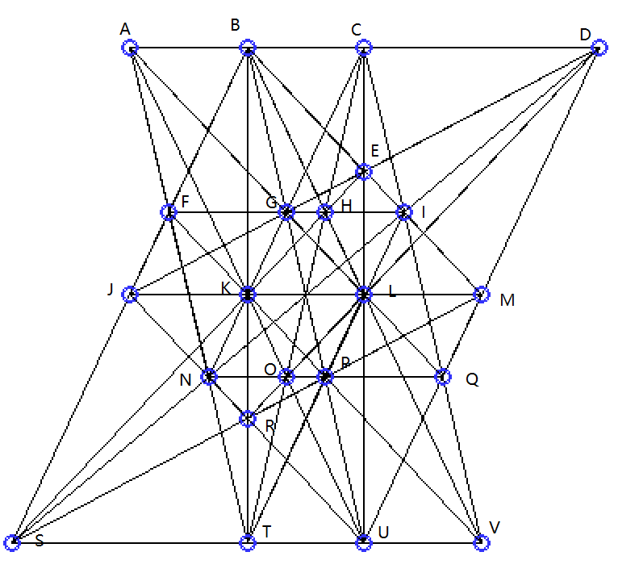  
(需要注意下面数据和图中坐标不匹配，下面数据将AKQU映射为无穷远直线）
```bash
        A[+1,1/3,0];
        B(+0,+0)
        C(+1,1/3)
        D(3/2,1/2)
        E(4/3,1/3)
        F(4,2)
        G(+1,+0)
        H(4/3,2/9)
        I(8/5,2/5)
        J(2,+1)
        K[+0,+1,0];
        L(2,1/3)
        M(2,1/2)
        N(+1,+1)
        O[+1,-1/3,0];
        P(4,+0)
        Q(5/2,1/2)
        R(+0,+1)
        S(4/3,2/3)
        T(+0,2/3)
        U[+1,+0,0];
        V(4,2/3)
ABCDAGLQAKOUAFNTBFJSBKRTBGPUBHLVBEIMCGKNCHOTCELUCIQVDEGJDINSDLORDMQUEHKSFGHIFKPVILPTJKLMJNRUMPRSNOPQSTUV
```

2019年12月6日发现22棵28行实数解  
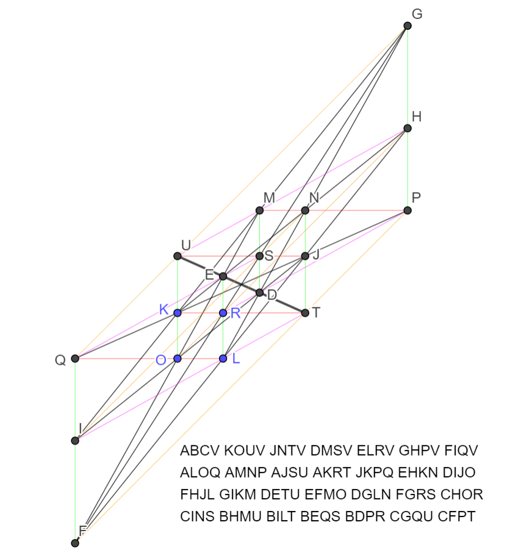  
```bash
        [+1*t^3+6*t^2+5*t+1]
        A[+1,+0,0];
        B[+1,1*t-2*(1*t^2+6*t+3)+2,0];
        C[+1,+1,0];
        D(-1*(1*t^2+6*t+3),-1*t+2*(1*t^2+6*t+3))
        E(+1,-1*(1*t^2+6*t+3))
        F(1*t-1*(1*t^2+6*t+3)+1,1*t+1)
        G(-t,-2*t+1*(1*t^2+6*t+3)-1)
        H(-t,-t)
        I(1*t-1*(1*t^2+6*t+3)+1,(1*t^2+6*t+3))
        J(-1*(1*t^2+6*t+3)+1,-1*t+1*(1*t^2+6*t+3)-1)
        K(+0,+1)
        L(+1,+0)
        M(-1*(1*t^2+6*t+3),-1*t+1*(1*t^2+6*t+3))
        N(-1*(1*t^2+6*t+3)+1,-1*t+1*(1*t^2+6*t+3))
        O(+0,+0)
        P(-t,-1*t+1*(1*t^2+6*t+3))
        Q(1*t-1*(1*t^2+6*t+3)+1,+0)
        R(+1,+1)
        S(-1*(1*t^2+6*t+3),-1*t+1*(1*t^2+6*t+3)-1)
        T(-1*(1*t^2+6*t+3)+1,+1)
        U(+0,-1*t+1*(1*t^2+6*t+3)-1)
        V[+0,+1,0];
ABCVKOUVJNTVDMSVELRVGHPVFIQVALOQAMNPAJSUAKRTJKPQEHKNDIJOFHJLGIKMDETUEFMODGLNFGRSCHORCINSBHMUBILTBEQSBDPRCGQUCFPT
```

2019年12月10日发现25棵35行复数解  
```bash
        [+1*t^4+4*t^3+8*t^2+5*t+1]
        A(-2*t^3 - 7*t^2 - 12*t - 3,t^3 + 4*t^2 + 7*t + 3)
        B(-2*t^3 - 7*t^2 - 12*t - 4,t^2 + t + 1)
        C(-t^3 - 4*t^2 - 8*t - 3,-t^3 - 4*t^2 - 6*t - 1)
        D(-2*t^3 - 7*t^2 - 12*t - 4,-t)
        E(+1,+0)
        F(+1, -t^3 - 4*t^2 - 7*t - 2)
        G(-t^3 - 4*t^2 - 8*t - 3, -t^3 - 4*t^2 - 7*t - 2)
        H(+1,t+1)
        I(-2*t^3 - 7*t^2 - 12*t - 3,+0)
        J(-t^3 - 4*t^2 - 8*t - 3,t+1)
        K(-2*t^3 - 7*t^2 - 12*t - 3, -t^3 - 3*t^2 - 5*t - 1)
        L(-2*t^3 - 7*t^2 - 12*t - 4, -t^3 - 3*t^2 - 5*t - 1)
        M[+1,+0,0];
        N(-3*t^3 - 11*t^2 - 20*t - 7,+1)
        O(-2*t^3-7*t^2-13*t-4,+1)
        P(+0,+1)
        Q[+1,t^3 + 3*t^2 + 6*t + 2,0];
        R[+1,t,0];
        S(-2*t^3-7*t^2-13*t-4,1*t^3+3*t^2+5*t+2)
        T(+0,-2*t^3-7*t^2-13*t-4)
        U(+0,+0)
        V(-3*t^3 - 11*t^2 - 20*t - 7,t+1)
        W(-2*t^3-7*t^2-13*t-4, -t^3 - 4*t^2 - 7*t - 2)
        X(-3*t^3 - 11*t^2 - 20*t - 7, -t^3 - 3*t^2 - 5*t - 1)
        Y[+0,+1,0];
EFHYCGJYAIKYBDLYMQRYPTUYNVXYOSWYFGMWKLMXHJMVEIMUHKUWCLVWBCSTADUXEJRSFKQTEGQXDIRVILNTFIPSGLOUAEOTBKPVDJPWBJOXDGNSAHPRCFNRCHOQABNQMNOPRTWXQSUV
```

[B. Grunbaum和Sloane]: http://neilsloane.com/doc/ORCHARD/orchard.html
[G. Ben和陶哲轩]: https://arxiv.org/abs/1208.4714
[射影几何简介]: https://bbs.emath.ac.cn//thread-2117-1-1.html
[Orchard Planting Problem]: http://mathworld.wolfram.com/Orchard-PlantingProblem.html
[果树问题]: https://en.wikipedia.org/wiki/Orchard-planting_problem
[每行3棵树]: https://oeis.org/A003035
[Xianzu Lin]: http://oeis.org/A006065/a006065.gif
[王兴君]: http://www.eol.cn/zheng_ming_1877/20060309/t20060309_166193.shtml
[黄阳阳]: https://bbs.emath.ac.cn/thread-1418-1-1.html
[最多只能种植23行]: https://bbs.emath.ac.cn/thread-2007-1-1.html
[新的23行解]: https://bbs.emath.ac.cn/forum.php?mod=redirect&goto=findpost&ptid=3953&pid=81177&fromuid=20
[一些漂亮的图片]: https://bbs.emath.ac.cn/thread-3953-1-1.html
[随机投影]: https://bbs.emath.ac.cn/forum.php?mod=redirect&goto=findpost&ptid=3953&pid=41123&fromuid=20
[算法总体介绍]: https://bbs.emath.ac.cn/forum.php?mod=redirect&goto=findpost&ptid=703&pid=8670&fromuid=20
[无法保证一定存在对应的果树问题解]: https://bbs.emath.ac.cn/thread-703-1-1.html
[13棵树]: https://bbs.emath.ac.cn/forum.php?mod=redirect&goto=findpost&ptid=703&pid=8917&fromuid=20
[14棵树]: https://bbs.emath.ac.cn/forum.php?mod=redirect&goto=findpost&ptid=703&pid=9023&fromuid=20
[只搜索包含线的数目比较多的方案]: https://bbs.emath.ac.cn/forum.php?mod=redirect&goto=findpost&ptid=703&pid=11859&fromuid=20
[15棵树]: https://bbs.emath.ac.cn/forum.php?mod=redirect&goto=findpost&ptid=703&pid=11143&fromuid=20
[16棵树]: https://bbs.emath.ac.cn/forum.php?mod=redirect&goto=findpost&ptid=703&pid=11188&fromuid=20
[17棵树]: https://bbs.emath.ac.cn/forum.php?mod=redirect&goto=findpost&ptid=703&pid=11837&fromuid=20
[一种更快速的部分判断识别一个点线关系是否存在合法的果树问题解的算法]: https://bbs.emath.ac.cn/forum.php?mod=redirect&goto=findpost&ptid=703&pid=23066&fromuid=20
[18棵树]: https://bbs.emath.ac.cn/forum.php?mod=redirect&goto=findpost&ptid=703&pid=16447&fromuid=20
[19棵树]: https://bbs.emath.ac.cn/forum.php?mod=redirect&goto=findpost&ptid=703&pid=17544&fromuid=20
[数学研发论坛上的网友一起合作]: https://bbs.emath.ac.cn/thread-2007-1-1.html
[解1]: https://bbs.emath.ac.cn/forum.php?mod=redirect&goto=findpost&ptid=3953&pid=41115&fromuid=20
[解2]: https://bbs.emath.ac.cn/forum.php?mod=redirect&goto=findpost&ptid=3953&pid=41141&fromuid=20
[解3]: https://bbs.emath.ac.cn/forum.php?mod=redirect&goto=findpost&ptid=3953&pid=81167&fromuid=20
[关键C++代码]: https://bbs.emath.ac.cn/forum.php?mod=redirect&goto=findpost&ptid=703&pid=9077&fromuid=20
[A006065]: https://oeis.org/A006065
[A172992]: https://oeis.org/A172992
[A172993]: https://oeis.org/A172993
[单壿著的《组合几何》的结果]: https://bbs.emath.ac.cn//forum.php?mod=redirect&goto=findpost&ptid=703&pid=20028&fromuid=20
[复数范围12棵树可以达到9行]: https://bbs.emath.ac.cn/forum.php?mod=redirect&goto=findpost&ptid=703&pid=81616&fromuid=20
[以前被maxima错误过滤]: https://bbs.emath.ac.cn/forum.php?mod=redirect&goto=findpost&ptid=703&pid=8904&fromuid=20
