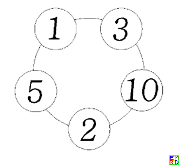
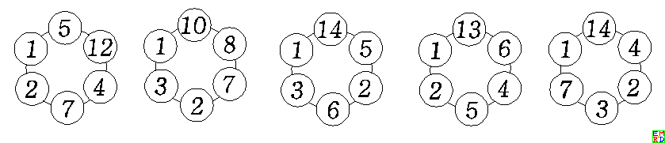

#摘要
[TSC999在2019年2月提问](https://bbs.emath.ac.cn/thread-15728-1-1.html) :  
  
上图表示一个穿有五颗珠子的手串。每颗珠子上刻着一个数字，它们从小到大依次是 1、2、3、5、10。
两颗相邻珠子上的数字之和是 4、6、7、12、13。
三颗相邻珠子上的数字之和是 8、9、14、15、17。
四颗相邻珠子上的数字之和是 11、16、18、19、20。
五颗珠子上的数字之和是 21。

以上五组数字从小到大排列起来，是：1、2、3、4、5、6、7、8、9、10、11、12、13、14、15、16、17、18、19、20、21。
从 1 到 21，不重复也不遗漏！

问题来了： 如果手串是由六颗珠子穿成的，每颗珠子上也都刻有数字（其中一颗上刻的是 1），并且满足上述特性，那么这些数字是什么？ 
它们在手串上是如何排列的？

对于六颗珠子的手串，本问题有解吗？

大家踊跃参与，最好搜索到了17棵珠子的结果并且定位到了[OEIS中perfect different set](http://oeis.org/A058241) ,并且和有限射影平面关联起来，得到不错的结果。

#开始搜索
在问题提出的次日，TSC999[用VB搜索出了所有的六颗珠子手串](https://bbs.emath.ac.cn/forum.php?mod=redirect&goto=findpost&ptid=15728&pid=77478&fromuid=20) ，其结果如果考虑其中一颗珠子上是数字 1，其余珠子上的数字假定是 x，y，z，u，v。  
程序运行结果是：  
k=1,x=2,y=5,z=4,u=6,v=13  
k=1,x=2,y=7,z=4,u=12,v=5  
k=1,x=3,y=2,z=7,u=8,v=10  
k=1,x=3,y=6,z=2,u=5,v=14  
k=1,x=5,y=12,z=4,u=7,v=2  
k=1,x=7,y=3,z=2,u=4,v=14  
k=1,x=10,y=8,z=7,u=2,v=3  
k=1,x=13,y=6,z=4,u=5,v=2  
k=1,x=14,y=4,z=2,u=3,v=7  
k=1,x=14,y=5,z=2,u=6,v=3  

【说明】程序给出了 10 个解答，但是其中 5 个是从手串背面观察的，手串翻转过来将与另 5 个解答相同。  
 因此真正的解答只有 5 组，见下图：  
   
 并且他提供了[对应的VB代码](../attached/perfectsum/tsc999.txt) 。  
 
 [wayne很快予以确认的确只有五组解](https://bbs.emath.ac.cn/forum.php?mod=redirect&goto=findpost&ptid=15728&pid=77487&fromuid=20) ，并且提供了TSC999需要的效率更高的Mathematica代码  
 ```bash
 n=6;
arr=a/@Range[n];
target=Flatten[{Total[arr],Table[Total[RotateLeft[arr,i][[1;;k]]],{i,0,n-1},{k,1,n-1}]}];
data=Subsets[Range[n (n-1)]+2,{n-2}];
Monitor[Reap[Timing[Do[tmp=Select[Permutations[Join[{2},data[[i]]]],Length[Tally[Differences[Sort[target/.Thread[arr->Join[{1},#]]]]]]==1&];If[Length[tmp]>0,Sow[tmp]],{i,Length[data]}]]],{i,Length[data]}]
```

其后TSC999得出不存在七颗珠子的手串。  
wayne进一步改进其代码并且使用多核得出所有的八颗珠子的手串：  
```bash
{{3,4,6,7,12,22},{{4,22,7,3,6,2,12},{12,2,6,3,7,22,4}}},
{{3,4,6,8,12,21},{{6,12,4,21,3,2,8},{8,2,3,21,4,12,6}}},
{{3,4,8,10,11,18},{{4,2,10,18,3,11,8},{8,11,3,18,10,2,4}}},
{{3,5,6,11,12,17},{{3,5,11,2,12,17,6},{6,17,12,2,11,5,3}}},
{{3,5,7,8,15,16},{{3,8,2,16,7,15,5},{5,15,7,16,2,8,3}}},
{{4,5,7,9,10,19},{{2,10,19,4,7,9,5},{5,9,7,4,19,10,2}}}
```
对应的Mathematica代码如下
```bash
n=8;
arr=a/@Range[n];
target=Flatten[{Total[arr],Table[Total[RotateLeft[arr,i][[1;;k]]],{i,0,n-1},{k,1,n-1}]}];
data=Select[IntegerPartitions[(-1+n) n-2,{n-2}],Length[Union[#]]==n-2&&Min[#]>2&];
Timing[ParallelTable[{d,Select[Permutations[Join[{2},d]],Length[Tally[Differences[Sort[target/.Thread[arr->Join[{1},#]]]]]]==1&]},{d,data}]]
```
并且穷举了九颗珠子的手串:  
```bash
{{1, 14, 8, 2, 28, 3, 6, 7, 4}, {1, 4, 7, 6, 3, 28, 2, 8, 14}},
{{1, 8, 12, 2, 3, 13, 24, 4, 6}, {1, 6, 4, 24, 13, 3, 2, 12, 8}},
{{1, 16, 22, 2, 3, 4, 6, 8, 11}, {1, 11, 8, 6, 4, 3, 2, 22, 16}},
{{1, 2, 4, 8, 16, 5, 18, 9, 10}, {1, 10, 9, 18, 5, 16, 8, 4, 2}}
```

[风云剑也提供了一段python代码](../attached/perfectsum/windcloud.txt) 。  

此后mathe提供了一种[手工穷举五颗珠子手串的方案](https://bbs.emath.ac.cn/forum.php?mod=redirect&goto=findpost&ptid=15728&pid=77543&fromuid=20) ,然后采用上面思路使用[C代码](../attached/perfectsum/mathe.txt) 编程计算到17颗珠子以内的结果:  
```bash
N=1
1
N=2
1 2
N=3
1 2 4
N=4
1 3 2 7
4 1 2 6
N=5
3 1 5 2 10
N=6
1 3 6 2 5 14
1 7 3 2 4 14
1 3 2 7 8 10
5 1 2 7 4 12
1 2 5 4 6 13
N=7

N=8
4 1 12 2 6 3 7 22
10 2 4 1 8 11 3 18
6 1 3 5 11 2 12 17
2 8 3 1 5 15 7 16
3 2 8 1 6 12 4 21
10 2 1 5 9 7 4 19
N=9
3 6 7 4 1 14 8 2 28
4 6 1 8 12 2 3 13 24
16 1 11 8 6 4 3 2 22
9 10 1 2 4 8 16 5 18
N=10
1 5 4 13 3 8 7 12 2 36
10 3 11 1 4 2 20 8 9 23
1 4 3 10 2 9 14 16 6 26
18 1 3 9 11 6 8 2 5 28
11 9 6 1 18 3 2 8 4 29
18 6 2 1 10 4 16 5 7 22
N=11

N=12
21 12 5 1 7 2 22 4 16 3 11 29
1 15 5 3 25 2 7 4 6 12 14 39
10 9 2 15 16 6 7 1 4 20 3 40
1 4 7 3 16 2 6 17 20 9 13 35
20 19 4 1 11 2 8 7 25 6 3 27
2 6 1 4 16 3 15 10 12 14 17 33
9 1 7 13 12 3 11 5 18 4 2 48
1 8 10 5 7 21 4 2 11 3 26 35
1 22 14 20 5 13 8 3 4 2 10 31
12 3 1 25 7 6 5 9 8 2 21 34
6 1 3 8 9 5 19 23 16 13 2 28
23 3 1 8 5 2 18 11 10 22 6 24
1 14 10 20 7 6 3 2 17 4 8 41
1 14 3 2 4 7 21 8 25 10 12 26
4 14 8 9 2 1 24 5 10 6 7 43
4 14 2 1 9 13 6 5 27 8 7 37
12 14 2 1 7 13 18 4 5 6 19 32
12 2 1 5 16 11 7 10 9 4 25 31
N=13

N=14
5 4 22 8 6 1 10 2 16 32 20 3 21 33
12 1 14 4 5 11 10 7 22 3 38 2 6 48
3 9 10 1 5 2 24 15 29 14 21 13 4 33
8 4 1 14 7 10 6 24 9 2 18 25 3 52
8 19 1 4 6 31 3 13 2 7 14 12 17 46
31 1 4 20 2 12 3 6 7 33 11 8 10 35
4 2 14 15 17 7 18 1 8 3 10 23 5 56
27 12 3 5 11 2 4 26 14 9 1 28 7 34
5 9 1 12 11 6 2 18 16 35 21 4 3 40
2 16 6 5 8 4 3 25 21 9 1 33 14 36
27 23 5 1 8 16 10 12 19 2 11 4 3 42
22 10 1 17 8 5 24 14 2 4 3 12 27 34
7 2 8 5 16 19 1 3 24 6 12 14 11 55
14 20 7 12 3 1 9 8 28 2 24 5 6 44
25 6 5 3 1 12 22 7 17 2 18 10 23 32
21 8 1 25 23 4 10 2 3 17 11 7 6 45
10 1 15 34 2 3 17 7 6 8 4 19 9 48
15 12 7 1 2 21 17 11 5 9 4 26 6 47
14 5 7 13 2 1 8 21 17 18 33 4 6 34
18 4 13 16 7 1 2 28 14 5 6 9 12 48
N=15

N=16

N=17
5 10 19 1 7 31 2 11 3 9 36 17 4 22 6 18 72
24 5 33 15 3 7 1 34 12 19 9 4 17 6 14 2 68
14 9 28 17 1 3 12 10 31 7 27 2 6 5 19 20 62
12 7 1 23 11 3 2 13 33 22 6 4 17 9 41 25 44
11 21 1 27 8 7 2 3 26 25 16 14 4 6 13 39 50
13 10 29 5 17 18 1 2 4 8 16 32 27 26 11 9 45
```

wayne根据上面的搜索结果从OEIS网站找到了[A058241](http://oeis.org/A058241) ，
并发现问题等价于[Perfect Difference Set](http://mathworld.wolfram.com/PerfectDifferenceSet.html)  

mathe的代码紧接着又找出了所有N=18的解:  
```bash
N=18
9 26 1 17 2 10 4 7 38 5 8 24 15 42 6 22 3 68
17 14 1 7 3 27 6 12 23 5 19 2 51 9 4 16 34 57
2 8 12 31 3 26 1 6 9 32 18 5 14 21 4 13 11 91
6 1 11 26 35 20 2 8 13 4 15 9 5 31 3 50 16 52
4 34 1 27 3 13 2 6 50 5 9 11 12 10 7 19 41 53
4 12 17 5 23 2 24 15 31 6 3 10 1 7 35 32 36 44
1 14 39 19 2 10 28 8 35 6 3 13 4 7 18 5 32 63
16 5 34 12 1 30 2 8 17 37 7 4 15 3 6 14 36 60
6 4 18 39 1 41 7 17 8 5 14 2 31 3 9 11 15 76
8 7 4 6 23 1 12 9 5 38 16 28 3 32 37 2 18 58
17 32 4 24 5 1 13 25 2 10 8 3 52 26 9 7 15 54
3 8 2 15 16 32 7 29 1 5 14 4 22 12 9 50 27 51
29 25 16 30 1 5 9 8 4 7 32 24 18 2 35 3 10 49
17 28 1 12 36 19 25 7 11 4 5 30 3 21 2 8 6 72
14 1 12 23 3 7 21 16 18 22 2 6 11 32 20 5 4 90
12 4 25 2 5 1 9 13 40 11 3 21 26 19 20 18 34 44
4 5 1 19 3 12 2 16 43 8 13 26 24 7 41 27 11 45
24 1 15 28 6 12 11 3 5 2 20 36 35 13 4 38 9 45
13 27 4 1 15 26 8 30 18 7 3 9 2 22 29 6 17 70
27 4 1 35 15 33 25 39 14 8 16 18 3 7 2 11 6 43
12 2 20 9 16 8 13 17 6 4 1 51 19 7 32 3 15 72
36 10 1 4 16 7 17 25 8 26 3 6 13 39 2 12 18 64
7 6 3 14 8 12 27 19 2 24 18 10 1 4 36 35 32 49
28 7 17 3 18 19 13 1 9 2 4 43 36 5 26 8 22 46
1 22 20 7 9 10 5 29 3 8 17 13 48 4 2 12 21 76
31 27 8 15 3 14 16 12 9 1 19 5 39 36 7 4 2 59
2 4 27 9 5 3 12 1 22 32 19 7 11 28 25 24 10 66
14 20 1 30 37 23 15 10 16 2 4 7 33 9 3 5 19 59
35 22 6 13 21 18 9 11 5 26 23 1 29 3 4 8 2 71
43 1 17 9 31 6 2 12 16 5 47 3 4 15 10 13 11 62
37 3 4 10 1 5 22 24 12 13 8 26 9 30 2 29 19 53
1 4 2 16 12 13 8 24 38 44 15 27 10 9 17 3 11 53
14 34 16 10 15 12 1 4 3 36 23 6 18 22 9 2 19 63
6 13 14 8 9 11 1 3 34 2 45 7 18 5 48 16 10 57
7 10 20 5 13 11 3 1 8 31 44 2 19 26 34 16 6 51
38 14 21 1 3 8 45 9 18 10 6 7 17 2 29 15 5 59
1 3 11 20 7 33 10 9 17 22 6 2 16 5 32 12 13 88
2 17 14 8 1 3 25 7 20 30 46 15 38 10 6 5 13 47
9 20 3 1 6 8 26 11 5 12 31 22 13 36 25 2 19 58
13 8 31 17 1 9 2 3 23 7 43 4 20 16 6 19 34 51
10 17 1 7 15 24 20 9 2 3 38 13 6 26 4 12 21 79
2 3 12 6 7 19 8 14 36 1 9 29 4 20 11 45 16 65
21 35 14 23 10 1 6 36 9 16 13 26 2 3 15 4 8 65
10 27 19 24 12 13 32 8 1 6 11 3 2 28 34 35 4 38
1 37 11 24 26 16 29 23 18 33 6 8 13 4 3 2 10 43
12 6 20 2 1 8 5 19 34 10 7 39 4 21 27 30 15 47
6 8 1 2 27 7 13 5 21 22 19 12 4 24 32 10 23 71
7 8 11 16 13 32 12 5 33 1 2 18 4 6 37 9 14 79
1 2 41 12 5 6 8 7 9 4 29 36 18 22 10 27 25 45
38 25 12 16 4 15 24 2 1 6 49 11 10 8 5 17 14 50
10 9 16 5 1 2 42 13 4 11 23 14 12 20 7 29 18 71
```

#有限射影平面
此后mathe找到了[一篇关于Perfect Difference Set的文章](https://www.cambridge.org/core/services/aop-cambridge-core/content/view/S2040618500034985) ,里面给出一种使用有限射影平面构造特殊解的方案:  
文章主要思路如下：  
如果我们要找$K$棵珠子的手串，其中$K=p^e+1$,其中$p$是素数，记$r=p^e,q=r^2+r+1$, 我们计算的和将要覆盖1,2,...,q。
我们先选择r阶有限域$F_r$,比如取r=3,那么就是模3运算。另外我们需要选择$F_{r^3}$中一个生成元g,
比如说我们选择$g$使得$g^3=g-1$,于是$F_{3r}$中任意一个元素可以写成$a+bg+cg^2$形式，其中a,b,c都是$F_r$中元素（也就是0,1,2)。  
经计算可以得知这样选择的g的阶是$3^3-1=26$,所以验证了g是生成元，也就是$F_{r^3}$中任意一个非零元还可以写成$g^h$的形式，其中$0\le h\le r^3-2=25$。
由于，对于任意h满足$0\le h\le r^3-2$,存在唯一的$a_h,b_h,c_h$使得$g^h=a_h+b_hg+c_hg^2$，我们记$h=H(a_h,b_h,c_h)$或$h=H(a_h+b_hg+c_hg^2)$  
现在我们把$F_{r^3}$中任意一个非零元素$a+bg+cg^2$看成$F_r$中射影平面上一个点$(a,b,c)$,那么需要注意如果有两个点u,v使得$H(u)-H(v)$是q的倍数， 那么它们表示的是射影平面上的同一个点，或者说存在$k\in F_r^{*}$使得u的每个分量都是v对应分量的k倍。
文章证明对于此射影平面任意直线上的点列$P_0,P_1,...,P_r$(每条直线上正好r+1个点), 那么$H(P_0),H(P_1),...,H(P_r)$两两差关于q的余数各不相同。  
比如我们选择直线$z=0$,所以上面的点分别为$(1,0,0), (0,1,0), (1,1,0),(1,2,0)$  
对应$F_{r^3}$中的数$1,g,1+g,1+2g$,对应$g^0,g^1,g^9,g^3$,所以我们选中了数$0,1,3,9$，选中的数中必然有两个数相差1，通过平移将它们变为0和1，这里这一步可以省略  
所以两两差模$q=13$分别为$1,3,9, 12, 2, 8, 10, 11, 6, 4, 5, 7$互不相同，验证了我们的结论。对应4棵珠子为$1-0=1,3-1=2,9-3=6,13-9=4$  
选择不同的直线结果会相同。为了获取不同的结果，我们需要选择不同的生成元g，对应的，相当于找到$H(P_0),H(P_1),...,H(P_r)$，我们将每个$H(.)$在乘上一个和q互素的数字在模q就可以得到在不同坐标系下的$H(.)$  
比如，我们可以将$g^0,g^1,g^9,g^3$全部指数乘以2得到$g^0,g^2,g^5,g^6$,然后平移为$g^8, g^10, g^0,g^1$,对应四颗珠子为$1-0=1,8-1=7,10-1=2,13-10=3$.
通过这种方法，我们可以在$O(r^6)$的时间内构造出所有的解，但是这种方法不能证明不存在其它解.

其中，含$k+1$颗珠子的手串的构造的解的数目满足下面表格的最后一列的数目  

|$k=p^n$| p | n |$q=k^2+k+1$|$\frac{\varphi(q)}{6n}$|
|-------|---|---|-----------|-----------------------|
|3|3|1|13|2|
|4|2|2|21|1|
|5|5|1|31|5|
|7|7|1|57|6|
|8|2|3|73|4|
|9|3|2|91|6|
|11|11|1|133|18|
|13|13|1|183|20|
|16|2|4|273|6|
|17|17|1|307|51|
|19|19|1|831|42|
|23|23|1|553|78|
|25|5|2|651|30|
|27|3|3|757|42|
|29|29|1|871|132|
|31|31|1|993|110|
|32|2|5|1057|30|

可以看出到现在为止找到的解都是符合文章模式的解。  
另外mathe找到了[另外一篇关于有限射影平面的文章](https://arxiv.org/ftp/math/papers/0611/0611492.pdf) , 里面说如果$n\equiv 1 (\mod 4)$或者$n \equiv 2(\mod 4)$而且n包含4k+3形式的素因子的奇数次方，那么不存在长度为n+1的手串.  
由此我们可以在[A058241](http://oeis.org/A058241) 后面添加三个零。  
mathe还给出了一段Pari/gp代码[实现上面的构造方法](../attached/perfectsum/gp.txt), 使用方法如下：  

```bash
(11:34) gp > normresult(8)
%216 =
[1 2 10 19  4  7  9  5]

[1 8 11  3 18 10  2  4]

[1 3  8  2 16  7 15  5]

[1 6 17 12  2 11  5  3]

[1 4 22  7  3  6  2 12]

[1 6 12  4 21  3  2  8]
```
