# 摘要
2011年1月mathe提出了[一个问题](https://bbs.emath.ac.cn/thread-2888-1-1.html) ：  
假设$1\lt t\lt k$,其中$t, k$都是正整数, 平面上两个圆$O_1, O_2$, 其中圆$O_1$在圆$O_2$内部。
过圆$O_2$上一个动点$P_1$向圆$O_1$一个固定方向（顺时针或者逆时针方向）做一条切线切$O_1$于$T_1$,交$O_2$于另外一个点$P_2$,
同样过$P_2$向圆$O_1$做另外一条切线切$O_1$于$T_2$,交$O_2$于另外一个点$P_3$,..., 直到得到$T_k$。直线$T_1T_t$和$T_{k-t+1}T_k$交于一点$Q$。  
证明或否定$Q$点轨迹是一个圆，并且这个圆和圆$O_1$, 圆$O_2$有公共的极点极线对。也就是说存在平面上一个点$H$, $H$向三个圆做切线的6个切点共线（特别的，对于同心圆，认为$H$在无穷远）

而这个问题还可以推广到普通二次曲线。

mathe很快用几何画板发现这个问题对于一般的t不成立，但是对于$t=k-1$是成立的。  
最后发现这个几何变换可以通过椭圆曲线群来描述。

# 二次对合变换
## 简单的二重迭代
mathe直接将问题推广到了普通圆锥曲线来考虑，但是先考虑了变换的最简单的二次迭代情况：  
设$C_1, C_2$是平面上的两条圆锥曲线. $C_1$（上的点列）是$C_2$作用对象，$C_2$是变换曲线。  
自$C_2$上的动点$Q$引$C_1$的两条切线得切点$P$和$R$，那么$P\rightarrow R$就确定了$C_1$上点列的一个变换，且称之为$C_1$关于$C_2$的一个二次对合变换（不知道数学上是否已经有这个变换的定义，需要注意的是二次对合变换不是对合变换）。

为简化计算，我们将曲线$C_1$射影成抛物线$y=x^2$，使得$C_1$上的点$(x,y)$可以写成参数形式$(x,x^2)$。  
假定上述各点坐标为$Q(x_0,y_0),P(x_1,y_1),R(x_2,y_2)$.  
$PR$是$Q$关于$C_1$的极线，其直线方程为$2x_0x-y-y_0=0$.  
$PR$和$C_1$交于$(x_1,y_1),(x_2,y_2)$两点，也就是方程$x^2-2x_0x+y_0=0$的两根是$x_1,x_2$,
由韦达定理可得$x_1+x_2=2x_0,x_1x_2=y_0$,  
由此可见,  若二次对合变换$C_2$将 $C_1$上的点$(x_1,y_1)$变换为$(x_2,y_2)$, 那么$(\frac{x_1+x_2}2,x_1x_2)$将满足曲线$C_2$的方程。  
反之可得，曲线$C_1:y=x^2$上点列的一个变换为二次对合变换的充要条件是$(u,v)=(\frac{x_1+x_2}2,x_1x_2)$满足一条圆锥曲线方程。

现在，我们设$C_2$的方程为$4A x^2+2B x y+C y^2+2D x+E y+F=0$,   
将$(\frac{x_1+x_2}2,x_1x_2)$代入方程得  
$A(x_1+x_2)^2+B(x_1+x_2)x_1x_2+C(x_1x_2)^2+D(x_1+x_2)+E(x_1x_2)+F=0$  (1)  
我们发现可以将上面方程改成矩阵形式  
$\begin{bmatrix}x_1&x_1^2&1\end{bmatrix}\begin{bmatrix}2A+E&B&D\\B&C&A\\D&A&F\end{bmatrix}\begin{bmatrix}x_2\\x_2^2\\1\end{bmatrix}=0$  (2)  
可以看到，对于源$(x_1,x_1^2)$,  像$(x_2,x_2^2)$一般有两解，且记为$x_{2_1},x_{2_2}$.   
假定$x_1\rightarrow x_{2_1}$是沿顺时针方向的，那么$x_1\rightarrow x_{2_2}$就是沿逆时针方向的。任取一个方向，就得到一个二次对合变换。  
也即是说，任意一个实对称矩阵确定圆锥曲线上一对互逆的二次对合变换。  

设(2)的展开式为$u x_2^2+v x_2+w=0$, 易知这里$u,v,w$都是$x_1,x_1^2,1$的线性组合，  
所以若将$\frac{x_{2_1}+x_{2_2}}2=-\frac v{2u},x_{2_1}x_{2_2}=\frac wu$看成一个平面上点的坐标，那么它正好是点$(x_1,x_1^2,1)$的一个射影变换，  
由于动点$(x_1,x_1^2,1)$满足圆锥曲线$y=x^2$的方程，故$(\frac{x_{2_1}+x_{2_2}}2,x_{2_1}x_{2_2})$也满足一条圆锥曲线的方程。  
也就是说, 变换 $x_{2_1}\rightarrow x_{2_2}$也是$C_1$上点列的一个二次对合变换。  
而 $x_{2_1}\rightarrow x_{2_2}$是 $x_{2_1}\rightarrow x_1$ 和$x_1\rightarrow x_{2_2}$的复合，故得二次对合变换的平方还是二次对合变换。  
其几何意义就是给定圆锥曲线$C_1,C_2$,从$C_1$上任意一动点P出发向某个方向(顺时针方向vs逆时针方向)作$C_1$切线交$C_2$于$Q_1$,过$Q_1$作$C_1$的另一条切线切$C_1$于$P_2$交$C_2$于$Q_2$,过$Q_2$做$C_1$的另一条切线切$C_1$于$P_3$,那么$PQ_1$和$Q_2P_3$的交点的轨迹是圆锥曲线.
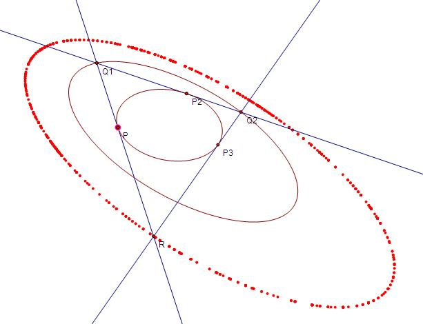  

对于(2)中矩阵我们可以看成二次曲线$C_3$:  
$(x,y,z)\begin{bmatrix}2A+E&B&D\\B&C&A\\D&A&F\end{bmatrix} \begin{bmatrix}x\\y\\z\end{bmatrix}=0$  
于是(2)式的几何意义就是$(x_2,x_2^2,1)$在点$(x_1,x_1^2,1)$关于$C_3$的极线上（也就是关于$C_3$的极线和$C_1$的交点)  

## 射影变换下的二次对合变换

上图中离散点列$P,P_2,P_3,\dots$是一个二次对合变换迭代点列，而$Q_1,Q_2,\dots$也是。  
对于圆锥曲线$C_1$上的一个二次对合变换$C_2$迭代点列$\{P_i\}$，它在一个射影变换$M$作用下的映像$\{M(P_i)\}$是圆锥曲线$M(C_1)$上的二次对合变换$M(C_2)$迭代点列。

通过射影对应，我们可以定义直线上的二次对合变换迭代点列。
如果$P_1,P_2,P_3,\dots,P_n,\dots$是圆锥曲线$C$上一个二次对合变换迭代点列，在 $C$上任意选择一点$P$,连接$PP_1,PP_2,\dots,PP_n,\dots$.等分别交直线 $l$ 到$Q_1,Q_2,Q_3,\dots,Q_n,\dots$,那么我们称$Q_1,Q_2,Q_3,\dots,Q_n,\dots$为直线 $l$ 上的二次对合变换迭代点列。
在另外圆锥曲线$C^{\prime}$上任取一点$P^{\prime}$,分别连接$Q_1,Q_2,\dots,Q_n,\dots$到$P^{\prime}$的直线交圆锥曲线$C^{\prime}$得出的交点序列还是$C^{\prime}$上的二次对合变换迭代点列。  
同样，两条直线之间点列的投影也保持二次对合变换的性质。  
于是，对圆锥曲线$C$上任取的6个不同点$P_1,P_2,\dots,P_6$, $C$上恰好存在一个的由此6点引导的二次对合变换迭代点列$P_1,P_2,\dots,P_6,\dots$。 

## 二次对合变换的等价定义

根据前面的知识，我们现在知道对于上面定义的二次对合变换，我们可以有下面四种不同的定义:  
i)给定圆锥曲线$C_1$,以及另外一个圆锥曲线$C_2$,对于$C_1$上任意一点$P_1$,过$P_1$做$C_2$的任意一条切线交$C_1$于$P_2$,同样过$P_2$做$C_2$的另外一条切线交$C_1$于$P_3$,...

依次类推，我们可以得到一个序列$P_1,P_2,P_3,\dots,P_n,\dots$。  
定圆锥曲线$C_1$任意一条动切线交圆锥曲线C于$P_1$和$P_2$二个点，我们称$P_2$为$P_1$在目标曲线C上关于第一类变换曲线$C_1$的二次对合变换的像（其中$P_1$,$P_2$的顺序可以任意指定，不同的指定方法得出两个不同的互逆的二次>对合变换，同样对于任意点$P_1$,可以有两个$P_2$满足条件，分别在两个互逆的不同分支上）
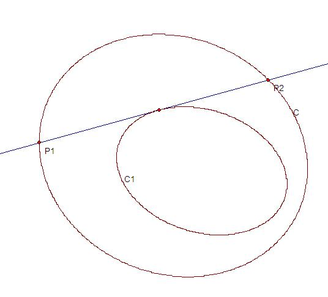  

ii)对偶的，给定圆锥曲线$C_1$,以及另外一个圆锥曲线$C_2$,对于$C_1$上任意一点$P_1$,$P_1$点的$C_1$的切线交于$C_2$于一点，而过着一点可以做$C_2$的另外一条切线，切点为$P_2$, 同样$P_2$的这条切线交$C_2$于另外一点，而过这一点$C_1$的另外一条切线的切点为$P_3$,...  
依次类推，我们可以得到一个序列$P_1,P_2,P_3,\dots,P_n,\dots$。

我们称$P_1$关于这个二次对合变换的像是$P_2$,$P_2$关于这个二次对合变换的像是$P_3$,... 而这个序列是对应的是一个二次对合变换序列。  
过定圆锥曲线$C_1$上一动点做圆锥曲线C的两条切线分别切C于$P_1$,$P_2$两个点，我们称$P_2$为$P_1$在目标曲线C上关于第二类变换曲线$C_1$的二次对合变换的像
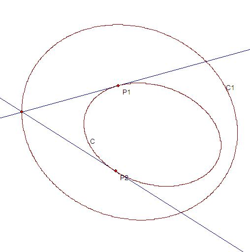  

iii)给定圆锥曲线$C_1$和$C_2$,对于$C_1$上任意一点$P_1$,$P_1$关于$C_2$的极线和$C_1$的一个交点定义为$P_2$,然后$P_2$关于$C_2$的极线（必然过$P_1$）和$C_1$的另外一个交点为$P_3$,$P_3$关于$C_2$的极线和$C_1$的另外一个交点为$P_4$,.... 依次类推，我们可以得到一个序列$P_1,P_2,P_3,\dots,P_n,\dots$。  
我们称$P_1$关于这个二次对合变换的像是$P_2$,$P_2$关于这个二次对合变换的像是P3,...而这个序列是对应的一个二次对合变换序列。  
对于圆锥曲线C上一点$P_1$,$P_1$关于定圆锥曲线$C_1$的极线交C于一点$P_2$,那么我们称$P_2$为$P_1$在目标曲线C上 关于第三类变换曲线$C_1$的二次对合变换的像                                                                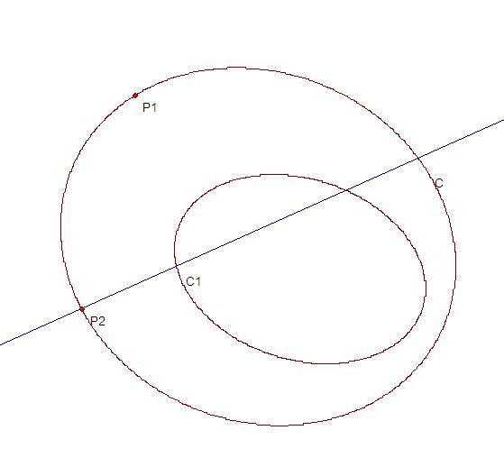  

iv)对偶于iii),给定圆锥曲线$C_1$和$C_2$,对于$C_1$上任意一点$P_1$,$P_1$处切线关于$C_2$的极点可以向$C_1$引任意一切线，切点定义为$P_2$,然后$P_2$处切线关于$C_2$的极点向$C_1$做另外一条切线（其中一条必然切于$P_1$)切$C_1$于$P_3$,.... 依次类推，我们可以得到一个序列$P_1,P_2,P_3,\dots,P_n,\dots$。
我们称$P_1$关于这个二次对合变换的像是$P_2$,$P_2$关于这个二次对合变换的像是$P_3$,... 而这个序列是对应的一个二次对合变换序列。  
对于圆锥曲线C上一点$P_1$,过$P_1$点的切线关于定圆锥曲线$C_1$的极点像C引一条切线切C于$P_2$,那么我们称$P_2$>为$P_1$在目标曲线C上关于第四类变换曲线$C_1$的二次对合变换的像
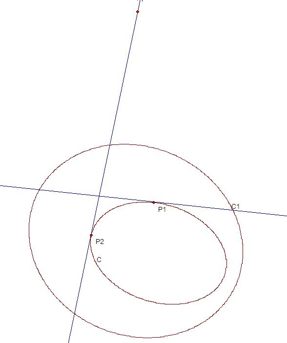  

而显然同一个二次对合变换如果选择不同的初始点，可以得到很多不同的二次对合变换序列。  

四种定义中的曲线$C_1$我们可以称之为这个二次对合变换的目标曲线，而其中的曲线$C_2$可以分别称为第一(二，三，四）类变换曲线。 

## 二次对合变换的驻点

我们现在查看第一类变换曲线，在复数范围，通常情况，它和目标曲线$C_1$有四条公切线。  
对于某一条公切线$P_1Q_1$,其中切$C_1$于$P_1$,切第一类变换曲线$C_2$于$Q_1$. 由于过$P_1$可以做$C_2$的两条切线，其中另外一条为为$P_1Q_2$,其中交$C_1$于另外一个点$P_2$.  
于是如果我们从$P_2$开始做二次对合变换序列，并将第一次变换的像选择为$P_1$,那么下一次变换，由于切线$P_1Q_1$是公切线，下一次变换结果还是$P_1$,而再下一次变换，由于我们需要切换到过$P_1$的另外一条切线$(P_1Q_2)$,所以又变换到$P_2$,于是我们得到对应的二次对合变换序列为  
$P_2,P_1,P_1,P_2,\dots$  
  
也就是这个变换序列中点$P_1$连续重复出现一次（所以我们也知道对于每个点，其变换的像同它在序列中的位置也有关系，总共有两种可能的取值）。  
另外一方面，如果一个点会在某个变换序列中连续重复出现，那么我们代入(2)式(定义3的代数形式）,得到如果$C_1$通过射影变换成$y=x^2$后，横坐标$x$必然是一个四次方程的根，所以最多四个解。  
而由于通常情况，目标曲线和第一类变换曲线有且仅有四条公切线，这说明这种在某个序列中连续重复出现一次的点有且仅有四个，正好是目标曲线和第一类变换曲线公切线在目标曲线上的切点，我们称这种点为这个二次对合变换的驻点。当然特殊的，如果目标曲线正好和第一类变换曲线在某点相切，那么情况退化为两个驻点重合的情况，而对应的驻点处二次变换序列为常数点序列$(P_1,P_1,P_1,\dots)$,这个点可以称为常驻点，显然常驻点最多两个。如果常驻点根据重数看成多个驻点，那么任何二次对合变换正好有且仅有四个驻点。  

## 二次对合变换的反射点
现在我们在查看目标曲线$C_1$和第一类变换曲线$C_2$的四个交点的情况，如下图:  
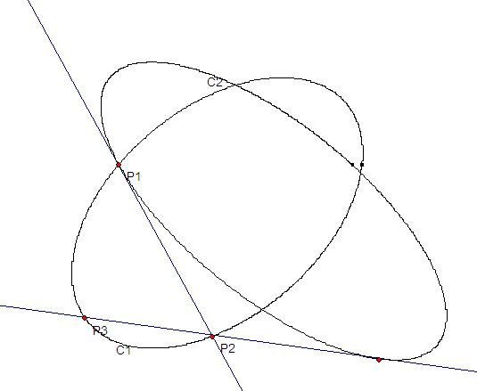  
$P_1$是两曲线一个交点，过$P_1$分别作出变换的后面两个点$P_2,P_3$, 
如果现在我们反过来从$P_3$开始序列，并且将第二个点选择为$P_2$,于是继续变换下去我们得到序列  
$P_3,P_2,P_1,P_2,P_3,\dots$,  
也就是这个序列到达$P_1$以后会“反射”回去，所以我们可以称变换中这样的点为这个变换的反射点。  
于是我们知道目标曲线和第一类变换曲线的交点总是反射点，所以通常情况，这样的反射点数目至少有四个。  
另外，前面我们已经证明，每个二次对合变换的平方还是二次对合变换，而对于这样包含反射点的二次对合变换序列中，$P_2$正好是它的平方变换的驻点。  
由于我们知道驻点只能有四个，这个也说明了反射点数目最多也只有四个。所以我们知道二次对合变换的反射点也正好有四个。  
而其中特别的，当目标曲线和第一类变换曲线相切于某一点，对应于两个反射点重合在一起（同时和两个驻点也重合在一起），对应的二次对合变换序列退化为常数点序列，也就是这时也同时是常驻点。  

一个二次对合变换的反射点还是它的平方变换的反射点，于是我们根据上面的结论，可以得出：  

###引理一: 
一个二次对合变换的目标曲线和它的第一类变换曲线，以及平方变换的第一类变换曲线交于公共的四个点（也就是它们的反射点）。一个二次对合变换的目标曲线和它的第一类变换曲线，以及平方变换的第一类变换曲线交于公共的四个点（也就是它们的反射点）。


## 二次对合变换的复合变换问题
mathe通过几何画板作图发现，同一个二次对合变换的任意次方还是二次对合变换，但是两个不同的二次对合变换的复合不一定是二次对合变换。  
而根据上面的引理一可以直到，两个不同的二次对合变换的复合还是二次对合变换的必要条件是目标曲线和两条第一类变换曲线经过四个公共点。  
我们可以猜测[这个条件应该是充分必要条件](https://bbs.emath.ac.cn/forum.php?mod=redirect&goto=findpost&ptid=2888&pid=34771&fromuid=20).  
如图目标曲线C和两个二次对合变换的第一类变换曲线$C_1$,$C_2$过公共四个点，那么对于目标曲线上动点A,过A点过于$C_1$,$C_2$的切线分别交目标曲线于B,C两个点，那么B,C两个点的连线必然同意固定二次曲线C3相切，而且C3也过这四个公共点。也就是$C_1$,C3确定的变换的复合是$C_2$确定的变换。（同样C3,$C_1$确定的变换也是$C_2$确定的变换，所以第一类变换曲线和目标曲线都过公共四点的那些变换也可以交换顺序）
  

同样，这个问题对应到圆的情况如下图:
  

其中三个圆有公共的根轴，于是AC必然相切于另外一个和它们有同样根轴的圆

我们可以直接考虑一个推广问题，对于圆锥曲线C以及它的一个二次对合变换，对于这个变换的两个不同的二次对合变换序列$P_1,P_2,P_3,\dots;Q_1,Q_2,Q_3,\dots$.  
那么我们可以猜想直线$P_1Q_1,P_2Q_2,P_3Q_3,P_4Q_4,\dots$等相切于一条二次曲线。  
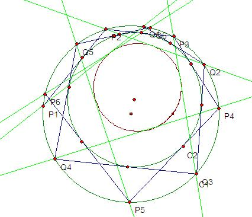  
（同样对偶的设$P_1$点的切线和$Q_1$点的切线交于$R_1,P_2$点的切线和$Q_2$点的切线交于$R_2$，等等.  
那么$R_1,R_2,\dots$ 等共一条二次曲线），容易看出，这个二次对合变换和原二次对合变换是可以交换的。  
由此我们可以猜想，同一条圆锥曲线的两个不同二次对合变换的乘积还是二次对合变换的充分必要条件是它们的乘积可以交换。  
另外，前面我们得出一个二次对合变换的平方和原二次对合变换的第一类变换曲线以及目标曲线交于公共的四个点。同样，如果我们假设这个二次对合变换的n次方也是二次对合变换（本题的猜想之一），那么我们可以得出n次方的第一类变换曲线也过这四个点。  
进一步，我们还可以猜想，两个二次对合变换的乘积还是二次对合变换（或可以交换）的充分必要条件是它们的第一类二次对合变换曲线和目标曲线交于公共的四个点，或者说它们构成一个过四个点的二次曲线系。  
类似的，使用第二二次对合变换曲线，那么得到的结论就对偶的变成同四条公共直线相切的二次曲线系。  
那么这个二次曲线实际上就相当于是一个$C$上二次对合变换，而我们这个新得到的圆锥曲线是这个二次对合变换的第一（二）类变换曲线。  

现在最后那个二次曲线系问题我们可以转化为如下图一个问题:  
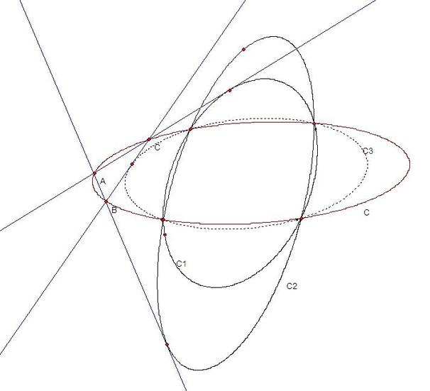  
二次曲线$C_1,C_2,C$过公共四个点，过$C$的动点$A_1$分别向$C_1,C_2$做切线交$C$于$A_2,A_3$.现在移动$A_1$,那么$A_2A_3$必然相切于一个通过过公共四个点的二次曲线.  
或者我们转化为圆的问题，已知圆$C,C_1,C_2$共根轴，那么过$C$上动点$A_1$分别向$C_1,C_2$做切线交$C$于$A_2,A_3$两点,那么当我们移动$A_1$时，动直线$A_2A_3$必然同一个固定圆相切，而且这个圆同$C,C_1,C_2$同根轴.  
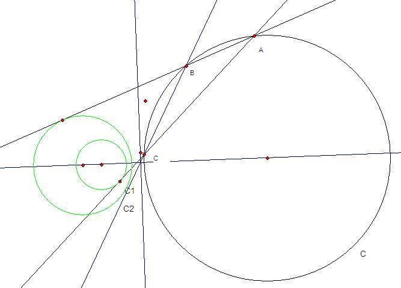  

如果三个共根轴的圆交于P,Q两点，我们可以以Q为中心做反演变换，可以得出如图的情况：  
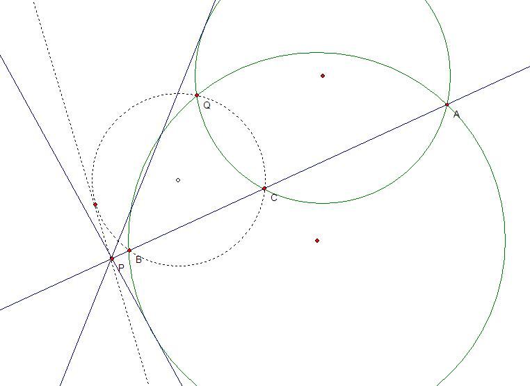  
三条直线过P点，Q为不在直线上一点（Q为反演中心）。  
对于一条直线上一个动点A,过A和Q做另外两条直线的切圆交这条直线于B,C,那么求证过Q,B,C的圆和一条过P点的定直线相切（注意过P点的这个圆的切线两条，只有一条是定直线）.  

我们假设通过射影变换将目标曲线变换为曲线$xy=1$而且目标曲线和第一类变换曲线四个交点中为$(1,0,0),(0,1,0),(1,1,1),(\frac ab,\frac ba,1)$这四个点，于是我们可以假设第一类变换曲线变换后方程为  
$(x-a)(y-b)=(1-a)(1-b)$.  
同样，如果还有另外通过这四个点的第一类变换曲线，其方程可以写成$(x-at)(y-bt)=(1-at)(1-bt)$,其中t任意。  
于是我们可以计算对于目标曲线上一点$(x,\frac1x)$,如果第一类变换曲线$(x-a)(y-b)=(1-a)(1-b)$将其变换为$(y,\frac1y)$,经计算可以知道$x,y$满足方程:  
$\begin{bmatrix}x^2&x&1\end{bmatrix}\begin{bmatrix}b^2&-2b&1\\-2b&-2ab+4b+4a-2&-2a\\1&-2a&a^2\end{bmatrix}\begin{bmatrix}y^2\\y\\1\end{bmatrix}=0$.  
同样，如果$(y,\frac1y)$经过另外一个第一类变换曲线$(x-at)(y-bt)=(1-at)(1-bt)$变为$(z,\frac1z)$.  
我们可以得到类似方程，然后消去y,就可以得到如上面一个复杂的方程.

我们可以直接计算一个无穷远点经过复合变换后得到的结果，如果假设复合变换的曲线为$(x-as)(y-bs)=(1-as)(1-bs)$,可以得到s和t的关系式:  
$a^2b^2(st)^2-2ab(s+t)st+(s^2+t^2)+(-2ab+4a+4b-2)st-2(s+t)+1=0$  
或  
$\begin{bmatrix}s^2&s&1\end{bmatrix}\begin{bmatrix}a^2b^2&-2ab&1\\-2ab&-2ab+4a+4b-2&-2\\1&-2&1\end{bmatrix}\begin{bmatrix}t^2\\t\\1\end{bmatrix}=0$ (1)  
而对每个t,有两个s满足条件。而我们需要证明，对于曲线$xy=1$上的任意一点，经过第一类变换曲线$(x-a)(y-b)=(1-a)(1-b)$和$(x-at)(y-bt)=(1-at)(1-bt)$后，相当于经过一次第一类变换$(x-as)(y-bs)=(1-as)(1-bs)$.  
也就是下面三个方程组对于任意给定的x都有解（也就是三条关于y,z的方程有公共解）
$\begin{bmatrix}x^2&x&1\end{bmatrix}\begin{bmatrix}b^2&-2b&1\\-2b&-2ab+4b+4a-2&-2a\\1&-2a&a^2\end{bmatrix}\begin{bmatrix}y^2\\y\\1\end{bmatrix}=0$ (2)
$\begin{bmatrix}y^2&y&1\end{bmatrix}\begin{bmatrix}b^2t^2&-2bt&1\\-2bt&-2abt^2+4bt+4at-2&-2at\\1&-2at&a^2t^2\end{bmatrix}\begin{bmatrix}z^2\\z\\1\end{bmatrix}=0$ (3)
$\begin{bmatrix}z^2&z&1\end{bmatrix}\begin{bmatrix}b^2s^2&-2bs&1\\-2bs&-2ab s^2+4bs+4as-2&-2as\\1&-2as&a^2s^2\end{bmatrix}\begin{bmatrix}x^2\\x\\1\end{bmatrix}=0$ (4)
最后mathe在maxima中通过暴力展开上面的表达式，证明这个命题是成立的，也就是说引理一的逆命题也是成立的。所以两个二次对合变换的复合还是二次对合变换的充分必要条件是两条第一类变换曲线和目标曲线经过公共的四个点，而且复合变换的第一类变换曲线也经过这四个点。

## 简单推论
然后我们可以继续分析，知道，如果第一类变换曲线和目标曲线本身重合，对应的二次对合变换退化为恒等变换；如果第一类变换曲线退化为相交直线形式，根据其代数形式计算可知，对应的二次对合变换退化为以相交直线的交点为对合中心的对合变换。
此外，如果第一类变换曲线和目标曲线相切于一点，那么这个切点变换任意次还是它本身，所以切点是这个变换的恒等元。反之，对于非恒等变换，由于第一类变换曲线和目标曲线最多有两个不同的切点，所以如果一个二次对合变换上有三个以上恒等元，那么只能是恒等变换。由此，我们可以非常容易得出一个结论：如果[一个n边形同时存在内接和外接圆锥曲线](http://mathworld.wolfram.com/BicentricPolygon.html) , 那么存在过外接圆锥上任意一点（顶点之一）的n边形同时外接和内接于这两个圆锥曲线。这个是因为我们马上可以得出对应二次对合变换的n次方变换是恒等变换。同样，如果n是偶数，那么我们马上可以知道这个二次对合变换的$\frac n2$次方是对合变换，所以这个多边形所有相隔$\frac n2$的顶点的连线共点.  

比如百度贴吧有个[双心五边形的问题](https://tieba.baidu.com/f?kz=625199790&red_tag=2196153879) ,通过这里的结论可以很自然的直接得出：  
如图，五边形A，B，C，D，E既外接于圆，又内切于圆。  
将五切点隔位相连，如此得到五个交点A3，B3，C3，D3，E3．证明：此五点共圆。  
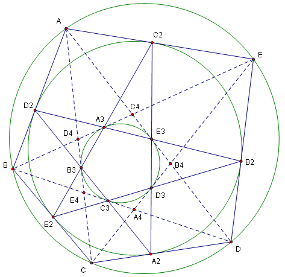  

## 一维形式和二阶二次曲线系
前面我们讨论了很多圆锥曲线上的二次对合变换的性质。实际上我们还可以推广到直线上，通过射影变换将圆锥曲线上的二次对合变换点列投影到直线上。容易证明，对于直线上，二次对合变换可以定义成
$A(x_1x_2)^2+2B(x_1x_2)(x_1+x_2)+C(x_1+x_2)^2+2D(x_1x_2)+2E(x_1+x_2)+F=0$定义的隐函数。  
而其中如果A,B,C都是0，就退化为一次的对合变换。实际上我们可以将它看成对合的二次扩展。  
我们知道，对于过四点的二次曲线系中，每条二次曲线同一条固定直线的交点正好构成一个对合变换。
而过四点的二次曲线系可以看成一个二次曲线，其所有系数都是一个参数t的不超过一次的多项式。
如果我们定义一个二次曲线系，其所有系数都是一个参数t的不超过二次的多项式，那么这个二次曲线系中每一条曲线同一条固定直线的两个交点正好是这条直线上一个二次对合变换的两个对应点
过四点的二次曲线系我们可以称为一阶二次曲线系，而我们新定义的这个含参数t二次多项式的曲线系可以称为二阶二次曲线系。  
反之，对于一条直线上的一个二次对合变换P,和直线外三个不共线的点A,B,C，  
过A,B,C和直线上动点x以及Px的圆锥曲线系是二阶二次曲线系（过固定三点A,B,C的二阶二次曲线系）。  

## 退化的二次对合变换
另外我们前面都没有讨论目标曲线退化为两条相交直线的情况。对于这种情况的一个变换，直线一上的点会被映射到直线二，而直线二上映射到直线一。于是这个变换的平方是直线一上的二次对合变换。于是我们可以用这种方法定义直线上的二次对合变换（二次合同变换）。（这个方法好像只能定义直线上的部分二次合同变换，所以最好还是以下面的另外一个方法作为几何定义）
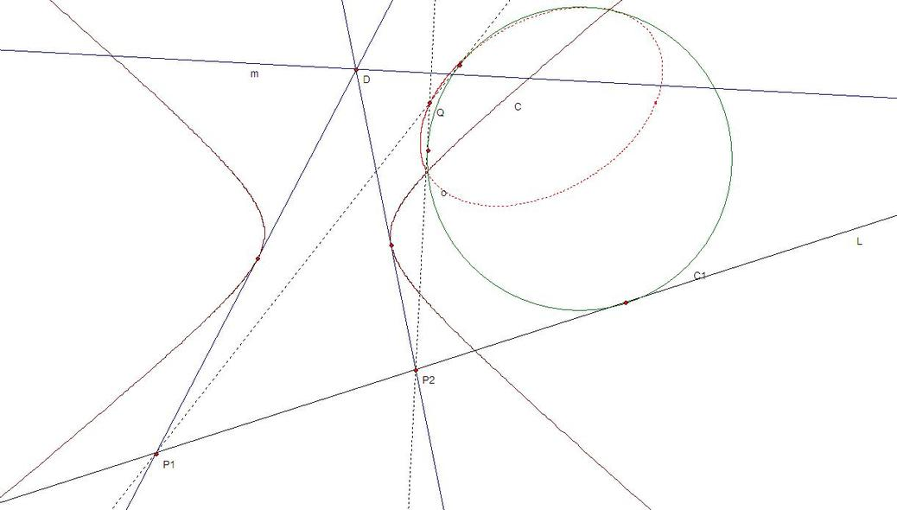  
如图，L是目标直线，直线m和圆锥曲线C构成变换曲线，对于m上任意一点D向C引两条切线交L于$P_1$,$P_2$两点，那么$P_1$和$P_2$之间构成二次对合变换（或称为二次合同变换）。

于是对于任意同L相切的二次曲线$C_1$,过$P_1$和$P_2$的$C_1$的切线（除直线L)交于动点Q,于是Q点的轨迹是一条二次曲线o.(这个性质实际上代表了直线和圆锥曲线上二次合同变换的关系）

## 直线和线束上的二次对合变换
直线上二次对合变换定义一：
给定直线l和圆锥曲线$C_1$,$C_2$,其中l为$C_1$的切线，$C_2$上任意动点关于$C_1$的两条切线交直线l于$P_1$,$P_2$,那么我们称$P_2$为$P_1$在目标直线l上关于$C_1$,$C_2$的二次对合变换的像，简称$P_2$为$P_1$的二次对合变换的像。
而同一个二次对合变换对于每个元可以确定两个不同的像，我们成为这个二次对合变换的两个分支
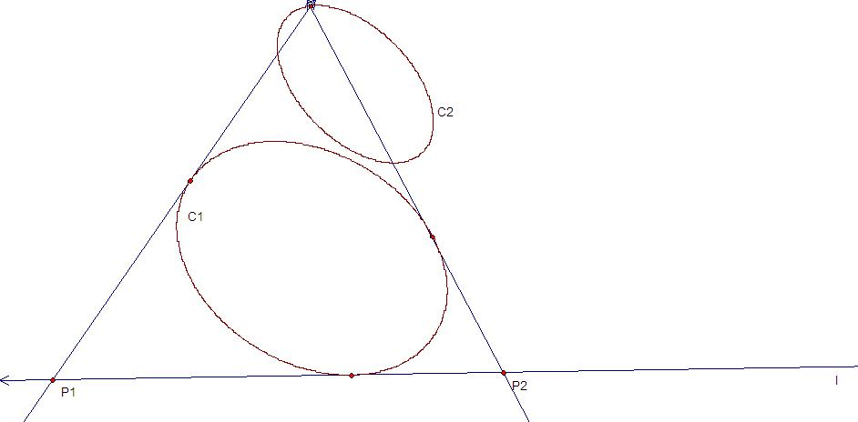  
对偶的，对于给定的点Q和过Q点的圆锥曲线$C_1$,以及另外一条圆锥曲线$C_2$,$C_2$上动点的切线交$C_1$于$P_1$,$P_2$两点，那么我们称直线Q$P_2$为直线Q$P_1$在过Q点线束中关于$C_1$,$C_2$的二次对合变换的像:
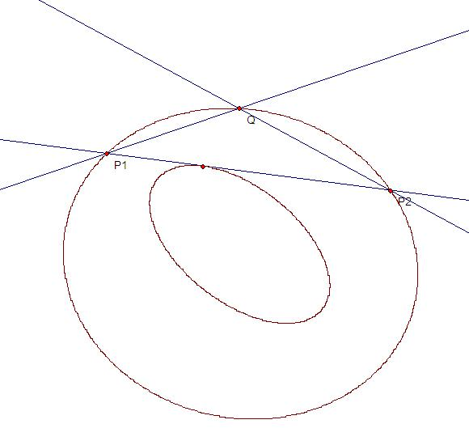  

## 各种逆定理
以上各定义的逆定理都成立，也就是:  
i)对于圆锥曲线C上一个二次对合变换T，连接C上任意一点P和像T(P)的直线同一个固定二次曲线相切  
ii)对于圆锥曲线C上一个二次对合变换T,C上任意一点P和像T(P)处切线的交点在一个固定二次曲线上。  
iii)对于圆锥曲线C上一个二次对合变换T,存在二次曲线$C_1$使得对于C上任意一点P,像T(P)在P关于$C_1$的极线上  
iv)对于圆锥曲线C上一个二次对合变换T,存在二次曲线$C_1$使得对于C上任意一点P处切线l,像T(P)处切线过l关于$C_1$的极点。  

v)对于直线l上任意一个二次对合变换T和一条同l相切的圆锥曲线C,过l上动点P和像T(P)的C的另外一条切线（不是l）的交点的轨迹是一条二次曲线  
vi)对于过Q点的线束上的一个二次对合变换T和过Q点的圆锥曲线C,任意过Q点直线l和像T(l)同C交点的连线切一固定二次曲线。  

##特殊的退化的二次对合变换
i)恒等变换是特殊的二次对合变换，它是在圆锥曲线的第一类变换曲线同自身重合时的结果。它是唯一一个有三个以上恒等元的二次对合变换（恒等元是指这个元的两个像都是自身）  
ii)对合变换也是特殊的二次对合变换，它是在圆锥曲线的第一类变换曲线退化为两条直线时的结果。它相当于过两条直线交点的任意直线同目标曲线两个交点之间确定的对合变换。对合变换中任何一个元的两个像都相同。而对于普通的二次对合变换，最多有四个元的两个像都相同，这些为反射点。同样对于普通的二次对合变换，如果某个元的两个像中有一个是自身，我们称这样的点为驻点，而对于普通的二次对合变换，最多有四个驻点。

对于直线l和给定的圆锥曲线C和直线m,过m上动点像圆锥曲线C引两条切线交l于$P_1$,$P_2$两个点，那么$P_2$必然是直线l上关于$P_1$的一个二次对合变换的像，其中如果l和圆锥曲线C相切，那么这个二次对合变换退化为对合变换:
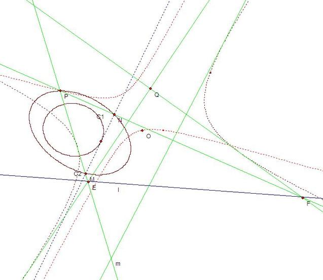  

##射影变换的保二次对合变换性
很显然，根据几何定义，我们可以得出，对圆锥曲线C（或直线l,线束Q）上任意一个射影变换，它将其上一个二次对合变换变换成另外一个二次对合变换。
同样，如果两个二次对合变换可以通过某个射影变换相互转化，我们称它们之间为合同的。
下图体现了线束间射影变换的保二次对合变换性（从线束Q到线束$Q^{\prime}$):

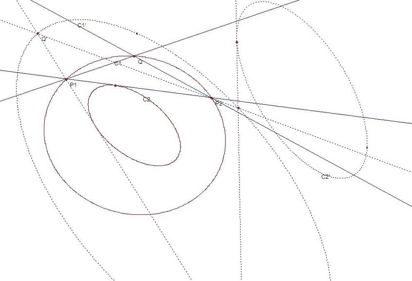  

# 二次对合变化与椭圆曲线群

##射影变换和对合变换
射影几何中，我们可以将直线上的点用齐次坐标$(x,y)$表示，其中$x,y$不同时为零，代表普通坐标下值为$\frac xy$的点, 其中$y=0$时代表无穷远点。对点的齐次坐标所有分量乘上同一个非零常数还是表示同一个点。  
在代数上，射影变换可以通过齐次坐标的线性变换形式来表示，也就是$(x_2,y_2 )=(x_1,y_1 )A$是从点$(x_1,y_1 )$ 到$(x_2,y_2 )$的射影变换，特别的，如果$A^2=I$（$I$表示单位阵），那么这个射影变换是一个对合变换，其中$A$是一个$2\times 2$的矩阵。  
由于$\begin{pmatrix}x_2&y_2\end{pmatrix}\begin{pmatrix}-y_2\\x_2\end{pmatrix}=0$而且$\begin{pmatrix}-y_2&x_2 \end{pmatrix}=\begin{pmatrix}x_2&y_2\end{pmatrix}\begin{bmatrix}0&1\\-1&0\end{bmatrix}$。  
于是上面变换我们也可以写成$\begin{pmatrix}x_1&y_1\end{pmatrix}A\begin{bmatrix}0&1\\-1&0\end{bmatrix}\begin{pmatrix}x_2\\y_2\end{pmatrix}=\begin{pmatrix}x_1&y_1\end{pmatrix}B\begin{pmatrix}x_2\\y_2\end{pmatrix}=0$. 特别的，如果这个射影变换是对合变换，矩阵B正好是可逆对称阵。而在本文中，为了避免混淆，我们可以将对合变换称为一次对合变换。  
二次对合变换  
定义1: 如果对于一个可逆的$3\times 3$对称阵C,点$(x_1,y_1 )$和点$(x_2,y_2 )$之间满足关系式  
$(x_1^2,x_1y_1,y_1^2 )C\begin{pmatrix}x_2^2\\x_2y_2\\y_2^2\end{pmatrix}=0$,我们称这是点$(x_1,y_1 )$到点$(x_2,y_2 )$的二次对合变换。  
由于对于给定的点$(x_1,y_1 )$,这个变换是一个二次方程，所以通常有两个解，也就是这个变换可以有两种不同的取值，我们看成是这个变换的两个不同的分支。很显然，这两个分支相互是对方的逆变换。我们可以将其记为$(x_2,y_2 )=QI_C (x_1,y_1 )$,这是一个双值函数.  
	二次对合变换群
对于给定的一个3阶可逆对称矩阵C和直线上任意一个点$(x_1,y_1 )$，我们可以先任意选择一个$(x_2,y_2 )$满足$(x_1^2,x_1 y_1,y_1^2 )C\begin{pmatrix}x_2^2\\x_2 y_2\\y_2^2 \end{pmatrix}=0$，于是此后我们计算第三个点$(x_3,y_3 )$使得$(x_3^2,x_3 y_3,y_3^2 )C\begin{pmatrix}x_2^2\\x_2 y_2\\y_2^2 \end{pmatrix}=0$而且这个点不同于$(x_1,y_1 )$ （如果这个方程两个根重合那么还是取这个值）。同样，我们可以继续寻找$(x_4,y_4 )$使得$(x_3^2,x_3 y_3,y_3^2 )C\begin{pmatrix}x_4^2\\x_4 y_4\\y_4^2 \end{pmatrix}=0$,而且$(x_4,y_4 )$不同于$(x_2,y_2 )$,  
同样，我们还可以将这个序列反向推导得出$(x_0,y_0 ) ，(x_{-1},y_{-1} ),\dots$
这样，我们就可以得到一个无穷点列$\{(x_k,y_k )\}$,其中每个点关于C的二次对合变换正好是前后两个点。而且其中$(x_{n+k},y_{n+k} )=QI_C^k (x_n,y_n )$.  
于是在这个无穷序列上，$\{QI_C^k,k \in Z\}$ 构成一个循环群，我们称其为这个二次对合变换在这个点列上的变换群。  

##二次对合变换的复合变换
现在给定一条圆锥曲线C和两个第一个变换曲线$K_1,K_2$,我们取C上任意一点X,通过向$K_1$某个方向做切线交C于Y,同样过Y点向$K_2$某个方向做切线交曲线C于Z,于是我们得到一个复合变换$X\to Z$. 前面我们通过复杂的计算得出了非常有意思的结论：  
如果曲线$C,K_1,K_2$在同一个二次曲线系，也就是有常数$u,v$使得$K_2=uC+vK_1$,那么$QI_{K_1}$和$QI_{K_2}$的复合变换也是二次对合变换，而且这两个变换的复合可以交换，而且复合变换的第一类变换曲线也在这个二次曲线系上（由于两个变换都是双值的，所以复合后我们可以得到两个不同的二次对合变换）。或者换成几何意义就是，如果$C,K_1,K_2$在同一个二次曲线系中，我们过C上一动点X向$K_1$某个方向$D_1$做切线交C于Y,过Y点向$K_2$某个方向$D_2$作切线交曲线C于Z，于是直线XZ同某个圆锥曲线相切，而且这个圆锥曲线在同一个二次曲线系中。并且如果我们过X向$K_2$的方向$D_2$做切线交C于$Y^{\prime}$,过$Y^{\prime}$向$K_1$的方向$D_1$的切线必然也交C于Z点。  
现在回到前面的二次对合变换群，我们可以知道，这个变换群是同初始点$(x_1,y_1 )$的选择无关的，它同样可以看成C和K确定的二次曲线系上面的群运算。  
##二次对合变换群中的运算
前面通过射影变换将目标曲线C变化为双曲线$xy=1$,然后将第一类变换曲线变换到二次曲线系$(x-at)(y-bt)=(1-at)(1-bt)$,或者写成$xy-1+t(-ay-bx+a+b)=0$, 于是得出对应的二次对合变换的变换矩阵为$\begin{bmatrix}b^2 t^2&-2bt&1\\-2bt&-2abt^2+4at+4bt-2&-2at\\1&-2at&a^2 t^2 \end{bmatrix}$。
链接中得出，如果第一类变换曲线$(x-a)(y-b)=(1-a)(1-b)$和$(x-ta)(y-tb)=(1-ta)(1-tb)$的复合变换对应的第一类变换曲线是$(x-as)(y-bs)=(1-as)(1-bs)$,那么t和s满足下面方程  
$(s^2,s,1)\begin{bmatrix}a^2 b^2&-2ab&1\\-2ab&-2ab+4a+4b-2&-2\\1&-2&1)\end{bmatrix}\begin{pmatrix}t^2\\t\\1\end{pmatrix}=0$  
现在在通过上面变换我们可以用参数$(a,b,t)$来唯一确定一个二次对合变换，其中$a,b$给定以后，就确定了一族相互之间复合运算可以交换的二次对合变换，而我们只需要使用参数t来识别这个曲线系中任何一个二次对合变换。  
于是对于给定参数$a,b$， $a\times b\ne1$后，我们先选择$t_1=1$对应的二次对合变换作为生成变化$A$。而$t=0$的情况对应恒等变换，是群中的单位元。为了计算$A^2$对应的参数$t_2$,我们使用上面的方程得到  
$(t^2,t,1)\begin{bmatrix}a^2 b^2&-2ab&1\\-2ab&-2ab+4a+4b-2&-2\\1&-2&1\end{bmatrix}\begin{pmatrix}1\\1\\1\end{pmatrix}=0$  
得出$(ab-1)^2 t_2^2-4(a-1)(b-1) t_2=0$,由于$t=0$对应恒等变换，我们得出$t_2=\frac{4(a-1)(b-1)}{(ab-1)^2}$.   
同样，假设我们已经得出$A^{n-1}$和$A^n$对应的参数$t_{n-1},t_n$,  
由于我们知道$t_{n-1}$和$t_{n+1}$都满足方程  
$(x^2,x,1)\begin{bmatrix}a^2 b^2&-2ab&1\\-2ab&-2ab+4a+4b-2&-2\\1&-2&1\end{bmatrix}\begin{pmatrix}t_n^2\\t_n\\1\end{pmatrix}=0$   
也就是$(abt_n-1)^2 x^2+(-2abt_n^2+(-2ab+4a+4b-2) t_n-2)x+(t_n-1)^2=0$.  
根据韦达定理我们得出$t_(n-1) t_(n+1)=\frac{(t_n-1)^2}{(abt_n-1)^2}$. 由此我们可以利用$t_n$和$t_{n-1}$计算出$t_{n+1}$. 这里也可以看出为什么要选择$a\times b\ne 1$,不然$t_{n-1} t_{n+1}=1$就是一个平凡的变换群了。  
在计算中，我们还可能会遇上$abt_n=1$的情况，这时对应$t_{n+1}$为无穷大,那么此时如何继续计算$t_{n+2}$呢？只要在方程  
$(x^2,x,1)\begin{bmatrix}a^2 b^2&-2ab&1\\-2ab&-2ab+4a+4b-2&-2\\1&-2&1\end{bmatrix}\begin{pmatrix}t_{n+1}^2\\t_{n+1}\\1\end{pmatrix}=0$.  
中除以$t_{n+1}^2$再让$t_{n+1}$趋向无穷远，我们就可以得出方程$(abx-1)^2=0$,也就是$t_n=t_{n+2}=\frac1{ab}$.  
我们也可以从几何角度来理解t为无穷大时的情况，t为无穷对应二次曲线系$xy-1+t(-ay-bx+a+b)=0$中的退化二次曲线$-ay-bx+a+b=0$,也就是两条直线：无穷远直线和直线$-ay-bx+a+b=0$,于是这时二次对合变换退化为一次对合变换，也就是对于目标曲线上任意一点X，过两直线交点（无穷远点$(a，-b，0)$）交目标曲线于另外一点Y就是变换结果，然后通过复合变换运算也能得出类似的结果。  
实际应用中，我们需要给定$t_n$和$t_m$计算出它们的复合变换$t_{n+m}$,为了计算这个值，我们可以看成是参数$(at_n,bt_n,1)$对应的变换曲线和$(at_n,bt_n,\frac{t_m}{t_n} )$对应的变换曲线的复合，于是得出  
$(\frac{t_{n+m}^2}{t_n^2},\frac{t_{n+m}}{t_n} ,1)\begin{bmatrix}a^2 b^2 t_n^4&-2abt_n^2&1\\-2abt_n^2&-2abt_n^2+4at_n+4bt_n-2&-2\\1&-2&1\end{bmatrix}\begin{pmatrix}\frac{t_m^2}{t_n^2}\\\frac{t_m}{t_n}\\1\end{pmatrix}=0$  
其中如果$t_m$是无穷大，方程直接为$(abt_n t_{n+m}-1)^2=0$.  
但是问题在于这个方程会同时给出$t_{n+m}$和$t_{n-m}$的值，但是我们无法区分它们。  
为此，我们可以同时使用用两个数$(t_n,t_{n+1})$来表示$A^n$而不是仅仅只用$t_n$.  
由此，给定$(t_n,t_{n+1})$和$(t_m,t_{m+1})$,我们需要计算$(t_{n+m},t_{n+m+1})$.  
我们可以利用$t_n ,t_{m+1}$的复合变换得出方程$(x-t_{n+m+1})(x-t_{n-m-1})$,同样用$t_m ,t_{n+1}$的复合变换得出方程$(x-t_{n+m+1})(x-t_{m-n-1})$,求它们的公因子我们可以得到$x-t_{n+m+1}$由此得出$t_{n+m+1}$。其中也有可能$t_{m-n-1}=t_{n-m-1}$，但是这只能在$n=m$或周期为2时有可能。周期为2的群只能有0，1两个元素，我们可以不用考虑。而对于$n=m$,我们需要特殊处理：  
直接使用二倍公式得出$t_{2n}=\frac{4(at_n-1)(bt_n-1)}{(abt_n^2-1)^2} ,t_{2n+2}=\frac{4(at_{n+1}-1)(bt_{n+1}-1)}{(abt_{n+1}^2-1)^2}$ , 然后分别用$t_{2n}$和$t_1=1$复合算出$(x-t_{2n+1})(x-t_{2n-1})$,利用$t_{2n+2}$和$t_1=1$复合得出$(x-t_{2n+1})(x-t_{2n+3})$,求它们公因式可得$t_{2n+1}$.  
而对于$n\ne m$而且周期大于2，同样，我们可以利用$t_1=1$和$t_{n+m+1}$得出方程$(x-t_{n+m})(x-t_{n+m+2})$,然后又利用$t_n$和$t_m$得出方程$(x-t_{n+m})(x-t_{n-m})$，计算两者公因子得出$t_{n+m}$。由此我们算出$(t_{n+m},t_{n+m+1})$。 这里还有一种特殊情况是如果$t_{n-m}$和$t_{n+m+2}$正好相等，我们无法区分哪个因子是$t_{n+m}$,这时我们可以继续利用$t_{m+1}$和$t_{n+1}$构造方程$(x-t_{n+m+2})(x-t_{n-m})$，这个方程有重因子$x-t_{n+m+2}$,我们从前面的方程$(x-t_{n+m})(x-t_{n+m+2})$中除去因子$x-t_{n+m+2}$即可得到$t_{n+m}$。  
这样，我们就可以得到了[这个群中加法的一个有效算法](http://bbs.emath.ac.cn/thread-5485-1-1.html‎) 。

##一般曲线下的变换关系
我们知道对于曲线系$xy-1-t(ay+bx-a-b)=0$和目标曲线$xy-1=0$有变换关系式  
$(s^2,s,1)\begin{bmatrix}a^2 b^2&-2ab&1\\-2ab&-2ab+4a+4b-2&-2\\1&-2&1)\end{bmatrix}\begin{pmatrix}t^2\\t\\1\end{pmatrix}=0$  
我们使用变量替换$t=\frac1{h+1}$,曲线系变成$h(xy-1)+(xy-1-ay-bx+a+b)=0$. 其中$h=0$代表最基本的第一类变换曲线，而$h=\infty$代表恒等变换。于是同样设一次变换后的$s$也有类似替换$s=\frac1{f+1}$,于是必然有  
$((f+1)^2,f,1)\begin{bmatrix}1&-2&1\\-2&-2ab+4a+4b-2&-2ab\\1&-2ab&a^2 b^2 \end{bmatrix}\begin{pmatrix}(h+1)^2\\h+1\\1\end{pmatrix}=0$  
化简后得到  
$(f^2,f,1)\begin{bmatrix}1&0&0\\0&-2ab+4a+4b-6&-4ab+4a+4b-4\\0&-4ab+4a+4b-4&a^2 b^2-6ab+4a+4b-3\end{bmatrix}\begin{pmatrix}h^2\\h\\1\end{pmatrix}=0$.  
对应到一般情况，设目标曲线为$J$,基本第一类变换曲线为$K$，其中$J,K$分别又代表它们的$3\times 3$对称矩阵形式。对应的第一类变换曲线系方程为$hJ+K$.假设矩阵$J^{-1} K$的特征方程为$g(x)=x^3-u_2 x^2+u_1 x-u_0$,对应特征值为$r_1,r_2,r_3$,于是根据链接中一个分析结果，如果我们通过射影变换变换将$J$变换为曲线$xy-1$，同时将$K$变换为曲线$u_3 (xy-1-ay-bx+a+b)$,那么这时必然有$a=1-\frac{r_1}{r_3} ，b=1-\frac{r_2}{r_3}$ ,而且对比特征值有$r_3=u_3$.于是$-2ab+4a+4b-6=-2 \frac{r_1 r_2+r_1 r_3+r_3 r_2}{r_3^2}=\frac{-2u_1}{r_3^2}, -4ab+4a+4b-4=\frac{-4r_1 r_2}{r_3^2}=\frac{-4u_0}{r_3^3}, a^2 b^2-6ab+4a+4b-3=\frac{r_1^2 r_2^2+r_2^2 r_3^2+r_3^2 r_1^2-2r_1 r_2 r_3 (r_1 +r_2 +r_3 )}{r_3^4} =\frac{(r_1 r_2+r_1 r_3+r_3 r_2)^2-4r_1 r_2 r_3 (r_1 +r_2 +r_3)}{r_3^4 }=\frac{u_1^2-4u_0 u_2}{r_3^4 }$.于是我们得到  
$(\frac{f^2}{r_3^2},\frac{f}{r_3} ,1)\begin{bmatrix}1&0&0\\0&\frac{-2u_1}{r_3^2}&\frac{-4u_0}{r_3^3}\\0&u \frac{-4u_0}{r_3^3}&\frac{u_1^2-4u_0 u_2}{r_3^4}\end{bmatrix}\begin{pmatrix}\frac{h^2}{r_3^2}\\ \frac{h}{r_3}\\1\end{pmatrix}=0$  
整理得到
$(f^2,f,1)\begin{bmatrix}1&0&0\\0&-2u_1&-4u_0\\0&-4u_0&u_1^2-4u_0 u_2 \end{bmatrix}\begin{pmatrix}h^2\\h\\1\end{pmatrix}=0$  
如果我们展开并且利用二次方程求根公式可以得到  
$f=\frac{u_1 h+2u_0±\sqrt{-4u_0 g(-h)}}{h^2}$  
现在我们查看椭圆曲线$y^2=u_0 (x^3+u_2 x^2+u_1 x+u_0)$,显然上面有点 $(0,u_0)$,现在我们假设曲线上还有一点$(h,∓\sqrt{-4u_0 g(-h) })$,我们连接这两点得到直线$y=u_0+\frac{∓\sqrt{-4u_0 g(-h)}-u_0}{h} x$,然后代入椭圆方程得到$u_0 (x^3+u_2 x^2+u_1 x+u_0)-(u_0+\frac{∓\sqrt{-4u_0 g(-h) }-u_0}{h} x)^2=0$,由于我们知道这个方程已经有解0，h，得到第三个解为$\frac{u_1±2 \frac{\sqrt{-4u_0 g(-h) }-u_0}h}{h}=\frac{u_1 h+2u_0±\sqrt{-4u_0 g(-h)}}{h^2} =f$，由此得出：  
###二阶对合变换群同椭圆曲线$y^2=u_0 (x^3+u_2 x^2+u_1 x+u_0)$的群是完全同构的  
曲线的横坐标对应二次曲线系中的参数h，纵坐标的符号决定了变换的方向。

##附录
有限域上二阶对合变换群的例子：
比如选择p=11,
a=2,b=3,我们可以得出$t_0=0,t_1=1,t_2=10,t_3=3,t_4=6,t_5=3,t_6=10,t_7=1$是个8阶群  
a=2,b=4,我们可以得出$t_0=0,t_1=1,t_2=9,t_3=3,t_4=9,t_5=1$是个6阶群  
可[参考链接](http://bbs.emath.ac.cn/thread-5485-1-1.html‎)  

另外[链接](http://bbs.emath.ac.cn/thread-5476-1-1.html)中利用了这种方法用计算机算出如果一个圆的内接$n(n\le9)$边形外切于另外一个椭圆时，圆和椭圆的关系公式。

##一般情况二阶对合变换群例子
我们可以选择目标曲线为圆$x^2+y^2-4=0$和第一类变换曲线为圆$x^2+y^2-2x+\frac{7}{16}=0$,这两个圆分别是一个三角形的外接圆和内切圆，所以这个第一类变换曲线的三次方就是恒等变换。对应特征方程为$x^3-\frac{121}{64} x^2+\frac{33}{32} x-\frac{9}{64}$，所以$u_0=\frac{9}{64},u_1=\frac{33}{32},u_2=\frac{121}{64}$。  
我们现在套用前面的结果来计算一下。由于我们知道第一类变换曲线自己对应$h=0$,代入方程$(f^2,f,1)\begin{bmatrix}1&0&0\\0&-2u_1&-4u_0\\0&-4u_0&u_1^2-4u_0 u_2\end{bmatrix}\begin{pmatrix}h^2\\h\\1\end{pmatrix}=0$，可以看出变化为f的一次方程，说明一个解是恒等变换，对应这个曲线变换的0次方，另外一个解为$\frac{u_1^2-4u_0 u_2}{4u_0}=0$，对应这个曲线变换的平方，是它自己的另外一个分支，而显然3次方又变回恒等变换，所以是个三次元。  
另外我们查看椭圆曲线$y^2=-\frac{9}{64}(x^3-\frac{121}{64}x^2+\frac{33}{32}x-\frac{9}{64})$，我们可以做变换$y=\frac{81}{4096}Y,x=-\frac{9}{64} X$得到曲线$Y^2=X^3+\frac{121}9 X^2+\frac{1408}{27} X+\frac{4096}{81}$,于是在Pari/Gp中我们用命令  
```bash
E=ellinit(0,121/9,0,1408/27,4096/81))
```
得到这个椭圆曲线群,而且前面的单位点对应X=0的情况就是$\begin{bmatrix}0,\frac{64}9\end{bmatrix}$  
于是我们可以用命令
```bash
gp > a=[0,64/9];
gp > b=elladd(E,a,a)
%10 = [0, -64/9]
gp > c=elladd(E,a,b)
[0]
```
同样可以得出是这个群里的三阶元。
