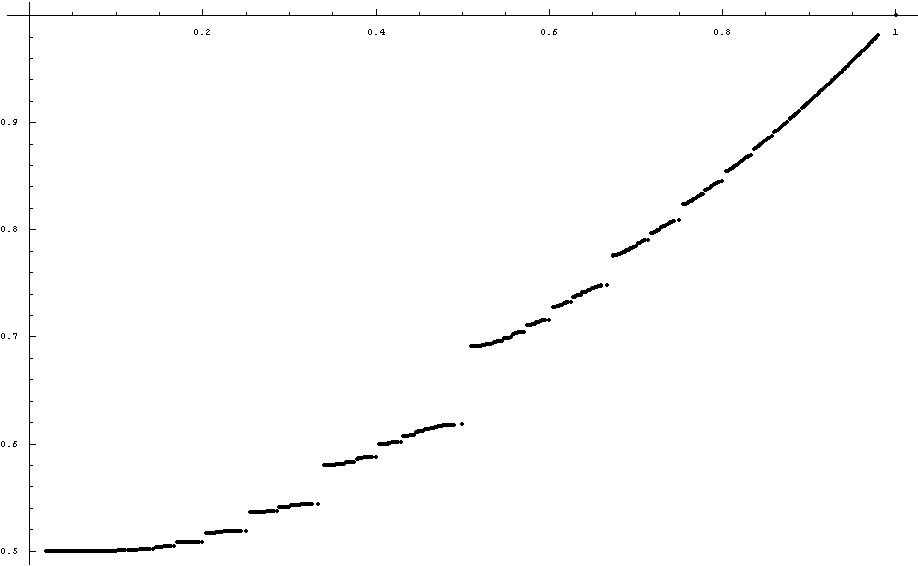

# 摘要
mathe[于2008年4月](https://bbs.emath.ac.cn/thread-331-1-1.html) 引用百度贴吧中一个问题(百度原链接已经不存在)  
  
A和B一开始站在同一个地方，他们不停地猜拳，A赢了就前进1米，B赢了就前进$\pi$米（他们朝同一个方向前进）直到A前进到B的前面为止，求A走到B前面的概率.  
显然，这个概率很难用解析表达式表示出来，那么现在问题是如何用数值计算的方法找到一个比较好的近似值（比如精确到小数点后面10位数？？？）  
后来mathe[计算出来这个概率](https://bbs.emath.ac.cn/forum.php?mod=redirect&goto=findpost&ptid=331&pid=2895&fromuid=20) 在0.54364331210052407755147385529445和0.54364331210052407755147385529454之间

# 具体内容
无心人建议从数值模拟开始，但是mathe觉得使用蒙特卡洛法模拟精度太低了。

## 辅助方程分析
mathe提出分析方程$x^m = 2- x^{-n}$在[复数范围根的分布](https://bbs.emath.ac.cn/thread-332-1-1.html) 。  
也就是对于任何正整数$n,m$,其中$n\gt m$,而且$(m,n)=1$, 证明或者否定  
方程 $x^m=2-x^{-n}$ 正好有m个根的范数严格大于1。  

上面的方程转化为多项式方程就是$x^{m+n}-2x^n+1=0$, 我们知道这个m+n次多项式总共有m+n个复数根（容易看出这个多项式方程不包含重根，因为多项式和它的导数互质）。
对于每个复数根，它的范数（也就是绝对值，也就是在复平面上到0的距离）可以大于1也可以小于1，也可以等于1。
显然,1是上面方程的一个根。[数值分析](https://bbs.emath.ac.cn/forum.php?mod=redirect&goto=findpost&ptid=332&pid=2832&fromuid=20) 的结果显示$m\lt n$时，总是正好有m个根的范数大于1。当然也比较容易证明正好有一个根的范数为1（也就是1）,所以我们还可以得出正好有n-1个根的范数小于1。  
点击下载[对应的C代码](../attached/randwalk/rw1.txt) 。  

然后mathe发现我们可以通过复变函数中的[儒歇定理](https://baike.baidu.com/item/%E5%84%92%E6%AD%87%E5%AE%9A%E7%90%86/3899479?fr=aladdin) 来证明这个问题。
儒歇定理说  
如果复变函数f(x)和g(x)在复平面某个有界区域上解析，而且在区域边界上总是有$|f(x)|>|g(x)|$,  
那么在区域内部,f(x)和f(x)+g(x)的零点数目相同。

[首先](https://bbs.emath.ac.cn/thread-332-1-1.html) 对于多项式$h(x)=x^{m+n}-2x^n+1$
于是我们选择$f(x)=x^m-2$, g(x)=x^{-n}$, 那么选择复平面上一个圆环$1\lt |z| \lt R$ (其中$R\ge 4$), 那么可以得出在内边界上$|f(z)|\ge 2-|z|^m = 1= |z^{-n}|=|g(z)|$。在外边界上
$|f(z)| \ge |z|-2\ge 2 \ge |z|^{-n}$,  
所以根据儒歇定理，函数$f(x)$和$f(x)+g(x)$在圆环$1\lt |x|\lt R$内零点数目相同。
$f(x)$在这个圆环内显然正好有m个根$\sqrt[m]{2}e^{\frac{2k\pi i}{m}}$, 于是我们得出函数$x^m=2-x^{-n}$在$|x| \gt 1$中正好有m个根。  
另外容易看出在$(m,n)=1$时，这个方程在单位圆上只有唯一根$x=1$。 由此进一步推导出它在单位圆内部正好$n-1$个根。

## 有理比例情况
我们先将问题推广到A赢了前进1米，B赢了前进x米($x>1$)的一般情况。容易理解，这个问题A能够超过B的概率p(x)是关于x的单调减函数。而我们现在要计算$p(\pi)$。  
我们可以先处理x为有理数情况，然后再选择两个非常接近$\pi$的有理数a和b,$a\gt pi\gt b$,分别计算$p(a)$和$p(b)$,那么必然有$p(a)<p(\pi)<p(b)$。
在a,b都很接近$\pi$时，这两个结果应该可以很好的逼进$p(\pi)$。  
所以[问题转为](https://bbs.emath.ac.cn/forum.php?mod=redirect&goto=findpost&ptid=331&pid=2852&fromuid=20) 对于有理数$n/m$,计算$p(n/m)$，这个问题可以转化为A赢了前进m米，B赢了前进n米的问题($n\gt m,(m,n)=1$)。  

对于A前进m，B前进n的问题，A和B之间的间隔始终是整数。  
任何时候A能够超过B的概率之和他们间相对距离有关系。我们记当A在B后面k米时，A能够超过B的概率为$q(k), (k\ge 1)$。
定义对于$k\le 0, q(k)=1$,
于是我们有递推式$q(k)=\frac 12 q(k-m)+\frac 12 q(k+n), (k\ge 1)$。  
这个递推式对应的特征方程为$x^{m+n}-2x^m+1=0$. 记$y=\frac1x$,那么y满足方程$y^m=2-y^{-n}$。  
根据前面一小节的分析，正好有m个范数大于1的y满足上面的方程，
也就是特征方程有m个范数小于1的x。此外特征方程还有n个解的范数不小于1。  
假设特征方程m个范数小于1的解为$x_1,x_2,...,x_m$,范数不小于的解为$x_{m+1},...,x_{m+n}$。  
由此它的通解形式为
$q(k)=a_1 x_1^k +a_2 x_2^k+...+a_{m+n} x_{m+n}^k$
由于q(k)有界 ($0\le q(k)\le 1$)，显然根据概率模型，当k趋向无穷时,q(k)趋向0,然后mathe觉得显然$a_{m+1},a_{m+2},...,a_{m+n}$都是0， 对此shshsh\_0510[表示了疑问](https://bbs.emath.ac.cn/forum.php?mod=redirect&goto=findpost&ptid=331&pid=2913&fromuid=20) 这个问题我们留在后面再分析
我们先可以得出$q(k)=a_1 x_1^k+a_2 x_2^k +... +a_m x_m^k$， 
其中$a_1,a_2,...,a_m$我们可以通过$q(0)=1,q(-1)=1,...,q(-m+1)=1$使用待定系数法解出。
而在这个计算过程中，我们记$y_i=\frac 1{x_i}$,所以$|y_i|\gt 1$, 
对应线性方程组左边的矩阵正好是[范得蒙行列式](https://baike.baidu.com/item/%E8%8C%83%E5%BE%B7%E8%92%99%E8%A1%8C%E5%88%97%E5%BC%8F/6081288?fr=aladdin) 。
在求解得到$a_1,a_2,...,a_m$的解以后
我们可以计算出$q(n)=a_1*x_1^n+a_2*x_2^n+...+a_m*x_m^n$
而最终所求的概率为$\frac 1 2+\frac{q(n)}2$  
这个算法时间复杂度最大为O(m^3)（解m阶线性方程组的时间）  
利用这个算法，使用$\pi$的连分数，我们可以计算出$x=\pi$时的概率在0.54364331210052407755147385529445和0.54364331210052407755147385529454之间。

## shshsh\_0510的疑问的解答
[这个问题](https://bbs.emath.ac.cn/thread-354-1-1.html) 转化为  
已知$t$个互不相同的复数$z_1,z_2,...,z_t$满足$|z_1|=|z_2|=...=|z_t|\ge 1$  
而且存在复数$a_1,a_2,...,a_t$使得  
$lim_{n->+infty} a_1 z_1^n+a_2 z_2^n+...+a_t z_t^n = 0$  
证明或否定$a_1=a_2=...=a_t=0$。  

[解答](https://bbs.emath.ac.cn/forum.php?mod=redirect&goto=findpost&ptid=354&pid=3112&fromuid=20)  
记$f(n)=a_1 z_1^n+a_2 z_2^n+...+a_t z_t^n$
那么 $\begin{bmatrix}1&1&\dots&1\\z_1&z_2&\dots&z_t\\ \dots&\dots&\dots&\dots\\z_1^{t-1}&z_2^{t-1}&\dots&z_t^{t-1}\end{bmatrix} \begin{bmatrix}a_1z_1^n\\a_2z_2^n\\ \dots\\a_tz_t^n\end{bmatrix}=\begin{bmatrix}f(n)\\f(n+1)\\ \dots\\f(n+t-1)\end{bmatrix}$  
上面方程左边是范得蒙矩阵，由于$z_1,z_2,...,z_t$互不相同，矩阵可逆，记其逆矩阵为$S$  
我们可以把结果写成
$\begin{bmatrix}a_1\\a_2\\ \dots\\a_t\end{bmatrix}=\begin{bmatrix}z_1^{-n}&0&\dots&0\\0&z_2^{-n}&\dots&0\\ \dots&\dots&\dots&\dots\\0&0&\dots&z_t^{-n}\end{bmatrix} S \begin{bmatrix}f(n)\\f(n+1)\\ \dots\\f(n+t-1)\end{bmatrix}$  
令$n\to\infty$后得到右边第一项有界，第二项是常数，最后一项趋向0，所以右边趋向0
所以我们得到  
$\begin{bmatrix}a_1\\a_2\\  \dots\\a_t\end{bmatrix}=\lim_{n\to\infty}\begin{bmatrix}z_1^{-n}&0&\dots&0\\0&z_2^{-n}&\dots&0\\ \dots&\dots&\dots&\dots\\ 0&0&\dots&z_t^{-n}\end{bmatrix} S \begin{bmatrix}f(n)\\f(n+1)\\ \dots\\f(n+t-1)\end{bmatrix}=\begin{bmatrix}0\\0\\ \dots\\0\end{bmatrix}$  
于是这里解答了shshsh\_0510的疑问，证明了前面判断$a_{m+1},a_{m+2},...,a_{m+n}$都是0是成立的。  

## 公式解形式
后来mathe进一步发现[公式形式](https://bbs.emath.ac.cn/forum.php?mod=redirect&goto=findpost&ptid=331&pid=2932&fromuid=20) 
$q(n)=1+\prod_{k=1}^m (1-y_k)$。  
证明过程如下  
记$f(x)=(x-y_1)(x-y_2)...(x-y_m)$，
我们要找出通项公式 
$q(k)=a_1 y_1^{-k}+a_2 y_2^{-k}+...+a_m y_m^{-k}$。  
已经知道$q(0)=q(-1)=...=q(-m+1)=1$  
由于$f'(x)=\sum_{k=1}^{m} \prod_{h\ne k} (x-y_h)$  
所以$f'(y_k)=\prod_{h\ne k} (x-y_h)$  
通过拉格朗日插值定义  
$g_k(x)=\sum_{h=0}^{m} \frac{y_h^k f(x)}{(x-y_h)f'(y_h)} -x^k$  
对于$0\le k\le m-1$,函数$g_k(x)$都是次数不超过m-1的多项式。但是
$y_1,y_2,...,y_m$都是多项式的根,所以上面多项式都只能是0多项式。  
所以$g_k(1)=0$，
于是我们可以得到通解
$a_k = \frac{f(1)}{(1-y_k)f'(y_k)}$。  

又由$g_m(x)$是m次多项式,而且$y_1,y_2,...,y_m$都是多项式的根，而且多项式最高次数项系数为-1,我们可以得到  
$g_m(x)=-(x-y_1)(x-y_2)...(x-y_m)$  
代入得到$g_m(1)=-(1-y_1)(1-y_2)...(1-y_m)$  
由此可以得到$q(-m)=1-(1-y_1)(1-y_2)...(1-y_m)$  
然后用$q(n)=2-q(-m)$就可以得到$q(n)=1+(1-y_1)(1-y_2)...(1-y_m)$。  
这个公式解的得出使得前面的算法复杂度从$O(m^3)$降低到$O(m)$。  

## 图解分析
zgg__根据mathe前面给出的算法，进一步给出了$p(\frac mn)$更多的结果，并给出了[如下的图片](https://bbs.emath.ac.cn/forum.php?mod=redirect&goto=findpost&ptid=331&pid=3644&fromuid=20) 结果  
  
其中横坐标为有理数$\frac mn$,纵坐标为函数$p$  
可以看出函数图像断断续续， zgg__判断应该所有的有理数点都是间断点。mathe觉得从概率模型可以判断所有有理点是间断点而所有无理数点连续，这这是一个很有意思的函数。  

## 递推计算
到处瞎逛 [在2009年6月](https://bbs.emath.ac.cn/forum.php?mod=redirect&goto=findpost&ptid=331&pid=19847&fromuid=20) 直接利用递推形式进一步通过高精度运算得出65位数值解 0.54364331210052407755147385529445657831392612256947034053879247246
wayne和creasson也都参与了进来使用了各种递推数列方案。  最后据说百度数学吧的p23571113给出了一个非常不错的递推式
他利用这个递推式把结果[计算到了1010位](https://bbs.emath.ac.cn/forum.php?mod=redirect&goto=findpost&ptid=331&pid=43088&fromuid=20)    
0.54364331210052407755147385529445657831392612256947034053879247246374414305483018245145775695096883220717486004594718527532007412228360528335475878537642682498798752460033959452295966537280151595683932260420142969912269547470318160164440348447527226290762794827273824460834386988689412985973946865662258102672858530538992612149048616090572192950253589447186126247894710363981902818079628110291035351795552736975286773938620890791445170351798375977217275448332611261136202806211683926831624282203219300700201423990016061636930192822287126154583407955782895997633557486192755560521334552614826309060532448189130068738894379973296353695386605676350086866206695997054625844089612208627001414910256496353802885619257714036714738182418201209724326394019015643856936432985657424307404819143244074348909443690441235742492945919575098921600461943386760367283847604958990581209085583142598033125927455476501220038757176402998283485055334627571799715857465089373498194067378462566263992483511115481881461455451437279574513

wayne把对应的算法写成了mathematica代码
```bash
b[n_] := Ceiling[n Pi] + n; a[1] = 1; p[0] = 1/2; m = 500; 
d = Table[a[n] = Binomial[b[n - 1] - 1, n - 1] -Sum[a[k]*Binomial[b[n - 1] - b[k], n - k], {k, 1, n - 2}]; p[n] = a[n]/2^b[n]; a[n], {n, m}]; N[Total[p /@ Range[0, m]], 100]
```

