给定一个三角形的内切圆和外接圆以后，那么同样以这两个圆作为内切圆和外接圆的三角形可以有无穷个，这个就是[双心三角形问题](http://mathworld.wolfram.com/BicentricPolygon.html) 。  
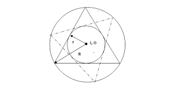  
mathe在2019年3月玩Geogebra时发现，连接双心三角形顶点和对边于内切圆的切点可以交于一点，而这个点的轨迹通常很小，但是看起来很“圆”。
那么[这个轨迹到底是不是圆](https://bbs.emath.ac.cn/thread-15789-1-1.html) 呢？  
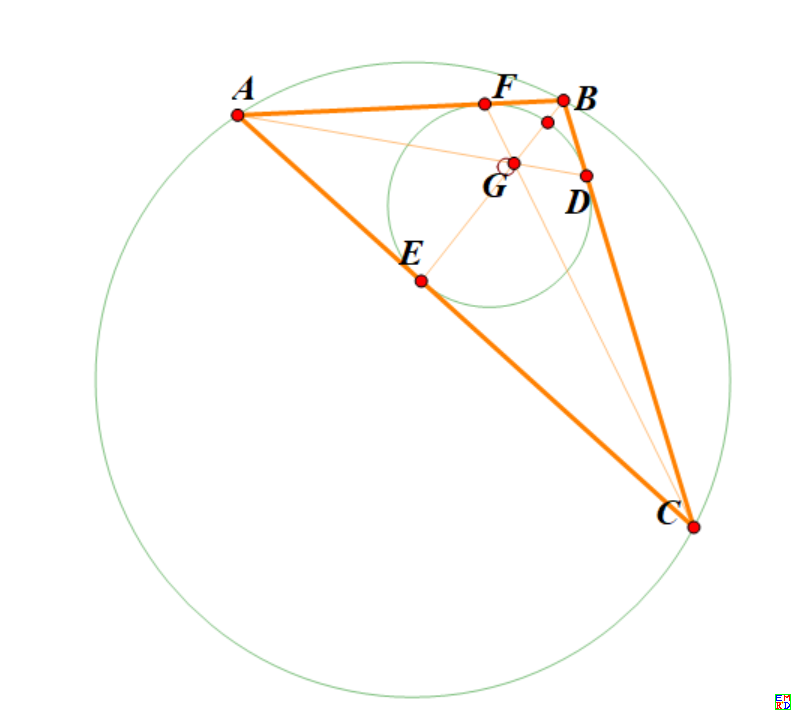  
大家一起展开了热烈讨论，并且发现除了重心意外，双心三角形很多其它心迹都很圆。

# 详细内容
lsr314首先指出，如果轨迹是圆，那么三角形绕一圈时，轨迹会绕三周，而不仅仅一周。zeroieme通过符号运算得出一个及其复杂的表达式，
因式分解得出三个二次表达式的乘积，lsr314给出了[对应轨迹图](https://bbs.emath.ac.cn/forum.php?mod=redirect&goto=findpost&ptid=15789&pid=77931&fromuid=20)   
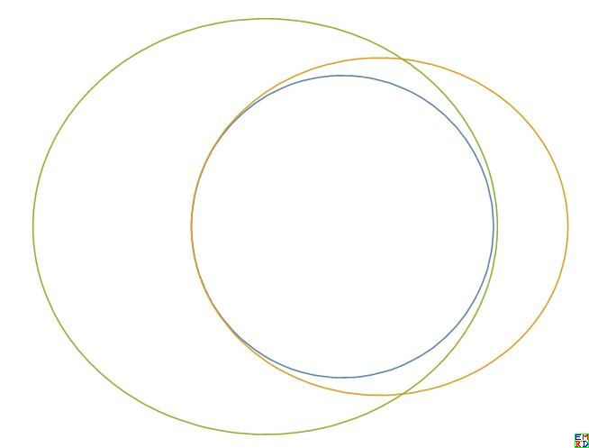  
我们果真在其中[找到了一个圆的方程](https://bbs.emath.ac.cn/forum.php?mod=redirect&goto=findpost&ptid=15789&pid=77922&fromuid=20) $x^2 \left(9 r_o^4-d^2 r_o^2\right)+8 d x r_o^2 \left(d^2-3 r_o^2\right)+y^2 \left(9 r_o^4-d^2 r_o^2\right)+d^6-9 d^4 r_o^2+16 d^2 r_o^4=0$
其中$d$是两个圆心的距离，$r_o$是外接圆半径。  
在将$r_o$设为1，并且重写圆的方程形式为$(3d^2-3)(x^2+y^2-1)-4(d^2-3)\left((x-d)^2+y^2-\frac{(1-d^2)^2}4\right)=0$后我们可以得出这个轨迹圆和外接圆内切圆[同根轴](https://bbs.emath.ac.cn/forum.php?mod=redirect&goto=findpost&ptid=15789&pid=77935&fromuid=20) 。  
wayne在Geogebra下[将轨迹局部放大](https://bbs.emath.ac.cn/forum.php?mod=redirect&goto=findpost&ptid=15789&pid=77941&fromuid=20) ，发现结果还是很圆  
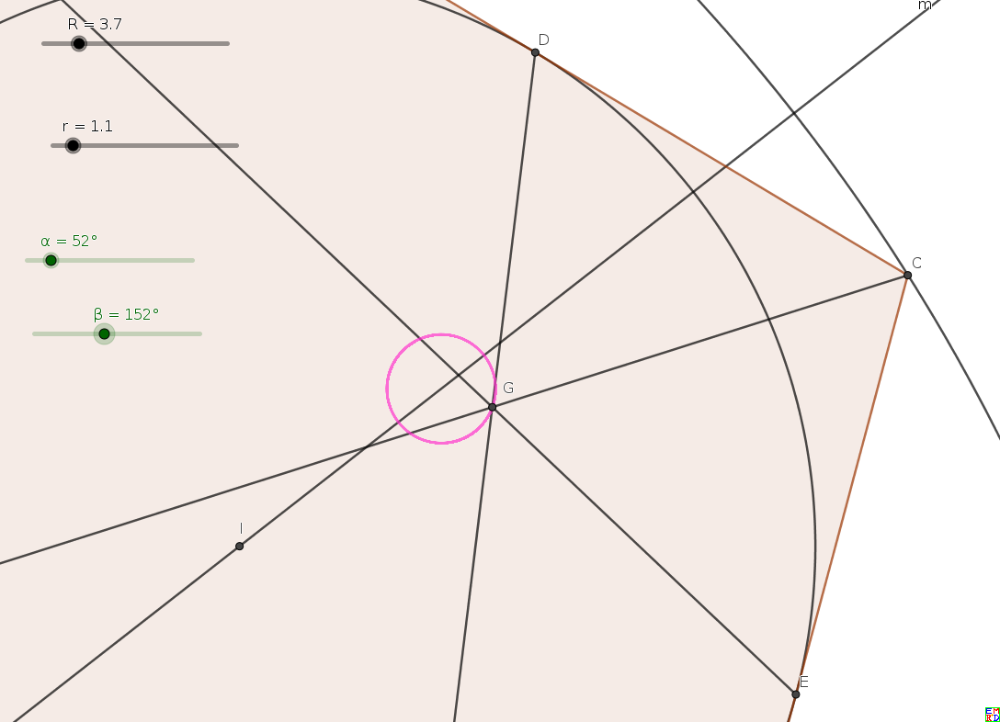  
lsr314尝试这将[双心三角形扩展为双心五边形](https://bbs.emath.ac.cn/forum.php?mod=redirect&goto=findpost&ptid=15789&pid=77949&fromuid=20) ，不过可惜发现顶点和对边切点连线不共点。  
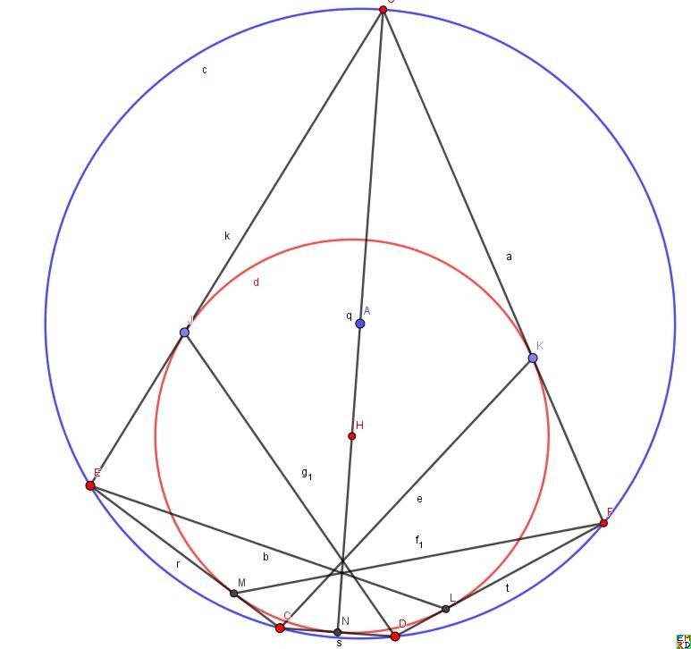  

wayne认为，我们的不变量有三个: 外接圆，内切圆的半径$R,r$，圆心距$d$依赖于$R,r$, 变量是$A$点的坐标。我们将所有的量尽可能的转化成这三个不变量,以及变量$A$来表达。
运用梅涅劳斯定理，$△ACF$被直线$EGB$切割，于是有：$\frac{AE}{EC}\frac{CG}{GF}\frac{FB}{BA} =1$ ,也就是说$\frac{CG}{GF} = \frac{AB\times CD}{AF\times BF} = \frac{c(s-c)}{(s-a)(s-b)},  s=(a+b+c)/2,$  
  
用Geogebra验证了，三角形的重心$M$，垂心$H$的轨迹也是同轴的圆。所以猜测三角形内的所有确定的心的轨迹都应该是同轴的圆。证明方法应该是类似的。就是找到两处三角形的边跟轴垂直的地方，求出中心[即圆心](https://bbs.emath.ac.cn/forum.php?mod=redirect&goto=findpost&ptid=15789&pid=77944&fromuid=20) ，进而用不变量 $R,r,d$来表达 "半径"。

lsr314试验了在三角形内分别作三个与内切圆和两边相切的圆，连接对应的切点的三条直线交于一点。  
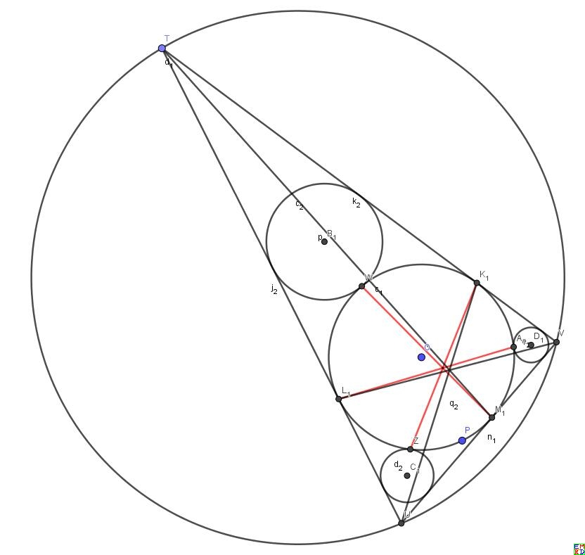  
[这个特殊点的轨迹并不是圆](https://bbs.emath.ac.cn/forum.php?mod=redirect&goto=findpost&ptid=15789&pid=77950&fromuid=20) ，有点像椭圆（红色）, 从而否定了wayne的猜想。（旁边的圆是三角形顶点和切点连线交点的轨迹）  
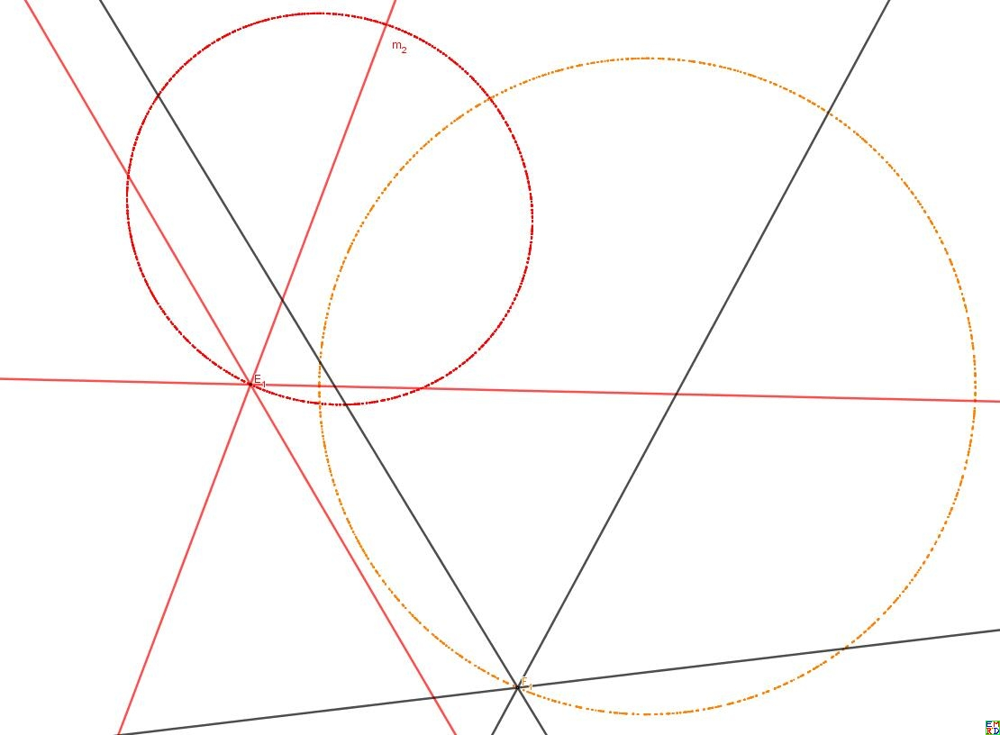  
lsr314认为三角形欧拉线上的点（相对于外心、重心、垂心的位置不变）的轨迹都是一个圆，这些圆的位似中心就是三角形的外心。
但是反过来不成立，比如旁心的轨迹也是一个圆，但是旁心一般不在欧拉线上。  
mathe[通过射影变换改变无穷远直线为一条和外圆相交的直线](https://bbs.emath.ac.cn/forum.php?mod=redirect&goto=findpost&ptid=15789&pid=77958&fromuid=20) ，每边中点改为对应的调和共轭点，
结果得到的图是几何作图验证一条圆锥曲线，但是不是圆。
开始mathe认为在原图中重心轨迹还是可能是圆（但是也可能是椭圆），但是肯定和原先的两圆不共享一条根轴（也就是不在同一个圆系）。但是后来发现这个图
恰恰说明了重心轨迹的确是圆，因为轨迹经过直线（对应原无穷远直线）和圆的交点，并且认为双心三角形中内接圆改为内接椭圆后结论还可能成立。    
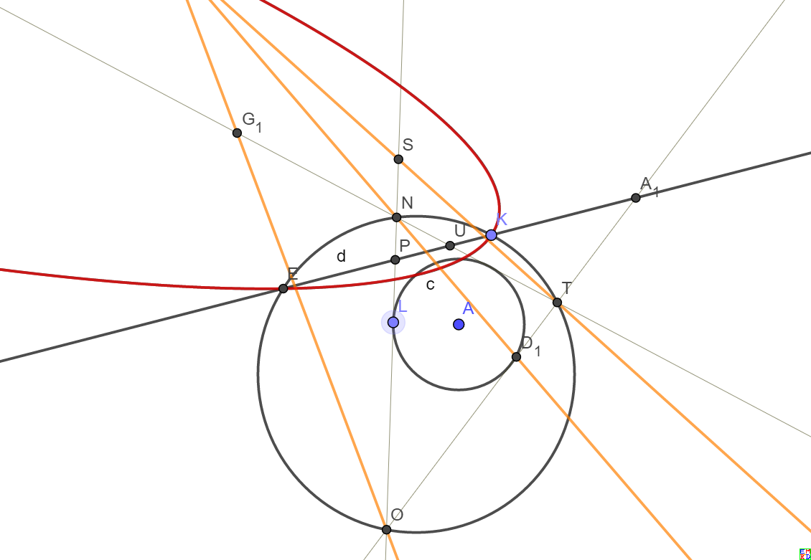  
图中三角形NOT是动三角形，直线EK为固定直线（相当于原图无穷远直线），三边交EK于P,U,A1.
而P关于NO的调和共轭是S(也就是NP*OS=NS*OP),U关于NT的调和共轭是G1, A1关于OT的调和共轭是D1
所以TS,OG1,ND1交于公共点F1,而红色圆锥曲线就是F1在三角形运动时的轨迹。  

关于[椭圆双心三角形的重心轨迹](https://bbs.emath.ac.cn/forum.php?mod=redirect&goto=findpost&ptid=15789&pid=78097&fromuid=20) 有下图，果然还是圆，但是其它心的轨迹就不行了。  
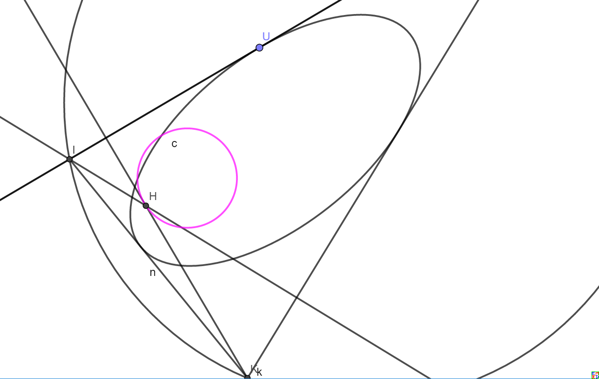  

mathe在一个图中做出了垂心(H)、重心(G)、旁心(P)、费马尔点(F)和顶点切点连线交点(T)[等的轨迹](https://bbs.emath.ac.cn/forum.php?mod=redirect&goto=findpost&ptid=15789&pid=77964&fromuid=20) ，可以看出出了费马尔点其余的都像圆，而费马尔点的轨迹像椭圆
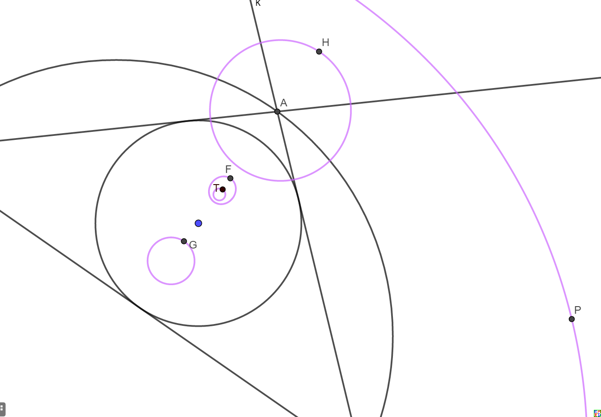  

mathe建议采用面积坐标表示各心的坐标，并且将边长作为参数，数学星空给出了[各心的面积坐标表达式](https://bbs.emath.ac.cn/forum.php?mod=redirect&goto=findpost&ptid=15789&pid=77982&fromuid=20)  

1.重心$G(1:1:1)$

2.内心$I(a,b,c)$

3.旁心$I_A(-a,b,c),I_B(a,-b,c),I_C(a,b,-c)$

4.外心$O(\sin(2A):\sin(2B):\sin(2C))=a^2(b^2+c^2-a^2):b^2(a^2+c^2-b^2):c^2(a^2+b^2-c^2)$

5.垂心$H(\tan(A):\tan(B):\tan(C)=\frac{1}{b^2+c^2-a^2}:\frac{1}{-b^2+c^2+a^2}:\frac{1}{b^2-c^2+a^2}$

6.九点圆圆心$N(a\cos(B-C):b\cos(C-A):c\cos(A-B))=a^2(b^2+c^2)-(b^2-c^2)^2:b^2(c^2+a^2)-(c^2-a^2)^2:c^2(a^2+b^2)-(a^2-b^2)^2$

   九点圆圆心N,外点O,重心G满足：ON:NG=3:-1

7.共轭重心$K(a^2:b^2:c^2)$

   三角形重心的等角共轭点称为共轭重心点；三角形中三条中线对对应内角平分线的等角线称为共轭中线，三条共轭中线的交点就是共轭重心K

8.热尔岗点Gergonne $Ge(\frac{1}{s-a}:\frac{1}{s-b}:\frac{1}{s-c})$

  三角形的内切圆切于BC,AC,AB三边于D,E,F,则AD,BE,CF交于一点称为热尔岗点

9.奈格尔点(Nagel) $Na(s-a,s-b,s-c)$

   三角形三个旁切圆在BC,CA,AB三边上的切点分别记为D',E',F'，则AD',BE',CF'交于一点称为奈格尔点Na

10.费尔巴哈点（Feuerbach)$a(1-\cos(B-C)):b(1-\cos(C-A)):c(1-\cos(A-B))$

   三角形的九点圆和旁切圆的三个切点

11.费马点$F(\frac{1}{\cot(A)+\cot(\frac{\pi}{3})}:\frac{1}{\cot(B)+\cot(\frac{\pi}{3})}:\frac{1}{\cot(C)+\cot(\frac{\pi}{3})})$

lsr314还发现[双心四边形的重心的轨迹](https://bbs.emath.ac.cn/forum.php?mod=redirect&goto=findpost&ptid=15789&pid=78001&fromuid=20) 好像也是圆，但是双心五边形就不行了  
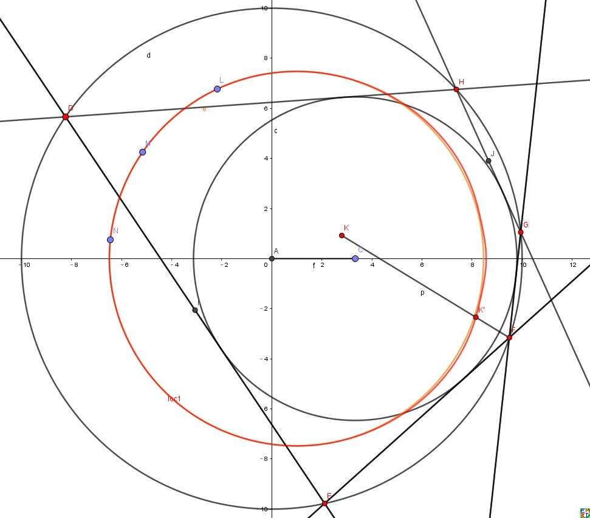  

然后[mathe提议](https://bbs.emath.ac.cn/forum.php?mod=redirect&goto=findpost&ptid=15789&pid=78003&fromuid=20)  
如果我们把整个平面看成复平面，外心O看出原点，内心I看成单位点1，另外再挑一个不在实数轴的点比如重心，设为变复数G.
设三角形三顶点为变复数A,B,C.我们根据上面上个点的面积坐标就可以得出三个方程，如
$G=\frac{A+B+C}3, 1=\frac{aA+bB+cC}{a+b+c}$，外心表达式稍微复杂些$0=a^2(b^2+c^2-a^2)A+b^2(a^2+c^2-b^2)B+c^2(a^2+b^2-c^2)C$,然后就可以解出A,B,C的表达式。同样对于其它任意心，我们也可以再利用其面积坐标再把A,B,C的表达式代入，把任意一个其它写成关于实数参数a,b,c和复数参数G.由于各心的对称心对称心，最终化简后表达式应该关于a,b,c对称，于是我们可以将各系数用r,R,s替换，最后写成f(r,R,s,G)的形式。如果最终结果不含s,由于r,R是常数，如果G的轨迹是圆而且上面表达是是G的分数线性形式，那么结果轨迹也必然是圆。另外参数设计假设了d=1,所以r,R直接有了额外的约束1=R(R-2r)。而G本身也应该可以写成s的表达式(比如二次形式)，但是还没想好如何表示。
利用表达式$|A|^2+|B|^2+|C|^2=3R^2$应该还可以得出一个关于G,s的方程。
上面过程G也可以直接用其它中心X替换，都可以求得一个类似$A=u(a,b,c)X+v(a,b,c)$的形式，而B,C是轮换表示。然后代入$A\bar{A}+B\bar{B}+C\bar{C}=3R^2$可以变化为形如$h+m(X+\bar{X})+nX\bar{X}=0$,其中h,m,n关于a,b,c必然全对称。可以分别替换为r,R,s.如果这时可以得出和s无关的表达式，那么就代表这个点轨迹必然是圆。因为这时方程可改写为$(X+\frac mn)(\bar{X}+\frac mn)=\frac{m^2}{n^2}-h$.  
但是通常情况上面一条关于X的方程带有参数s,并不能确定出X的图像。于是我们应该可以继续利用$A^2\bar{A}^2+B^2\bar{B}^2+C^2\bar{C}^2=3R^4$
这样应该可以得出X关于s的另外一条参数方程。消去s将可以得出X的方程.  
[数学星空利用上面的思路进行计算](https://bbs.emath.ac.cn/forum.php?mod=redirect&goto=findpost&ptid=15789&pid=78075&fromuid=20) ，得出  

1.对于重心G,我们可以设

  $x+yI=\frac{A+B+C}{3},x_0+y_0I=\frac{aA+bB+cC}{a+b+c},0=a^2(b^2+c^2-a^2)A+b^2(a^2-b^2+c^2)B+c^2(a^2+b^2-c^2)C$

  消元结果：$9R^2x^2-12R^2xx_0+4R^2x_0^2+9R^2y^2-12R^2yy_0+4R^2y_0^2-x_0^4-2x_0^2y_0^2-y_0^4=0$

  简化结果：$(3x-2x_0)^2+(3y-2y_0)^2=(\frac{x_0^2+y_0^2}{R})^2$
  

2.对于垂心H，我们可以得到：

  消元结果：$R^2x^2-4R^2xx_0+4R^2x_0^2+R^2y^2-4R^2yy_0+4R^2y_0^2-x_0^4-2x_0^2y_0^2-y_0^4=0$
  
  简化结果：$(x-2x_0)^2+(y-2y_0)^2=(\frac{x_0^2+y_0^2}{R})^2$

3.对于热尔岗点Ge,我们可以得到：

   消元结果：$9R^4x^2-24R^4xx_0+16R^4x_0^2+9R^4y^2-24R^4yy_0+16R^4y_0^2-R^2x^2x_0^2-R^2x^2y_0^2+8R^2xx_0^3+8R^2xx_0y_0^2-9R^2x_0^4-R^2x_0^2y^2+8R^2x_0^2yy_0-18R^2x_0^2y_0^2-R^2y^2y_0^2+8R^2yy_0^3-9R^2y_0^4+x_0^6+3x_0^4y_0^2+3x_0^2y_0^4+y_0^6=0$

   简化结果：$(x+\frac{4x_0(-3R^2+x_0^2+y_0^2)}{9R^2-x_0^2-y_0^2})^2+(y+\frac{4y_0(-3R^2+x_0^2+y_0^2)}{9R^2-x_0^2-y_0^2})^2=(\frac{(x_0^2+y_0^2)(R^2-x_0^2-y_0^2)}{(9R^2-x_0^2-y_0^2)R})^2$

4.对于奈格尔点Na,我们可以得到：

   消元结果：$R^2x^2+R^2y^2-x_0^4-2x_0^2y_0^2-y_0^4=0$

   简化结果：$x^2+y^2=(\frac{x_0^2+y_0^2}{R})^2$

5.对于九点圆圆心N,我们可以得到：
  
   消元结果：$4R^2x^2-8R^2xx_0+4R^2x_0^2+4R^2y^2-8R^2yy_0+4R^2y_0^2-x_0^4-2x_0^2y_0^2-y_0^4=0$

   简化结果：$(x-x_0)^2+(y-y_0)^2=(\frac{x_0^2+y_0^2}{2R})^2$

由此我们验证了这五种心迹都是圆。而且除了热尔岗点，其它的方程都出乎意料的简单。  

