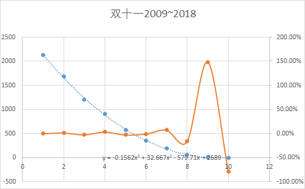
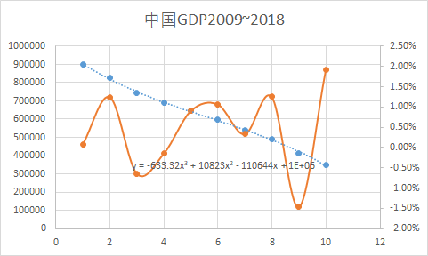
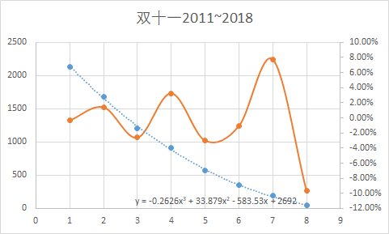
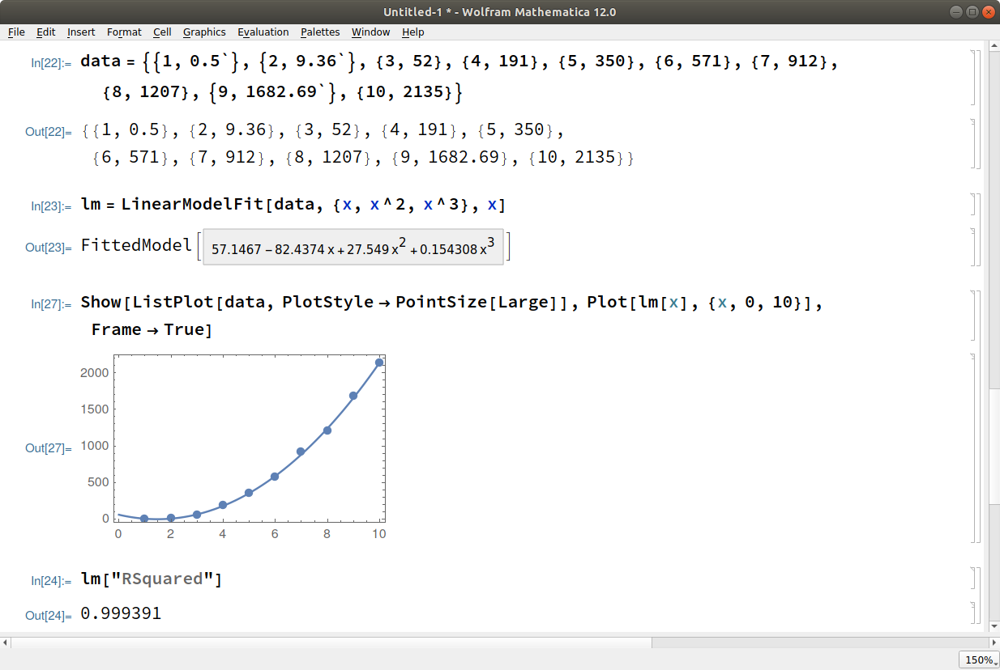
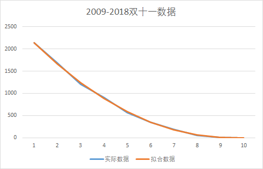
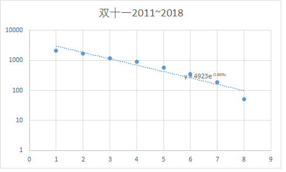

# 摘要
wayne转载了一个关于双十一数据“作假”的新闻，我们搜索网络可以得到[很多相关信息](https://new.qq.com/omn/20191112/20191112A0ANYJ00.html)

问题提出者发现通过三次回归曲线将天猫双十一历经10年数据进行拟合，拟合度均超过99.94%，这个数据过于完美，不符合现实，并且提前预测今年双十一销售额为2689亿元，和实际的2684亿元仅差5亿。  
这个分析结果咋一看的确非常有说服力。我们对数据进行了重复分析，最终确定，没有任何理由认为天猫双十一数据存在人为作假。网络上认为数据作假的提出者也不应该是故意中伤天猫，而只是因为错用了数学模型，导致了错误的结论。  
这个问题提出已经有了相当长的时间，作为技术公司的阿里除了表示对造谣者追究法律责任之外，这么久未能找出问题所在，让人有点失望。

# 具体信息
看到这个消息，mathe首先自己在excel里面同样对这些双十一销售数据进行了拟合，并且同时对中国相应年份的GDP数据进行了拟合  
  
  
图中各点分别代表2018~2009年双十一销售额数据和中国GDP数据（横坐标1代表2018年，横坐标10代表2009年），
虚线代表三次回归曲线（并且给出了对应方程），那条棕色波浪线代表实际数据和模拟数据之间的相对误差。

对比两图，可以看出双十一数据在2009和2010年的相对误差分别超过和接近100%，倒是相应的中国GDP数据很平稳，最大相对误差不超过2%。从这个结果，我们没有任何
理由相信双十一销售额存在人工作假问题。  

由于观察到2009和2010年两年的相对误差过大，mathe又做了一幅图，淘汰了2009和2010年数据，再次做三次回归，得到如下结果  
  
这次我们可以看到，最大相对误差还在10%左右，对比GDP数据可以看出拟合结果一点也不好。  
看到mathe的结果后，wayne用mathematica也做了相应的模拟，并且计算了拟合结果的RSquared值，得出如下结果  
  
这下我们可以大概知道这个99.94%的拟合度的来源了。  
但是为什么这两个结果会相差这么大呢？

mathe比较了通过双方的拟合公式计算的数据  

|--------|--------|------------|-----------|
|2018   |2135   |2141.8008|2141.9807 |
|2017  |1682    |1658.9984|1659.169632|
|2016 |1207    |	1239.6556|1239.789196|
|2015 |912    |	882.8352|	882.913544|
|2014 |571    |	587.6|587.616828|
|2013 |350    |	353.0128|	352.9732|
|2012 |191    |	178.1364|	178.056812|
|2011 |52    |	62.0336|	61.941816|
|2010 |9.36    |	3.7672|	3.702364|
|2009 |0.5    |	    2.4|2.412608|

可以看出双方的拟合结果没有本质的却别，除了由于2018年的数据mathe用了1682, wayne用了1682.69导致双方的结果出现细微的区别以外，没有很大的区别。  
但是为什么最终的结论是如此不同呢？  

mathe觉得其中最根本的原因在于三次回归的目标是总的绝对误差的平方和最小。对于像双十一这种指数速度快速递增的数目，拟合的结果会导致最后几年那些很大的数据被
拟合的很好，但是那些较早的小数据拟合的结果非常差。  
从上面表格可以看出，各种数据拟合以后的绝对误差都不大，比如2018年的拟合误差很小，约7亿。  
但是对于2010年的误差5.6亿相对当年营业额9.36亿就非常巨大了；而2009年的偏差更加离谱，把0.5亿拟合成2.4亿。  
但是就是这样的结果，R-Squared 的评价是99.94%。所以最根本的原因还是拟合的方法和评价体系不对，把应该通过相对误差分析的结果用绝对误差进行分析。  
同样，如果不采用对数坐标，对结果图片进行查看，由于最初几年的数据两组数据绝对值都太小了，完全看不出区别。
  
但是同样的数据如果采用对数坐标，我们马上可以看出最初几年(图的右边的数据)拟合的其实一点也不好  
  

另外我们查看[R-Squared的计算公式](https://www.investopedia.com/terms/r/r-squared.asp) 为
$R^2 = 1 - \frac{Explained Variation}{Total Variation}$
可以看出，其结果实际上和样本本身的波动情况(Total Variation)密切相关。对于双十一这种指数快速递增的数据，其数据本身的波动太大了，
导致Total Variation过大，所以计算出来的$R^2$就非常接近1了。实际上这个计算出来的数据是0.9994并不代表拟合程度的百分比，而只是一种参考数值。  
如果我们继续查看上面关于R-Square的网页中关于R-Squared的局限性，就可以发现有 
```bash
Limitations Of R-Squared
R-squared will give you an estimate of the relationship between movements of a dependent variable based on an independent variable's movements. It doesn't tell you whether your chosen model is good or bad, nor will it tell you whether the data and predictions are biased. A high or low R-square isn't necessarily good or bad, as it doesn't convey the reliability of the model, nor whether you've chosen the right regression. You can get a low R-squared for a good model, or a high R-square for a poorly fitted model, and vice versa.
```
也就是说，R-squared可以告诉你预测公式和实际情况的差距有多少，但是并不能告诉你你的预测模型本身是不是合理的。

对于这种指数递增的数据，比较合理的拟合是将销售额取对数以后，再进行拟合，比如下图才是比较合理的结果  
  
可以看出，结果还是很正常的，而且从图中可以看出，最近几年双十一销售额的增长率开始有一点放慢了。  

