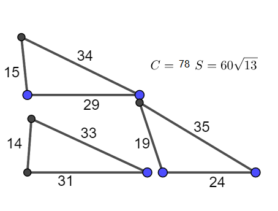

# 摘要
lsr314于[2019年11月提问](https://bbs.emath.ac.cn/thread-17031-1-1.html) ：  
称三边长都是正整数并且最大公约数为$1$的三角形为本原三角形。  
三边长分别为$(14,31,33),(15,29,34),(19,24,35)$的三个三角形，周长都等于$78$，面积都是$60sqrt{13}$。  
  
那么，是否存在四个周长和面积彼此相等的本原三角形？五个以及更多个呢？  
如果不要求本原，那么任意多个都是可以的：
假设$P(x,k)$是曲线$k^2 + 2 k x^2 =2 x^3 + x^2 + \frac x9$上的有理点，且$-1\le x\le 0,a=6(1+x),$再由$a+b+c=12,(6-a)(6-b)(6-c)=6$解出$b,c$即得到一个和$(3,4,5)$周长和面积相等的三角形。同时放大即得到整数边长的三角形，这样的解有无限多个。  

# 详细内容
mathametica很快给出[另外几个三个等周等积本原三角形的例子](https://bbs.emath.ac.cn/forum.php?mod=redirect&goto=findpost&ptid=17031&pid=81956&fromuid=20) :  
$$
\begin{pmatrix}
 31 & 89 & 96 & 216 & 36 \sqrt{1463} \\
 32 & 87 & 97 & 216 & 36 \sqrt{1463} \\
 51 & 64 & 101 & 216 & 36 \sqrt{1463} \\
\end{pmatrix}
\begin{pmatrix}
 17 & 122 & 123 & 262 & 12 \sqrt{7467} \\
 23 & 112 & 127 & 262 & 12 \sqrt{7467} \\
 59 & 74 & 129 & 262 & 12 \sqrt{7467} \\
\end{pmatrix}
\begin{pmatrix}
 43 & 106 & 113 & 262 & 60 \sqrt{1441} \\
 56 & 87 & 119 & 262 & 60 \sqrt{1441} \\
 71 & 71 & 120 & 262 & 60 \sqrt{1441} \\
\end{pmatrix}
\begin{pmatrix}
 51 & 101 & 110 & 262 & 60 \sqrt{1834} \\
 61 & 86 & 115 & 262 & 60 \sqrt{1834} \\
 71 & 75 & 116 & 262 & 60 \sqrt{1834} \\
\end{pmatrix}
\begin{pmatrix}
 55 & 103 & 104 & 262 & 12 \sqrt{52269} \\
 59 & 93 & 110 & 262 & 12 \sqrt{52269} \\
 74 & 75 & 113 & 262 & 12 \sqrt{52269} \\
\end{pmatrix}
\begin{pmatrix}
 66 & 95 & 101 & 262 & 30 \sqrt{10218} \\
 71 & 86 & 105 & 262 & 30 \sqrt{10218} \\
 77 & 79 & 106 & 262 & 30 \sqrt{10218} \\
\end{pmatrix}
$$

并且给出了[俩组四个等周等积本原三角形的例子](https://bbs.emath.ac.cn/forum.php?mod=redirect&goto=findpost&ptid=17031&pid=81958&fromuid=20)  
$$
\begin{pmatrix}
 49 & 108 & 109 & 266 & 420\sqrt{38}\\
 53 & 98 & 115 & 266 & 420\sqrt{38}\\
 58 & 91 & 117 & 266 & 420\sqrt{38}\\
 63 & 85 & 118 & 266 & 420\sqrt{38}\\
\end{pmatrix}
\begin{pmatrix}
 32 & 117 & 125 & 274 & 60 \sqrt{959}\\
 37 & 109 & 128 & 274 & 60 \sqrt{959}\\
 47 & 97 & 130 & 274 & 60 \sqrt{959}\\
 62 & 81 & 131 & 274 & 60 \sqrt{959}\\
\end{pmatrix}
$$  
随后给出了更多四个本原三角形的结果，并且给出了[五个等周等积本原三角形](https://bbs.emath.ac.cn/forum.php?mod=redirect&goto=findpost&ptid=17031&pid=81965&fromuid=20) 的结果  
$$
\begin{pmatrix}
 50 & 157 & 163 & 370 & 30 \sqrt{17094} \\
 53 & 150 & 167 & 370 & 30 \sqrt{17094} \\
 59 & 141 & 170 & 370 & 30 \sqrt{17094} \\
 75 & 122 & 173 & 370 & 30 \sqrt{17094} \\
 95 & 101 & 174 & 370 & 30 \sqrt{17094} \\
\end{pmatrix}
$$  

后面他还给出了更多的五个等周等积本原三角形，并且还有[很多周长相同面积不同的组](https://bbs.emath.ac.cn/forum.php?mod=redirect&goto=findpost&ptid=17031&pid=81966&fromuid=20) 的。  

[wayne分析](https://bbs.emath.ac.cn/forum.php?mod=redirect&goto=findpost&ptid=17031&pid=81975&fromuid=20) :
设三角形三边分别是$x+y,y+z,z+x$,周长$2p$,面积为$A$, 那么$x+y+z = \frac L2=p,$,再根据海伦公式 $ xyz(x+y+z) =p xyz=A^2$,  
设$GCD(x,y,z)=1$, 解方程得通解 $x=uv,y=vw,z=wu,p=uv+vw+wu, A^2=u^2v^2w^2(uv+vw+wu)$,其中$GCD(u,v,w)=1$.  
zeroieme指出：  
若u,v,w为奇，于是x=uv,y=vw,z=wu为奇,因此x+y,y+z,z+x为偶，需要补丁。  

dlsh提出，有面积也是整数的解吗？

wayne找到了[一些周长更小的解](https://bbs.emath.ac.cn/forum.php?mod=redirect&goto=findpost&ptid=17031&pid=81981&fromuid=20) ，不过可以有些不是本原三角形:  
他给出了如下的Mathematica代码:  
```bash
{a, b, c, x, y, z} =.; Table[{length, 
  Table[{{a, b, c} = tuple; 
    sol = Solve[
      x + y + z == 
        a + b + c && (x + y - z) (x - y + z) (-x + y + z) == (a + b - 
           c) (-a + b + c) (a - b + c) && z >= y >= x > 0, {x, y, z}, 
      Integers]; If[Length[sol] > 3, tmp = {x, y, z} /. sol;
     Print[{tuple, length, 
       Sqrt[(a + b - c) (-a + b + c) (a - b + c) length]/4, tmp}];
     tmp, {}]}, {tuple, 
    Select[IntegerPartitions[length, {3}], 
     GCD @@ # == 1 && #.{-1, 1, 1} > 0 && #.{1, -1, 1} > 
        0 && #.{1, 1, -1} > 0 &]}]}, {length, 1, 260}]
```
并且给出了面积为整数的一组解，但是同样没有满足本原的条件：  
$\begin{pmatrix}74&182&192\\84&164&200\\96&149&203\\104&140&204\end{pmatrix}$  周长448,面积是6720.  

mathe指出[方程可以转化为椭圆曲线方程](https://bbs.emath.ac.cn/forum.php?mod=redirect&goto=findpost&ptid=17031&pid=81988&fromuid=20) ，但是同样不能很好处理本原三角形的条件:  
找周长和面积的平方都是有理数而且相等的多个三角形，wayne已经转化为找三个有理数x,y,z使得  
$x+y+z=p, xyz=H=\frac{A^2}p$, 如果存在有理解，说明对于选定的z,  
 那么$(x+y)^2=(p-z)^2, xy=\frac Hz$, 所以$(x-y)^2=(p-z)^2-\frac{4H}z$, 或者$(\frac{x-y}z)^2=(\frac pz-1)^2-\frac{4A^2}{pz^3}$.  
所以$(\frac{x-y}{2Apz})^2=(\frac1{2Az}-\frac1{2Ap})^2-\frac1{p^3z^3}$  
设$Y=\frac{x-y}{2Apz}, X=-\frac1{pz}$,于是转变为椭圆曲线$Y^2=X^3+(\frac{pX}{2A}+\frac1{2Ap})^2$  
而对于这样一个椭圆曲线，如果存在一个有理解，那么通常的我们可以通过椭圆曲线上的加法运算得到更多的（甚至无穷组）椭圆曲线上的有理点。所以关键就是找一条包含无穷组有理点的椭圆曲线，转化为上面的格式然后就可以找出很多个周长面积相等的本原三角形。  

几天后，wayne找出了6个本原三角形的解  
周长$854$,面积$420\sqrt{2379}$
$\begin{pmatrix}112&367&375\\115&357&382\\127&336&391\\147&310&397\\167&287&400\\193&259&402\end{pmatrix}$  
lsr314找出了更多本原三角形的解  
找到一组七个的,周长为$1778$，面积为$120 sqrt[265811]$:  
$\begin{pmatrix}153&811&814\\199&729&850\\239&682&857\\314&601&863\\337&577&864\\369&544&865\\439&473&866\end{pmatrix}$  
七个的也不少，周长更小的是$1022$，面积为$420 sqrt[5694]$:  
$\begin{pmatrix}147&436&439\\151&420&451\\175&381&466\\186&367&469\\196&355&471\\231&316&475\\251&295&476\end{pmatrix}$  
八个的，周长$3302$，面积$180sqrt[4830826]$：  
$\begin{pmatrix}601& 1347& 1354\\606& 1315& 1381\\625& 1266& 1411\\643& 1233& 1426\\739& 1101& 1462\\796& 1035& 1471\\841& 986& 1475\\859& 967& 1476\end{pmatrix}$

周长$3914$，面积$420 sqrt[1679106]$：  
$\begin{pmatrix}697& 1572& 1645\\725& 1502& 1687\\732& 1489& 1693\\813& 1369& 1732\\956& 1201& 1757\\982& 1173& 1759\\1021& 1132& 1761\\1075& 1077& 1762\end{pmatrix}$

周长$4222$，面积$120 sqrt[32190639]$：  
$\begin{pmatrix}836& 1643& 1743\\869& 1567& 1786\\887& 1536& 1799\\911& 1499& 1812\\938& 1461& 1823\\1006& 1375& 1841\\& 1295& 1851\\1175& 1191& 1856\end{pmatrix}$

九个的，周长$3718$，面积$60060 sqrt[57]$：  
$\begin{pmatrix}605& 1499& 1614\\634& 1441& 1643\\662& 1397& 1659\\671& 1384& 1663\\{719& 1320& 1679\\759& 1271& 1688\\795& 1229& 1694\\914& 1099& 1705\\977& 1034& 1707\end{pmatrix}$

用了一个比较高效的算法。  
十个的，周长是$19058$，面积是$360360 sqrt[733]$：  
$\begin{pmatrix}2379& 8206& 8473\\2401& 8129& 8528\\2473& 7956& 8629\\2753& 7504& 8801\\3094& 7065& 8899\\3289& 6834& 8935\\3479& 6617& 8962\\3913& 6141& 9004\\3985& 6064& 9009\\4810& 5209& 9039\end{pmatrix}$  

十一个的，周长是$21926$，面积是$47880 sqrt[98090]$：  
$\begin{pmatrix}3268& 9263& 9395\\3363& 8923& 9640\\3403& 8835& 9688\\3466&   8713& 9747\\3907& 8056& 9963\\4243& 7638& 10045\\4588& 7239&   10099\\4663& 7155& 10108\\4883& 6913& 10130\\5455& 6308&   10163\\5523& 6238& 10165\end{pmatrix}$  

十一个的还有一组更小的，周长$16462$，面积$840 sqrt[87734229]$:  
$\begin{pmatrix}2246& 7041& 7175\\2247& 7034& 7181\\2291& 6871& 7300\\2351& 6735& 7376\\2417& 6614& 7431\\2631& 6293& 7538\\2911& 5936& 7615\\3063& 5756& 7643\\3556& 5207& 7699\\3975& 4766& 7721\\4304& 4431& 7727\end{pmatrix}$  

以及5个面积为整数的本原三角形  
有五个的，周长是$7546$，面积是$2522520$：  
$\begin{pmatrix}1901&2772&2873\\1914&2723&2909\\1925&2693&2928\\2018&2525&3003\\2213&2288&3045\end{pmatrix}$  
并且给出了对应的代码
```bash
maxabc = 5*10^3;
maxprime = 20;
f[l_] := Last[Cases[FactorInteger[l], {mm_, nn_} -> mm]]
R = Select[Range[maxabc], f[#] < maxprime &];
Length[R]
Do[p = a + b + c; q = a b c; gg = Select[Divisors[q], (p > # > p/3) &];
 g = Select[gg, IntegerQ[Sqrt[(p - #)^2 - 4 q/#]] &];
 If[Length[Complement[g, {a, b, c}]] >= 4,
  g1 = {{a + b, a + c, c + b}};
  Do[d = Sqrt[(p - t)^2 - 4 q/t]; {x, y, z} = 
    Sort[{p - t, (p + t + d)/2, (p + t - d)/2}]; 
   g1 = Union[g1, {{x, y, z}}], {t, Complement[g, {a, b, c}]}];
  If[Length[g1] >= 5 && Union[Table[GCD @@ kk, {kk, g1}]] == {1}, 
   Print[{Length[g1], a, b, c, g1}]]], {a, Select[R, # > 727 &]}, {b, 
  Select[R, # >= a &]}, {c, 
  Select[R, (# >= b && GCD[a + b, b + #, a + #] == 1 && 
      IntegerQ[Sqrt[a b # (a + b + #)]]) &]}]
```