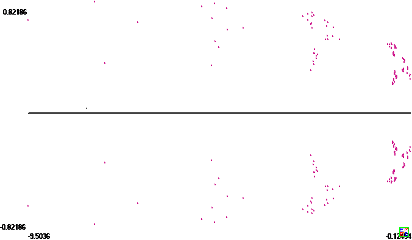

数学星空[于2015年底提问](https://bbs.emath.ac.cn/thread-8790-1-1.html) :  
对于$a(n+1)=a(n)+\frac{1}{a(n)^2},a(1)=1$,

我们可以利用微分方程求解$a(n)$的第一阶项.

设$a(n)=y$

又$a(n+1)-a(n)=a^{\prime}(n)$

则有$y^{\prime}y^2=1$

求解得到:$a(n)=y \approx (3n)^{\frac{1}{3}}$

接下来,我们可设

$(a(n))^3=3n+a+b\ln(n)+\frac{c}{n}+\frac{d}{n^2}+\frac{e}{n^3}+\frac{f}{n^4}+\dots$

本主题的任务是如何求解$a,b,c,d,e$?

或者利用数学计算软件或者数学理论给出更精确的表达式?

注:Kuing(郭子伟)已证明(P111，kuingluing20151222)

$(3n)^{1/3}<a(n)<(3n)^{1/3}+(3n)^{-1/3}$

并指出(彩色の夢∩o∩)给出下面结果,但并未给出证明过程:

$(a(n))^3=3n+2+\ln(n+2)-\frac{1}{9n+6}-\ln(5)+\frac{1}{15}$

最终我们通过努力，得出这个数列的无穷项展开形式。而且这种方法可以使用在很多类似的数列上，比如:  
2010年初数学星空提问的[一个数列不等式](https://bbs.emath.ac.cn//thread-2056-1-1.html) 也可以用类似方法分析:  
若数列${a_n}$满足 :  
$a_1=\frac12 , a_{n+1}=\frac12(a_{n}^2+1)$  
则: $1-\frac2n+\frac2{n^2}\ln(\frac n3)+\frac{417}{128n^2}\le a_n\le 1-\frac 2n+\frac{5\ln n+3}{2n^2}$

# 初步逼近

mathe很快给出[如下分析方案](https://bbs.emath.ac.cn/forum.php?mod=redirect&goto=findpost&ptid=8790&pid=61862&fromuid=20) :  
$a(n+1)=a(n)+\frac{1}{a(n)^2}$  
得出  
$a(n+1)^3=a(n)^3+3+\frac{3}{a(n)^3}+\frac{1}{a(n)^6}$  
归纳容易得出对于$n\ge 2$有$a(n)^3\ge 3n+2$于是重新代入上面得出  
$a(n)^3\le 8+3(n-2)+3\sum_{k=2}^{n-1}\frac{1}{3k+2}+\sum_{k=2}^{n-1}\frac{1}{(3k+2)^2}$  
然后我们可以利用积分估算得出  
$a(n)^3\le 8+3(n-2)+\ln(3(n-1)+2)-\ln(8)+\frac{1}{8}-\frac{1}{3(n-1)+2}=3n+\ln(3n-1)-\frac{1}{3n-1}+\frac{1}{8}+2-\ln(8)\lt 3n+2+\ln(n)$  
而在得到这个上界后，我们有可以利用它来估计下界得出  
$a(n)^3 \ge 8+3(n-2) +3\sum_{k=2}^{n-1} \frac{1}{3n+2+\ln(n)}$  
而且容易看出后面求和式$3\sum_{k=2}^{n-1}\frac{1}{3n+2}$的差在$n$趋向无穷收敛到一个常数  
所以可以知道存在常数$C$是的$a(n)^3 \ge 3n+\ln(n)+C$  
也就是我们可以非常轻松证明$a(n)^3-3n-\ln(n)$有界，进一步分析还可以得出其极限存在，但是求这个极限比较有难度  
而数值计算$\Delta(n)=a(n)^3-3n-\ln(n)$,有  
$\Delta(10)  =1.220832$  
$\Delta(100)=1.151530$  
$\Delta(1000)=1.137657$  
$\Delta(10000)= 1.135573$  
$\Delta(100000)=1.135295$  
$\Delta(1000000)= 1.135261$  
$\Delta(10000000)=1.135256$  
所以可以看出1＃彩色の夢∩o∩)估计公式中常数项偏离比较大，倒是本楼开头估计是中对应常数项$\ln(3)+\frac{1}{8}+2-\ln(8)$只略微大了一些  
同样要数值计算这个极限值，也可以先计算前面若干项，然后对于余下部分求和式和近似公式求差值，而差值部分误差可以非常容易估计，这样就可以得出极限值一个较好的估计范围了。  

# 无穷展开
次日Buffalo给出了一个神奇的含$\ln(n)$的[无穷展开式形式](https://bbs.emath.ac.cn/forum.php?mod=redirect&goto=findpost&ptid=8790&pid=61867&fromuid=20) :  
首先令$b_n=a_n^3$，得到$b_{n+1}=b_n+3+\frac{3}{b_n}+\frac{1}{b_n^2}$。渐近式前三项当然是$3n+\ln n+a$，但是后面的项可不是$\frac{1}{n}$的简单级数，而应该是$\sum_{i=1}^{\infty}\frac{P_i(\ln n,a)}{n^i}$，这里的$P_i(\ln n,a)$是$\ln n$的$i$次多项式（事实上同时也是$a$的$i$次多项式）。用待定系数法，令$f_m(n)=3n+\ln n+a+\sum_{i=1}^{m}\frac{P_i(\ln n,a)}{n^i}$让mathematica在$n=\infty$处展开$f_{m}(n+1)-f_m(n)-3-\frac{3}{f_m(n)}-\frac{1}{f_m(n)^2}$到$O(\frac{1}{n^{m+1}})$逐次得到$P_i(\ln n,a)$。计算发现$P_i(\ln n,a)$实际上很神奇地仅仅是是$\ln n+a$的$i$次多项式，而且系数有很明显的规律，可以把一部分项合并降低次数，目前做到$b_n\approx 3n+\ln n+a+\ln(1+\frac{\ln n+a}{3n})-\frac{5}{6(3n+\ln n+a)}+\frac{\ln(1+\frac{\ln n+a}{3n})}{3n+\ln n+a}+\sum_{i=2}^{\infty}\frac{Q_i(ln n+a)}{n^{i+2}}$，想进一步降低多项式次数遇到数列{270, 870, 1725, 2780, 4000, 5361}，找不到规律。

前的结果用于快速计算任意初值的数列极限值已经足够了：已经知道$b_n\approx 3n+\ln n+a+\ln(1+\frac{\ln n+a}{3n})−\frac{5}{6(3n+\ln n+a)}+\frac{\ln(1+\frac{\ln n+a}{3n})}{3n+\ln n+a}-\frac{1}{6n^2}+\sum_{i=1}^{\infty}\frac{Q_i(\ln n+a)}{n^{i+2}}$，从初值出发计算$N$项，定义$\Delta(n)=b_n-3n-\ln n$，$\Delta(N)$就是极限a的粗略值$d_0$，然后令$d_{i+1}=\Delta(N)-\ln(1+\frac{\ln N+d_i}{3N})+\frac{5}{6(3N+\ln N+d_i)}-\frac{\ln(1+\frac{\ln N+d_i}{3N})}{3N+\ln N+d_i}+\frac{1}{6N^2}$，这样迭代数次直至结果不变，这个值和真实极限值的误差是$O(\frac{\ln N}{N^3})$。
费点功夫把展开式多计算几项就可以得到更好的逼近效果$O(\frac{(\ln N)^i}{N^{i+2}})$。
作为例子，选初值为1，计算100项，迭代几次后得到极限值为1.1352567349497837，计算10000项，迭代几次后得到极限值为1.1352558474127066，两者相差$8.9\times 10^{-7}$，小于估计的$O(\frac{\ln N}{N^3})\approx 5\times 10^{-6}$

假设已经求得初值为$b_1$的数列的通式$b_n=f(n,b_1)\approx 3n+\ln n+h_{b_1}+R(n,a(b_1))$，现在来看对极限值$h_{b_1}$我们能了解到什么程度。
递推方程是平移不变的，因此$f(n,b_i)=f(n,f(i,b_1))=f(n+i-1,b_1)$，所以有$h_{b_i}=\lim_{n\to\infty}(f(n,b_i)-3n-\ln n)=\lim_{n\to\infty}f(n+i-1,b_1)-3n-\ln n=h_{b_1}+3i-3$，这是个严格的等式。由$b_i=f(i,b_1)~3i+\ln i+h_{b_1}+R(i,h_{b_1})$可以迭代求得$3i\approx b_i-\ln\frac{b_i}{3}-h_{b_1}+...$，最后得到$h_{x}~x-\ln \frac{x}{3}-3+\frac{5}{6x}+\frac{2}{3x^2}+\frac{77}{108x^3}+\frac{133}{240x^4}-\frac{2669}{5400x^5}-\frac{1676}{567x^6}+O(\frac{1}{x^7})$。非常神奇的是尽管$f(n,a)$里含有巨量的$\ln n+a$，可是后面的项里面不仅$h_{b_1}$合情合理地消失了，连$\ln x$也无影无踪。
对于很大的初值$b_1$，可以直接用这个表达式作为近似值。如果$b_1$不太大，可以先迭代$i-1$次得到较大的$b_i$，算出$h_{b_i}$，然后用等式$h_{b_1}=h_{b_i}-3i+3$计算。

mathe对Buffalo的结果[做进一步推导](https://bbs.emath.ac.cn/forum.php?mod=redirect&goto=findpost&ptid=8790&pid=61884&fromuid=20) :  
对于$b_{n+1}=b_n+3+\frac{3}{b_n}+\frac{1}{b_n^2}$,假设
$b_n=3n+\ln(n)+a+\sum_{k=1}^{+\infty}\frac{P_k(\ln(n)+a)}{n^k}$

我们先查看$\frac{P_k(\ln(n+1)+a)}{(n+1)^k}=\frac{P_k(\ln(n)+a+\ln(1+\frac{1}{n}))}{n^k*(1+\frac{1}{n})^k}$,
这个式子展开后是一个无穷级数，可以写成形如$\sum_{h=k}^{+\infty}\frac{Q_{k,h}(\ln(n)+a)}{n^h}$的级数，其中
每个$Q_{k,h}(.)$都是次数不超过k的多项式,而且同$a$无关。  
所以从形式上，这种形式的级数应该是可以用于这种递推式的，但是得出的结果不一定是收敛的，如同$\Gamma$函数的Stirling级数就是不收敛的，而只是一种渐近式。  
为了计算方便，我们可以将$b_n=3n+\ln(n)+a+\sum_{k=1}^{+\infty}\frac{P_k(\ln(n)+a)}{n^k}$中n用$\frac{1}{y}$代替，而$\ln(n)+a$用$X$代替，写成形式级数  
$b_n=\frac{3}{y}+X+\sum_{k=1}^{+\infty}P_k(X)y^k$  
而其中如果我们将$y$替换为$\frac{y}{1+y}$,然后再将$X$替换为$X+\ln(1+y)$,就可以得出$b_{n+1}=\frac{3(1+y)}{y}+X+\ln(1+y)+\sum_{k=1}^{+\infty}\frac{P_k(X+\ln(1+y))y^k}{(1+y)^k}$
然后代入原始递推式即可。  
比如在Pari/Gp,我们可以输入
```bash
(16:47) gp > 3/y+X+(b00+b01*X)*y+(b10+b11*X+b12*X^2)*y^2+O(y^3)
%1 = 3*y^-1 + X + (b01*X + b00)*y + (b12*X^2 + b11*X + b10)*y^2 + O(y^3) //这个即$b_n$二阶近似
(16:49) gp > subst(%1,y, y/(1+y))
%3 = 3*y^-1 + (X + 3) + (b01*X + b00)*y + (b12*X^2 + (-b01 + b11)*X + (-b00 + b10))*y^2 + O(y^3)
(16:51) gp > subst(%3,X,X+log(1+y))
%4 = 3*y^-1 + (X + 3) + (b01*X + (b00 + 1))*y + (b12*X^2 + (-b01 + b11)*X + (-b00 + (b01 + (b10 - 1/2))))*y^2 + O(y^3)//这个为$b_{n+1}$的二阶近似
(16:52) gp > %4-%1-3-3/%1-1/%1^2
%6 = ((-b01 + 1/3)*X + (-b00 + (b01 - 11/18)))*y^2 + O(y^3)
```
由此得出b01=1/3,b00=-5/18.  
类似可以得出  
$b_n=3n+\ln(n)+a+\frac{\frac{1}{3}(\ln(n)+a)-\frac{5}{18}}{n}+\frac{-\frac{1}{18}(\ln(n)+a)^2+\frac{11}{54}(\ln(n)+a)-\frac{1}{6}}{n^2}+\frac{\frac{1}{81}(\ln(n)+a)^3-\frac{7}{81}(\ln(n)+a)^2+\frac{29}{162}(\ln(n)+a)-\frac{157}{1458}}{n^3}+\frac{-\frac{1}{324}(\ln(n)+a)^4+\frac{8}{243}(\ln(n)+a)^3-\frac{115}{972}(\ln(n)+a)^2+\frac{122}{729}(\ln(n)+a)-\frac{13327}{174960}}{n^4}+...$

公式:  
$\sum_{k=1}^{+\infty}\frac{P_k(X+\ln(1+y))y^k}{(1+y)^k}-\sum_{k=1}^{+\infty}P_k(X)y^k=\frac{3}{b_n}+\frac{1}{b_n^2}$
$(\frac{3}{y}+X+\sum_{k=1}^{+\infty}P_k(X)y^k)^2(\sum_{k=1}^{+\infty}\frac{P_k(X+\sum_{h=1}^{\infty}\frac{(-1)^{h-1}y^h}{h})y^k}{(1+y)^k}-\sum_{k=1}^{+\infty}P_k(X)y^k)=3(\frac{3}{y}+X+\sum_{k=1}^{+\infty}P_k(X)y^k)+1$

上面表达式中常数a的值的计算是一个大问题，Buffalo最早给出了7位左右的精度，后来[wayne](https://bbs.emath.ac.cn/forum.php?mod=redirect&goto=findpost&ptid=8790&pid=61891&fromuid=20) 和mathe都尝试予以改进, [Buffalo](https://bbs.emath.ac.cn/forum.php?mod=redirect&goto=findpost&ptid=8790&pid=61895&fromuid=20) 随后给出了
30位精度的值1.135255847315503714195394347748。  

# 快速计算方案
Buffalo随后表示:  
绕开数列通式的渐近式直接快速求极限值的渐近展开式方法。  
根据前面的分析，我们知道$h(b_i)=h(b_1)+3i-3$，因为$b_2=b_1+3+\frac{3}{b_1}+\frac{1}{b_1^2}$，所以$h(x)$应该满足函数方程$h(x+3+\frac{3}{x}+\frac{1}{x^2})=h(x)+3$，从这个函数方程即可快速求得极限值$a(x)$的渐近式：前面的几项为  
$h(x)~x-\ln\frac{x}{3}-3+\frac{5}{6x}+\frac{2}{3x^2}+\frac{77}{108x^3}+\frac{133}{240x^4}-\frac{2669}{5400x^5}-\frac{1676}{567x^6}-\frac{788279}{317520x^7}+\frac{7762807}{362880x^8}+\frac{886072583}{12247200x^9}-\frac{21193112}{111375x^10}-\frac{51269552749}{28226880x^11}+\frac{13179813953723}{14010796800x^12}+\frac{7041436522468181}{127498250880x^13}+\frac{97349629390438}{1218979125x^14}+\cdots$
除了系数可以乘以$n(n+1)!3^n$化为整数实在是看不出规律，连符号都无法预测。  

# 公式证明
mathe尝试对上面的计算过程给出[比较严格的证明过程](https://bbs.emath.ac.cn/forum.php?mod=redirect&goto=findpost&ptid=8790&pid=61908&fromuid=20) :  
记$f(x)=x+3+\frac{3}{x}+\frac{1}{x^2},f_1(x)=f(x),f_{k+1}(x)=f(f_k(x))$。那么$f_k(x)$相当于保持数列$b(n)$递推关系不变，但是第零项$b(0)$改变成$x$,那么第$k$项就变为$f_k(x)$了。  
设$y=g(a,m)$为使得$\displaystyle\lim_{n\to\infty}f_n(y)-3(n+m)-\ln(n+m)=a$的数而且$y\ge 2$ 。  
根据前面的分析过程，不管数列$f_n(y)$中第零项$y$是多少，极限$\displaystyle\lim_{n\to\infty}f_n(y)-3n-\ln(n)$都是存在的，  
于是对于给定的m极限$\displaystyle\lim_{n\to\infty}f_n(y)-3(n+m)-\ln(n+m)$也存在只是和前一个极限差了常数$3m$。  
于是$y=g(a,m)$表示如果保持数列$b(n)$的递推关系，其中第$m$项$b(m)$为$y$,那么$\displaystyle\lim_{n\to\infty}b(n)-3n-\ln(n)$的极限正好为$a$。  
而比较有意思的是这时候的$m$我们可以推广到任意一个实数而不仅仅是整数，从而将数列$b_a(m)$推广为一个定义在正实数范围以$m$为自变量的函数  
于是容易得出$g(a,m)=g(a+3d,m-d)$,而且对于我们以前定义的$b_a(m)=g(a,m)$  
而根据前面分析应该有$g(a,n)~3n+\ln(n)+a+\sum_{k=1}^{\infty}\frac{P_k(\ln(n)+a)}{n^k}$  
由于$g(a,n)=g(a-3d,n+d)$,如果我们选择适当d使得$\ln(n+d)+a-3d=0$,记其中$m=n+d$,得到  
那么结果可以简化为$g(a,n)=g(a-3d,m) \approx 3m+\sum_{k=1}^{\infty}\frac{P_k(0)}{m^k}$.  
由此，对于任意$n,b_a(n)=g(a,n)$, 如果我们可以先利用上面公式反解出对应的m，就可以求出对应的$d=m-n$,然后利用$a=3d-log(m)$得出$a$.  
于是问题就变成求渐进式$s(x)\approx 3x+\sum_{k=1}^{\infty}\frac{P_k(0)}{x^k}$,以及其逆函数.  
然后我们假设当将n替换成n+1时，对应的$m$变化为$m^{\prime}$，于是根据m的定义必然有$m^{\prime}-\frac{\ln(m^{\prime})}{3}=m+1-\frac{\ln(m)}{3}$  
这里$m^{\prime}$可以看成是$m$的隐函数，显然可以看出在$m \to \infty$时,$m^{\prime} = m+1+o(1)$,代入递推式$m^{\prime}=m+1+\frac{\ln(\frac{m^{\prime}}{m})}{3}$,可以看出对于一般情况的f,这里$m^{\prime},m$之间关系式直同f中常数项相关  
得出$m^{\prime} = m+1+\frac{1}{3m}+o(\frac{1}{m})$,反复迭代可以得出$m^{\prime}=J(m)=m+1+\frac{1}{3m}-\frac{1}{18m^2}-\frac{1}{54m^3}+\frac{7}{324m^4}+\dots$  
系数依次为$\frac13,-\frac1{18},-\frac1{54},\frac7{324},-\frac{31}{4860},-\frac{107}{29160},\frac{2833}{612360},-\frac{621}{459270},\dots$
然后再次利用公式$b_a(n+1)=b_a(n)+3+\frac3{b_a(n)}+\frac1{b_a(n)^2}$,并且$b_a(n+1)=s(m^{\prime}),b_a(n)=s(m)$,将$m^{\prime}=J(m)$代入，  
也就是求$s(J(m))=s(m)+3+\frac3{s(m)}+\frac1{s(m)^2}$  
比较系数，就可以得出${P_k(0)}$的值,  
分别为$-\frac5{18},-\frac16,-\frac{157}{1458}, -\frac{13327}{174960},-\frac{444191}{7873200},-\frac{14533499}{330674400},-\frac{776933609}{20832487200}$  
从前面的结果来看都是负数而且绝对值小于1，也就是级数很可能是收敛的  
于是$H(x)=\frac{1}{s(\frac1x)}$满足H(0)=0而且展开式非常容易算出，于是H的逆函数在0的展开式也可以计算出来，由此可以得出s的逆函数的展开式，也是[罗兰级数形式](https://en.m.wikipedia.org/wiki/Lagrange_inversion_theorem).  
可以用来计算更高精度结构，然后结果再倒数一下可以得到s的逆函数形式，也就是可以用$b_a(n)$直接计算对应的$m$,最后可以推导出对应的$a$  
最后m的公式应该是$\frac13x+\frac5{18x}+\frac1{2x^2}+\frac{239}{324x^3}+\frac{5227}{6480x^4}+\dots$.  
前面得出m(x)的形式是$m(x)=\frac x3+\sum_{k=1}^{\infty}\frac{u_k}{x^k}$。于是当x取$b_n$得出结果为m,而当x取$b_{n+1}$时得到结果为$m^{\prime}$,那么$m^{\prime}$和m恰好有关系$m^{\prime}=J(m)$.  
也就是$J(m(x))=m(x+3+\frac3x+\frac1{x^2})$.  
由此直接可以解出$m(x)$的系数.  

在得到m(x)后可以求出对应的m再求出a.在得到a和给定项数n,那么可以先算m使得$m-\frac{\ln(m)}3=n+\frac a3$,然后就可以用$m\to x$的函数s求出这一项的值. 

现在比如选择$b_30= 94.577173180254437058800379657718614759$  
那么根据前4项可得$m=31.5287182224435829596913315304969568$,$a=1.13525584723432304669623826092662724$,精度在8位  
如果$b_1000=3008.045412232225615137583957841337992049977740047149556926283$  
那么根据m(x)前4项可得$m=1002.681896477635973673360401688986574721554051620745012411842,a=1.1352558473155037114596749643830028099868785719581459235494458$精度在17位，基本接近$\frac1{x^5}$左右的精度.  

而如果我们计算m(x)更多项数，就可以有更好的收敛精度，甚至对于较小的x也可以计算出高精度的a.  

# 推广
wayne随后提出[对问题进行一般化推广](https://bbs.emath.ac.cn/forum.php?mod=redirect&goto=findpost&ptid=8790&pid=61917&fromuid=20)  
此题目抽象出来，本质上是一个非线性函数在无穷迭代后的函数性态分析。
设$x_1 =1$,  $x_n = g(x_{n-1}) = g(g(x_{n-2}))=.... g^{(n-1)}(x_1)$
在本题里面,
对于$a$数列，$x_1=1, g(x) = x+\frac1{x^2}$
对于$b$数列，$x_1=1, g(x) = x(1+\frac1x)^3$
我们可否站在这个层面，即通过分析$g(x)$的函数性态，来分析对于给定的点$x_0$，$g^{(n)}(x_0)$的稳定性态。
比如，$x_1=1$，$n \to +\infty$, $g^{(n)}(x_1) \approx f(n)+c$，求$f(n) $和$c$。  更进一步，$f(n)$和$c$是否跟初始值$x_1$无关？

比如，$x_1=x$，$h(x) = g^{(+\infty)}(x) $ ,求$h(x)$？

mathe认为:  
一般情况是迭代$x_1=g(x_0),..x_n=g(x_{n-1})=..=g^n(x_0)$有一个不动点$x^{.}$,也就是$x^{.}=g(x^{.})$,而且迭代过程会收敛到$x^{.}$，我们需要分析收敛情况.  
我们可以先做分式线性变换$h(x)=\frac1{g(\frac1x+x^{.})-x^{.}}$,将不动点变化到无穷远点。而对于本题中，是属于单侧接近$x^{.}$,对应可以转化为迭代充分大次数后数值单调增到无穷大
设$g(x)=x^{.}+\sum_{k=1}^{\infty} a_k(x-x^{.})^k$, 如果$a_1\lt 1$那么会收敛比较快，那么如果其中$a_1=1$于是收敛会很慢，其中  
$h(x)=1/{\sum_{k=1}^{\infty}{a_k}/{x^k}}=x+\sum_{k=0}^{\infty}{b_k}/{x^k}$  
而对于特殊迭代$h(x)=x+\frac u{x^h}$,可以利用$x_{n+1}^{h+1}=x_n^{h+1}+uh+\dots$来替换成$b_0\ne 0$的模式.  
 当然如果只分析收敛速度，就不需要展开这么多项，基本只要分析常数项$b_0$的值即可.

Buffalo给出了公式形式:  
对于方程$a_{n+1}=\alpha a_n+\frac{P_k(n)}{a_n^m}$，$P_k(n)=\sum_{i=0}^k\beta_i n^i$（所有参数都大于零）有以下一般性结论  
1. 若$\alpha\gt 1$，则$a_n\approx c\alpha^n+...$  
2. 若$\alpha=1$，则$a_n\approx (\frac{m+1}{k+1}\beta_k n^{k+1})^{\frac{1}{m+1}}+...$  
3. 若$0\lt \alpha\lt 1$，则$a_n\approx (\frac{\beta_k n^{k}}{1-\alpha})^{\frac{1}{m+1}}+...$  

$\alpha\ge 1$时上面的结论没问题。  
$0\lt\alpha\lt1$时用代换$a_n=(\frac{\beta_k n^k}{1-\alpha})^{\frac{1}{m+1}}b_n$重新定标得到方程$b_{n+1}=\alpha b_n+\frac{1-\alpha}{b_n^m}+o(\frac{1}{n})$。  
非线性极限普适方程$S_{n+1}=\alpha S_n+\frac{1-\alpha}{S_n^m}$有不动点，情况比较复杂。随着$m$的取值变化数列的“极限”会出现分岔、混沌现象。第一个分岔点在$m=\frac{1+\alpha}{1-\alpha}$处。

记$g_{(1)}(x)=g(x)=\frac{(1+x)^3}{x^2}, g_{(k+1)}(x)=g(g_{(k)}(x))$我们知道$h(g(x))=h(x)+3$
那么我们知道对于所有$n>0$,方程$g_{(n)}(x)=x$的解都必然是$h(x)$的非解析点.
试做了一下$g_{(5)}(x)=x$的零点图如下
  
Buffalo做了总结:  
做个小结：
考察满足递推关系$a_{n+1}=\alpha a_n+\frac{P_k(n)}{a_n^m}$的初值为$x$的数列的极限行为。这里的$P_k(n)=\sum_{i=0}^{k}\alpha_i n^i$，不妨设$\alpha_k=1$。所有的参数都是非负正实数，特别是$m$也不限于整数。现在根据$\alpha$取值范围分情况讨论。

1. $\alpha>1$  
此时$a_n ~h(x)\alpha^{n-1}+\frac{Q_k(n)}{h(x)^m}\alpha^{-mn}+\cdots$。多项式$Q_k(n)$满足$Q_k(n+1)-\alpha^{m+1}Q_k(n)=\alpha^{2m}P_k(n)$。第二项已经很小了，后面的没必要计算下去。
若$P_k(n)=1$，则$h(x)$满足$h(\alpha x+\frac{1}{x^m})=\alpha h(x)$，由这个等式可以求得$h(x)~x(1+\frac{\alpha^m}{(\alpha^{m+1}-1)x^{m+1}}-\sum_{i=2}^{\infty}\frac{m}{(i-1)!}\frac{R(i,\alpha^{m+1})}{\prod_{j=1}^{i}(\alpha^{(m+1)j}-1)}(-\frac{\alpha^m}{x^{m+1}})^i)$。$R(i,t)$是的$t$的$\frac{i(i-1)}{2}-1$次多项式，系数除了$1$次、$\frac{i(i-1)}{2}-2$次为零之外都是$m$的$i-2$次正整系数多项式，而且$\frac{i(i-1)}{2}-1$次系数为$\frac{(m+i-2)!}{m!}$，常数项为$\prod_{j=1}^{i-2}(im+j)$，二次项系数为$(i-2)(m+1)\prod_{j=2}^{i-2}(im+j)$。
前几个$R(i,t)$是$R(2,t)=1$，$R(3,t)=3m+1+(m+1)t^2$。

2. $0<\alpha<1$  
作代换$a_n=(\frac{\alpha_k n^k}{1-\alpha})^{\frac{1}{m+1}}b_n$可以得到$b_{n+1}=\alpha b_n+\frac{1-\alpha}{b_n^m}+O(\frac{1}{n})$。普适极限方程$S_{n+1}=\alpha S_n+\frac{1-\alpha}{S_n^m}$有不动点$S_n=1$，随着参数的变化数列的趋势会出现分岔、混沌现象。当$0<m<\frac{1+\alpha}{1-\alpha}$时$S_n \rightarrow 1$，$m>\frac{1+\alpha}{1-\alpha}$时不动点不稳定，开始变成两周期以至更长周期的循环，而且很快就变成混沌的。

3. $\alpha=1$  
作代换$b_n=a_n^{m+1}$可以得到$b_{n+1}=b_n+m+1+\sum_{i=2}^{\infty}C_{m+1}^{i}(\frac{P_k(n)}{b_n})^{i-1}$，所以$b_n~Q_{k+1}(n)+\frac{m}{2}\ln n+h(P_k,x)+O(\frac{\ln n}{n})$，多项式$Q_{k+1}(n)$满足$Q_{k+1}(n+1)-Q_{k+1}(n)=P_{k}(n)$。
如果$P_{k}(n)=1$可以进一步得到$b_n~(m+1)n+\frac{m}{2}\ln(n+\frac{\frac{m}{2}\ln n+h(x)}{m+1})+h(x)-\frac{m(2m+1)}{12((m+1)n+\frac{m}{2}\ln n+h(x))}+\frac{\frac{m^2}{4} \ln(1+\frac{\frac{m}{2}\ln n+h(x)}{2(m+1)n})}{(m+1)x+\frac{m}{2}\ln n+h(x)}-\frac{7m^3+4m^2}{48(m+1)^2 n^2}+\sum_{i=3}^{\infty}\frac{R_{i-2}(\frac{m}{2}\ln n+h(x))}{n^i}$
这时候$h(x)$满足$h(\frac{(1+x)^{m+1}}{x^m})=h(x)+m+1$，$h(x)~x-\frac{m}{2}\ln\frac{x}{m+1}-(m+1)+\frac{m(2m+1)}{12x}+\frac{m^2(3m+2)}{48x^2}+\cdots$。后面的$-k$次项系数含$m((k+1)m+k)$因子，如果$k$是偶数还有一个额外的$m$因子。


# 更多计算结果
数学星空试着对[更多递推数列进行类似计算](https://bbs.emath.ac.cn/forum.php?mod=redirect&goto=findpost&ptid=8790&pid=61940&fromuid=20) ，得出  
对于$a_{n+1}=a_n+\frac{1}{a_n^2}$

1.令$b_n=a_n^3$,得到 
 
   $b_{n+1}=b_n+3+\frac{3}{b_n}+\frac{1}{b_n^2}$

2.由$m'-\frac{\ln(m')}{3}=m+1-\frac{\ln(m)}{3}$渐近展开：

   $m'=J(m)=m+1+\frac{1}{3m}-\frac{1}{18m^2}-\frac{1}{54m^3}+\frac{7}{324m^4}-\frac{31}{4860m^5}-\frac{107}{29160m^6}+\frac{2833}{612360m^7}-$

     $\frac{641}{459270m^8}-\frac{3001}{2755620m^9}+\frac{87961}{66134880m^{10}}-\frac{817951}{2182451040m^{11}}-\frac{24880117}{65473531200m^{12}}+$

     $\frac{1118093573}{2553467716800m^{13}}-\frac{67495517}{612832252032m^{14}}-\frac{603350659}{4178401718400m^{15}}+\frac{150300871447}{965210796950400m^{16}}+\cdots$

3.由$m(x+3+\frac{3}{x}+\frac{1}{x^2})=J(m(x))$,设$m(x)=\frac{x}{3}+\sum_{k=1}^\infty \frac{u_k}{x^k}$,渐近展开：

  $m(x)=\frac{x}{3}+\frac{5}{18x}+\frac{1}{2x^2}+\frac{239}{324x^3}+\frac{5227}{6480x^4}+\frac{7297}{32400x^5}-\frac{382271}{226800x^6}-\frac{12524549}{3175200x^7}+\frac{709670963}{342921600x^8}+$

       $\frac{28761656717}{1028764800x^9}-\frac{6137702104697}{226328256000x^{10}}-\frac{516199738730261}{829870272000x^{11}}-\frac{1429968790523743403}{4369266982080000x^{12}}+$

       $\frac{2050189135375425012401}{113600941534080000x^{13}}+\frac{35895037045177279350019}{795206590738560000x^{14}}-\frac{6198573918031962345943781}{9542479088862720000x^{15}}-\frac{53515807461516509490031169}{16031364869289369600x^{16}}+\cdots$

4.极限值$a_0$由下式求出：

   $m(a_n)-\frac{\ln(m(a_n))}{3}=n+\frac{a_0}{3}$

5.关于$b_n$渐近展开式计算：$y=\frac{1}{n},X=\ln(n)+a_0$

  $F_1=f(y,X)=\frac{3}{y}+X+(b_{00}+b_{01}X)y+(b_{10}+b_{11}X+b_{12}X^2)y^2+(b_{20}+b_{21}X+b_{22}X^2+b_{23}X^3)y^3+(b_{30}+b_{31}X+b_{32}X^2+b_{33}X^3+b_{34}X^4)y^4+(b_{40}+b_{41}X+b_{42}X^2+b_{43}X^3+b_{44}X^4+b_{45}X^5)y^5+$

   $(b_{50}+b_{51}X+b_{52}X^2+b_{53}X^3+b_{54}X^4+b_{55}X^5+b_{56}X^6)y^6+(b_{60}+b_{61}X+b_{62}X^2+b_{63}X^3+b_{64}X^4+b_{65}X^5+b_{66}X^6+b_{67}X^7)y^7+(b_{70}+b_{71}X+b_{72}X^2+b_{73}X^3+b_{74}X^4+b_{75}X^5+b_{76}X^6+b_{77}X^7+b_{78}X^8)y^8+\cdots$

  $F_2=f(\frac{y}{1+y},X+\ln(1+y))$

  由$F_2=F_1+3+\frac{3}{F_1}+\frac{1}{F_1^2}$求解得到：

   $b_{00}=\frac{-5}{18}, b_{01} =\frac{1}{3}, b_{10} =\frac{-1}{6}, b_{11} =\frac{11}{54}, b_{12}=\frac{-1}{18}, b_{20}=\frac{-157}{1458}, b_{21}=\frac{29}{162}, b_{22}=\frac{-7}{81}, b_{23}=\frac{1}{81}, b_{30}=\frac{-13327}{174960}, b_{31}=\frac{122}{729}, b_{32}=\frac{-115}{972},b_{33}=\frac{8}{243}, b_{34}=\frac{-1}{324}, b_{40}=\frac{-444191}{7873200}, b_{41}=\frac{20647}{131220}$ 

   $b_{42}=\frac{-1321}{8748}, b_{43}=\frac{139}{2187}, b_{44}=\frac{-35}{2916}, b_{45}=\frac{1}{1215},b_{50}=\frac{-14533499}{330674400}, b_51=\frac{138391}{944784}, b_{52}=\frac{-28573}{157464}, b_{53}=\frac{8273}{78732}, b_{54}=\frac{-200}{6561}, b_{55}=\frac{187}{43740}, b_{56}=\frac{-1}{4374}, b_{60}=\frac{-777322409}{20832487200}, b_{61}=\frac{33909461}{248005800}$ 

   $b_{62}=\frac{-65179}{314928}, b_{63}=\frac{2047}{13122}, b_{64}=\frac{-1097}{17496}, b_{65}=\frac{1787}{131220}, b_{66}=\frac{-197}{131220}, b_{67}=\frac{1}{15309}$

  

类似于mathe提供的求解思路，我们来讨论稍一般的情形

对于$a_{n+1}=a_n+\frac{1}{a_n^{k-1}}$

1.令$a_n^k=b_n$,得到 
 
   $b_{n+1}=b_n+k+\frac{k(k-1)}{2b_n}+\frac{k(k-1)(k-2)}{6b_n^2}+\frac{k(k-1)(k-2)(k-3)}{24b_n^3}+\frac{k(k-1)(k-2)(k-3)(k-4)}{120b_n^4}+\frac{k(k-1)(k-2)(k-3)(k-4)(k-5)}{720b_n^5}+\cdots$

2.由$m'-\frac{\ln(m')}{k}=m+1-\frac{\ln(m)}{k}$渐近展开：

   $m'=J(m)=m+1+\frac{1}{km}-\frac{k-2}{2k^2m^2}+\frac{-9k+6+2k^2}{6(k^3m^3)}-\frac{3k^3-22k^2+36k-12}{12k^4m^4}+\frac{12k^4-125k^3+350k^2-300k+60}{60k^5m^5}-$

   $\frac{-120+900k-1700k^2+1125k^3-274k^4+20k^5}{120k^6m^6}+\frac{-8820k+24500k^2-25725k^3+11368k^4+840-2058k^5+120k^6}{840k^7m^7}-\frac{-2520+35280k+315k^7-6534k^6-135240k^2+205800k^3-142149k^4+45962k^5}{2520k^8m^8}+$

   $\frac{-45360k+229320k^2-476280k^3+471429k^4+2520-235494k^5+59062k^6-6849k^7+280k^8}{2520k^9m^9}-\frac{-1461600k^2+3969000k^3-5314932k^4+3770550k^5+226800k-1447360k^6+293175k^7-28516k^8+1008k^9-10080}{10080k^{10}m^{10}}+\cdots$

3.由$m(x+k+\frac{k(k-1)}{2x}+\frac{k(k-1)(k-2)}{6x^2}+\frac{k(k-1)(k-2)(k-3)}{24x^3}+\frac{k(k-1)(k-2)(k-3)(k-4)}{120x^4}+\frac{k(k-1)(k-2)(k-3)(k-4)(k-5)}{720x^5}+\cdots)=J(m(x))$


   设$m(x)=\frac{x}{k}+\sum_{k=1}^\infty \frac{u_k}{x^k}$,渐近展开：

   

   注：上面$m(x)$形式解不正确，需要重新研究其形式才能求解渐近展开式

  

4.极限值$a_0$由下式求出：


   $m(a_n)-\frac{\ln(m(a_n))}{k}=n+\frac{a_0}{k}$


5.关于$b_n$渐近展开式计算：$y=\frac{1}{n},X=\ln(n)+a_0$


    $F_1=f(y,X)=\frac{k}{y}+X+(b_{00}+b_{01}X)y+(b_{10}+b_{11}X+b_{12}X^2)y^2+(b_{20}+b_{21}X+b_{22}X^2+b_{23}X^3)y^3+(b_{30}+b_{31}X+b_{32}X^2+b_{33}X^3+b_{34}X^4)y^4+(b_{40}+b_{41}X+b_{42}X^2+b_{43}X^3+b_{44}X^4+b_{45}X^5)y^5+$

   $(b_{50}+b_{51}X+b_{52}X^2+b_{53}X^3+b_{54}X^4+b_{55}X^5+b_{56}X^6)y^6+(b_{60}+b_{61}X+b_{62}X^2+b_{63}X^3+b_{64}X^4+b_{65}X^5+b_{66}X^6+b_{67}X^7)y^7+(b_{70}+b_{71}X+b_{72}X^2+b_{73}X^3+b_{74}X^4+b_{75}X^5+b_{76}X^6+b_{77}X^7+b_{78}X^8)y^8+\cdots$


  $F_2=f(\frac{y}{1+y},X+\ln(1+y))$


  由$F_2=x+k+\frac{k(k-1)}{2F_1}+\frac{k(k-1)(k-2)}{6F_1^2}+\frac{k(k-1)(k-2)(k-3)}{24F_1^3}+\frac{k(k-1)(k-2)(k-3)(k-4)}{120F_1^4}+\frac{k(k-1)(k-2)(k-3)(k-4)(k-5)}{720F_1^5}+\cdots$求解得到：

  注：上面$F_1$形式解不正确，需要重新研究其形式才能求解渐近展开式
  
对于$k=4$,我们可以得到：

对于$a_{n+1}=a_n+\frac{1}{a_n^3}$

1.令$a_n^4=b_n$,得到 
 
   $b_{n+1}=b_n+4+\frac{6}{b_n}+\frac{4}{b_n^2}+\frac{1}{b_n^3}$

2.由$m'-\frac{3\ln(m')}{8}=m+1-\frac{3\ln(m)}{8}$渐近展开：

   $m'=J(m)=m+1+\frac{3}{8m}-\frac{3}{64m^2}-\frac{17}{512m^3}+\frac{105}{4096m^4}-\frac{297}{163840m^5}-\frac{11111}{1310720m^6}+\frac{76737}{14680064m^7}+$

     $\frac{492243}{587202560m^8}-\frac{40474549}{14092861440m^9}+\frac{9274267}{7516192768m^{10}}+\ldots$

3.由$m(x+4+\frac{6}{x}+\frac{4}{x^2}+\frac{1}{x^3})=J(m(x))$,设$m(x)=\frac{x}{4}+\sum_{k=1}^\infty \frac{u_k}{x^k}$,渐近展开：

  $m(x)=\frac{x}{4}+\frac{7}{16x}+\frac{75}{64x^2}+\frac{1001}{384x^3}+\frac{11637}{2560x^4}+\frac{292843}{76800x^5}-\frac{8813443}{716800x^6}-\frac{1962519689}{30105600x^7}+\frac{709670963}{342921600x^8}+$

       $\frac{28761656717}{1028764800x^9}-\frac{6137702104697}{226328256000x^{10}}+\ldots$

4.极限值$a_0$由下式求出：

   $m(a_n)-\frac{3\ln(a_n)}{8}=n+\frac{a_0}{4}$

5.关于$b_n$渐近展开式计算：$y=\frac{1}{n},X=\frac{3\ln(n)}{2}+a_0$

  $F_1=f(y,X)=\frac{4}{y}+X+(b_{00}+b_{01}X)y+(b_{10}+b_{11}X+b_{12}X^2)y^2+(b_{20}+b_{21}X+b_{22}X^2+b_{23}X^3)y^3+(b_{30}+b_{31}X+b_{32}X^2+b_{33}X^3+b_{34}X^4)y^4+(b_{40}+b_{41}X+b_{42}X^2+b_{43}X^3+b_{44}X^4+b_{45}X^5)y^5+\dots$

   $(b_{50}+b_{51}X+b_{52}X^2+b_{53}X^3+b_{54}X^4+b_{55}X^5+b_{56}X^6)y^6+(b_{60}+b_{61}X+b_{62}X^2+b_{63}X^3+b_{64}X^4+b_{65}X^5+b_{66}X^6+b_{67}X^7)y^7+(b_{70}+b_{71}X+b_{72}X^2+b_{73}X^3+b_{74}X^4+b_{75}X^5+b_{76}X^6+b_{77}X^7+b_{78}X^8)y^8$

  $F_2=f(\frac{y}{1+y},X+\frac{3\ln(1+y)}{2})$

  由$F_2=F_1+4+\frac{6}{F_1}+\frac{4}{F_1^2}+\frac{1}{F_1^3}$求解得到：

   $b_{00}=\frac{-7}{16}, b_{01} =\frac{3}{8}, b_{10} =\frac{-75}{256}, b_{11} =\frac{1}{4}, b_{12}=\frac{-3}{64}, b_{20}=\frac{-1295}{6144}, b_{21}=\frac{123}{512}, b_{22}=\frac{-41}{512}, b_{23}=\frac{1}{128}, b_{30}=\frac{-27387}{163840}, b_{31}=\frac{2033}{8192}, b_{32}=\frac{-123}{1024},b_{33}=\frac{47}{2048}, b_{34}=\frac{-3}{2048}, b_{40}=\frac{-2743793}{1960800}, b_{41}=\frac{85369}{327680}$ 

   $b_{42}=\frac{-2771}{16384}, b_{43}=\frac{797}{16384}, b_{44}=\frac{-103}{16384}, b_{45}=\frac{3}{10240},b_{50}=\frac{-89215957}{734003200}, b_{51}=\frac{855727}{3145728}, b_{52}=\frac{-118521}{524288}, b_{53}=\frac{34883}{393216}, b_{54}=\frac{-4603}{262144}, b_{55}=\frac{551}{327680}, b_{56}=\frac{-1}{16384}, b_{60}=\frac{-4615268183}{41104179200}, b_{61}=\frac{13043753}{45875200}$ 

   $b_{62}=\frac{-605645}{2097152}, b_{63}=\frac{38351}{262144}, b_{64}=\frac{-83575}{2097152}, b_{65}=\frac{7731}{1310720}, b_{66}=\frac{-581}{1310720}, b_{67}=\frac{3}{229376}$

  

类似于mathe提供的求解思路，我们来讨论稍一般的情形

对于$a_{n+1}=a_n+\frac{1}{a_n^{k-1}}$

1.令$a_n^k=b_n$,得到 
 
   $b_{n+1}=b_n+k+\frac{k(k-1)}{2b_n}+\frac{k(k-1)(k-2)}{6b_n^2}+\frac{k(k-1)(k-2)(k-3)}{24b_n^3}+\frac{k(k-1)(k-2)(k-3)(k-4)}{120b_n^4}+\frac{k(k-1)(k-2)(k-3)(k-4)(k-5)}{720b_n^5}+\ldots$

2.由$m'-\frac{(k-1)\ln(m')}{2k}=m+1-\frac{(k-1)\ln(m)}{2k}$渐近展开：

  $m'=J(m)=m+1+\frac{k-1}{2km}-\frac{k-1}{4k^2m^2}-\frac{-5k^2+2k^3+3}{24k^3m^3}+\frac{6k+k^4+4k^3-14k^2+3}{48k^4m^4}+\frac{-73k^4+50k^3+13k^5+100k^2-75k-15}{480k^5m^5}-\frac{325k^3+50k^2-248k^4+17k^6+6k^5-135k-15}{960k^6m^6}+$

     $\frac{1225k^2-6125k^3+2744k^5-1441k^6+1911k^4+1470k+105+111k^7}{13440k^7m^7}+\frac{-32340k^3-17052k^4-13584k^6-2652k^7+43316k^5+14700k^2+6300k+997k^8+315}{80640k^8m^8}+\frac{102312k^4-112896k^5+42108k^7-10721k^8-12092k^6+35280k^3-35280k^2+109k^9-8505k-315}{161280k^9m^9}+\ldots$


3.由$m(x+k+\frac{k(k-1)}{2x}+\frac{k(k-1)(k-2)}{6x^2}+\frac{k(k-1)(k-2)(k-3)}{24x^3}+\frac{k(k-1)(k-2)(k-3)(k-4)}{120x^4}+\frac{k(k-1)(k-2)(k-3)(k-4)(k-5)}{720x^5}+\ldots)=J(m(x))$,设$m(x)=\frac{x}{k}+\sum_{k=1}^\infty \frac{u_k}{x^k}$,渐近展开：

  $m(x)=\frac{x}{k}+\frac{1+2k^2-3k}{12kx}+\frac{7k^3+13k-17k^2-3}{48kx^2}+\frac{-442k-1420k^3+437k^4+1490k^2-67+2k^5}{4320kx^3}+\frac{-6573k+42315k^3-17661k^2+7014k^5-30072k^4+4901+76k^6}{12096kx^4}+\frac{-117880k^2+301049k^4-151018k^3+25666k^6-160888k^5+119816k+738k^7-17483}{1209600kx^5}-$

       $\frac{3163257k^2+411621k^4-2145479k^3-35273k^6+207669k^5-2315013k-27849k^7+738931+2136k^8}{4838400kx^6}-\frac{-357561276k^3-98841666k^5+225077818k^4-20753016k^7+46893306k^6+320183186k^2+4159831k^8-134911902k-37644k^9+15791307+56k^{10}}{203212800kx^7}+\cdot$

4.极限值$a_0$由下式求出：

   $m(a_n)-\frac{(k-1)\ln(a_n)}{2k}=n+\frac{a_0}{k}$

5.关于$b_n$渐近展开式计算：$y=\frac{1}{n},X=\frac{(k-1)\ln(n)}{2}+a_0$

  $F_1=f(y,X)=\frac{k}{y}+X+(b_{00}+b_{01}X)y+(b_{10}+b_{11}X+b_{12}X^2)y^2+(b_{20}+b_{21}X+b_{22}X^2+b_{23}X^3)y^3+(b_{30}+b_{31}X+b_{32}X^2+b_{33}X^3+b_{34}X^4)y^4+(b_{40}+b_{41}X+b_{42}X^2+b_{43}X^3+b_{44}X^4+b_{45}X^5)y^5+$

   $(b_{50}+b_{51}X+b_{52}X^2+b_{53}X^3+b_{54}X^4+b_{55}X^5+b_{56}X^6)y^6+(b_{60}+b_{61}X+b_{62}X^2+b_{63}X^3+b_{64}X^4+b_{65}X^5+b_{66}X^6+b_{67}X^7)y^7+(b_{70}+b_{71}X+b_{72}X^2+b_{73}X^3+b_{74}X^4+b_{75}X^5+b_{76}X^6+b_{77}X^7+b_{78}X^8)y^8$

  $F_2=f(\frac{y}{1+y},X+\frac{(k-1)\ln(1+y)}{2})$

  由$F_2=F_1+k+\frac{k(k-1)}{2F_1}+\frac{k(k-1)(k-2)}{6F_1^2}+\frac{k(k-1)(k-2)(k-3)}{24F_1^3}+\frac{k(k-1)(k-2)(k-3)(k-4)}{120F_1^4}+\frac{k(k-1)(k-2)(k-3)(k-4)(k-5)}{720F_1^5}+\ldots$求解得到：

   $b_{00}=\frac{-(2k-1)(k-1)}{12k}, b_{01} =\frac{k-1}{2k}, b_{10} =\frac{-(7k-3)(k-1)^2}{48k^2}, b_{11} =\frac{(5k-4)(k-1)}{12k^2}, b_{12}=\frac{-(k-1)}{4k^2}, b_{20}=\frac{-(k-1)(2k^4+559k^3-1221k^2+659k+37)}{4320k^3}, b_{21}=\frac{(12k-7)(k-1)^2}{24k^3}, b_{22}=\frac{-(13k-11)(k-1)}{24k^3}, b_{23}=\frac{k-1}{6k^3}, b_{30}=\frac{-(k-1)(76k^5+15910k^4-48812k^3+46423k^2-10298k-3011)}{120960k^4}, b_{31}=\frac{(k-1)(2k^4+919k^3-2151k^2+1439k-173)}{1440k^4}, b_{32}=\frac{-(49k-32)(k-1)^2}{48k^4},b_{33}=\frac{(15k-13)(k-1)}{24k^4}, b_{34}=\frac{-(k-1)}{8k^4}$  

   $b_{40}=\frac{-(k-1)(3334k^6+511322k^5-2033962k^4+2779595k^3-1359379k^2+30191k+38659)}{3628800k^5}, b_{41}=\frac{(k-1)(194k^5+51077k^4-162094k^3+168236k^2-54448k-2389)}{60480k^5} ,b_{42}=\frac{-(k-1)(4k^4+2573k^3-6252k^2+4573k-826)}{1440k^5}, b_{43}=\frac{(241k-167)(k-1)^2}{144k^5},  b_{44}=\frac{-(33k-29)(k-1)}{48k^5}, b_{45}=\frac{k-1}{10k^5},  b_{50}=\frac{-(k-1)(18908k^7+2272111k^6-11151258k^5+19937499k^4-14363838k^3+637575k^2+4729396k-2469193)}{14515200k^6}, b_{51}=\frac{(k-1)(4498k^6+816620k^5-3312988k^4+4761575k^3-2695483k^2+342545k+52993)}{725760k^6}$

   $b_{52}=\frac{-(k-1)(1138k^5+363283k^4-1181120k^3+1295830k^2-498998k+22747)}{120960k^6} , b_{53}=\frac{(k-1)(4k^4+3296k^3-8199k^2+6298k-1327)}{864k^6}, b_{54}=\frac{-(1403k-1009)(k-1)^2}{576k^6}, b_{55}=\frac{(177k-157)(k-1)}{240k^6}, b_{56}=\frac{-(k-1)}{12k^6}$
  
