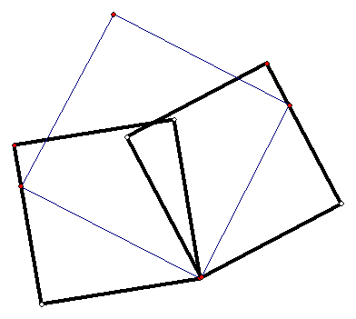
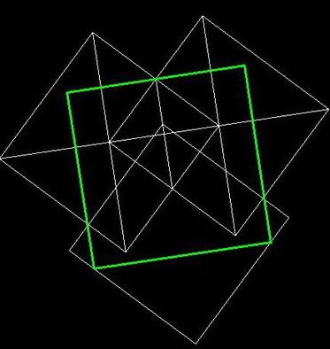
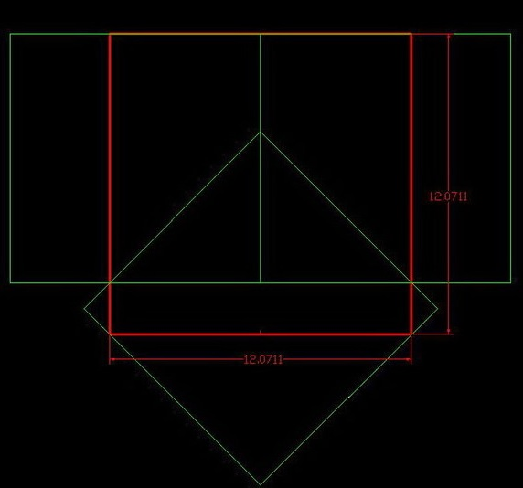
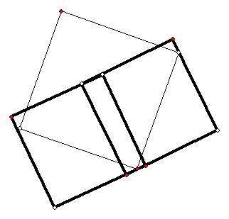
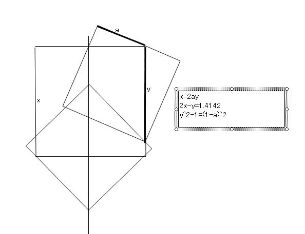
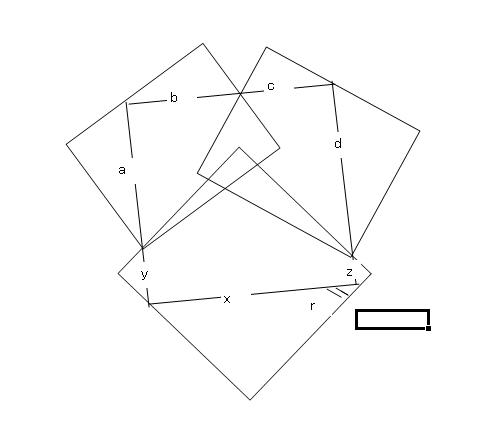
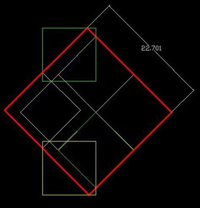

数学星空提出了一个[很开放的问题](https://bbs.emath.ac.cn/thread-1589-1-1.html) :  
1.3个,5个,6个,7个,8个,10个单位正方形能覆盖的最大正方形边长分别是多少?  
这个问题很复杂也很有意思，最后大家得出3个单位正方形能够覆盖边长为1.272..的大正方形:  
  

# 详细内容
数学星空首先给出了一种3个单位正方形覆盖[边长为1.13137...](https://bbs.emath.ac.cn/forum.php?mod=redirect&goto=findpost&ptid=1589&pid=20084&fromuid=20) 的正方形的方案  
  
并且他指出4个和5个单位正方形应该都只能覆盖边长为2的大正方形。 
虽说大家这时都觉得上面3个正方形覆盖方案不够好，但是构造更佳的答案还是很困难， 直到第二天数学星空又构造了一种[边长为1.20710678的方案](https://bbs.emath.ac.cn/forum.php?mod=redirect&goto=findpost&ptid=1589&pid=20098&fromuid=20)  
  
又过了一天，mathe给出了一种能够达到[相同结果的不同构图](https://bbs.emath.ac.cn/forum.php?mod=redirect&goto=findpost&ptid=1589&pid=20112&fromuid=20)  
  
然后他又发现一种可以达到$\sqrt{\frac{\sqrt{5}-1}2+1}=1.272...$的方案，这是我们[现在能找到的最优结果](https://bbs.emath.ac.cn/forum.php?mod=redirect&goto=findpost&ptid=1589&pid=20113&fromuid=20)  
  
又过了一天，shshssh_0510给出了达到[一个1.25的方案](https://bbs.emath.ac.cn/forum.php?mod=redirect&goto=findpost&ptid=1589&pid=20121&fromuid=20)  
  
随后也给出了[另外一个达到1.272...的方案](https://bbs.emath.ac.cn/forum.php?mod=redirect&goto=findpost&ptid=1589&pid=20122&fromuid=20) 
  
后来对于7个正方形覆盖问题，数学星空可以覆盖边长为2.20710678...  
  
然后数学星空发现了一片很不错的相关文章  
  
