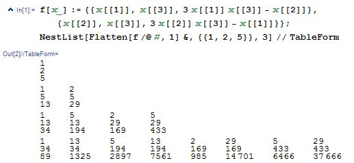

# 简介
2008年11月[northwolves在csdn要求](https://bbs.csdn.net/topics/280038582) :  
1. 四个不同自然数$a\lt b\lt c\lt d$ 满足$a^2+b^2+c^2+d^2=abcd$，列出1亿内的所有组合。  

2. n个不同自然数$a_1\lt a_2\lt\dots\lt a_n$ 满足$a_1^2+a_2^2+\dots+a_n^2=a_1a_2\dots a_n$，列出1亿内的所有组合。  

2013年2月[wayne在数学研发论坛寻求下面不定方程的解](https://bbs.emath.ac.cn/thread-4916-1-1.html) :  
求正整数解：  
$x^2+y^2+z^2=3xyz$  
===============
更进一步，假如 $0\lt x\le y\le z\le 10^{10}$，那么总共有多少组呢?  

litaoye(绿色夹克衫)给出了一种利用韦达定理进行递降的巧妙算法，mathe利用这种方法彻底解决了更大范围的解。  
比如其中问题1的第10000组解为  
$a=1155707276902$  
$b=52631648121718437290225329446159132818342$  
$c=121653557459230956410906311942093212906353571240214806$  
$d=54756951556826666523961130929258828162755166803423037863993739741969018235335921416820498267983420590064684413368261305133980613412835260713754668464533252084098231022109546996215107093857821479530279109208302608$  

# 详细内容
northwolves先给出了一组问题1的解: 2，6，22，262  
medie2005很快发现:  
一般的,对如下的数列:
$a[0]=a[1]=a[2]=a[3]=2$.  
$a[n]=a[n-1]\times a[n-2]\times a[n-3]-a[n-4]$  
相邻四项都满足:$a[n-3]^2+a[n-2]^2+a[n-1]^2+a[n]^2=a[n-3]\times a[n-2]\times a[n-1]\times a[n]$.  
因此,22, 262, 34582, 199330642也是一组解.
262, 34582, 199330642, 1806032092550706也是一组解.

对$a^2+b^2+c^2=abc$.我们同样可以构造一系列解.
$a[0]=a[1]=a[2]=3$.  
$a[n]=a[n-1]\times a[n-2]-a[n-3]$  
于是,(3,6,15),(6,15,87),(15,87,1299),...都满足$a^2+b^2+c^2=abc$.

一般的,对$k=a^{k-2}$.我们选定k,如果方程有解$a_0$,那么,我们可以定义数列:  
$a[0]=a[1]=\dots=a[k-1]=a_0$;  
$a[n]=a[n-1]\times\dots\times a[n-(k-1)]-a[n-k]$.  
那么，$(a[n-(k-1)],\times,a[n-1],a[n])$为$a_1^2+a_2^2+\dots+a_k^2=a_1a_2\dots a_k$的解.  

northwolves发现medie2005构造的解就是[A061292](https://oeis.org/A061292).  
而n=3时的问题对应[A086326](https://oeis.org/A086326)  
而[A002559](https://oeis.org/A002559) Markoff numbers对应wayne的问题。
但是northwolves发现还有解不在medie2005的系列解之中，比如  
2	22	82	3606  
6	22	262	34582  
2	82	306	50182  
2	306	1142	698902  
2	262	3122	1635922  
6	262	3122	4907782  
22	82	3606	6505222  
22	262	11522	66412806  

northwolves搜索了部分解，medie2005根据northwolves陆续搜索出来的结果总结出  
对第k组解(a,b,c,d)，a,b必然在前k-1组解中出现！  
因此，我们猜测：所有的a,b都可以在前面的解中找到。  
如果这个猜测成立，那么，(a,b)的选择范围就很小了。  

litaoye(绿色夹克衫)总结出可以利用二次方程的韦达定理来构造出所有的解:  
看lz给的数据，看来有可能从最小的一组解，构造出全部解的可能（不过还需要证明，可以构造出一组解不难证明，可以构造出全部解，就不容易证明了）  
我说说我看到的一些规律（估计lz早就发现了）  
最小的一组解是  
2 2 2 2  
固定前3个可以得出  
$2^2 + 2^2 + 2^2 + X^2 = 8X$(解1元2次方程)  
x的两个解为x=2和x=6  
现在成了2 2 2 6 -> 2 6 2 2  
固定前3个可以得出  
$2^2 + 6^2 + 2^2 + X^2 = 24X$(解1元2次方程)  
x的两个解为x=2和x=22  
现在成了2 6 2 22 -> 2 6 22 2  
固定前3个可以得出  
$2^2 + 6^2 + 22^2 + X^2 = 264X$(解1元2次方程)  
x的两个解为x=2和x=262  
现在成了2 6 22 264  
同样的方法就可以构造出  
2    6    262    3122  
2    6    3122    37202  
2    6    37202    443302  
2    6    443302    5282422  
2    6    5282422    62945762  
2    22    82    3606  
的构造方法如下  
2 2 2 2 -> 2 2 2 6-> 2 2 6 22-> 2 2 22 82->2 22 82 3606  
至少目前给出的解,都可以从2 2 2 2构造出来  

然后他给出了证明思路:  
假设存在四个不同自然数$a\lt b\lt c\lt d$ 满足$a^2+b^2+c^2+d^2=abcd$  
那么一定存在另一组$a b c e$满足$a^2+b^2+c^2+e^2=abce$（通过1元2次方程的另一个解可以解出）
而$e \lt d$，同理$a b c e$一定存在另一组$a b f e$ 满足$a^2+b^2+f^2+e^2=abfe$  
而$f \lt c \dots$  
推到最后，$w^2 + x^2 + y^2 + z^2 = wxyz$ 只有当$w=x=y=z$，才不存在另一组更小的解，而只有在$w=x=y=z=2$时，这个等式才成立，因此可以推出  
2 2 2 2是所有解的唯一根。  
再说一下，这种解法也许可以推出lz的第2题  
2. n个不同自然数$a_1\lt a_2\lt\dots\lt a_n$ 满足$a_1^2+a_2^2+\dots+a_n^2=a_1a_2\dots a_n$ ，列出1亿内的所有组合。 
在3个数的时候，3 3 3是所有解的唯一根，在5个数的时候，似乎无解。  

但是随即发现对于5个数的情况的分析存在问题:  
不好意思，上面的证明有些问题，5个数的时候存在1 1 3 3 4，这个最小解，可能是所有解的根，但这五个数并不相等.  
准确点说，应当是 $2\times a_5 \gt a_1a_2a_3a_4$ 时存在更小的一组整数解.  
4个数时，当$2\times a_4 \gt a_1a_2a_3$时，存在更小的一组整数解  
3个数时，当$2a_3 \gt a_1a_2$时，存在更小的一组整数解  
但应当可以证明2 2 2 2是4个数中满足$2a_4 \gt a_1a_2a_3$ 的唯一解（$a_1\ge a_2\ge a_3\ge a_4$），这样便可以证明所有解都是由2 2 2 2派生出的。  
用穷举法可以，下面是一些穷举范围划定  
$2a_4 \lt a_1a_2a_3$   
=>  
$2a_4^2 \lt a_1a_2a_3a_4$  
=>  
$2a4^2 \lt a_1^2 + a_2^2 + a_3^2 + a_4^2$  
=>  
$a_4^2 \lt a_1^2 + a_2^2 + a_3^2$  
=>
$a_1a_2a_3a_4 \lt 2(a_1^2 + a_2^2 + a_3^2)$  
=>  
$a_1a_2a_3a_3 \lt 2(3a_3^2)$  
=>  
$a_1a_2 \lt 6$  
穷举范围很小了  
下面分2种情况分析  
1、$a_3 \lt a_4$  
2、$a_3 = a_4$  

1、$a_3 \lt a_4$ 可以从
$a_4^2 \lt a_1^2 + a_2^2 + a_3^2$  
=>  
$(a_4-a_3)(a_4+a_3) \lt a_1^2 + a_2^2$  
$(a_4-a_3)$至少为1=>  
$a_4+a_3 \lt a_1^2 + a_2^2$  
穷举范围很小

2、$a_3 = a_4$ 可以从 $a_1^2 + a_2^2 + a_3^2 + a_4^2 = a_1a_2a_3a_4$  
=>  
$a_1^2 + a_2^2 + 2a_4^2 = a_1a_2a_4^2$  
=>  
$a_1^2 + a_2^2 = (a_1a_2 - 2)a_4^2$  
穷举范围很小  
排除额外情况后，就可以推出2 2 2 2是唯一的满足$2a_4 \lt a_1a_2a_3$的整数解，因此所有解都是从2 2 2 2派生出的  
3个数时的3 3 3也一样。

mathe指出:  
litaoye的方法很好.  
而对于更加一般的情况,我们只需要穷举所有  
$x_1x_2\dotsx_{n-2}\le n$的情况  
而所有其它的解都可以通过上面的规则产生.  

再加一个对$x_{n-1}$的起始约束,不然开始解还是太多:  
$x_{n-1}\le\sqrt{\frac{x_1^2+x_2^2+\dots+x_{n-2}^2}{x_1x_2\dots x_{n-2}-2}}$  
比如对于n=3我们得到方程
$x_1^2+x_2^2+x_3^2=x_1x_2x_3$  
起始解必须有$x_1\le 3$.由于$x_1\le 2$显然无解,所以$x_1=3$.  
这时我们可以得到起始解中$x_2\le \sqrt{\frac{x_1^2}{x_1-2}}=3$.  
也就是所有解可以通过(3,3,3)和(3,3,6)来派生.(其实应该只用前一个就可以了,这个可以通过再对$x_n$加约束来达到)  
同样对于$n=4$,第一个约束表明$x_1x_2\le 4$,使用前面我得到$n=4$时所有数都是偶数的结论可以知道$x_1=x_2=2$.  
然后使用第二个约束得到$x_3\le\sqrt{\frac8{4-2}}=2$,所以得到$x_3=2$.  
同样可以得到$n=4$的所有解由$(2,2,2,x_4)$派生.  
并且他写了个程序搜索所有的初始解,其中n=6,9,11,12无解.对于其它13以内的n都只有唯一一个初始解.  
如  
n=3: 3,3,3  
n=4: 2,2,2,2  
n=5: 1,1,3,3,4  
n=7: 1,1,1,2,2,2,3  
n=8: 1,1,1,1,2,2,2,4  
n=10:1,1,1,1,1,1,1,3,4,4  
n=13:1,1,1,1,1,1,1,1,3,4,5  
而第一个有两个以上初始解的是n=14  
1,1,1,1,1,1,1,1,1,1,2,2,3,3  
1,1,1,1,1,1,1,1,1,1,1,3,4,6  

由此他继续算出了n=4的前10000组解，其中第10000组为:  
1155707276902	52631648121718437290225329446159132818342 121653557459230956410906311942093212906353571240214806 7399794021243203937345243489590275923833855218950097547420488918995229934938733746100352534434654547982102	 
计算前10000个结果是瞬间完成的，[点击下载他的C++代码](../attached/squareprod/mathe.txt)  

然后在[数学研发论坛的对应帖子中](https://bbs.emath.ac.cn/thread-881-1-1.html) ,他给出哪些n在100以内有非平凡解，并提交的OEIS产生了[A146974](https://oeis.org/A146974)  

而后来对于wayne提出的类似问题，hujunhua提供了一份Mathematica计算方案
```bash
f[x_] := {{x[[1]], x[[3]], 3 x[[1]] x[[3]]-x[[2]]},{x[[2]],x[[3]],3x[[2]] x[[3]]-x[[1]]}};
NestList[Flatten[f/@#,1] &,{{1, 2, 5}}, 4]//TableForm
```
  

```bash
f[x_] := {{x[[1]], x[[3]], 3 x[[1]] x[[3]] - x[[2]]}, {x[[2]], x[[3]],3 x[[2]] x[[3]] - x[[1]]}};
g[x_] := Flatten[f /@ x, 1];
h[x_] := Select[g[x], #[[3]] < 10^10 &]
Answer = NestWhileList[h, {{1, 2, 5}}, Length[#] > 0 &];
Flatten[Answer, 1]
(Flatten[Answer, 1] // Length) + 2
```
wayne把代码优化为
```bash
Union@Flatten[
  NestList[Union@Sort@Flatten[Table[Union[
         Map[Sort, {x, y, z, 4 x y z - t} /. Thread[Rule[{x, y, z, t}, #]] & /@ 
           NestList[RotateLeft, ii, 4]]], {ii, #}], 1] &, {{1, 1, 1, 1}}, 5], 1]
```
数学星空找到了[维基百科中对应的介绍](http://en.wikipedia.org/wiki/Markov_number)  

mathe做了总结:  
回到一般性题目$x_1^2+x_2^2+...+x_n^2=mx_1x_2...x_n$  
对于解$x_1\le x_2\le\dots\le x_n$,如果一组解不能够通过更加小的解通过二次方程的方法扩展而成，那么  
$x_n$必然是方程$X^2-mx_1x_2...x_{n-1}X+(x_1^2+...+x_{n-1}^2)=0$较小的解，于是我们得出  
$x_{n-1}\le x_n\le \frac{2(x_1^2+...+x_{n-1}^2)}{mx_1x_2\dots x_{n-1}}\le\frac{2(n-1)x_{n-1}^2}{mx_1x_2...x_{n-1}}$  
由此我们得出  
$x_1x_2...x_{n-2}\le\frac{2(n-1)}m$  
也就是我们只需要先分析出满足上面情况的解  
对应n=m=4的情况，也就是分析$x_1x_2\le\frac32$的解即可。也就是$x_1=x_2=1$  
对应$2+z^2+u^2=4zu$

而同样，对于任意一组满足条件的$x_1,x_2,...,x_{n-2}$,方程简化为  
$A+X^2+Y^2=CXY$,  
同样假设$X\le Y$,同样，如果这组解(X,Y)如果不能由更小的解产生，必然有  
$X\le Y\le\frac{2(A+X^2)}{CX}$  
得出$CX^2\le 2X^2+2A$  
于是对于任意$C\ge 3$,我们直接得出$X\le\sqrt{\frac{2A}{C-2}}$  
也就是同样，我们可以非常良好的确定$x_{n-1}$的范围。然后对于范围内的就可以很容易确定$x_n$,最后通过这些解可以构造出所有其它解。  
对应到n=m=4的情况得出$z\le\sqrt{2}$,所以必然$x=y=z=1$,$3+u^2=4u$,u=1或u=3.

进一步分析，我们可以得出如下算法:  
i)穷举前面条件下所有$x_1\le x_2\le\dots\le x_{n-2}$.  
ii)对于i)中每个组合，利用前面结果穷举所有$x_{n-1}\le\sqrt{\frac{2A}{C-2}}$,而且要求$x_{n-2}\le x_{n-1}$.  
iii)对于上面的每个$x_1\le x_2\le\dots\le x_{n-2}\le x_{n-1}$,求解关于$x_n$的二次方程，如果两个解都不小于$x_{n-1}$,我们就得出两个（或重根情况只有一个）基本解。  
iv)对于所有的解，分别替换$x_1,x_2,...,x_{n-1}$得出所有的扩展解。 （注意对于小的基本解，替换$x_n$可以得出另外一组基本解.

hujunhua进一步指出:  
当$1\le x_1\lt x_2\lt\dots\ltx_n$时，一个完整的递推公式共有$(n-1)$的单式，分别是  
$(x_1, x_2, \dots, x_n)\to(x_1, x_2,\dots, x_{i-1}, x_{i+1}, \dot, x_n, x^{\prime}_i)$, $ (i=1, 2, 3, \dots, n-1)$  
其中$x^{\prime}_i=mx_1 x_2 \dots x_{(i-1)} x_{(i+1)} \dots x_n-x_i$  
也就是从表$(x_1, x_2, \dots, x_n)$中去掉$x_i$, 然后在表尾添上$x^{\prime}_i$  
当相邻分量相等时，对应的单式相同，可缩并为一个单式。

在这样的递推关系下，从一个初解出发可以生成一棵树。如果这棵树不能囊括方程的全解，那就表明有多个初解，相应地可生成多棵树。
不同的树有不同的初解（根），不同的初解，即mathe所言基本解，是不会存在递推关系的。因为，存在递推关系的两个解，必有一个不是基本解。


