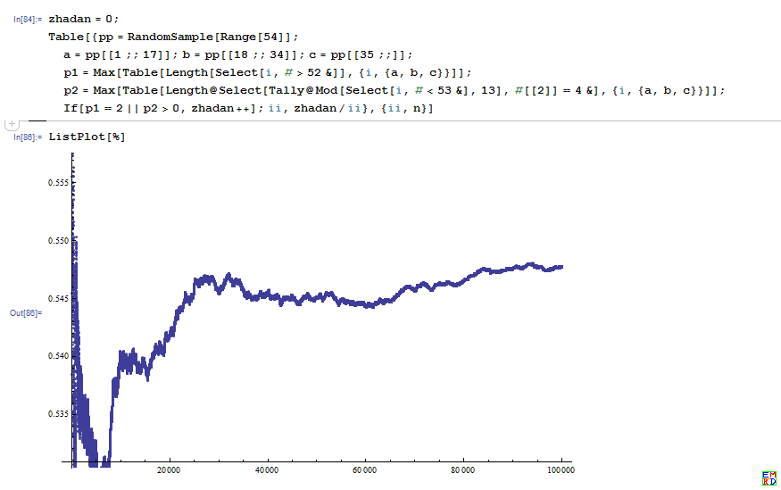
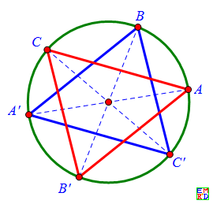
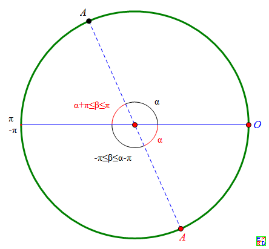
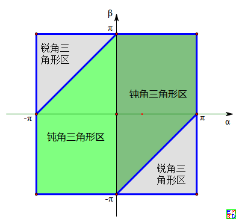
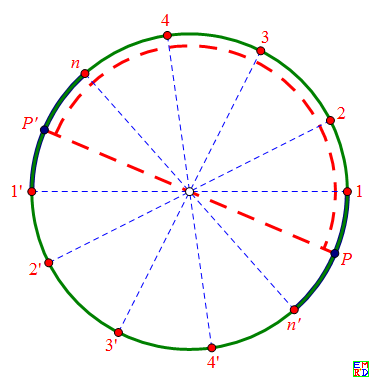
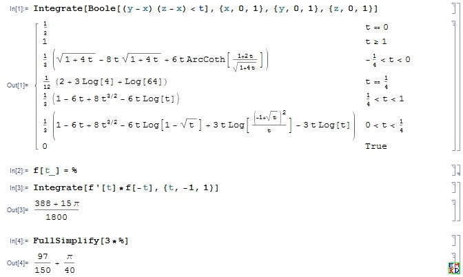

---

title: "钝角三角形的概率"
date: "2020-01-30"
thumbnail: "../images/triangleprob/twodcircle.png"
author: "mathe"
tags: 
    - "概率"
    - "三角形" 
    - "正方形"
---

倪举鹏于[14年1月份提问](https://bbs.emath.ac.cn/thread-5232-1-1.html):  
54张牌,地主里面，地主得到20张牌，那么地主得到炸弹的概率是多少（得到4个一样或者对王）?
<!--more-->
wayne快速给出了答案，然后他们[引申出](https://bbs.emath.ac.cn/forum.php?mod=redirect&goto=findpost&ptid=5232&pid=51651&fromuid=20)了平面图形中随机选择三个点，构成钝角三角形的一系列概率问题.

# 扑克牌问题
对于扑克牌问题，wayne首先计算出[三个人都没有炸弹的概率](https://bbs.emath.ac.cn/forum.php?mod=redirect&goto=findpost&ptid=5232&pid=51580&fromuid=20):  
1）计算54张牌分成17,17,20三堆，且不存在4条和对王的所有情况：  
 母函数$((x+y+z)^4-x^4-y^4-z^4)^{13} ((x+y+z)^2-x^2-y^2-z^2 )$ 的$x^{20}y^{17}z^{17},x^{17}y^{20}z^{17},x^{17}y^{17}z^{20}$的系数。  
 ```bash
Select[CoefficientRules[((x+y+z)^4-x^4-y^4-z^4)^13 ((x+y+z)^2-x^2-y^2-z^2 ),{x,y,z}],Min[#[[1]]]==17&&Max[#[[1]]]==20&]
```
算得 $341495369180333055148032\times 3= 1024486107540999165444096$  
2）计算54张牌分成17,17,20三堆的所有可能情况：Multinomial[17, 17, 20] =749991557119474188218700  
3）有炸弹的概率就是：  
$1-\frac{341495369180333055148032}{749991557119474188218700}=\frac{79350463857642022741}{145686005656463517525} \approx 0.5446677153$  
所以有54.5%的概率至少有一人出现炸弹。
并且给出了模拟结果:  
  
从54张牌里随机取20张出来 ，[没有炸弹(4条或对王)的概率](https://bbs.emath.ac.cn/forum.php?mod=redirect&goto=findpost&ptid=5232&pid=51591&fromuid=20)：  
$((x+1)^4-x^4)^13 ((x+1)^2 -x^2)$中$x^{20}$的系数 223786474655744 除以 $C_{54}^{20}$.  
于是有炸弹的概率：$1- \frac{223786474655744}{321387366339585} =\frac{1072537271251}{3531729300435}\approx 0.303686$.  
[模拟结果](https://bbs.emath.ac.cn/forum.php?mod=redirect&goto=findpost&ptid=5232&pid=51586&fromuid=20):  
  

# 钝角三角形概率问题
倪举鹏由此引申出[一个扩展的问题](https://bbs.emath.ac.cn/forum.php?mod=redirect&goto=findpost&ptid=5232&pid=51630&fromuid=20):  
随机给定一个三角形，是钝角三角形的概率是多少？wayne指出结果依赖于三个点的限定区域  
## 圆周问题
[圆周上随机选择三点构成钝角三角形的概率](https://bbs.emath.ac.cn/thread-5241-1-1.html)是多少呢？
Lwins\_G认为还可以推广到“在超球面$S_n$上任意取$k$个点，求这$k$个点可以被全部分配在半个超球面上的概率”。  
sheng_jianguo给出[如下的解答](https://bbs.emath.ac.cn/forum.php?mod=redirect&goto=findpost&ptid=5241&pid=51706&fromuid=20):  
因为是均匀分布，所以取到每个点的概率密度与取到其对径点的概率密度是一样的。每个点都有一个对径点，这样便有$k$对点。在每对点中各取一点，共有$2^k$中取法，每种取法的概率密度是相同的。现在只要计算这$2^k$种取法中，有多少种取法(记为$F(k)$)是落在同一半球上的，则所求概率为$\frac{F(k)}{2^k}$。  
上面有个假设，即认为$F(k)$的值只与$k$有关，而跟$k$个点的具体位置无关。这个是可以证明的（忽略两点重合，三点共大圆的零概率情况）。而且，还可以证明，$F(k)$等于球面上$k$个大圆（任意两个大圆不重合，任意三个大圆不共点）把球面分割成小片的片数。这个数目等于$k^2-k+2$。  
于是三维球面情况所求概率等于 $\frac{k^2-k+2}{2^k}$。  
hujunhua给出了对应的[二维情况的图解](https://bbs.emath.ac.cn/forum.php?mod=redirect&goto=findpost&ptid=5241&pid=51754&fromuid=20)：  
在一个圆周上随机取3点，构成钝角三角形的概率为3/4. 计算方法可以不用积分，使用sheng_jianguo的方案即可:  
  
随机取三点，再考虑其对径点，取点或其对径点的概率是相同的，共有8个三角形，只有图中的2个才是锐角三角形，其它6个都是钝角三角形。  
并且[进一步给出](https://bbs.emath.ac.cn/forum.php?mod=redirect&goto=findpost&ptid=5241&pid=51770&fromuid=20):  
如下图1，当$0\lt \alpha\lt \pi$时（黑标记角）, 点B位于OA弧的对顶角弧上时才是锐角三角形，这时$-\pi\lt\beta\lt\alpha-\pi$，对应下图2右下角的灰色三角区。在其它位置都是钝角三角形，对应于下图2中的深绿色区。  
当$\pi\lt\alpha\lt0$时（红标记角）, 点B同样位于OA弧的对顶角弧上时才是锐角三角形，这时$\pi+\alpha\lt\beta\lt\pi$，对应于下图2左上角的灰色三角区。在其它位置都是钝角三角形，对应于下图2中的浅绿色区。  
  
kastin基于三个点的不同分布概率，使用积分模型也给出了[很多不同的结论](https://bbs.emath.ac.cn/forum.php?mod=redirect&goto=findpost&ptid=5241&pid=51786&fromuid=20)。  
mathe给出了一种[通过积分计算的方案](https://bbs.emath.ac.cn/forum.php?mod=redirect&goto=findpost&ptid=5241&pid=51847&fromuid=20):  
圆周上随机取n个点，落在半圆上概率可以如下计算。  
对于任意t,$0\lt t\le\frac12$,我们设n个点落在角度不超过$t\times 2\pi$上概率为$F_n(t)$,于是我们知道$F_2(t)=2t$.  
而且$F_{n+1}(t)=\int_{s=0}^t (2t-s)dF_n(s)$.  
然后$F_n(\frac12)$就是所求的结果.  
比如:  
$F_3(t)=\int_{s=0}^t(4t-2s)ds=3t^2$,  
$F_4(t)=\int_{s=0}^t(2t-s)\times 6sds=4t^3$.  
猜测$F_n(t)=nt^{n-1}$,于是$F_{n+1}(t)=\int_{s=0}^t (2t-s)\times n(n-1)s^{n-2}ds=\int_{s=0}^n(2n(n-1)ts^{n-2}-n(n-1)s^{n-1}ds=2nts^{n-1}-(n-1)s^n|_{s=0}^t=(n+1)t^n$,归纳假设成立.  
于是n个点落在半圆上概率为$\frac n{2^{n-1}}$.  
对于这种情况，hujunhua也用他的方法[得出相同的结果](https://bbs.emath.ac.cn/forum.php?mod=redirect&goto=findpost&ptid=5241&pid=51858&fromuid=20):  
圆周上任取n点偏于一个半圆的概率，可以如下计算：  
首先，不用考虑其中任意两点处于一种固定的相对位置的情况，比如两点重合或者处于对径位置情况。对于连续的圆周来说，这样的特例概率是零。所以只需要考虑n个不同点，并且没有两点处于对径位置的情况，这样的一个n点组，我们称为一个样本。  
任一特定样本s，将其中的1个点或者更多的点换成其对径点所得的新样本 s’ 称为它的一个相关样本。显然，s 连同它自身共有$2^n$个相关样本，对于对径变换，它们组成一个封闭的簇。  
于是整个样本空间可以划分为一个个簇, 所有的簇组成样本空间的一个商集。显然，每个簇恰好有2n个半偏样本，所以取到半偏样本的概率是$\frac{2n}{2^n}=\frac{n}{2^{n-1}}$.  
关于每个簇恰好有2n个半偏样本，说明一下。一个簇有2n点，分为n对对径点，将圆周分成了n对相对弧段。在任意一段半圆周上，都恰好包含其中的n个点（直径端无点）或者n+1个点（直径端有点，我们不用考虑这种零概率情况），这就是一个半偏样本。当半圆的直径端在一对相对弧段上滑动时，所包含的半偏样本是不变的，所以一对相对弧段对应于1对半偏样本。故共有n对半偏样本。  
  
如图，红色虚线半圆（为了清晰，将它缩到了圆内，实际上应该与圆重合的）包含了一个半偏样本｛1,2,3,4,..., n｝,当半圆的直径端P,P'在相对弧段1n', 1'n上滑动时，半圆弧所包含的点仍然是{1,2,3,4, n}. 所以相对弧段1n'&1’n 就对应于一对相对的半偏样本｛1,2,3,4,...,n｝&｛1',2,',3,',4',...,n'｝.   

sheng_jianguo进一步[将问题推广到高维](https://bbs.emath.ac.cn/forum.php?mod=redirect&goto=findpost&ptid=5241&pid=52003&fromuid=20)：  
若在$r+1$维空间中，$n$个$r-1$维超球面最多可以把$r$维超球面切割成$F(n,r)$部分，则
当$r$为奇数时$F(n,r)= 2\binom{n}{1}+2\binom{n}{3}+\dots+2\binom{n}{r}$
当$r$为偶数时$F(n,r)= 2\binom{n}{0}+2\binom{n}{2}+\dots+2\binom{n}{r}$
（其中，$\binom{n}{i}=\frac{n!}{i!\cdot{(n-i)!}}$表示$n$个数中取$i$个数组合的个数$(i=0,1,2,\dots,r)$，当$n\lt r$时，$\binom{n}{i}=0$).
所以，若在$r+1$维空间中，在$r$维超球面上任意取$n$个点，则这$n$个点可以被全部分配在半个超球面上的概率为$p=\frac{F(n,r)}{2^n}$。
请各位高手看看上面组合公式是否还能简化。
举例：
当$r=1$时，即2维空间中，$n$个双点（0维球面）最多可以把圆（1维球面）分为$F(n,1)=2\binom{n}{1}=2n$，故$r=1$时, $p=\frac{2n}{2^n}$。
当$r=2$时，即3维空间中，$n$个圆（1维球面）最多可以把球面（2维球面）分为$F(n,2)=2\binom{n}{0}+2\binom{n}{2}=n^2-n+2$部分，故$r=2$时，$p=\frac{n^2-n+2}{2^n}$。
当$r=3$时，即4维空间中，$n$个2维球面最多可以把3维球面分为$F(n,3)=2\binom{n}{1}+2\binom{n}{3}=\frac{n^3-3n^2+8n}3(n>2时)$部分，故$r=3$时，$p=\frac{n^3-3n^2+8n}{3\cdot{2^n}}$，当$n\gt 2$时，$p=1$，当$n\lt 3$时。
## 正方形情况
那么在[单位正方形内](https://bbs.emath.ac.cn/thread-5236-1-1.html),随机取三点,构成三角形是钝角三角形的概率为多少?  
[wayne](https://bbs.emath.ac.cn/forum.php?mod=redirect&goto=findpost&ptid=5236&pid=51662&fromuid=20)发现[百度贴吧里面](http://tieba.baidu.com/p/1451727017)已经有人通过复杂的符号计算得出了结果$\frac{97}{150}+\frac{\pi}{40}\approx0.72520648300641149763$并且这个结果和他的数值模拟结果非常匹配。  
Lwins\_G[给出](https://bbs.emath.ac.cn/forum.php?mod=redirect&goto=findpost&ptid=5236&pid=51681&fromuid=20):  
简要思想是：  
1) 一个角是否为钝角，可以用形成该角的两条有向边的内积（有向边看作向量）的正负来判别。  
2) 一个三角形为钝角三角形，当且仅当其恰好有一个钝角。  
故而，这归结为计算  
$ 3 \int_0^1 \int_0^1 \int_0^1 \int_0^1 \int_0^1 \int_0^1 f((x_2 - x_1)(x_3 - x_1) + (y_2 - y_1)(y_3 - y_1)) dx_1 dy_1 dx_2 dy_2 dx_3 dy_3 . $  
其中$f(x)$当$x \lt 0$时取$1$，否则取$0$。  
  
从而验证了百度贴吧中结果的正确性。

