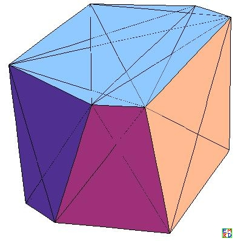

zhouguang 提出了一个关于[超立方体的最大嵌套问题]:  
设d(m,n)表示在单位n维方（n为1、2、3时，分别对应线段、正方形、立方体）中的最大的m维方的大小（这个大小在m为1、2、3时，分别对应长度、面积、体积，并且此处m不大于n）。求d(m,n)。

他首先给出: 对于一些简单的情况，已知如下结果：  
1、d(k,k)=1；  
2、d(1,k)=sqrt(k)，均为体对角线的长度；  
3、d(2,3)=9/8，d(2,3)表示单位立方体内能够容纳的最大正方形的面积。  
大家还能算一些其它的d(m,n)的值么？  
  
补充内容 (2018-9-4 09:53):  
补充m为2时的情况：   
4、d(2,2k)=k，当n为偶数时，最大正方形的对角线和n维方的主对角线（体对角线）重合。  
5、d(2,2k+1)=k+1/8，当n为奇数时，最大正方形的顶点在某条棱的1/4处。  

这个问题非常复杂，zhouguang, wayne, zgg__, mathe等参与了讨论，最终我们解决了m=3的情况，即解决了在单位n维方种能够嵌入的最大的三维立方体。

# 详细内容
为了解决 d(3,4)，[zhouguang写了一段mathematica代码]用一个三维超平面去截取一个四维超立方体获取对应的三维交集对象
```bash
ll[p1_, p2_] := Dot[p1 - p2, p1 - p2];
cr[l_, s_, t_] := Module[{p1 = First[l], p2 = Last[l], x},
   If[s.p1 != s.p2, x = (s.p2 - t)/(s.p2 - s.p1); If[0 <= x <= 1, Return[x p1 + (1 - x) p2], Return[0]],  Return[0]];];
dr[ps_] := Module[{ss, pn, q, x, y, ans, i},
   If[Length[ps] <= 3, Print["Err Short"]];
   ss = {{0, 0, 0}, {0, Sqrt[ll[ps[[1]], ps[[2]]]], 0}};
   pn = {x, y, 0};  q = Map[ll[pn, #] &, ss] == Map[ll[ps[[3]], #] &, Take[ps, 2]];
   AppendTo[ss, pn /. Last[Solve[q, {x, y}]]];
   Do[pn = {x, y, z};   q = Map[ll[pn, #] &, ss] == Map[ll[ps[[i + 4]], #] &, Take[ps, i + 3]];
    ans = Solve[q, pn]; If[Length[ans] < 1, Print["Err"];];
    AppendTo[ss, pn /. Last[ans]];
    , {i, 0, Length[ps] - 4}]; ss];
pcs = (Table[IntegerDigits[i, 2, 4], {i, 0, 15}] 2 - 1)/2
pcs // Length
ls = Select[Subsets[pcs, {2}], ll[First[#], Last[#]] == 1 &];
ls // Length
```
然后把图做出来，比如  
  
    
然后他在上面第二个图得出一个边长为1.0074347568842812，[得出$d(3,4)\ge 1.02247050844335$]。  
接下去他分析认为d(3,5)=34Sqrt[2]-27Sqrt[3]=[1.31789]。其中对应立方体的八个顶点分别为：{{1/2,1/2,-t,-t,1/2},{1/2,-t,1/2,-t,1/2},{-t,-t,1/2,1/2,1/2},{-t,1/2,-t,1/2,1/2},{t,t,-1/2,-1/2,-1/2},{t,-1/2,t,-1/2,-1/2},{-1/2,-1/2,t,t,-1/2},{-1/2,t,-1/2,t,-1/2}}，其中t=(3-Sqrt[6])/2=0.275255
并且他给出对应的下图
  

继续计算他[得出如下表格]:

[table]
[tr=#f6f6f6][td]d(m,n)[/td][td]m=1[/td][td]m=2[/td][td]m=3[/td][td]m=4[/td][td]m=5[/td][td]m=6[/td][/tr]
[tr][td]n=1[/td][td]1[/td][td]-[/td][td]-[/td][td]-[/td][td]-[/td][td]-[/td][/tr]
[tr][td]n=2[/td][td]1.414213562[/td][td]1[/td][td]-[/td][td]-[/td][td]-[/td][td]-[/td][/tr]
[tr][td]n=3[/td][td]1.732050808[/td][td]1.125[/td][td]1[/td][td]-[/td][td]-[/td][td]-[/td][/tr]
[tr][td]n=4[/td][td]2[/td][td]2[/td][td]1.022470508[/td][td]1[/td][td]-[/td][td]-[/td][/tr]
[tr][td]n=5[/td][td]2.236067977[/td][td]2.125[/td][td]1.317889316[/td][td][/td][td]1[/td][td]-[/td][/tr]
[tr][td]n=6[/td][td]2.449489743[/td][td]3[/td][td]2.828427125[/td][td][/td][td][/td][td]1[/td][/tr]
[tr][td]n=7[/td][td]2.645751311[/td][td]3.125[/td][td]2.828427125[/td][td][/td][td][/td][td][/td][/tr]
[tr][td]n=8[/td][td]2.828427125[/td][td]4[/td][td]3.267669390[/td][td][/td][td][/td][td][/td][/tr]
[tr][td]n=9[/td][td]3[/td][td]4.125[/td][td][/td][td][/td][td][/td][td][/td][/tr]
[tr][td]n=10[/td][td]3.162277660[/td][td]5[/td][td][/td][td][/td][td][/td][td][/td][/tr]
[/table]

但是接下去zgg__得出了d(3,7)更好的结果d(3,7)=[2.892895457]:
```bash
mm = {{-a, 1/2, -d, -(1/2), -(1/2), -(1/2), -(1/2)}, {1/2, -b, c, -(1/2), -(1/2), -(1/2), -(1/2)}, {c, -b, 1/2, -(1/2), -(1/2), 1/2, 1/2}, {-d, 1/2, -a, -(1/2), -(1/2), 1/2, 1/2}, {-c, b, -(1/2), 1/2, 1/2, -(1/2), -(1/2)}, {d, -(1/2), a, 1/2, 1/2, -(1/2), -(1/2)}, {a, -(1/2), d, 1/2, 1/2, 1/2, 1/2}, {-(1/2), b, -c, 1/2, 1/2, 1/2, 1/2}};
ll[p1_, p2_] := Dot[p1 - p2, p1 - p2];
c[x_, y_] := ll[mm[[x]], mm[[y]]];
e1 = {c[1, 2], c[2, 3], c[3, 4], c[4, 1], c[5, 6], c[6, 7], c[7, 8], c[8, 5], c[1, 5], c[2, 6], c[3, 7], c[4, 8]};
e2 = {c[1, 6], c[2, 5], c[3, 8], c[4, 7], c[1, 8], c[4, 5], c[2, 7], c[3, 6], c[1, 3], c[2, 4], c[5, 7], c[6, 8]};
e3 = {c[1, 7], c[2, 8], c[3, 5], c[4, 6]};
e = Join[Map[# - z &, e1], Map[# - 2 z &, e2], Map[# - 3 z &, e3]];
ans = Solve[e == 0, {a, b, c, d, z}][[3]];
ans // N // MatrixForm
zz = RootReduce[Sqrt[z /. ans]];
f = First[zz][x]
N[zz^3, 10]
```

然后mathe使用拉格朗日乘数法[验证了zhouguang的d(2,n)的结论]并且[尝试把方法推广到d(3,n)] 
然后他把问题转化为求一个$m\times n$阶矩阵问题:  
我们可以对坐标进行平移，使得外面n维超立方体中离A最近顶点坐标为$(0,0,...,0)$,最远顶点坐标为$(1,1,...,1)$  
这时设$A(a_1,a_2,...,a_n), X_h(a_1+t_{h1},a_2+t_{h2},...,a_n+t_{hn})$  
于是对于任意i,有$\sum_{h=1}^m t_{hi}=1-2a_i$,以及边界条件$\sum_{\{h|t_{hi}\ge 0\}}t_{hi}\le 1-a_i=\frac{1+\sum_{h=1}^mt_{hi}}2, \sum_{\{h|t_{hi}\le 0\}}t_{hi}\ge -a_i=\frac{\sum_{h=1}^mt_{hi}-1}2$  
或者说$\sum_{\{h|t_{hi}\ge 0\}}t_{hi}-\sum_{\{h|t_{hi}\le 0\}}t_{hi}\le 1$,即$\sum_{h=1}^m |t_{hi}|\le 1$ （取最大值时，这n个不等式应该大部分会变为等式)  
以及对于任意h,有$\sum_{i=1}^n t_{hi}^2$都相等（要求等于$\frac 1m\sum_{i=1}^n (1-2a_i)^2=\frac 1m\sum_{i=1}^n (\sum_{h=1}^mt_{hi})^2)$  
还有对于任意不同的$h_1,h_2$,有$\sum_{i=1}^n t_{h_1i}t_{h_2i}=0$  
而我们的目标是让$\sum_{i=1}^n t_{hi}^2$或$\sum_{i=1}^n (1-2a_i)^2=\sum_{i=1}^n (\sum_{h=1}^mt_{hi})^2$最大化.  
为了得到最大值解，我们除了使用$\frac{(m+2)(m-1)}2$组已知的二次等式约束，以及上面n组不等式的部分改为等式的表达式外，另外选择若个独立的$t_{hi}$将它们变为0来求得可能的最优解  
我们可以查看$m \times n$阶矩阵  
$T=\begin{pmatrix}t_{11}&t_{12}&...&t_{1n}\\t_{21}&t_{22}&...&t_{2n}\\...&...&...&...\\t_{m1}&t_{m2}&...&t_{mn}\end{pmatrix}$  
于是要求矩阵各行的元素平方和都相同，不同两行之间内积为0（也就是行向量长度都相等而且两两正交）。  
而任意一列中数字的绝对值之和不超过1.  
得到任意这样的矩阵，我们就可以构造出满足条件的超立方体。而上面构造的目标是使得行向量长度尽量大。  
由于最大值必然在所有变量的边界条件取到，所以如果矩阵中一个数字不是0，那么所在列所有非零数字绝对值之和必须为1，由此得出最优解任意一列数字绝对值之和为一。  
由此可以得到矩阵中非零数字数目最多是${(m+2)(m-1)}/2+n$个。  

最后经过一系列及其复杂的人机结合的运算，[得出d(3,n)的结论]

$n\equiv 0(mod 3)$， 最大棱长平方 $\frac n3$  
$n\equiv 2(mod 3)$,  已知最大棱长平方$\frac{n-2}3+0.20204102886728760721086370117643443213$  
$n\equiv 1(mod 3)$,    
&nbsp;&nbsp;当$n\le 4$时,已知最大棱长平方$\frac{n-1}3+0.014924789378487091772702700468246887087$,  
&nbsp;&nbsp;而在$n=7$时，已知最大棱长平方为$\frac{n-1}3+0.030276368395549006911606670186456882565$  
&nbsp;&nbsp;而在$n\ge 10$时，已知最大棱长平方$\frac{n-1}3+0.0333704529042344576650050707338027930$  

最后他另外提供了一段C代码对上面结论再进行[数值验算]
```bash
#include <stdio.h>
#include <math.h>

#define MAXSOL   50
#define N 6
double solbuf[MAXSOL][N];
int solc;
#define A(i,j) a[(i)*N+(j)]
void solve(double *a, double *b)
{
    int i,j,k;
    for(i=0;i<N;i++){//in i column
       double maxv = -1.0;
       int index=-1;
       for(j=i;j<N;j++){
          if(fabs(A(i,j))>maxv){
              maxv=fabs(A(i,j));
              index = j;
          }
       }
       if(index != i){//swap row index and i
         double tmp;
         for(j=i;j<N;j++){
             tmp = A(i,j);
             A(i,j)=A(index,j);
             A(index,j)=tmp;
         }
         tmp = b[i];
         b[i]= b[index];
         b[index]=tmp;
       }
       //divid by A(i,i) in row i
       for(j=i+1;j<N;j++)A(i,j)/=A(i,i);
       b[i]/=A(i,i);A(i,i)=1.0;
       for(j=0;j<N;j++){
          if(j==i)continue;
          for(k=i+1;k<N;k++){
             A(j,k)-=A(i,k)*A(j,i);
          }
          b[j]-=b[i]*A(j,i);
          A(j,i)=0.0;
       }
    }
}

void init_b(double *b, double x0, double y0, double z0, double a0, double b0, double c0, int N1, int N2)
{
    b[0]=x0+y0+z0-1.0;
    b[1]=x0*y0-a0*(1-a0);
    b[2]=y0*z0-b0*(1-b0);
    b[3]=z0*x0-c0*(1-c0);
    b[4]=x0*x0+a0*a0+(1-c0)*(1-c0)-y0*y0-(1-a0)*(1-a0)-b0*b0-N1;
    b[5]=x0*x0+a0*a0+(1-c0)*(1-c0)-z0*z0-(1-b0)*(1-b0)-c0*c0-N2;
}

void init_a(double *a, double x0, double y0, double z0, double a0, double b0, double c0,int N1, int N2)
{
    A(0,0)=1.0;A(0,1)=1.0;A(0,2)=1.0;A(0,3)=0.0;A(0,4)=0.0;A(0,5)=0.0;
    A(1,0)=y0;A(1,1)=x0;A(1,2)=0.0;A(1,3)=-1.0+2*a0;A(1,4)=0.0;A(1,5)=0.0;
    A(2,0)=0.0;A(2,1)=z0;A(2,2)=y0;A(2,3)=0.0;A(2,4)=-1+2*b0;A(2,5)=0.0;
    A(3,0)=z0;A(3,1)=0.0;A(3,2)=x0;A(3,3)=0.0;A(3,4)=0.0;A(3,5)=-1+2*c0;
    A(4,0)=2*x0;A(4,1)=-2*y0;A(4,2)=0.0;A(4,3)=2.0;A(4,4)=-2*b0;A(4,5)=-2+2*c0;
    A(5,0)=2*x0;A(5,1)=0.0;A(5,2)=-2*z0;A(5,3)=2*a0;A(5,4)=2-2*b0;A(5,5)=-2.0;
}

#define MAXITER 20
#define MINERR  0.00001
#define DELT    (4*MINERR)
void pushs(double x0, double y0,double z0, double a0,double b0,double c0)
{
    int i;
    for(i=0;i<solc;i++){
       if(fabs(x0-solbuf[i][0])<DELT&&fabs(y0-solbuf[i][1])<DELT&&
          fabs(z0-solbuf[i][2])<DELT&&fabs(a0-solbuf[i][3])<DELT&&
          fabs(b0-solbuf[i][4])<DELT&&fabs(c0-solbuf[i][5])<DELT){
            break;//find a matched solution
       }
    }
    if(i>=solc){
       if(solc>=MAXSOL){
          fprintf(stderr, "buffer overflow\n");
          return;
       }
       solbuf[solc][0]=x0;solbuf[solc][1]=y0;solbuf[solc][2]=z0;
       solbuf[solc][3]=a0;solbuf[solc][4]=b0;solbuf[solc][5]=c0;
       printf("x=%f,y=%f,z=%f,a=%f,b=%f,c=%f\n",
            x0,y0,z0,a0,b0,c0);
       solc++;
    }
}

int main(int argc, char *argv[])
{
    int N1=atoi(argv[1]);
    int N2=atoi(argv[2]);
    int count;
    double a1,b1,c1;
    double a[N*N],b[N];
    for(a1=0.1;a1<=0.9;a1+=0.1)for(b1=0.1;b1<=0.9;b1+=0.1)for(c1=0.1;c1<=0.9;c1+=0.1){
        double a0=a1,b0=b1,c0=c1,x0,y0,z0;
        double r=sqrt(a0*(1-a0)*b0*(1-b0)*c0*(1-c0));
        z0=r/(a0*(1-a0));x0=r/(b0*(1-b0));y0=r/(c0*(1-c0));
        if(0<x0&&x0<1&&0<y0&&y0<1&&0<z0&&z0<1){
          for(count=0;count<MAXITER;count++){
            init_a(a,x0,y0,z0,a0,b0,c0,N1,N2);
            init_b(b,x0,y0,z0,a0,b0,c0,N1,N2);
            solve(a,b);
            double maxerr=-1.0;
            int u;
            for(u=0;u<N;u++){
               if(fabs(b[u])>maxerr)maxerr=fabs(b[u]);
            }
            x0-=b[0];y0-=b[1];z0-=b[2];a0-=b[3];b0-=b[4];c0-=b[5];
            if(0<x0&&x0<1&&0<y0&&y0<1&&0<z0&&z0<1&&
                0<a0&&a0<1&&0<b0&&b0<1&&0<c0&&c0<1){
                 if(maxerr<MINERR){
                     
                     pushs(x0,y0,z0,a0,b0,c0);
                     break;
                 }
            }else{
                break;
            }
          }
        }
    }
}
```
至此，我们解决了超立方体嵌入最大三维立方体，但是嵌入更高维子立方体问题还有待大家的继续努力,按照上面的方法，对计算量要求会很大。

[超立方体的最大嵌套问题]: https://bbs.emath.ac.cn/forum.php?mod=viewthread&tid=15517&extra=page%3D1%26filter%3Ddigest%26digest%3D1
[zhouguang写了一段mathematica代码]: https://bbs.emath.ac.cn/forum.php?mod=redirect&goto=findpost&ptid=15517&pid=75729&fromuid=20
[得出$d(3,4)\ge 1.02247050844335$]: https://bbs.emath.ac.cn/forum.php?mod=redirect&goto=findpost&ptid=15517&pid=75752&fromuid=20
[1.31789]: https://bbs.emath.ac.cn/forum.php?mod=redirect&goto=findpost&ptid=15517&pid=75943&fromuid=20
[得出如下表格]: https://bbs.emath.ac.cn/forum.php?mod=redirect&goto=findpost&ptid=15517&pid=75963&fromuid=20
[2.892895457]: https://bbs.emath.ac.cn/forum.php?mod=redirect&goto=findpost&ptid=15517&pid=76073&fromuid=20
[验证了zhouguang的d(2,n)的结论]: https://bbs.emath.ac.cn/forum.php?mod=redirect&goto=findpost&ptid=15517&pid=76074&fromuid=20
[尝试把方法推广到d(3,n)]: https://bbs.emath.ac.cn/forum.php?mod=redirect&goto=findpost&ptid=15517&pid=76077&fromuid=20
[得出d(3,n)的结论]: https://bbs.emath.ac.cn/forum.php?mod=redirect&goto=findpost&ptid=15517&pid=76207&fromuid=20
[数值验算]: https://bbs.emath.ac.cn/forum.php?mod=redirect&goto=findpost&ptid=15517&pid=76212&fromuid=20
