# 问题探源
[lsr314提出]如下图一个问题

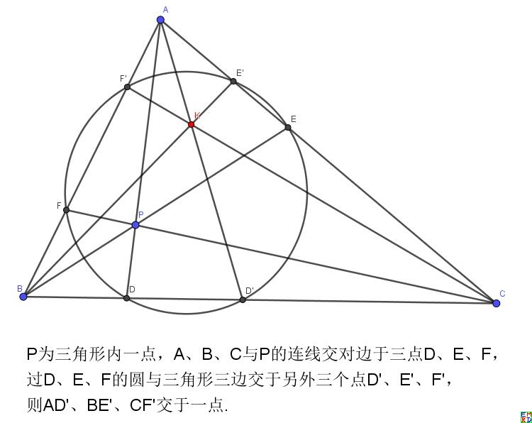

这个图中一个点到另外一个点的变换形成了平面上点之间的一种对合关系。  
hujunhua觉得选择一个在仿射变换下能够[保持二次曲线的对合关系]会更有价值，所以他提出了如下的变换:
对于给定的三角形ABC, 对于其内部任意一点P,连接PA,PB,PC分别交对边于D,E,F；找出D,E,F在对边上（关于对边中点的）对称点D',E',F'，
那么AD',AE',AF'必然交于一点P'。 P=>P'就构成了平面上除了三边所在直线上的点之间一种对合变换。

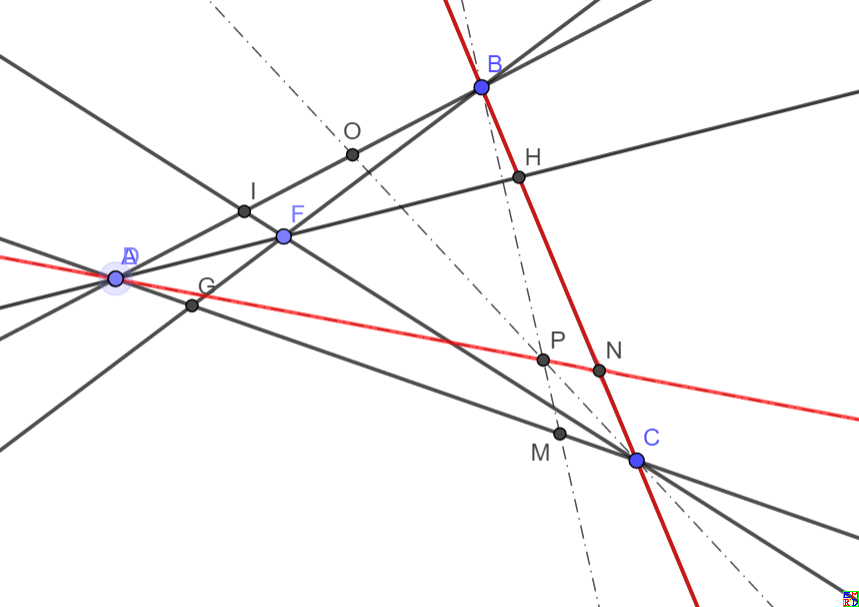

这个变换可以将普通直线变换为过三角形顶点的圆锥曲线（二次曲线）

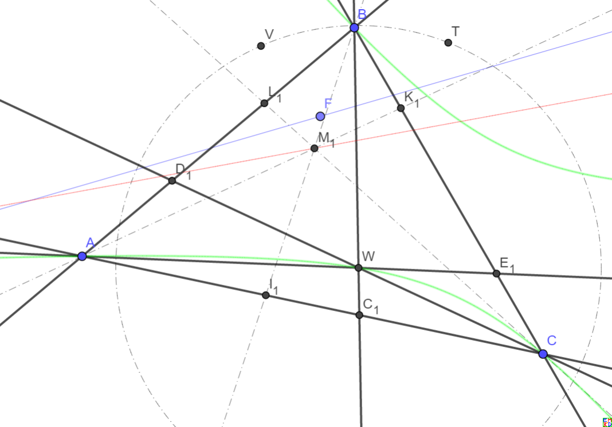

# 具体信息
hujunhua通过使用三角形面积坐标（一种特殊的齐次坐标）来分析这种变换，并将之称为[三坐标反演]
他发现在面积坐标下，如果点$(x,y,z) \to (x\prime,y\prime,z\prime)$,那么它们的面积坐标之间有简单的反演关系$x x\prime = y y\prime = z z\prime$。

hujunhua发现  
【性质1】三坐标反演正好有[四个不动点](1,1,1), (-1,1,1), (1,-1,1), (1,1,-1)

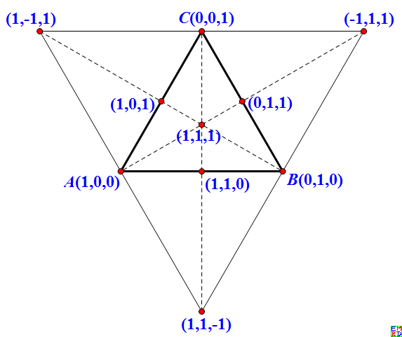

【性质2.1】除去三角形边上的点和顶点，三坐标反演是一个对合。
【性质2.2】三角形边上的点——顶点除外——都映射到相对顶点，包括边上的复点也不例外。
【性质2.3】三角形顶点的映像位于对边上，具体位置取决于逼近顶点的路径。即通过三角形的某顶点比如A的曲线，作图确定在曲线上的该顶点A的映像时，A与自身的连线即曲线在该点的切线。故顶点的像是曲线在该的切线像与对边的交点。  

【性质3.1】一般[直线映射为通过三个顶点的二次曲线]。该曲线还通过原直线上的一对对合点。  
  

【定义】三角形的外接同心椭圆  三角形的诸外接椭圆中，中心与三角形重心重合者。  
特例：三角形的[外接同心椭圆映射为无穷远线]。

mathe两次插队指出，将三角形两个顶点通过射影变换变换为虚圆点(1,i,0), (1,-i,0)以后，[三坐标反演和普通平面的反演变换发生了神秘的联系]，并且[给出了证明]。

【性质4.1】通过两个顶点但不通过第三个顶点的[二次曲线簇]在变换下封闭。  
【命题1】通过两个顶点和两个不动点（无三点共线）的[二次曲线为变换下的不变曲线]。
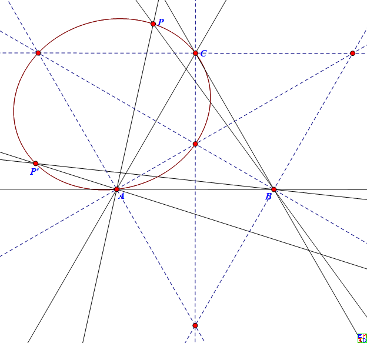  

然后hujunhua开始对三坐标反演的不变代数曲线感兴趣，并猜测曲线$\frac{x^2}{y^2}+\frac{y^2}{x^2}+\frac{y^2}{z^2}+\frac{z^2}{y^2}+\frac{z^2}{x^2}+\frac{x^2}{z^2}=c\gt 6$应该是[不变曲线]，大概有如下图:  
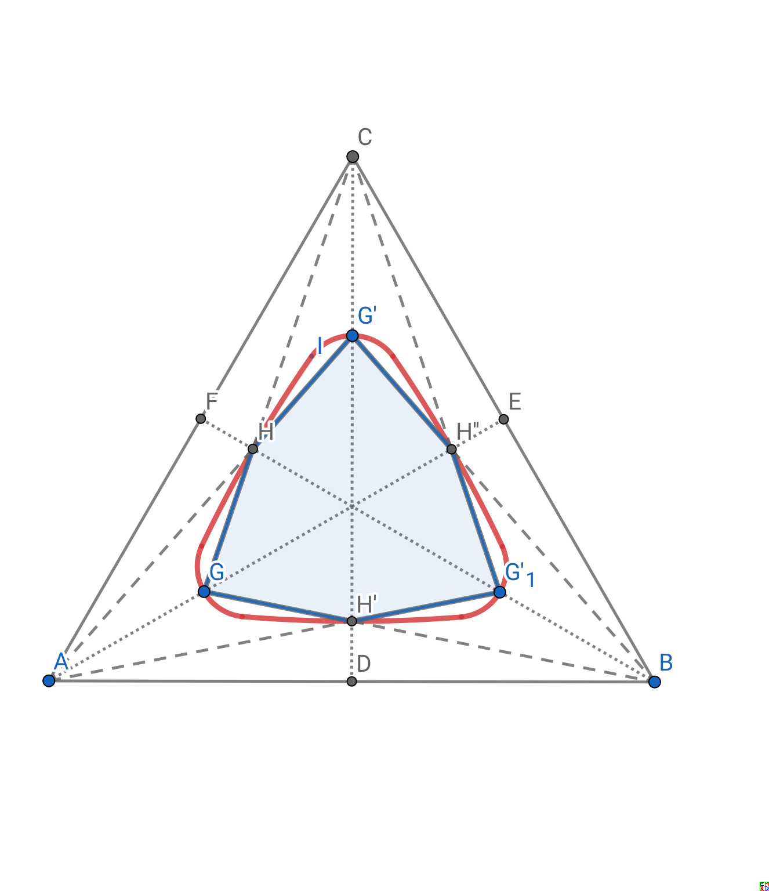  
由于面积坐标形式比较复杂，众人纷纷上场，最后[wayne给出了正确的图]  
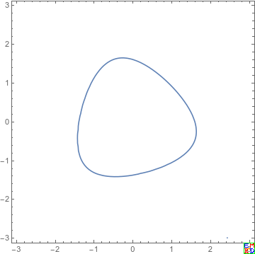 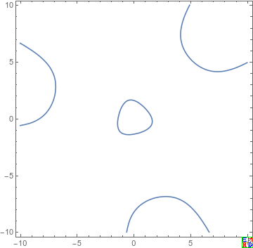  
数学星空通过复杂的数学计算软件计算不同参数C[演化出的系列图]  
  
后面他们又[向三次不变曲线进军]  
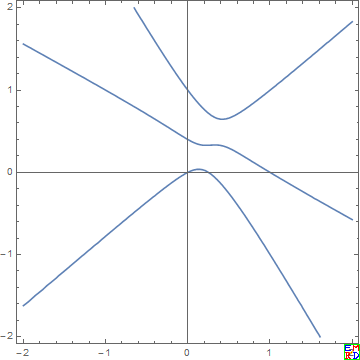  
[复杂的轮子发现]的差不错了，mathe发现三坐标反演其实就是[等角共轭]或更精确的说是[等分共轭]。
数学星空同时给出了[等角共轭和等分共轭的二次不变曲线]  
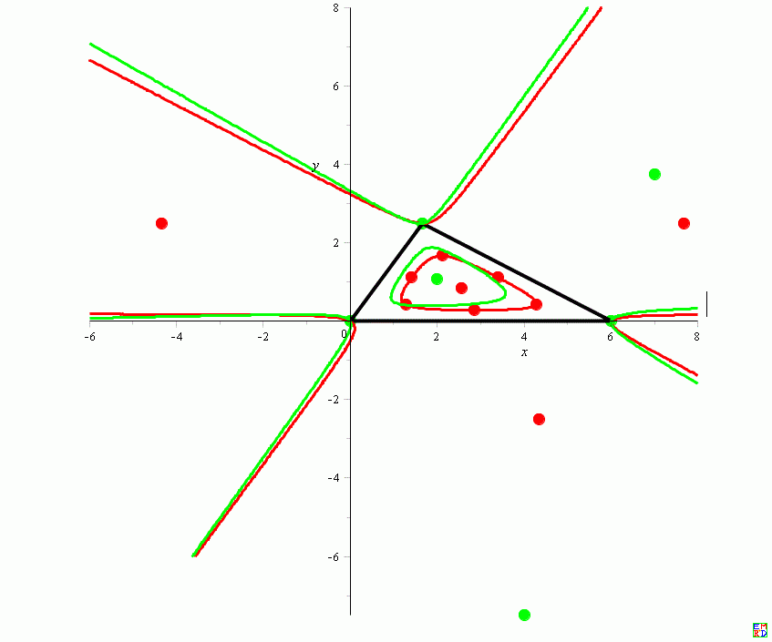  
mathe还给出了对偶变换的不变曲线  
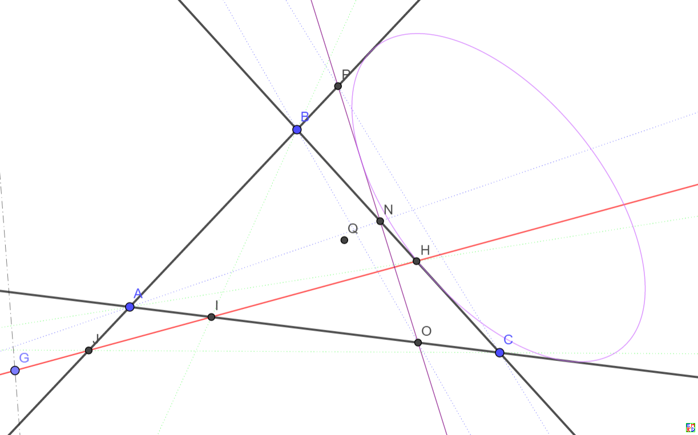  

[lsr314提出]: https://bbs.emath.ac.cn/thread-15835-1-1.html
[保持二次曲线的对合关系]: https://bbs.emath.ac.cn/forum.php?mod=redirect&goto=findpost&ptid=15835&pid=78297&fromuid=20
[三坐标反演]: https://bbs.emath.ac.cn/forum.php?mod=viewthread&tid=15842
[四个不动点]: https://bbs.emath.ac.cn/forum.php?mod=redirect&goto=findpost&ptid=15842&pid=78328&fromuid=20
[直线映射为通过三个顶点的二次曲线]: https://bbs.emath.ac.cn/forum.php?mod=redirect&goto=findpost&ptid=15842&pid=78331&fromuid=20
[外接同心椭圆映射为无穷远线]: https://bbs.emath.ac.cn/forum.php?mod=redirect&goto=findpost&ptid=15842&pid=78335&fromuid=20
[三坐标反演和普通平面的反演变换发生了神秘的联系]: https://bbs.emath.ac.cn/forum.php?mod=redirect&goto=findpost&ptid=15842&pid=78339&fromuid=20
[给出了证明]: https://bbs.emath.ac.cn/forum.php?mod=redirect&goto=findpost&ptid=15842&pid=78346&fromuid=20
[二次曲线簇]: https://bbs.emath.ac.cn/forum.php?mod=redirect&goto=findpost&ptid=15842&pid=78340&fromuid=20
[二次曲线为变换下的不变曲线]: https://bbs.emath.ac.cn/forum.php?mod=redirect&goto=findpost&ptid=15842&pid=78342&fromuid=20
[不变曲线]: https://bbs.emath.ac.cn/forum.php?mod=redirect&goto=findpost&ptid=15842&pid=78381&fromuid=20
[wayne给出了正确的图]: https://bbs.emath.ac.cn/forum.php?mod=redirect&goto=findpost&ptid=15842&pid=78402&fromuid=20
[演化出的系列图]: https://bbs.emath.ac.cn/forum.php?mod=redirect&goto=findpost&ptid=15842&pid=78501&fromuid=20
[向三次不变曲线进军]: https://bbs.emath.ac.cn/forum.php?mod=redirect&goto=findpost&ptid=15842&pid=78503&fromuid=20
[复杂的轮子发现]: https://bbs.emath.ac.cn/forum.php?mod=redirect&goto=findpost&ptid=15842&pid=78891&fromuid=20
[等角共轭]: https://baike.baidu.com/item/%E7%AD%89%E8%A7%92%E5%85%B1%E8%BD%AD/9846435
[等分共轭]: https://en.m.wikipedia.org/wiki/Isotomic_conjugate
[等角共轭和等分共轭的二次不变曲线]: https://bbs.emath.ac.cn/forum.php?mod=redirect&goto=findpost&ptid=15842&pid=78924&fromuid=20
