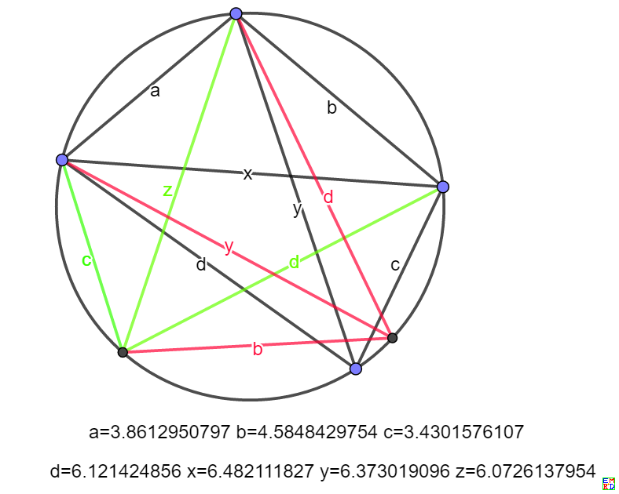

wayne的微信群提出了[一个恒等式问题](https://bbs.emath.ac.cn/thread-16974-1-1.html) :  
设$a,b,c,d,x,y$为正实数，且满足$xy=ac+bd, \frac xy=\frac{ad+bc}{ab+cd}$  
求证：$\frac{abx}{a+b+x}+\frac{cdx}{c+d+x}=\frac{ady}{a+d+y}+\frac{bcy}{b+c+y}$。  
比较有意思的是这个恒等式最后同圆内接四边形的对角线关联了起来。

# 详细内容

mathe提议设 $xz=ad+bc, yz=ab+cd$, 并言道“于是考虑边长为$a,b,c,d$的圆内接四边形，边顺序的不同安排得出对角线长度分别为$x,y;y,z;z,x$. 这时右边等式代表什么？和面积有关系吗？”
  
利用托勒密定理：圆内接四边形对边乘积之和等于对角线乘积之和， 我们可以将[恒等式中变量几何化](https://bbs.emath.ac.cn/forum.php?mod=redirect&goto=findpost&ptid=16974&pid=81547&fromuid=20) 。  

hujunhua按mathe的提议，把原题[改造为对称形式](https://bbs.emath.ac.cn/forum.php?mod=redirect&goto=findpost&ptid=16974&pid=81544&fromuid=20)  

已知：正实数$a,b,c,d,x,y,z￥  满足 $xy=ac+bd,yz=ab+cd, xz=ad+bc$. 

求证：$\frac{abx}{a+b+x}+\frac{cdx}{c+d+x}=\frac{ady}{a+d+y}+\frac{bcy}{b+c+y}=\frac{acz}{a+c+z}+\frac{bdz}{b+d+z}$

然后给出了简洁的[代数证明](https://bbs.emath.ac.cn/forum.php?mod=redirect&goto=findpost&ptid=16974&pid=81545&fromuid=20) :  

由改造后的题设3等式两两相加可得$\begin{split}x(y+z)&&=(a+b)(c+d),\\y(z+x)&&=(a+d)(b+c),\\z(x+y)&&=(a+c)(b+d).\end{split}$ 由此立即可以看出直接通分的美好前景, 比如连等式的左式通分后易化简为  
$\frac{abc+bcd+cda+dab+xyz}{a+b+c+d+x+y+z}$  
结果是$a,b,c,d;x,y,z$的全对称式，连等式当然成立!

[mathe另外提醒](https://bbs.emath.ac.cn/forum.php?mod=redirect&goto=findpost&ptid=16974&pid=81549&fromuid=20):  
需要注意对于任意给定的正数a,b,c,d,我们可以求得唯一的一组正数x,y,z满足条件。
因为三式相乘开平方得到$xyz=\sqrt{(ac+bd)(ad+bc)(ab+cd)}$，然后分别除以三式可以唯一确定x,y,z.
但是几何模型会有一个额外要求，即三边之和大于第四边。

[wayne提醒](https://bbs.emath.ac.cn/forum.php?mod=redirect&goto=findpost&ptid=16974&pid=81568&fromuid=20) a,b,c,d可以拓展到任意实数范围，只要分母非零，等式还是依旧成立。这个也可以从解析函数的解析延拓角度去理解。

这个方法比较有意思的是非常巧妙的顺便给出了圆的内接四边形的对角线长度公式。
