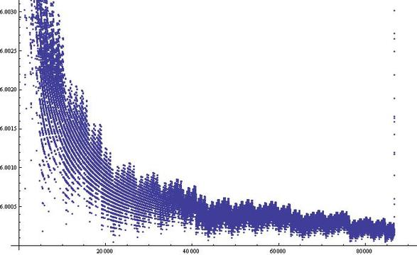

2011年3月[KeyTo9\_Fans提问](https://bbs.emath.ac.cn/thread-3063-1-1.html):

设数列$\{A_n\}$是不能表示成$a^2+b^2+c^2$(或者说三个完全平方数之和)的正整数组成的数列, 即[A004215](http://oeis.org/A004215)：  
比如  
$A_1=7$  
$A_2=15$  
$A_3=23$  
$A_4=28$  
$A_5=31$  
……  

求证：  
(1)$A_n>6n$  
(2)$\lim\limits_{n\to\infty}\frac{A_n}n=6$

# 初步分析
mathe根据[A004215](http://oeis.org/A004215)中信息发现这个数列就是$4^a(8k+7)$, 但是这个结论比较困以证明。  
有了这个结论，这里的问题就很简单了, [因为](https://bbs.emath.ac.cn/forum.php?mod=redirect&goto=findpost&ptid=3063&pid=36012&fromuid=20):  
不超过n的数中  
8k+7型的有$[\frac{n+1}8]$个  
4(8k+7)型的有$[\frac{n+4}{32}]$个  
..  
$4^h(8k+7)$型的有$[\frac{n+4^h}{2^{2h+3}}]$个  
累加即可。  
结果严格小于$\frac{n+1}8+\frac{n+4}{32}+\dots=\frac{n+1}6$.  
所以我们得到$n\lt\frac{A_n+1}6$,或者说$6n\le A_n$.  
另外由于$A_n$不是3的倍数，不可能等于$6n$,所以得到$A_n\gt 6n$.  
而又因为上面计数可以反向防缩得到$n\gt \frac{A_n+1}6-\log_2(A_n)$.  
于是我们得到$\lim\limits_{n\to\infty}\frac{A_n}n\le 6$,结合$A_n\gt 6n$得到$\lim\limits_{n\to\infty}\frac{A_n}n=6$.  
zgg\_\_给出了数列$\frac{A_n}n$的[图像](https://bbs.emath.ac.cn/forum.php?mod=redirect&goto=findpost&ptid=3063&pid=36011&fromuid=20):  
  

KeyTo9\_Fans也指出，证明(8k+7)的正整数不能表示为3个平方数之和[很容易](https://bbs.emath.ac.cn/forum.php?mod=redirect&goto=findpost&ptid=3063&pid=36013&fromuid=20)  
首先看$a^2 \mod 8$的结果：  
$0^2 \mod 8=0$  
$1^2 \mod 8=1$  
$2^2 \mod 8=4$  
$3^2 \mod 8=1$  
$4^2 \mod 8=0$  
$5^2 \mod 8=1$  
$6^2 \mod 8=4$  
$7^2 \mod 8=1$  
只有$0$、$1$、$4$三种结果。  
其中：  
$0=0+0+0$  
$1=1+0+0$  
$2=1+1+0$  
$3=1+1+1$  
$4=4+0+0$  
$5=4+1+0$  
$6=4+1+1$  
而$7$不能用$3$个$0$、$1$、$4$来表示。  
所以形如$(8k+7)$的正整数不能表示成$3$个平方数之和。  
剩下的问题还有：  
1. $4(8k+7)$、$16(8k+7)$、……的正整数也不能表示成$3$个平方数之和。  
2. 其余的正整数可以表示成$3$个平方数之和。  

mathe指出，$4^a(8b+7)$不能表示成三平方数和也简单。由于是偶数，那么三个平方数必然全部偶数或两奇一偶。  
对于全部偶数的情况，可以退化成$4^{a-1}(8b+7)$问题，所以只需要考虑两奇一偶情况，但是这时和不是4的倍数，矛盾。  

zgg\_\_指出，根据[A004215](http://oeis.org/A004215)记载，高斯最早解决了三平方和问题。

# 幺模矩阵
mathe从网络上找到了[证明过程](http://www.math.sunysb.edu/~deland/teaching_files/math311/class_files/sum3squares.pdf), 其中主要使用了一种叫做幺模矩阵(Unimodular Matrix)的数学工具。
幺模矩阵就是那些所有元素都是整数，而且行列式是1或-1的矩阵。  
对于幺模矩阵，其逆矩阵也是幺模矩阵，这个只要证明逆矩阵所有元素都是整数即可。  
实际上，对于幺模矩阵A,求逆矩阵中一行相当于解方程  
$Ax=b=\begin{bmatrix}0\\0\\ \vdots\\0\\1\\0\\ \vdots\\0\end{bmatrix}$。  
根据克莱姆法则，我们知道$x_i=\frac{|A_i|}{|A|}$,其中$A_i$是将$A$第i列用b替换得到矩阵。由于$|A|=+-1$,所以$x_i$必然是整数。  

# 幺模等价关系
论文里面提到一个等价关系，但是没有具体说明是什么等价关系，但是可以猜测到应该如下定义:  
对于一个$n\times n$的对称正定整数矩阵A,它对应于一个二次型$x^{\prime}Ax$,其中$x$是一个n维向量。  
对么对于任何一个幺模矩阵T,我们说二次型$x^{\prime}T^{\prime}ATx$和$x^{\prime}Ax$等价，也可以说对称矩阵$A$和$T^{\prime}AT$等价。  
如果定义正定二次型$f(x)=x^{\prime}Ax$是一个n维整向量空间到正整数集的映射,  
那么如果$g(x)$和$f(x)$等价，那么它们的值域相等。证明很简单:  
设$g(x)=x^{\prime}T^{\prime}ATx=x^{\prime}Bx$,对于任意$a=b^{\prime}Ab$,取$c=T^{-1}b$,那么$a=c^{\prime}Bc$,反之亦然。所以两个函数值域相等。  
比如一般二阶二次型就是$ax^2+2bxy+cy^2$,写成矩阵形式就是$\begin{pmatrix}x&y\end{pmatrix}\begin{bmatrix}a&b\\b&c\end{bmatrix}\begin{pmatrix}x\\y\end{pmatrix}$.  
而三阶二次型就是$ax^2+2bxy+cy^2+2dxz+2eyz+fz^2$,写成矩阵形式为$\begin{pmatrix}x&y&z\end{pmatrix}\begin{bmatrix}a&b&d\\b&c&e\\d&e&f\end{bmatrix}\begin{pmatrix}x\\y\\z\end{pmatrix}$.  
比如射影几何里面，圆锥曲线方程的一般形式就是其次坐标的二次型。如果对于一个二次型，对于所有非零向量代入结果大于0我们说是正定的.  

# 证明简介
文章证明了一个定理，如果一个3阶的正定整系数二次型其对应矩阵行列式为1，那么它等价于二次型$x^2+y^2+z^2$.  
也就是说，对于任意一个3阶正定整系数矩阵A，存在幺模矩阵T使得$A=T^{\prime}T$.  

有了这个结论，后面就相对简单一些了，我们只需要构造一个行列式为1的3阶正定整系数矩阵A,使其二次型可以取到整数n,文章中选择矩阵
$\begin{bmatrix}a_{11}&a_{12}&1\\a_{12}&a_{22}&0\\1&0&n\end{bmatrix}$.  
由于这个矩阵对于  
$x=\begin{pmatrix}0\\0\\1\end{pmatrix}$  
二次型取值为n,我们只需要构造的矩阵特征值为1即可，其中含3个参数  
其中$a_{11}\gt 0,b=a_{11}a_{22}-a_{12}^2\gt 0$.  
行列式为1的条件相当于$-b -= a_{12}^2(\mod a_{22})$  
构造中需要使用Dirichlet定理:对于任意互素整数a,b,数列{an+b}中存在素数。  

具体证明过程有点复杂，有兴趣的可以直接查看原论文，或者到[数学研发论坛](https://bbs.emath.ac.cn/forum.php?mod=redirect&goto=findpost&ptid=3063&pid=36030&fromuid=20)查看mathe翻译的证明摘要过程。

# 三立方和
虽然三平方和的证明过程很不简单，但是和[三立方和问题](http://www.asahi-net.or.jp/~KC2H-MSM/mathland/math04/matb0100.htm)比较起来，还是小巫见大巫了。  
数学家们最近据说动用了50万台计算机才解决了将[42表示为三个整数立方和的问题](https://www.ithome.com/0/443/896.htm):  
$42=(-80538738812075974)^3 + 80435758145817515^3 + 12602123297335631^3$  

现在我们已知的结论有：  
i) 有无穷种将1表示为三立方和的方案  
    $(1\pm 9m^3)^3 + (9m^4)^3 + (-9m^4 \mp 3m)^3 = 1$  
ii) Ramanujan给出了  
    $(3n^2+5nm-5m^2)^3+(4n^2-4nm+6m^2)^3+(5n^2-5nm-3m^2)^3=(6n^2-4nm+4m^2)^3$  

iii) 当$n\equiv 4(\mod 9)$或$n\equiv 5(\mod 9)$时，$x^3+y^3+z^3=n$无整数解  
iv) 我们可以猜测除了iii)中情况，所有其它n可以表示为三个立方数之和， 但是这个问题还无人能够证明。  

将42表示为三个立方数之和的解决使得100以内所有自然数的三立方和问题得到了解决。

