---

title: "最团结的圆"
date: "2020-02-01"
thumbnail: "../images/圆与三角形的重叠面积.png"
author: "mathe"
tags: 
    - "圆"
    - "三角形" 
    - "极值"
---

# 问题来源
2019年1月[lsr314提问](https://bbs.emath.ac.cn/forum.php?mod=viewthread&tid=15716&fromuid=20)，如图:  
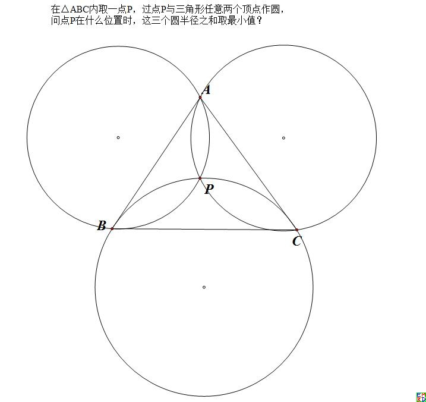  
并且要求推广点P不限制在三角形内部，可以是平面任意位置。请问什么时候这三个圆最紧密团结（半径之和最小）？

# 极值点分析
lsr314首先[给出了一个结论](https://bbs.emath.ac.cn/forum.php?mod=redirect&goto=findpost&ptid=15716&pid=77348&fromuid=20):  
假设点P到三条边$a,b,c$的张角分别是$x,y,z$,则应满足$\frac{a\cos x}{\sin^2 x}=\frac{b \cos y}{\sin^2 y}=\frac{c \cosz}{\sin^2 z}$.  
并且后来给出了[对应的几何意义](https://bbs.emath.ac.cn/forum.php?mod=redirect&goto=findpost&ptid=15716&pid=77386&fromuid=20):  
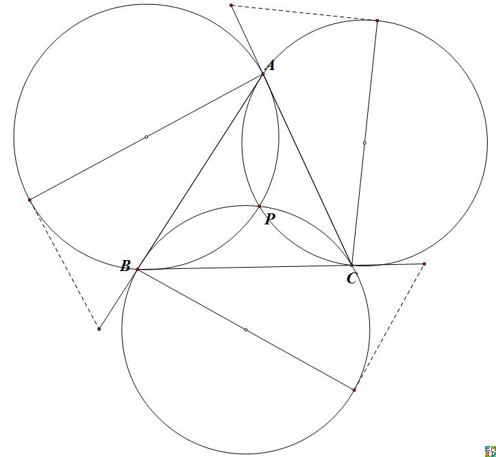  
如图，三条切线长（虚线）相等的时候，三个圆的半径之和取得最小值。  
并且他还认为，一般情况，极值情况的P点位置无法通过尺规作图得到。  
mathe[验算并赞同](https://bbs.emath.ac.cn/forum.php?mod=redirect&goto=findpost&ptid=15716&pid=77381&fromuid=20)lsr314的结论：  
也就是P点对三边张角x,y,z满足条件
$\frac{1-\cos^2(x)}{\cos(x)}:\frac{1-\cos^2(y)}{\cos(y)}:\frac{1-\cos^2(z)}{\cos(z)}=a : b : c$而且$x+y+z=2\pi$.  
对于三角形内部的点P,显然只能三个角都是钝角,  
由于函数$\frac{1-\cos^2(x)}{\cos(x)}$在$x\in (\frac{\pi}2,\pi)$单调增,所以给定$a,b,c$后，这样的解最多只有唯一一组。  
而由于函数$\frac{1-\cos^2(x)}{\cos(x)}$值域覆盖$(-\infty,0)$整个区间，所以这样的解也必然存在。  
设$u=\cos(x),v=\cos(y),w=\cos(z)$,  
于是存在参数$h\lt 0$使得  
$\begin{cases}u^2+v^2+w^2-1-2uvw=0\\
1-u^2-ahu=0\\
1-v^2-bhv=0\\
1-w^2-chw=0
\end{cases}$  
这个方程组的解正常情况应该无法尺规作图.  
随后mathe验算一般情况最后h需要满足的方程[是一个7次多项式](https://bbs.emath.ac.cn/forum.php?mod=redirect&goto=findpost&ptid=15716&pid=77382&fromuid=20), 比如$a=3,b=4,c=5$代入后，得到  
$h$满足的方程为$6534375h^7 - 2098350h^6 + 2379375h^5 + 70000h^4 + 66360h^3 + 137600h^2 - 18000h + 9856=0$.  
mathe并且使用[在线magma](http://magma.maths.usyd.edu.au/calc/)计算上面[方程的Galios群得出](https://bbs.emath.ac.cn/forum.php?mod=redirect&goto=findpost&ptid=15716&pid=77383&fromuid=20)：  
Symmetric group G acting on a set of cardinality 7  
Order = 5040 = $2^4\times 3^2 \times 5 \times 7$  
所以显然根据伽罗瓦理论可以得出是不可以尺规作图的。  
lsr314进一步提问除了mathe前面提及三角形内部的极值点，[是否还存在外部极值点](https://bbs.emath.ac.cn/forum.php?mod=redirect&goto=findpost&ptid=15716&pid=77390&fromuid=20)？  
在外部的时候，取极值的条件是$\frac{a\cos x}{\sin^2x}=\frac{b\cos y}{\sin^2y}=-\frac{c \cos z}{\sin^2z}$, 所以应该是$0\lt x,y\lt \frac{\pi}2,z=x+y\gt \frac{\pi}2$.  
定性地分析，点P接近三条边所在的直线时，有一个圆半径趋于无限大，点P与三角形距离很远时，三个圆的半径都很大，所以在每个区域都有极小值。  
如图，夹在两条射线之间并且在三角形外部的这个区域对应的极值点P落在深色区域，而外接圆是穿过这个深色区域的。  
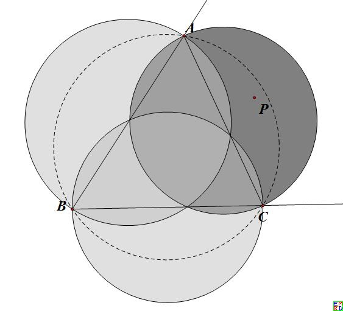  
mathe也进一步分析这种情况，发现[外部极值点和内部极值点关系密切](https://bbs.emath.ac.cn/forum.php?mod=redirect&goto=findpost&ptid=15716&pid=77401&fromuid=20):  
如果存在钝角时，钝角那侧还会多一个极值点，而且很可能是全局极值点。  
由于三角形内部必然存在一个唯一的$P_0$点，满足方程$\frac{a\cos(x_0)}{\sin^2(x_0)}=\frac{b\cos(y_0)}{\sin^2(y_0)}=\frac{c\cos(z_0)}/{\sin^2(z_0)}$而且$x_0+y_0+z_0=2\pi$,其中$\frac{\pi}2\lt x_0\lt\pi,\frac{\pi}2\lt y_0\lt\pi,\frac{\pi}2\lt z_0\lt\pi$  
我们选择$P_1$点，使得$x_1=pi-x_0,y_1=pi-y_0,z_1=z_0$,于是$x_1+y_1=z_1$,而且满足方程$\frac{a\cos(x_1)}{\sin^2(x_1)}=\frac{b\cos(y_1)}{\sin^2(y_1)}=-\frac{c\cos(z_1)}{\sin^2(z_1)}$，同样我们可以得出$P_2,P_3$。  
从图像上看，$P_1,P_2,P_3$分别为$P_0$时对应三个圆关于各自的边的对称图形的交点。  
比较有意思的是上面四个极值点中三个圆的半径之和都相等。  
并且给出了特殊情况下$P_1$和$P_0$的图片,这时由于角特别大，$P_0$也跑到三角形外部。  
其中，$a=b=5,c=9,h=-0.24855704711080550767183431584936828387$,  
$u=v=-0.55594708911635773652783798763298602680,w=-0.38184566820609717835179976754753014669$  
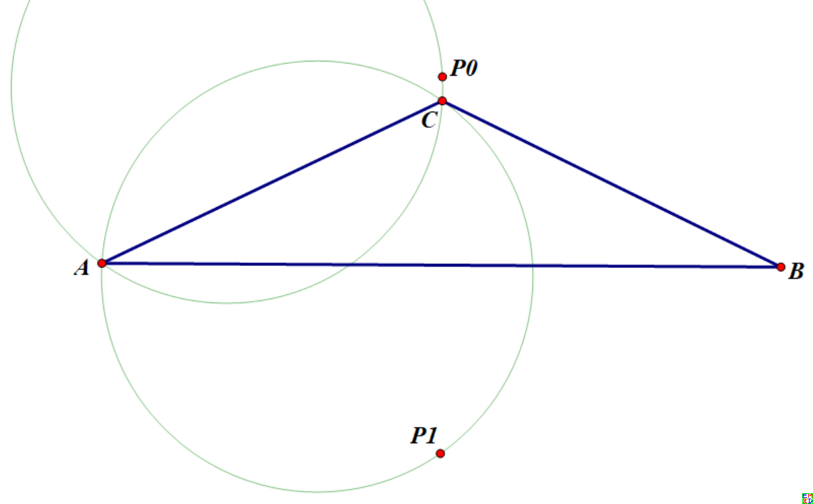  
mathe还尝试研究$P_0$从三角形内部变换到外部的边界条加你，[其结果很复杂](https://bbs.emath.ac.cn/forum.php?mod=redirect&goto=findpost&ptid=15716&pid=77403&fromuid=20),是一个关于a,b,c的16次方程。
而如果设置$a=b$,那么边界条件化为：  
$c^{16} - 14a^2c^{14} + 91a^4c^{12} - 348a^6c^{10} + 842a^8c^8 - 1296a^{10}c^6 + 1184a^{12}c^4 - 512a^{14}c^2=0$  
在a=b=1时，得出c=1.6712918672309108116400324722046009792,或者说c满足方程$c^6 - 8*c^4 + 26*c^2 - 32=0$.  
对应这个等腰三角形的顶角为钝角113.36631447849125805882333189902549881°。  
接着他认为极值点应该只有两个而不是前面认为的四个，如下图:  
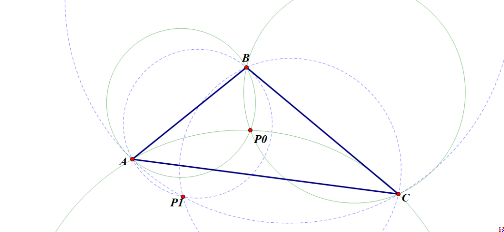  
如果给定三角形ABC内部的点P0,那么我们可以作出三个绿色圆，它们各自关于对应的边的对称可以得出三个蓝色圆。  
而三个圆的交点除了三角形三个顶点就只有两个点了（图上$P_0,P_1$)。唯一的例外是正三角形，这时外部点$P_1$可以取外接圆上任意一点。  
这说明虽然我们发现每条边外侧都有半径和先变小再变大的过程，但是不是所有区域都有极小值，其中有两个区域最小值是在边界上的，所以另一个区域可以有更小值.  
另外如果我们选择三角形ABC为等腰三角形，其中AC=BC,设最优点P0对边BC的张角为w,那么做出C-w图后，惊奇的发现这竟然是减函数而不是增函数  
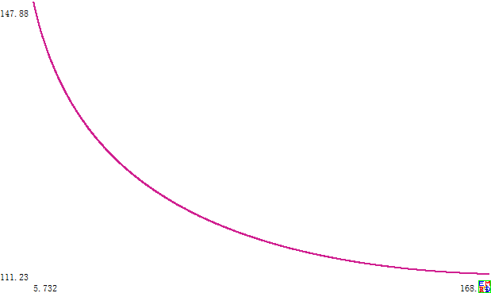  
图中以角度为单位。  
在角C趋向0度时，w会剧烈趋向180度，但是在角C趋向180度时，w会有一个极限角度111.16795543407148897243102385051624736°。  
dlpg070认为极值点应该[还是四个而不是两个](https://bbs.emath.ac.cn/forum.php?mod=redirect&goto=findpost&ptid=15716&pid=77832&fromuid=20):  
他给出了半径和关于变量h的等高线：  
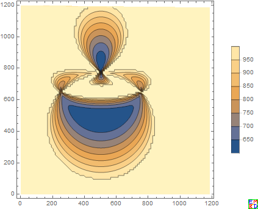  
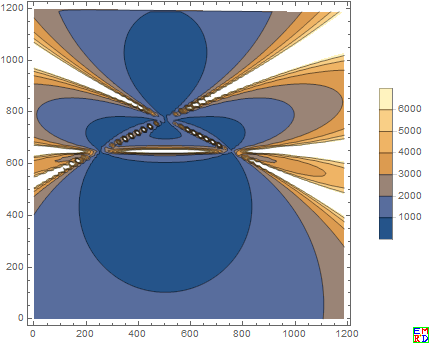  
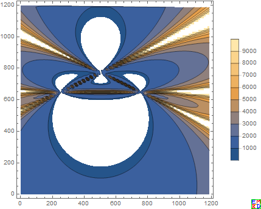  
并给出一个[人机交换演示工具](https://bbs.emath.ac.cn/forum.php?mod=redirect&goto=findpost&ptid=15716&pid=77841&fromuid=20):  
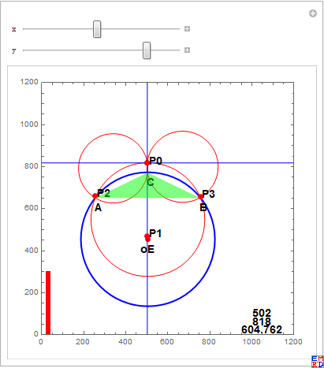  
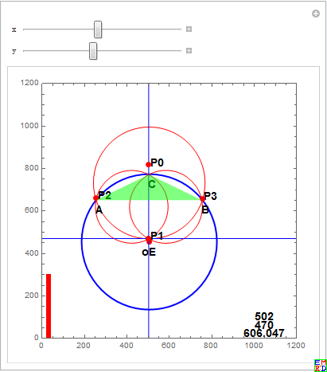  
但是mathe还是认为只有两个最小值，他给出了对应的三维图:  
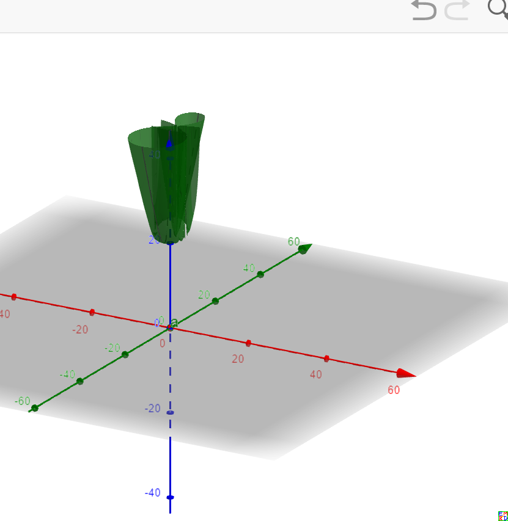  
认为可以看到的确对于大部分的和会有四个区域（对应四个锥形图），但是最小值不同，我们只看到一大一小两个可以取到最小值。另外两个小的被大的完全包含了。  
# 派生几何变换
[mathe发现](https://bbs.emath.ac.cn/forum.php?mod=redirect&goto=findpost&ptid=15716&pid=77429&fromuid=20)给定平面上一个三角形ABC,对于平面上任意一个点P(P不在三角形边上），分别做三角形P关于BC,CA,AB的对称点$P_1,P_2,P_3$,那么三角形$BCP_1,CAP_2,ABP_3$的外接圆交于一点Q,这种方式确定了一个$P\to Q$的一一对映关系，请问这是一种什么样的对应关系？
用几何画板做了个特殊情况的$P\to Q$轨迹，结果证明不是线性的对合变换，因为直线被变换为奇怪的曲线了：  
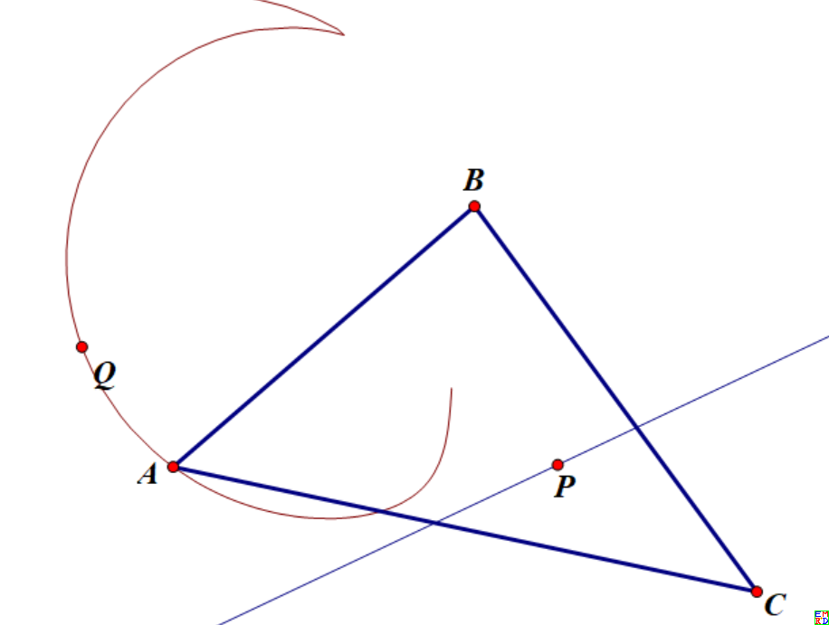  
[lsr314发现](https://bbs.emath.ac.cn/forum.php?mod=redirect&goto=findpost&ptid=15716&pid=77432&fromuid=20)原三角形外接圆，$P_0$关于三边对称点外接圆和$P_1$关于三边对称点外接圆三圆共弦：  
  

然后[mathe发现](https://bbs.emath.ac.cn/forum.php?mod=redirect&goto=findpost&ptid=15716&pid=77447&fromuid=20)， 选择P为平面上一点，其关于三边对称点$P_1,P_2,P_3$，过$P_1,P_2,P_3$三点的圆为圆R,那么P->圆心R会将三角形内部的点一一映射三角形内部的点，
而且会把直线映射为经过三角形顶点的双曲线。  
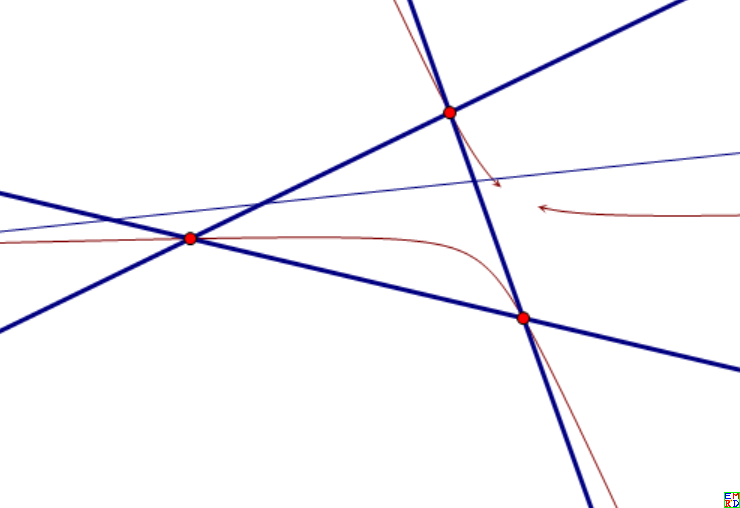  
[hujunhua指出](https://bbs.emath.ac.cn/forum.php?mod=redirect&goto=findpost&ptid=15716&pid=77450&fromuid=20)这个变换边上的点被映射到相对的顶点，故由映射的连续性可知三角形内的点是映射到三角形内的。  
由楼上的垂心循环可知，此处映射的不动点为三角形ABC的内心。  
易知不动直线为三角形的角平分线。  

[hujunhua发现](https://bbs.emath.ac.cn/forum.php?mod=redirect&goto=findpost&ptid=15716&pid=77449&fromuid=20)一种有意思的几何变换存在周期迭代:  
映射：四点形PABC→四点形PP1P2P3 (P1P2P2是P关于三边的对称点）  
因为一个明显的迭代循环，他的焦点落在了四点形中P与三点形的关系上。  
这个迭代循环是：垂心→内心→外心→垂心。即P是ABC的垂心（内心，外心）时，也是P1P2P3的内心（外心，垂心）。  
他想知道重心是否也有迭代循环，作图的结果是肯定的，并且周期也是3。只是还没仔细研究，不知道重心循环中的其他两个是三角形的什么中心。  
又试了一下等角中心（费马点），作图发现还是周期为3的循环。同样不知道循环中的其它两点是什么中心。  
垂心循环中，经过周期3得到的是位似形，位似中心即点P，位似比不定。  
重心循环和等角中心循环中一般不是位似形。猜想是相似形，作图验证正确。  
于是猜想对任意点P，都存在周期为3的迭代循环。即经过3次迭代，必得到与原来相似的四点形。  
作图验证猜想是正确的。  
mathe试着把三角形[推广到四边形](https://bbs.emath.ac.cn/forum.php?mod=redirect&goto=findpost&ptid=15716&pid=77452&fromuid=20)结果发现还是存在周期现象，只是现在是以4为周期： 
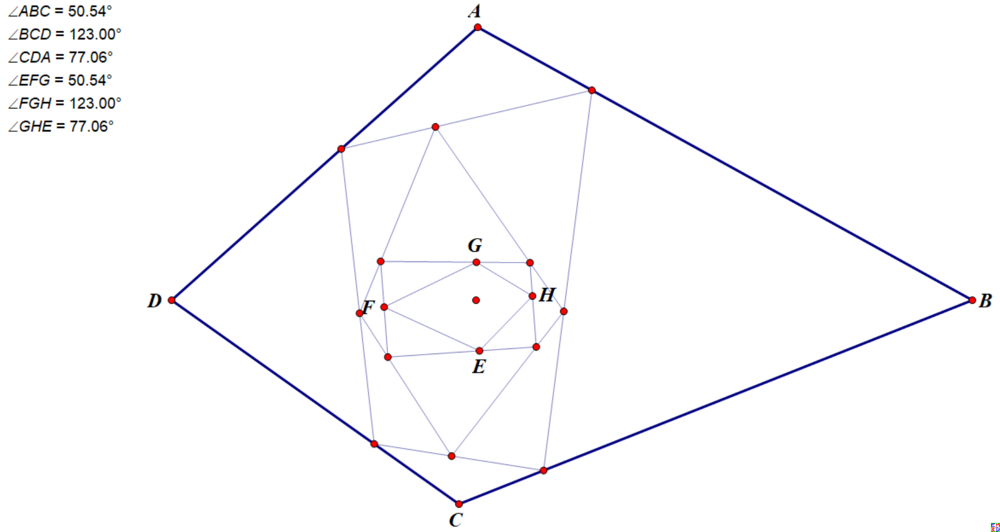  
mathe继续提供[Pari/Gp代码](../attached/tightcircle.txt)计算更多边的情况，证实也都存在周期现象。  
比如上面pari/gp代码，然后调用  
```bash
(11:12) gp > m=granm(10,2);
(11:12) gp > h=m;
(11:12) gp > for(u=1,10,h=perprotate(h))
(11:12) gp > pangle(m)
%58 = [0.13094390757425572586897330693922760638, 0.27478457799382083099586956163919994750, -0.83403509336655614549647414732045555854, 0.59735297479132672647706922853304549911, -0.52632380321904226169862901627243144170, -0.80511734034786098563793583703215670988, -0.38438818934646934888818443410206486840, -0.99130533701336277684115213150606694557, 0.41861095048399809858695131599839686302, -0.066203186117102511991044546302214391115]
(11:13) gp > pangle(h)
%59 = [0.13094390757425572586897330693922760656, 0.27478457799382083099586956163919994285, -0.83403509336655614549647414732045555834, 0.59735297479132672647706922853304549645, -0.52632380321904226169862901627243144215, -0.80511734034786098563793583703215671111, -0.38438818934646934888818443410206487575, -0.99130533701336277684115213150606694557, 0.41861095048399809858695131599839686347, -0.066203186117102511991044546302214393602]
```
验证10个平面点也满足条件（取P为原点）。  
但是如果扩展到三维空间就不成立了.  

然后mathe[尝试证明上面的结论](https://bbs.emath.ac.cn/forum.php?mod=redirect&goto=findpost&ptid=15716&pid=77463&fromuid=20):  
P在多边形内部时，P和各顶点连线把初始多边形的相应内角分为两部分，这2n个角度集合记为S。  
不同阶段的迭代多边形，各顶点与P的连线亦将该多边形的各内角分为两部分，相应2n个角度的集合不变，仍然为S，只是两两组合不同，并有简单的规律：均分两组循环相配。  
n个符号的简单循环，周期自然是n.  
P于多边形各边的镜像点可以由P点在各边上的投影来代替，这只不过将诸镜像点构成的多边形以P为位似中心缩小了一半。
引理：如图，P为角ABC内一点，E、F为P在两边上的投影（ $\theta=\frac{\pi}2$)，显然B、E、P、F四点共圆，故有图中标示的两组等角B1和B2（角B的两部分）。
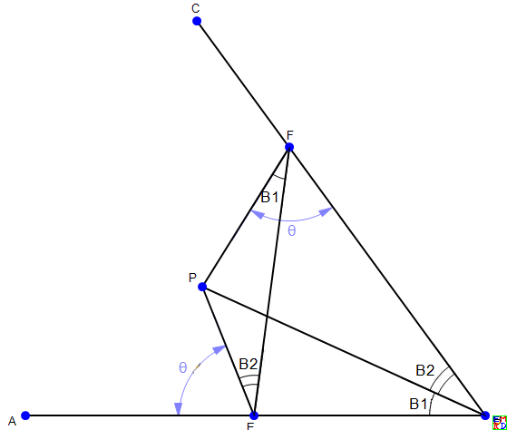  
对于一个凸多边$V_1V_2...V_i...V_n$, 假定其内角$\angle V_i$被连线$PV_i$分为$V_{i,1}+V_{i,2}$, 假定P在边$V_iV_{i+1}$的投影为$V_i^1$。  
记$S_1=\{V_{i,1}\}, S_2=\{V_{i,2}\},S=S_1\cup S_2$.  
上述下标按$\pmod n$理解。  
按引理有：$\angle PV_{i-1}^1V_i^1=V_{i2},\angle PV_i^1V_{i-1}^1=V_{i1},\angle V_{i-1}^1V_i^1V_{i+1}^1=V_{i,1}+V_{i+1,2}$.  
可见经过一次投影，所得多边形$V_1^1\cdots V_i^1\cdots V_n^1$的内角的分割组合变成了$\angle V_i^1=V_{i,1}+V_{i+1,2}$与$\angle V_i=V_{i,1}+V_{i,2}$相比仍然是$S_1+S_2$，当把$S_1,S_2$看作有序的表时，按表的运算规则应该是$S_1+\text{RotationLeft}(S_2)$.  
依此类推，$k$次迭代的投影多边形$V_1^k\cdots V_i^k\cdots V_n^k$的内角的分割组合变成了$\angle V_i^k=V_{i,1}+V_{i+k,2}$当$k=n$时，内角的分割组合就变回了$\angle V_i^n=V_{i,1}+V_{i,2}$，多边形就变回了初始的形状。  
由此mathe继续推广题目的结论:  
显然，楼上的图中的角度$\theta$不等于$\frac{\pi}2$时，仍有四点共圆，引理依然成立，后续的证明依然有效。  
如图每次射线和边夹角都是60度，同样能够三次映射后得到相似的三角形。  
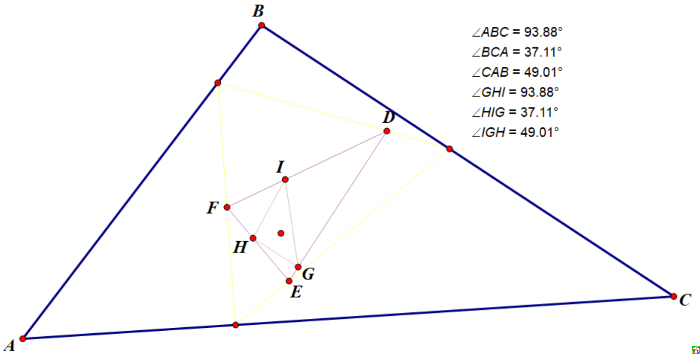  

hujunhua[尝试另外一种扩展](https://bbs.emath.ac.cn/forum.php?mod=redirect&goto=findpost&ptid=15716&pid=77457&fromuid=20)：  
对于一条光滑的闭曲线C，从平面上一点P向曲线C的切线作投影，切线动一周生成投影的轨迹C1，称为曲线C对点P的投影曲线。
接着再作C1对点P的投影曲线。  
为了无穷迭代不发散到无穷远或退化到点P，我们将投影曲线以P为中心作一个位似变换，使所得像曲线的周长或面积保持不变，始终等于C的周长或面积。  
那么无穷迭代会收敛到一个与C全等的曲线吗？  
lsr314指出，作图验证这时对椭圆就不成立了：  
  
而更换P点位置（图中的D）在外面的时候，轨迹有点像大白：  
  
wayne也来凑热闹，给出了另外一种漂亮的图片:  
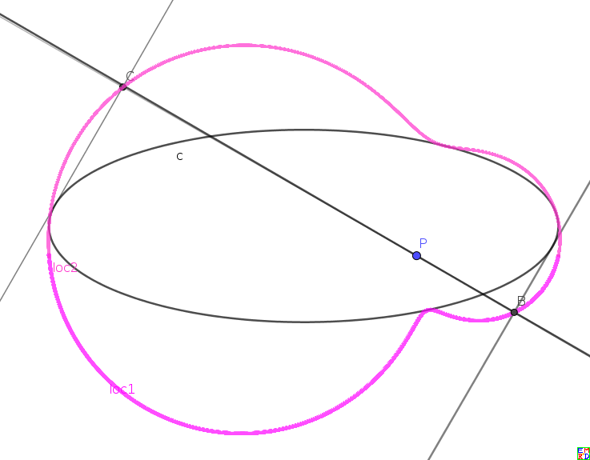  
