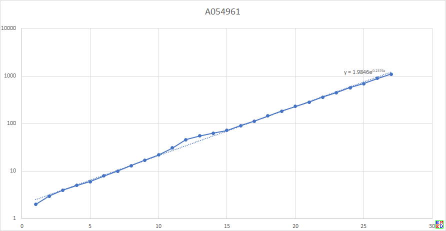
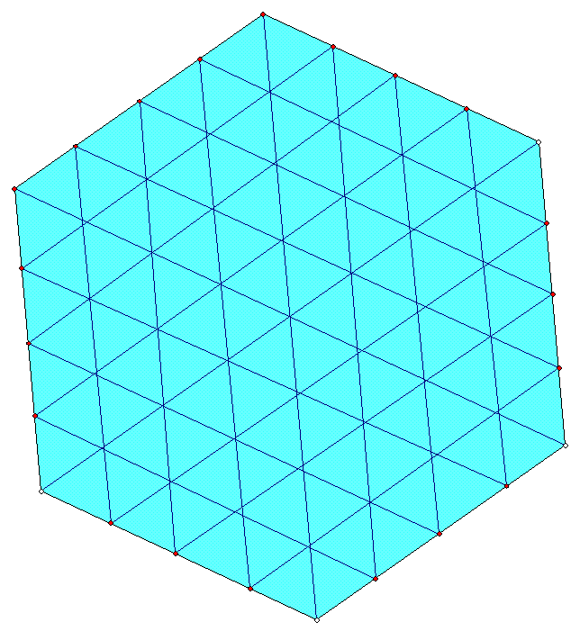

#摘要
网络上广为流传着一个毒酒问题，这个问题也由于牵涉到二进制表示，有时候会被用于程序员面试：

现在有1024瓶红酒，其中有[一瓶有剧毒]。
人喝了之后经过大约七天然后突然毒发而死。
(喝一滴和喝一瓶效果一样，七天内并没有病发的现象)
毒酒跟普通红酒外表、气味完全一样，所以除了用活人试毒外别无他法。
现在你手上有一批用来试毒的死囚，每位死囚都按规定能收取安家费一万元(不论最后是否中毒)。
你必须于七天后找出哪一瓶是毒酒。问如何设计方案使用最少成本？

通过使用二进制表示可以轻松仅用10个囚犯解决上面这个问题，并且用信息论可以证明这已经是最优结果了。但是如果把上面的问题中的一桶毒酒改为两桶，会出现什么情况呢？同样使用信息论可以得出这时[理论下界]是19,但是实际上我们能达到的数目却远远大于19。这个问题曾经在百度多个贴吧中出现，
后来这个[两桶毒酒问题]在数学研发论坛被深入讨论, 通过各种不同的方案，从最初构造出[使用127个囚犯的方案]到最终通过计算机搜索出一种[使用27个囚犯解决1090瓶酒的方案]

#详细内容

##手工构造模型
[百度贴吧](http://tieba.baidu.com/f?kz=587967375) 最早有人提出将$n^2$桶酒排列成$n\times n$的方阵，然后让n个囚徒分别喝n行,n个囚徒分别喝n列，再使用$2n-1$个囚徒喝和一条对角线平行的各条线上的酒，就可以得到一种使用
$4n-1$个囚徒区分$n^2$桶酒的方案。很多没有经过深思熟虑的同学们都会提议直接用$2n$个囚徒分别去喝n行喝n列来解决这个问题，却没有注意到在最后当某两行与某两列各自有两个囚徒倒下时，我们只能确定这两瓶毒酒是属于
这两行与这两列的四个交点中的两个，但是不能完全确定是哪两个。这就是为什么我们需要$2n-1$个额外的囚徒来区分各条对角线。于是这个粗糙的[正方形模型]对于1000瓶酒，我们需要使用一个$32\times 32$的方阵来解决，最终需要使用$4\times 32-1=127$个囚徒。

随后zed提议改进正方模型为[正六边形模型], 在这个模型中，我们可以用$6a+3$个囚徒解决$3a^2+3a+1$瓶酒，从而将囚犯数目降低为$6\times 18+3=111$人。

##初步数学模型
接着mathe[利用果树种植问题中的现成结论]得出一种使用79个囚犯的方案。其主要思路就是问题转化为Packing $K_3$ into $K_n$的图论问题。 于是对于n桶酒，大概需要$\sqrt{6n}$个囚犯。
而后来他直接通过在OEIS网站寻找到关于Packing $K_3$ into $K_n$的已知最好结果得出了[41个囚犯的方案], 并且给出了[搜索41个囚徒方案的C代码]。

随后[shshsh_0510提出了一种方案]使得对于充分多的酒瓶数目时的[复杂度得到了突破]，达到了O(log^2(x)).

通过在网络上找到一篇文章《Union-free Hypergraphs and Probability Theory》(Peter Franki and Zoltan Furedi)可以得出了一种使得$4n$个囚犯解决$2^n$瓶酒的构造方案从而可以[使用40个囚犯解决1024桶酒问题]。
其思路是将长度为n的0,1向量看成$2^n$阶有限域$F_{2^n}$中的数。
而记$I=(1,1,\dots,1)$也就是所有n个分量都是1的数。
对于4n个囚犯,可以将他们分成4组X,Y,Z,W；其中每组n个囚犯
分别做$F_{2^n}$到各组n个囚犯构成集合的一一映射， 映射$g_1:F_{2^n}\to 2^X, g_2: F_{2^n}\to 2^Y, g_3: F_{2^n}\to 2^Z, g_4: F_{2^n}\to 2^W$
于是集合$\text{\{}g_1(a)\cup g_2(I-a)\cup g_3(a^3) \cup g_4(I-a^3)| a\in F_{2^n} \text{\}}$就满足条件。

通过google找到一篇使用随机构造的算法的文章[New Bounds for Union-free Families of Sets]，我们竟然可以使用这种碰运气的算法产生[33个囚徒的方案]和[32个囚徒的方案]（点击链接获取[33个囚徒方案数据的16进制格式表示]以及[32个囚徒方案数据的16进制格式表示]）。

##小规模数据穷举
随后mathe写了一个[穷举代码]穷举了酒瓶数目比较少的情况得出6个囚徒可以识别8坛酒，7个囚徒识别10坛酒等：

对于n=6,可以识别8坛酒
        
        00
        03
        0C
        15
        1A
        26
        29
        30

对于n=7,可以识别10坛酒:
        
        00
        03
        05
        09
        12
        24
        38
        48
        54
        62

对于n=8,至少可以识别13坛酒:
        
        00
        03
        0C
        15
        26
        38
        49
        52
        60
        8A
        90
        A1
        C4

对于n=9,至少可以识别16坛酒:
        
        000
        003
        024
        038
        048
        062
        00D
        016
        051
        081
        098
        0C4
        10A
        110
        121
        144

n=10,至少20坛酒
        
        000
        003
        024
        038
        048
        062
        00D
        016
        051
        098
        0C4
        10A
        110
        181
        231
        254
        28A
        2C1
        30C
        322

n=11,至少可以26坛酒
        
        016
        051
        098
        0C4
        10A
        110
        181
        231
        254
        28A
        2C1
        30C
        322
        000
        003
        00D
        024
        038
        048
        062
        428
        485
        4C2
        521
        540
        600

n=12,可以32坛
        
        0C4
        10A
        110
        081
        144
        221
        288
        301
        431
        494
        505
        602
        628
        740
        000
        00D
        024
        038
        048
        051
        062
        092
        252
        4C2
        832
        886
        909
        A04
        A41
        B02
        C18
        C80

n=13,可以39坛
        
        010A
        0110
        0081
        0121
        0144
        0205
        0494
        0612
        0640
        0720
        0904
        0A11
        0A20
        0B02
        0C06
        0C08
        0C21
        0E80
        0000
        0003
        000D
        0016
        0024
        0048
        0051
        02B0
        03C0
        08A8
        101C
        1022
        10E0
        1188
        1242
        1280
        1401
        1428
        1444
        1812
        1901

n=14,至少47坛
        
        0110
        0081
        0121
        0144
        0205
        0494
        0222
        0460
        0630
        0704
        0809
        0842
        0A11
        0B02
        0C10
        0E80
        10C0
        1212
        1301
        1408
        1421
        1890
        1940
        1A00
        0000
        0003
        000D
        0016
        0024
        0038
        0048
        0051
        0098
        010A
        1406
        2046
        2084
        2214
        22C0
        2320
        2402
        2488
        2908
        2C20
        3009
        3010
        3060

上面每一行数都是一个16进制数,其中A,B,C,D,E,F表示16进制中的10~15.
而我们可以将每位16进制数转化为4位二进制数,比如

0  -> 0000

1 ->  0001

2 ->  0010

3 ->  0011

4 ->  0100

...

F ->  1111

于是替换以后,每一行可以表示成一个n位二进制数.其中每一位分别对应那个人是否要喝对应的那坛酒(所在行表示酒)
从而在OEIS上找到了[A054961]和本问题相对应。

##手工模型改进
而后tannis_jin在百度上[对正方形模型的对角线确定方法进行了改善],使得确定对角线的数目从2n-1降低到$\lfloor\frac{n}2\rfloor$。

设正方形变长为a

对角线需要：

若a=2k，则需k人。

若a=2k+1，则需k人。（k>1）

举个例子：

a=7

0123321

1012332

2101233

3210123

3321012

2332101

1233210

在这个方案的基础上，继续优化。
并且指出识别32行中最多两行不需要32个囚犯而是12个即可，同样识别对角线不需要16个囚犯，9个即可

于是通过[构造法也可以达到只需要33给囚犯]。

##进化模型
随后mathe使用BLISS库淘汰同构结构得出[8人最多验证13瓶酒]的两种方案

G H BD AF CE ABC DEF AEG BFG CDG ADH BEH CFH

O BD AF CE GH ABC DEF AEG BFG CDG ADH BEH CFH

以及[9人最多只能识别17瓶]正好包好两瓶毒酒的方案，而且本质上只有一种方案：

G HI EF AB DEI CFI ADH BCH ACE BDF CDG AFHI BEHI CEGH DFGH AEGI BFGI

并且随后将图的同构代码切换成[nauty](http://pallini.di.uniroma1.it/) ,找出[10人22瓶]，11人31瓶，12人46瓶等方案。

10个人22瓶毒酒的一些本质不同的方案，每个数据表示为16进制数（需要将它们转化为10比特的二进制数)

1 2 300 a0 50 c 2c8 234 1c4 138 285 229 21a 246 18a 115 149 126 99 96 65 6a

11人31瓶:

400 40b 415 452 464 622 506 4b0 48c 618 528 4c1 701 63 a9 125 5c 96 20e 11a 245 149 283 191 268 170 1a2 2a4 342 2d0 1c4

12人46瓶:

800 825 84a 870 c12 898 914 a11 c09 a0c 886 903 c44 928 a22 8c1 451 238 132 d4 426 a9 14c 243 468 264 161 e2 518 614 191 292 48c 60a 505 483 309 18a 285 306 4b0 350 621 542 1a4 2c8

并给出了[基本搜索源码]， 而最终代码采用类似单性繁殖的进化方案进化到[使用27个囚犯解决1090瓶酒的方案]，并把结果更新到[A054961]

点击下载[进化版本代码]和[最终数据]

最新版本更新在: [https://blog.emath.ac.cn/two-poisoned-wine/](https://blog.emath.ac.cn/two-poisoned-wine/)

[一瓶有剧毒]: https://blog.csdn.net/github_38885296/article/details/78003388
[两桶毒酒问题]: https://bbs.emath.ac.cn/thread-1511-1-1.html
[理论下界]: https://bbs.emath.ac.cn/forum.php?mod=redirect&goto=findpost&ptid=1511&pid=19404&fromuid=20
[使用127个囚犯的方案]: https://bbs.emath.ac.cn/forum.php?mod=redirect&goto=findpost&ptid=1511&pid=19415&fromuid=20
[使用27个囚犯解决1090瓶酒的方案]: https://bbs.emath.ac.cn/forum.php?mod=redirect&goto=findpost&ptid=1511&pid=74510&fromuid=20
[正方形模型]: https://bbs.emath.ac.cn/forum.php?mod=redirect&goto=findpost&ptid=1511&pid=19415&fromuid=20
[正六边形模型]: https://bbs.emath.ac.cn/forum.php?mod=redirect&goto=findpost&ptid=1511&pid=19416&fromuid=20
[利用果树种植问题中的现成结论]: https://bbs.emath.ac.cn/forum.php?mod=redirect&goto=findpost&ptid=1511&pid=19429&fromuid=20
[41个囚犯的方案]: https://bbs.emath.ac.cn/forum.php?mod=redirect&goto=findpost&ptid=1511&pid=19445&fromuid=20
[搜索41个囚徒方案的C代码]: https://bbs.emath.ac.cn/forum.php?mod=redirect&goto=findpost&ptid=1511&pid=19474&fromuid=20
[shshsh_0510提出了一种方案]: https://bbs.emath.ac.cn/forum.php?mod=redirect&goto=findpost&ptid=1511&pid=19458&fromuid=20
[复杂度得到了突破]: https://bbs.emath.ac.cn/forum.php?mod=redirect&goto=findpost&ptid=1511&pid=19464&fromuid=20
[使用40个囚犯解决1024桶酒问题]: https://bbs.emath.ac.cn/forum.php?mod=redirect&goto=findpost&ptid=1511&pid=19500&fromuid=20
[New Bounds for Union-free Families of Sets]: https://bbs.emath.ac.cn/forum.php?mod=attachment&aid=OTM5fDM2ZmUxMDQxfDE1NzE2NTkzNTB8MjB8MTUxMQ%3D%3D
[33个囚徒的方案]: https://bbs.emath.ac.cn/forum.php?mod=redirect&goto=findpost&ptid=1511&pid=38892&fromuid=20
[32个囚徒的方案]: https://bbs.emath.ac.cn/forum.php?mod=redirect&goto=findpost&ptid=1511&pid=38921&fromuid=20
[穷举代码]: https://bbs.emath.ac.cn/forum.php?mod=redirect&goto=findpost&ptid=1511&pid=19549&fromuid=20
[A054961]: https://oeis.org/A054961
[对正方形模型的对角线确定方法进行了改善]: https://bbs.emath.ac.cn/forum.php?mod=redirect&goto=findpost&ptid=1511&pid=19621&fromuid=20
[构造法也可以达到只需要33给囚犯]: https://bbs.emath.ac.cn/forum.php?mod=redirect&goto=findpost&ptid=1511&pid=19624&fromuid=20
[33个囚徒方案数据的16进制格式表示]: ../attached/poison33.txt
[32个囚徒方案数据的16进制格式表示]: ../attached/poison32.txt
[8人最多验证13瓶酒]: https://bbs.emath.ac.cn/forum.php?mod=redirect&goto=findpost&ptid=1511&pid=74184&fromuid=20
[9人最多只能识别17瓶]: https://bbs.emath.ac.cn/forum.php?mod=redirect&goto=findpost&ptid=1511&pid=74188&fromuid=20
[10人22瓶]: https://bbs.emath.ac.cn/forum.php?mod=redirect&goto=findpost&ptid=1511&pid=74396&fromuid=20
[基本搜索源码]: ../attached/code1.cpp
[进化版本代码]: ../attached/code2.cpp
[最终数据]: ../attached/poisonall.txt
