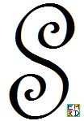
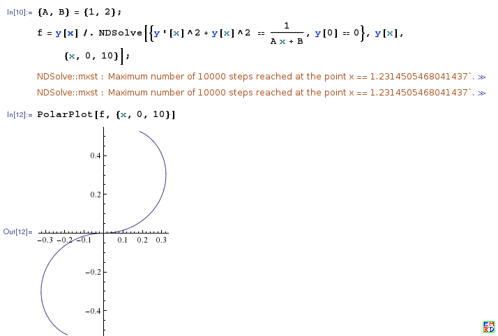
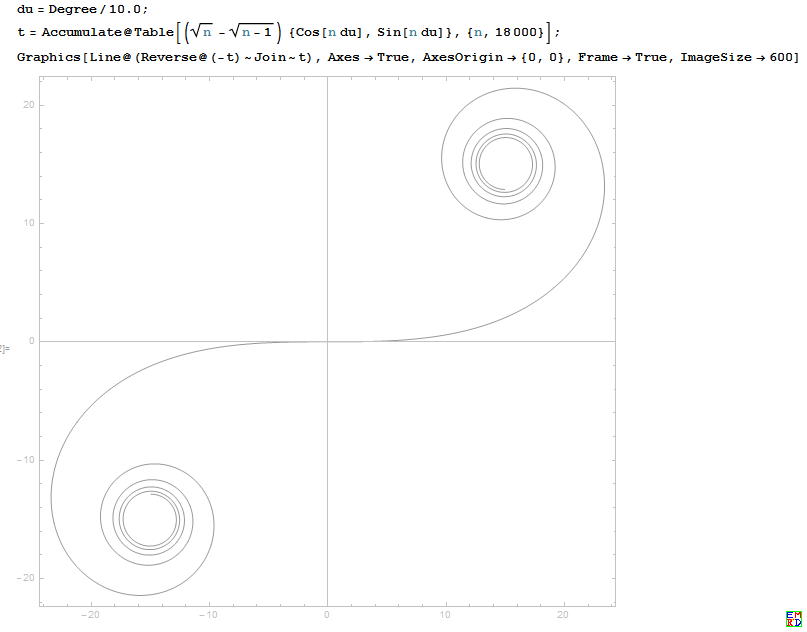
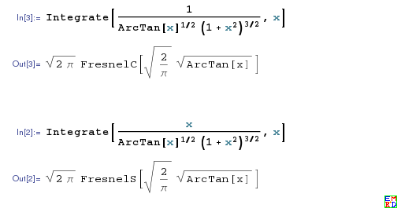
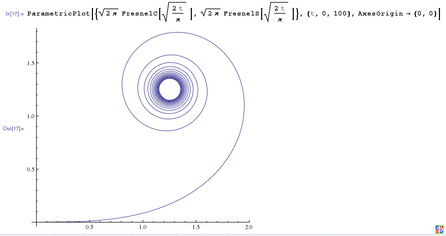
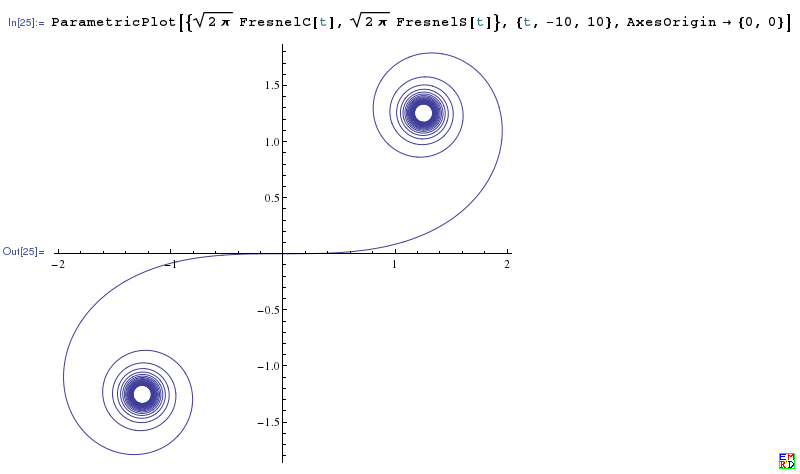

# 问题提出
2013年8月，[hujunhua提问](https://bbs.emath.ac.cn/thread-5130-1-1.html) :  
由于工程上的原因，提出了一种曲率随弧长的变化率为常数的过渡曲线，用来连接两段圆弧，使得传动速度均匀变化。  
虽然后来的分析表明这种曲线不能适用于两段弧的一些相对位置情况，但是，即使不为工程应用，这也不失为一个有趣而有难度的数学问题。  

在这个问题中，曲率的符号需要约定。  
我们约定垂直于纸面的 $Z$轴，正方向向上（指向着我们），  
规定曲线弧的一个方向为弧长微分$ds$的正方向，  
曲线的曲率半径的方向为从切点（密切圆与曲线）指向密切圆的圆心。  
当三者构成右手系时，曲率为正，构成左手系时为负。  

在实际的工程问题中，两段圆弧（及其连接端）给定了起点曲率和终点曲率，假定存在曲率均匀过渡的曲线段，那么应该不难依该曲率变化率将曲线段向两端无穷延伸。  
由于曲率无穷大对应的曲率圆收缩为点，所以所谓无穷延伸，表现为收敛到两个定点，一点代表曲率负无穷大，另一点代表曲率正无穷大。  
从负无穷到正无穷，中间必定经过唯一的 0 曲率点，即曲线的拐点。所以曲线大致就是如下样子：  
  

# 详细内容
wayne很快[给出了一个极坐标微分方程](https://bbs.emath.ac.cn/forum.php?mod=redirect&goto=findpost&ptid=5130&pid=50495&fromuid=20) :  
根据 极坐标方程。貌似导出的微分方程并不复杂,不过，也难解:

$\rho^{\prime}(\theta )^2+\rho(\theta )^2=\frac{1}{A \theta +B}$

常数A，B，还有积分常数不知道怎么确定，胡乱设置了一下，数值积分得到的图像还是比较接近的，:)  
  
不过hujunhua觉得微分方程不应该这么简单，他重新推导了一下，并且给出一组数值解:  
以拐点为弧长参数的起点，以拐切线（x轴）为切线偏转角的起始，设弧长为s, 切线偏转角度为$\theta$（在平角以内就是切线的倾角），先考虑s为正的半边。

由$dk=\frac{ds}{\lambda}$（$\lambda$为常数） 积分得 $k=\frac{s}{\lambda}$，
将曲率的定义式$ k=\frac{d\theta}{ds} $代入得 $\lambda d\theta=s ds$, 
积分得到$ \lambda\times \theta=\frac12s^2$, 当$s\gt 0$时即为 $s=\sqrt{2\lambda\theta}$

我们知道圆也有简明的弧长与切线偏转角的关系式 $s=r\theta$, 这条曲线的上述关系式也很简明，与圆有得一比。  
由此性质可以得到数值曲线。我们取一个很小的角度，比如 1 度，切线每转过 1 度，曲线弧的增长步长为$ds_n=(\sqrt{n}-\sqrt{n-1})\sqrt{2\lambda\frac{\pi}{180}}$，以弦代弧就可以画出曲线了。  
  
然后hujunhua通过搜索发现这个曲线的名称为[羊角螺线](http://zh.wikipedia.org/wiki/%E6%9F%AF%E5%A5%B4%E8%9E%BA%E7%BA%BF) ,又叫柯奴螺线，还叫欧拉双头螺线。  
而[zgg\_\_](https://bbs.emath.ac.cn/forum.php?mod=redirect&goto=findpost&ptid=5130&pid=50502&fromuid=20) 搜索到了[Cornu Spiral](http://mathworld.wolfram.com/CornuSpiral.html) 

wayne[进一步求解](https://bbs.emath.ac.cn/forum.php?mod=redirect&goto=findpost&ptid=5130&pid=50504&fromuid=20) ，  
 $2\lambda\theta=s^2 =(\lambda\frac{d\theta}{ds})^2$  
即  $\theta=s^2 =(\frac{\lambda}2)(\frac{d\theta}{ds})^2$  
又因为$\tan(\theta)=y^{\prime}$  
所以可以设$p=y^{\prime}$,则$ y^{\prime\prime} =p\frac{dp}{dy}$  
于是对于曲线 $\theta\gt 0$的分支，有  
$dy =\frac{p dp}{(\tan^{-1}(p))^{\frac12}(1+p^2)^{\frac32}}$  
$dx =\frac{dy}p=\frac{dp}{(\tan^{-1}(p))^{\frac12}(1+p^2)^{\frac32}}$  
这就是参数方程解了。  

用Mathematica 竟然得到上面两个积分的原函数了：  
$x=\sqrt{2 \pi } \text{FresnelC}(\sqrt{\frac{2}{\pi }} \sqrt{\tan ^{-1}(p)})$  
$y=\sqrt{2 \pi } \text{FresnelS}(\sqrt{\frac{2}{\pi }} \sqrt{\tan ^{-1}(p)})$  
换一下参数，好简洁阿：  
$x=\sqrt{2 \pi } \text{FresnelC}(\sqrt{\frac{2\theta}{\pi }})$  
$y=\sqrt{2 \pi } \text{FresnelS}(\sqrt{\frac{2\theta}{\pi }})$  
$\theta$即是前面提及的切线的倾角。
跟hujunhua前面提到的羊角螺线完全吻合！
  
画出上面的参数方程的图（有意把$\theta$放大了范围），简直太有型了！
  
受到启发，咱再把角度范围放大，终于得到全景图了：
  

hujunhua[进一步做变量替换](https://bbs.emath.ac.cn/forum.php?mod=redirect&goto=findpost&ptid=5130&pid=50512&fromuid=20) :  
将得到的  $s=\sqrt{2\lambda\theta}$ 代入公式  
$$
\begin{cases} 
d x=\cos\theta\cdot d s\\
d y=\sin\theta\cdot d s
\end{cases}
$$
直接可得超级简洁的参数方程  
$$
\begin{cases}
d x=\cos\frac{s^2}{2\lambda}\cdot d s\\\\
d y=\sin\frac{s^2}{2\lambda}\cdot d s
\end{cases}
$$
我在得到 $s=\sqrt{2\lambda\theta}$ 后因为已经可得到数值曲线，沾沾自喜，错过了。  

然后wayne求出羊角曲线中无穷收敛点的坐标:  
我们可以求出无穷收敛的两个羊角点的坐标。
```bash
Integrate[cos(s^2/(2 \[Lambda])),{s,0,\[Infinity]},Assumptions->\[Lambda]>0]
```
$\{\frac{\sqrt{\lambda\pi}}2,\frac{\sqrt{\lambda\pi}}2\}$，$\{-\frac{\sqrt{\lambda\pi}}2,-\frac{\sqrt{\lambda\pi}}2\}$  

282842712474表示用[复数计算会更加方便](https://bbs.emath.ac.cn/forum.php?mod=redirect&goto=findpost&ptid=5130&pid=54456&fromuid=20)  
设函数方程为$z=z(s)$，s是弧长参数，那么
$$\frac{d^2 z}{ds^2}=i k(s) \frac{dz}{ds}$$
代入$k(s)=2\alpha s$，即
$$\ln \frac{dz}{ds}=i\alpha s^2+C_1$$
即
$$z=\int_0^s C\exp\left(i\alpha t^2\right)dt$$
涉及到了高斯积分了，没有明显表达式了~~，选择C=1，直接就得
$$x=\int_0^s \cos\alpha t^2 dt ,\quad y=\int_0^s \sin\alpha t^2 dt$$
