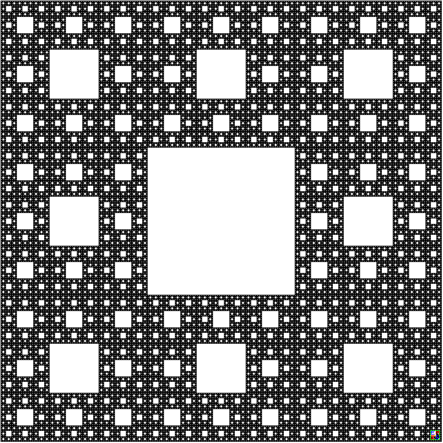
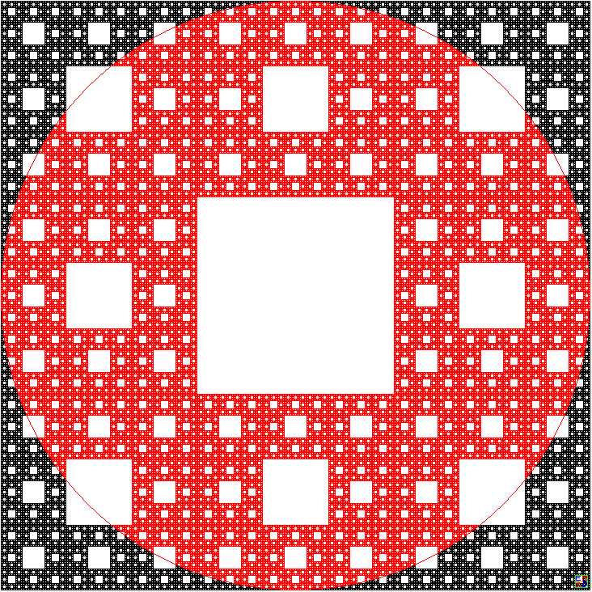
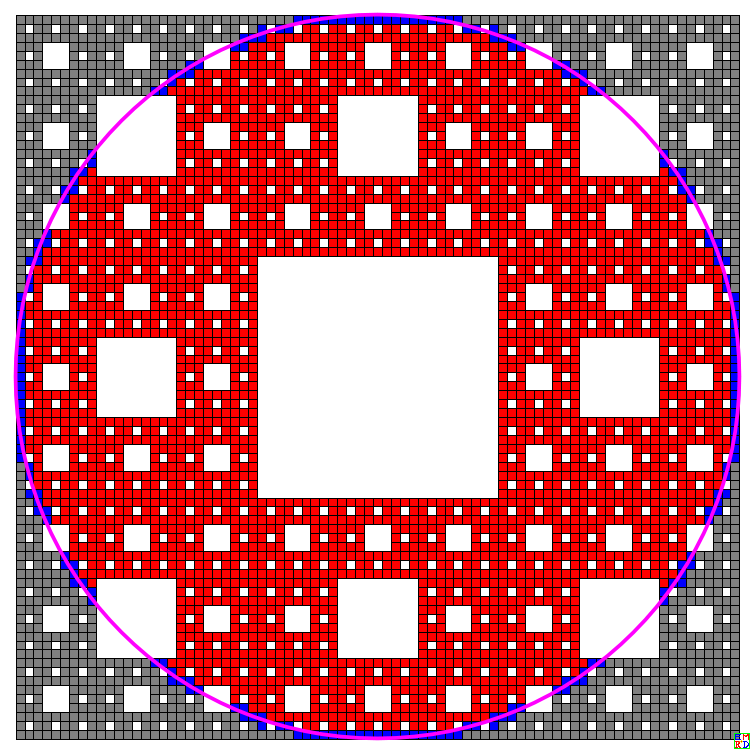
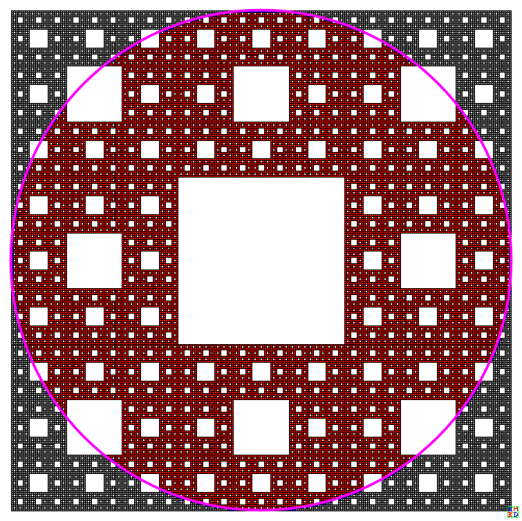
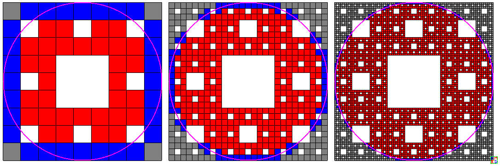
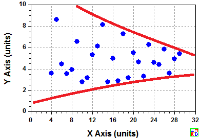
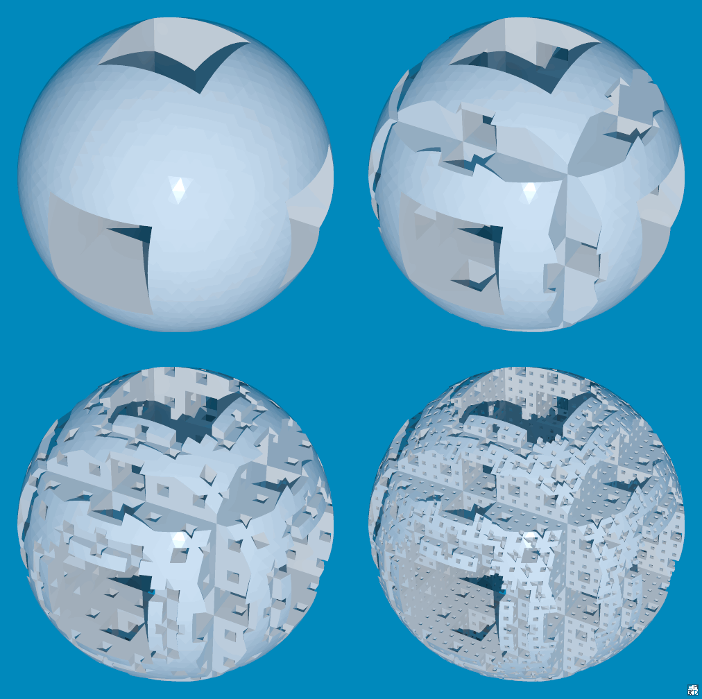
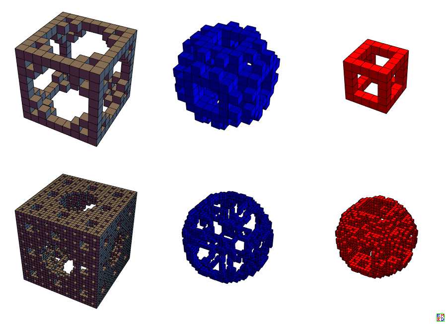

# 摘要
KeyTo9\_Fans在[2017年9月提出一个问题](https://bbs.emath.ac.cn/thread-9655-1-1.html) ：  
我们把边长为1的正方形挖成[谢尔宾斯基地毯](https://baike.baidu.com/item/谢尔宾斯基地毯) ，如下图所示：
  

我们假设这个地毯的“面积”为1，

然后把该地毯“裁剪”成直径为1的圆，变成“谢尔宾斯基铜钱”，如下图红色部分所示：
  

问：这个“谢尔宾斯基铜钱”的“面积是多少？

注：

严格来说，这不能称为【面积】，因为该地毯的维数不足2，其分形维只有$\log_3 8=1.89...$维，是没有【面积】的。

这里的【面积】指的是[豪斯多夫维积](https://baike.baidu.com/item/豪斯多夫维) ，也就是它在$\log_3 8=1.89...$维空间里，所占空间的大小。 

# 详细内容
对于这个题目，[hujunhua首先给出了自己的看法](https://bbs.emath.ac.cn/forum.php?mod=redirect&goto=findpost&ptid=9655&pid=67326&fromuid=20) :  
待我有空了，编个M10程序来计算一下这个孔方兄的“面积”。初步设想是这样的：  
1、面积公式：将正方形划分成$3^n\times 3^n$个小方块，则每个非白小方块的“面积”等于$\frac1{8^n}$。设圆内的非白方块数为$a(n)$,则孔方兄的“面积”大于并约等于$\frac{a(n)}{8^n}$。  
2、递进细分：把那些被圆周穿过的非白小方块扔到一个集C中，然后将集C中的每小方块划分为$3\times 3$个更小的方块，设这些更小方块位于圆内的非白者数量为$d(n)$， 则孔方兄的面积增量等于$\frac{d(n)}{8^{n+1}}$。  
3、重复2. 直到达到指定的精度

mathe建议，由于图像上下左右的四块是一模一样的，我们只要看左下那四分之一部分。  
wayne开始用Mathematica进行计算，不过开始出了点错。mathe建议同时统计正好落在圆上的小方块数目，就可以同时给出上下界了。hujunhua进一步建议取这个上下界的中值得出更好的估计值。  
[wayne使用了如下的代码](https://bbs.emath.ac.cn/forum.php?mod=redirect&goto=findpost&ptid=9655&pid=67336&fromuid=20)  
```bash
kernel=DeleteCases[Tuples[{-1,0,1},{2}],{0,0}];
kernel={{-1,-1},{0,-1},{1,-1},{1,0},{1,1},{0,1},{-1,1},{-1,0}};
rect={{-1,-1},{-1,1},{1,1},{1,-1}};
g[points_]:=Module[{ps=points},{Flatten[Table[Table[Join[k,{t=MinMax[Norm[ps[[2]]/6 #+k]&/@rect];(Sign[1/2-t[[1]]]+Sign[1/2-t[[2]]])/2}],{k,ps[[2]]/3 #+p[[1;;2]]&/@kernel}],{p,ps[[1]]}],1],ps[[2]]/3}]
pp=Nest[g,{{{0,0,1}},1},3];
Graphics[{EdgeForm[Thickness[.001]],Flatten[Table[{Which[j[[3]]==-1,Gray,j[[3]]==0,Blue,j[[3]]==1,Red],Rectangle[j[[1;;2]]+{-1,-1}*pp[[2]]/2,j[[1;;2]]+{1,1}*pp[[2]]/2]},{j,pp[[1]]}],1],Thickness[.005],RGBColor[1,0,1],Circle[{0,0},1/2]}]
```
给出了最初的结果,  
统计所有的圆外，圆上，圆内的格子数目分别如下：  
```bash
{{1},{1.},8}
{{1/16,7/16,1/2},{0.0625,0.4375,0.5},64}
{{13/64,19/128,83/128},{0.203125,0.148438,0.648438},512}
{{123/512,51/1024,727/1024},{0.240234,0.0498047,0.709961},4096}
{{259/1024,145/8192,5975/8192},{0.25293,0.0177002,0.72937},32768}
{{2117/8192,389/65536,48211/65536},{0.258423,0.00593567,0.735641},262144}
{{34119/131072,1045/524288,386767/524288},{0.26030731,0.0019931793,0.73769951},2097152}
{{547243/2097152,2801/4194304,3097017/4194304},{0.26094580,0.00066781044,0.73838639},16777216}
```
并且给出了两个不同分辨率的孔方兄快照  
  
  

[lsr314也给出了他的方案](https://bbs.emath.ac.cn/forum.php?mod=redirect&goto=findpost&ptid=9655&pid=67342&fromuid=20) ， 
不考虑与圆相交而被切割的误差，只以小正方形的中心位置来划分圆内圆外，那么可以用三进制来判断，代码如下：  
```bash
f[x_, y_] :=
MemberQ[(IntegerDigits[Min[x, y], 3] - 1)^2 +
   Take[IntegerDigits[Max[x, y], 3] -
      1, -Length[IntegerDigits[Min[x, y], 3]]]^2, 0]
ff[l_] := (s = t = 0;
  Do[If[f[i, j], ,
    If[((i + 1/2)/3^l - 1/2)^2 + ((j + 1/2)/3^l - 1/2)^2 < 1/4,
     s = s + 1, t = t + 1]], {j, 0, 3^l - 1}, {i, 0, 3^l - 1}];
  s/(s + t))
Do[Print[{l, N[ff[l]]}], {l, 7}]
```
结果如下： 
{1,1.}  
{2,0.8125}   
{3,0.734375}  
{4,0.742188}  
{5,0.739502}  
{6,0.738739}  
{7,0.738728}  

[chyanog给出了两个版本的Mathematica代码](https://bbs.emath.ac.cn/forum.php?mod=redirect&goto=findpost&ptid=9655&pid=67344&fromuid=20)  
第一个需要11.1版本，使用了MengerMesh和计算几何相关的函数，代码简单易懂，不过效率不高  
```bash
Clear["`*"];

n=3;

poly=MeshPrimitives[MengerMesh[n],2];

Graphics[{
Antialiasing->False,
EdgeForm[Black],
Red,Select[poly,RegionWithin[Disk[{0.5,0.5},0.5],#]&],
Blue,Select[poly,!RegionDisjoint[Circle[{0.5,0.5},0.5],#]&],
Gray,Select[poly,!RegionWithin[Disk[{0.5,0.5},0.5],#]&&RegionDisjoint[Circle[{0.5,0.5},0.5],#]&],
Thick,Magenta,Circle[{0.5,0.5},0.5]
}]
```
第二个版本速度快一些，不限于版本11  
```bash
Clear["`*"];

carpet[n_]:=Nest[ArrayFlatten[{{#,#,#},{#,0,#},{#,#,#}}]&,1,n];

n=3;

ArrayPlot[carpet[n],Mesh->All]

p=Rescale[{{#1,#2},{#1+1,#2},{#1+1,#2+1},{#1,#2+1}}&@@@N@Position[carpet[n],1]];

Graphics[{
EdgeForm[Black],
Antialiasing->False,
Red,Polygon@Select[p,AllTrue[#,Norm[#-0.5]<0.5&]&],
Blue,Polygon@Select[p,With[{m=Norm[#-0.5]&/@#},Min@m<0.5&&Max@m>0.5]&],
Gray,Polygon@Select[p,AllTrue[#,Norm[#-0.5]>0.5&]&],
Thick,Magenta,Circle[{0.5,0.5},0.5]
}
]
```
补充内容 (2017-9-27 10:46):  
次数，圆上，圆内，圆外，“面积”  
{1, 8, 0, 0, 0.5}  
{2, 28, 32, 4, 0.71875}  
{3, 76, 332, 104, 0.72265625}  
{4, 204, 2908, 984, 0.73486328125}  
{5, 580, 23900, 8288, 0.73822021484375}  

并且chyanog给出了几个小孔方兄的快照  
  

hujunhua指出， 当考察整个小方格是否位于圆内/外或者被圆穿越时，有没有人担心两个对顶格所公共的对顶格点刚好在圆上，使得两格刚好一内一外？
或者像lsr314那样仅仅考察格子的中心时，有没有考虑过一个格子的中心刚好在圆上？  
一个简单而有趣的事实是：无论分辨率多大，不可能有一个格子，它的中心或者一个顶点刚好在圆上。 

wayne发现， 其实这里面有大量的重复计算。 当确定了某个正方形已经是 整体的在圆内，或者圆外时，下一次迭代的时，由此产生的8个小正方形跟圆的关系 没必要重复判断 。我们只需进行简单的计数就行。 这样程序只进行 圆上的方格个数的统计。这样能大大的降低空间复杂度和时间复杂度。  
然后他得到更新的结果  
```bash
{{0,8,0},8,{0,1.0000000,0}}
{{4,28,32},64,{0.062500000,0.43750000,0.50000000}}
{{104,76,332},512,{0.20312500,0.14843750,0.64843750}}
{{984,204,2908},4096,{0.24023438,0.049804688,0.70996094}}
{{8288,580,23900},32768,{0.25292969,0.017700195,0.72937012}}
{{67744,1556,192844},262144,{0.25842285,0.0059356689,0.73564148}}
{{545904,4180,1547068},2097152,{0.26030731,0.0019931793,0.73769951}}
{{4377944,11204,12388068},16777216,{0.26094580,0.00066781044,0.73838639}}
{{35052688,29724,99135316},134217728,{0.26116288,0.00022146106,0.73861566}}
{{280499768,79276,793162780},1073741824,{0.26123577,0.000073831528,0.73869040}}
{{2244206376,212076,6345516140},8589934592,{0.26126001,0.000024688896,0.73871530}}
{{17954209288,565692,50764701756},68719476736,{0.26126813,8.2319020*10^-6,0.73872364}}
```
KeyTo9\_Fans开始出手，[一下子把迭代次数提升到18次](https://bbs.emath.ac.cn/forum.php?mod=redirect&goto=findpost&ptid=9655&pid=67349&fromuid=20)  
```bash
{0,8,0},8,{0.0000000000000000,1.0000000000000000,0.0000000000000000}
{4,28,32},64,{0.0625000000000000,0.4375000000000000,0.5000000000000000}
{104,76,332},512,{0.2031250000000000,0.1484375000000000,0.6484375000000000}
{984,204,2908},4096,{0.2402343750000000,0.0498046875000000,0.7099609375000000}
{8288,580,23900},32768,{0.2529296875000000,0.0177001953125000,0.7293701171875000}
{67744,1556,192844},262144,{0.2584228515625000,0.0059356689453125,0.7356414794921875}
{545904,4180,1547068},2097152,{0.2603073120117188,0.0019931793212891,0.7376995086669922}
{4377944,11204,12388068},16777216,{0.2609457969665527,0.0006678104400635,0.7383863925933838}
{35052688,29724,99135316},134217728,{0.2611628770828247,0.0002214610576630,0.7386156618595123}
{280499768,79276,793162780},1073741824,{0.2612357661128044,0.0000738315284252,0.7386904023587704}
{2244206376,212076,6345516140},8589934592,{0.2612600075080991,0.0000246888957918,0.7387153035961092}
{17954209288,565692,50764701756},68719476736,{0.2612681315513328,0.0000082319020294,0.7387236365466379}
{143635171632,1509332,406119132924},549755813888,{0.2612708551750984,0.0000027454589144,0.7387263993659872}
{1149085383304,4026028,3248957101772},4398046511104,{0.2612717669999256,0.0000009154127838,0.7387273175872906}
{9192693786392,10740796,25991667561644},35184372088832,{0.2612720716795138,0.0000003052717830,0.7387276230487032}
{73541578891856,28646804,207933369171996},281474976710656,{0.2612721732896830,0.0000001017738924,0.7387277249364246}
{588332707461496,76396620,1663467029827132},2251799813685248,{0.2612722071855238,0.0000000339269146,0.7387277588875616}
{4706661863240488,203728972,13307736442512524},18014398509481984,{0.2612722184847365,0.0000000113092298,0.7387277702060338}
```
hujunhua利用上面数据统计上下界的平均值，然后KeyTo9_Fans估计极限为0.738727775865795。

wayne随后表示还可以利用y=x的对称性于是只需要计算$\frac1 8$的面积即可，[他的代码](../attached/xebsj/wayne.txt) 由此突破了KeyTo9\_Fans迭代18次的结果。  
但是他的代码遇到了内存使用的瓶颈。后来他利用[KeyTo9\_Fans的代码](../attached/xebsj/fans.txt) 并且[略作修改](../attached/xebsj/fans_wayne.txt) 使用2天12小时27分把结果迭代到了30次。
```bash
19: {37653295449008288,543283204,106461892083564380},{0.26127222225314139514,3.7697845123307871518*10^-9,0.73872777397707409253}
20: {301226365040331144,1448779164,851695138117736668},{0.26127222350931090383,1.2566156136484263328*10^-9,0.73872777523407348252}
21: {2409810924185402784,3863345612,6813561108806027412},{0.26127222392811149179,4.1886477055927406887*10^-10,0.73872777565302373765}
22: {19278487403784147304,10302538780,54508488880751520380},{0.26127222406771505802,1.3962543659240198024*10^-10,0.73872777579265950539}
23: {154227899257743649824,27473690092,436067911073488311796}
24: {1233823194135208730288,73263231116,3488543288661173252292}
25: {9870585553277031899992,195369181668,27908346309484760627908}
26: {78964684426737227956608,520985280228,223266770476399080439708}
27: {631717475415287101141792,1389296277316,1786134163812581951993244}
28: {5053739803326001562892000,3704793953044,14289073310504360438453772}
29: {40429918426617891895941808,9879454623900,114312586484044763011824820}
30: {323439347412969480294205216,26345219429236,914500691872384449385489772}
```
并且把极限估计到了0.73872777586246736918。

KeyTo9\_Fans根据结果给出如下上下界  
  
并预测20位有效结果为$0.738727775862478009946(3)$  

[zeroieme也给出了一种横向分割的思路](https://bbs.emath.ac.cn/forum.php?mod=redirect&goto=findpost&ptid=9655&pid=67470&fromuid=20)  
[Ickiverar提供了一种思路避免int64之间的乘法](https://bbs.emath.ac.cn/forum.php?mod=redirect&goto=findpost&ptid=9655&pid=67490&fromuid=20) 并且提供了[相应的C代码](../attached/xebsj/ickiverar.txt)  
并且在仅花费了1.6天就计算到了32层  
```bash
{0, 8, 0}
{4, 28, 32}
{104, 76, 332}
{984, 204, 2908}
{8288, 580, 23900}
{67744, 1556, 192844}
{545904, 4180, 1547068}
{4377944, 11204, 12388068}
{35052688, 29724, 99135316}
{280499768, 79276, 793162780}
{2244206376, 212076, 6345516140}
{17954209288, 565692, 50764701756}
{143635171632, 1509332, 406119132924}
{1149085383304, 4026028, 3248957101772}
{9192693786392, 10740796, 25991667561644}
{73541578891856, 28646804, 207933369171996}
{588332707461496, 76396620, 1663467029827132}
{4706661863240488, 203728972, 13307736442512524}
{37653295449008288, 543283204, 106461892083564380}
{301226365040331144, 1448779164, 851695138117736668}
{2409810924185402784, 3863345612, 6813561108806027412}
{19278487403784147304, 10302538780, 54508488880751520380}
{154227899257743649824, 27473690092, 436067911073488311796}
{1233823194135208730288, 73263231116, 3488543288661173252292}
{9870585553277031899992, 195369181668, 27908346309484760627908}
{78964684426737227956608, 520985280228, 223266770476399080439708}
{631717475415287101141792, 1389296277316, 1786134163812581951993244}
{5053739803326001562892000, 3704793953044, 14289073310504360438453772}
{40429918426617891895941808, 9879454623900, 114312586484044763011824820}
{323439347412969480294205216, 26345219429236, 914500691872384449385489772}
{2587514779303826096159159104, 70253935029820, 7316005534979145849098804868}
{20700118234430796112810254760, 187343834543092, 58528044279833354136899152484}
```
据此KeyTo9\_Fans给出了21位有效值估计$0.7387277758624780099409(3)$。
KeyTo9\_Fans把结果提交oeis形成了[A293288](https://oeis.org/A293288) 和[A293289](https://oeis.org/A293289) 。

##三维扩展
chyanog建议再把问题推广到三维，  
首先我们需要推广到门格海绵

<video width="640" height="480" controls>
  <source src="../attached/menger.mp4" type="video/mp4">
Your browser does not support the video tag.
</video>   


然后他给出了对应的的门格海绵球的快照  
<a name=menger></a>
  
hujunhua发现对于门格海绵球，会出现两个对顶小正方形正好分局分界球内外的情况（公共顶点在球面上），也会出现小正方体中心在球面的情况。  
[chyanog首先给出三维的计算结果](https://bbs.emath.ac.cn/forum.php?mod=redirect&goto=findpost&ptid=9655&pid=80906&fromuid=20)  
  
[代码下载](../attached/menger.txt)

2019年12月9日，Ickiverar给出了一个[性能更高的代码](../attached/xebsj/ickiverar-3d.txt)  

|迭代次数|球外|球上|球内的方块的个数|
|---------|-----|-----|--------------------|
|1  | 0  | 20 | 0|
|2 | 140 | 216| 44|
|3 | 4456| 1224| 2320|
|4 | 97232| 7968| 54800|
|5 | 1999432| 54456| 1146112|
|6 | 40353584| 367944| 23278472|
|7 |809527216| 2444520| 468028264|
|8 |16206910376| 16284576| 9376805048|
|9 |324246978160|108525168|187644496672|
|10|6485663211680|723469800|3753613318520|
|11|129718088017720|4822582872|75077089399408|
|12|2594393910475736|32150080560|1501573939443704|

结果被收集到[A329302](https://oeis.org/A329302)

